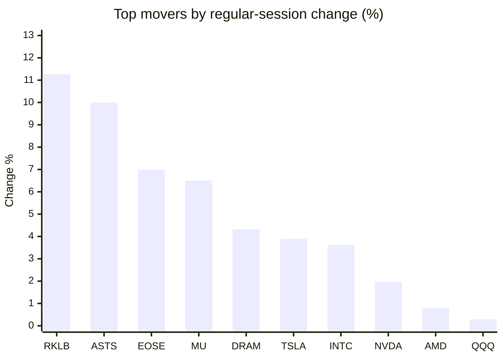
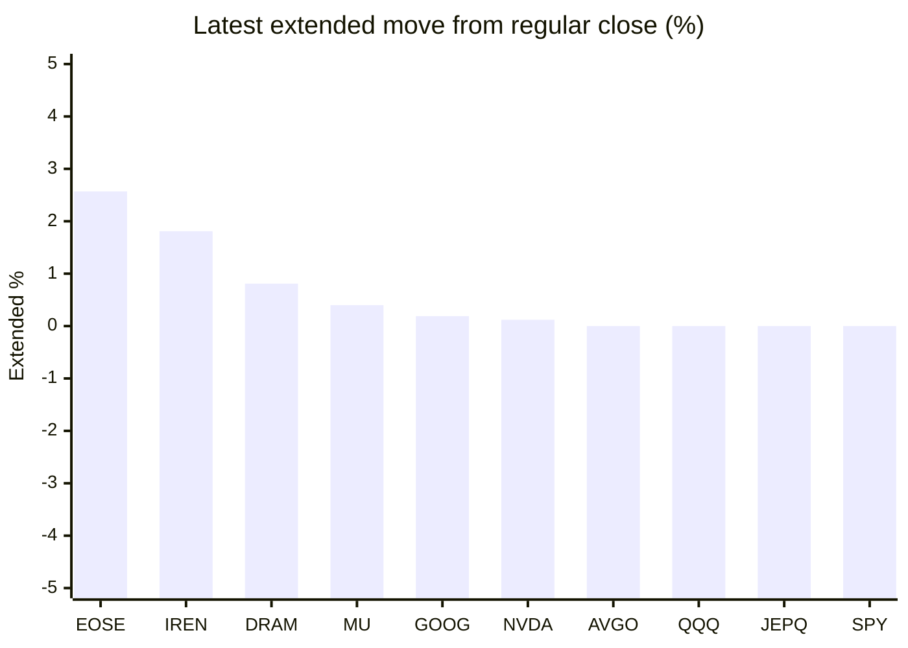

# Stock Brief - 2026-05-12

Generated at 2026-05-12 11:29 +07 from `watchlist.md`.
Prices are snapshots from Yahoo Finance public chart data. Extended/overnight is the latest available pre/post-market datapoint from the same feed.

## Market Snapshot

- SPY: close 739.30, latest extended 739.28, regular move +0.23%, extended move -0.00%
- QQQ: close 713.29, latest extended 713.30, regular move +0.29%, extended move +0.00%
- JEPQ: close 59.72, latest extended 59.72, regular move +0.18%, extended move -0.00%

## Watchlist Prices

| Ticker | Name | Regular close | Latest extended/overnight | Regular move | Extended move | Latest data time | Source |
|---|---|---:|---:|---:|---:|---|---|
| INTC | Intel Corporation | 129.44 USD | 128.63 USD | +3.62% | -0.63% | 2026-05-11 19:59 EDT | [Yahoo](https://finance.yahoo.com/quote/INTC/) |
| AVGO | Broadcom Inc. | 428.43 USD | 428.44 USD | -0.37% | +0.00% | 2026-05-11 19:59 EDT | [Yahoo](https://finance.yahoo.com/quote/AVGO/) |
| RKLB | Rocket Lab Corporation | 117.35 USD | 115.82 USD | +11.26% | -1.30% | 2026-05-11 19:59 EDT | [Yahoo](https://finance.yahoo.com/quote/RKLB/) |
| AAPL | Apple Inc. | 292.68 USD | 292.50 USD | -0.22% | -0.06% | 2026-05-11 19:59 EDT | [Yahoo](https://finance.yahoo.com/quote/AAPL/) |
| NVDA | NVIDIA Corporation | 219.44 USD | 219.70 USD | +1.97% | +0.12% | 2026-05-11 19:59 EDT | [Yahoo](https://finance.yahoo.com/quote/NVDA/) |
| TSLA | Tesla, Inc. | 445.00 USD | 444.20 USD | +3.89% | -0.18% | 2026-05-11 19:59 EDT | [Yahoo](https://finance.yahoo.com/quote/TSLA/) |
| SNDK | Sandisk Corporation | 1,547.56 USD | 1,538.00 USD | -0.95% | -0.62% | 2026-05-11 19:59 EDT | [Yahoo](https://finance.yahoo.com/quote/SNDK/) |
| QQQ | Invesco QQQ Trust, Series 1 | 713.29 USD | 713.30 USD | +0.29% | +0.00% | 2026-05-11 19:59 EDT | [Yahoo](https://finance.yahoo.com/quote/QQQ/) |
| SPY | State Street SPDR S&P 500 ETF T | 739.30 USD | 739.28 USD | +0.23% | -0.00% | 2026-05-11 19:59 EDT | [Yahoo](https://finance.yahoo.com/quote/SPY/) |
| JEPQ | JPMorgan Nasdaq Equity Premium  | 59.72 USD | 59.72 USD | +0.18% | -0.00% | 2026-05-11 19:59 EDT | [Yahoo](https://finance.yahoo.com/quote/JEPQ/) |
| ASTS | AST SpaceMobile, Inc. | 82.55 USD | 74.03 USD | +9.99% | -10.32% | 2026-05-11 19:59 EDT | [Yahoo](https://finance.yahoo.com/quote/ASTS/) |
| MU | Micron Technology, Inc. | 795.33 USD | 798.49 USD | +6.50% | +0.40% | 2026-05-11 19:59 EDT | [Yahoo](https://finance.yahoo.com/quote/MU/) |
| IREN | IREN LIMITED | 55.15 USD | 56.15 USD | -9.89% | +1.81% | 2026-05-11 19:59 EDT | [Yahoo](https://finance.yahoo.com/quote/IREN/) |
| EOSE | Eos Energy Enterprises, Inc. | 8.57 USD | 8.79 USD | +6.99% | +2.57% | 2026-05-11 19:59 EDT | [Yahoo](https://finance.yahoo.com/quote/EOSE/) |
| GOOG | Alphabet Inc. | 386.77 USD | 387.50 USD | -2.59% | +0.19% | 2026-05-11 19:59 EDT | [Yahoo](https://finance.yahoo.com/quote/GOOG/) |
| DRAM | Roundhill Memory ETF | 55.08 USD | 55.53 USD | +4.32% | +0.81% | 2026-05-11 19:59 EDT | [Yahoo](https://finance.yahoo.com/quote/DRAM/) |
| AMD | Advanced Micro Devices, Inc. | 458.79 USD | 458.05 USD | +0.79% | -0.16% | 2026-05-11 19:59 EDT | [Yahoo](https://finance.yahoo.com/quote/AMD/) |
| ASML | ASML Holding N.V. - New York Re | 1,565.81 USD | 1,564.87 USD | -1.65% | -0.06% | 2026-05-11 19:59 EDT | [Yahoo](https://finance.yahoo.com/quote/ASML/) |

## Charts

### Top Movers - Regular Session

### Extended / Overnight Move

### Quick Heatmap

| Group | Names in watchlist | Avg regular move | Avg extended move |
|---|---|---:|---:|
| Mega-cap tech | AVGO, AAPL, NVDA, TSLA, GOOG | +0.54% | +0.01% |
| Semis / memory | INTC, SNDK, MU, DRAM, AMD, ASML | +2.11% | -0.04% |
| Space / high beta | RKLB, ASTS, IREN, EOSE | +4.59% | -1.81% |
| ETFs | QQQ, SPY, JEPQ | +0.23% | -0.00% |

## News Headlines

- [Up 377%, Is Intel Proving Why It Was a Mistake for Nvidia to Replace Intel in the Dow Jones Industrial Average?](https://www.fool.com/investing/2026/05/11/intel-nvidia-ai-growth-stock-dow-jones/?.tsrc=rss) (2026-05-12 10:50 Bangkok)
- [Qualcomm China Trip Puts AI And Chip Export Risks In Focus](https://finance.yahoo.com/markets/stocks/articles/qualcomm-china-trip-puts-ai-031131119.html?.tsrc=rss) (2026-05-12 10:11 Bangkok)
- [Archer Aviation Q1 Earnings Call Highlights](https://www.marketbeat.com/instant-alerts/archer-aviation-q1-earnings-call-highlights-2026-05-11/?utm_source=yahoofinance&utm_medium=yahoofinance&.tsrc=rss) (2026-05-12 10:11 Bangkok)
- [Dow Jones Futures: Techs Fall As South Korea Eyes Excess AI Profits; CPI Inflation Due](https://finance.yahoo.com/m/0994977b-17f2-37cd-920f-ab04cf3be305/dow-jones-futures%3A-techs-fall.html?.tsrc=rss) (2026-05-12 10:10 Bangkok)
- [Too Many Tech Stocks Lurking in Your Portfolio? These 3 Investments Offer More Balance.](https://www.fool.com/investing/2026/05/11/too-many-tech-stocks-lurking-in-your-portfolio-the/?.tsrc=rss) (2026-05-12 09:50 Bangkok)
- [Anthropic Just Delivered Great News for Alphabet Investors](https://www.fool.com/investing/2026/05/11/anthropic-just-delivered-great-news-for-alphabet-i/?.tsrc=rss) (2026-05-12 09:20 Bangkok)
- [Best Fintech Stocks to Buy in 2026](https://www.fool.com/investing/2026/05/11/best-fintech-stocks-to-buy-in-2026/?.tsrc=rss) (2026-05-12 08:50 Bangkok)
- [Micron vs. Sandisk: Which Memory Stock Is the Better Buy Right Now?](https://www.fool.com/investing/2026/05/11/micron-vs-sandisk-which-memory-stock-is-the-better/?.tsrc=rss) (2026-05-12 08:20 Bangkok)

## Caveats

- This is not investment advice. Extended-hours prices can be thin and volatile.
- Yahoo public endpoints may lag official exchange data.
