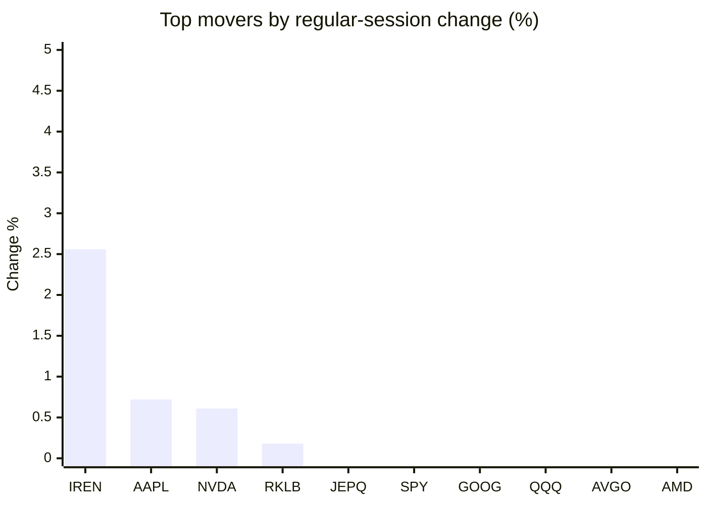
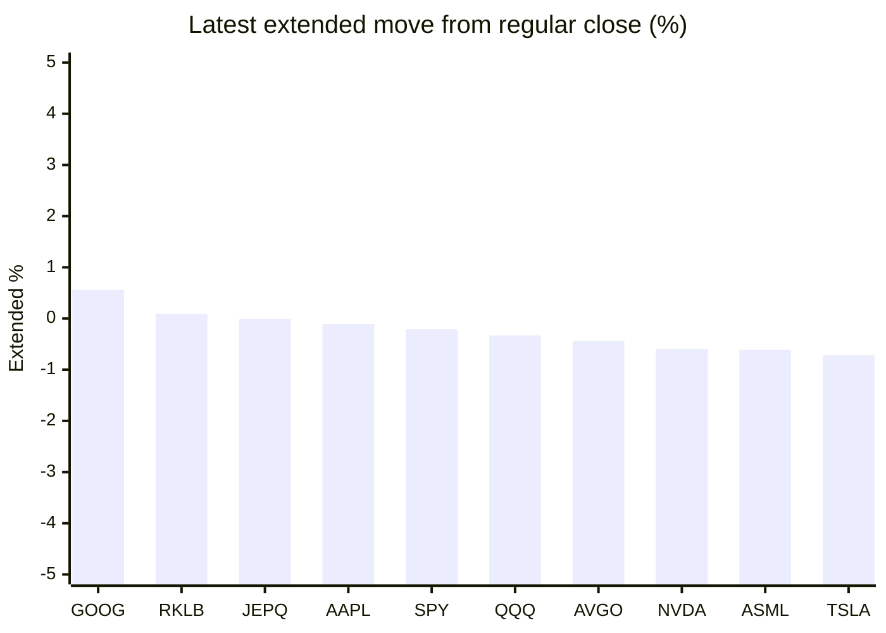

# Stock Brief - 2026-05-13

Generated at 2026-05-13 12:52 +07 from `watchlist.md`.
Prices are snapshots from Yahoo Finance public chart data. Extended/overnight is the latest available pre/post-market datapoint from the same feed.

## Market Snapshot

- SPY: close 738.18, latest extended 736.66, regular move -0.15%, extended move -0.21%
- QQQ: close 707.24, latest extended 704.90, regular move -0.85%, extended move -0.33%
- JEPQ: close 59.66, latest extended 59.66, regular move -0.10%, extended move -0.01%

## Watchlist Prices

| Ticker | Name | Regular close | Latest extended/overnight | Regular move | Extended move | Latest data time | Source |
|---|---|---:|---:|---:|---:|---|---|
| INTC | Intel Corporation | 120.61 USD | 117.58 USD | -6.82% | -2.51% | 2026-05-12 19:59 EDT | [Yahoo](https://finance.yahoo.com/quote/INTC/) |
| AVGO | Broadcom Inc. | 419.30 USD | 417.45 USD | -2.13% | -0.44% | 2026-05-12 19:59 EDT | [Yahoo](https://finance.yahoo.com/quote/AVGO/) |
| RKLB | Rocket Lab Corporation | 117.56 USD | 117.67 USD | +0.18% | +0.09% | 2026-05-12 19:59 EDT | [Yahoo](https://finance.yahoo.com/quote/RKLB/) |
| AAPL | Apple Inc. | 294.80 USD | 294.49 USD | +0.72% | -0.11% | 2026-05-12 19:59 EDT | [Yahoo](https://finance.yahoo.com/quote/AAPL/) |
| NVDA | NVIDIA Corporation | 220.78 USD | 219.48 USD | +0.61% | -0.59% | 2026-05-12 19:59 EDT | [Yahoo](https://finance.yahoo.com/quote/NVDA/) |
| TSLA | Tesla, Inc. | 433.45 USD | 430.31 USD | -2.60% | -0.72% | 2026-05-12 19:59 EDT | [Yahoo](https://finance.yahoo.com/quote/TSLA/) |
| SNDK | Sandisk Corporation | 1,452.02 USD | 1,414.22 USD | -6.17% | -2.60% | 2026-05-12 19:59 EDT | [Yahoo](https://finance.yahoo.com/quote/SNDK/) |
| QQQ | Invesco QQQ Trust, Series 1 | 707.24 USD | 704.90 USD | -0.85% | -0.33% | 2026-05-12 19:59 EDT | [Yahoo](https://finance.yahoo.com/quote/QQQ/) |
| SPY | State Street SPDR S&P 500 ETF T | 738.18 USD | 736.66 USD | -0.15% | -0.21% | 2026-05-12 19:59 EDT | [Yahoo](https://finance.yahoo.com/quote/SPY/) |
| JEPQ | JPMorgan Nasdaq Equity Premium  | 59.66 USD | 59.66 USD | -0.10% | -0.01% | 2026-05-12 19:59 EDT | [Yahoo](https://finance.yahoo.com/quote/JEPQ/) |
| ASTS | AST SpaceMobile, Inc. | 72.96 USD | 72.42 USD | -11.62% | -0.74% | 2026-05-12 19:59 EDT | [Yahoo](https://finance.yahoo.com/quote/ASTS/) |
| MU | Micron Technology, Inc. | 766.58 USD | 747.00 USD | -3.61% | -2.55% | 2026-05-12 19:59 EDT | [Yahoo](https://finance.yahoo.com/quote/MU/) |
| IREN | IREN LIMITED | 56.56 USD | 55.86 USD | +2.56% | -1.24% | 2026-05-12 19:59 EDT | [Yahoo](https://finance.yahoo.com/quote/IREN/) |
| EOSE | Eos Energy Enterprises, Inc. | 8.10 USD | 7.97 USD | -5.48% | -1.55% | 2026-05-12 19:59 EDT | [Yahoo](https://finance.yahoo.com/quote/EOSE/) |
| GOOG | Alphabet Inc. | 383.82 USD | 385.97 USD | -0.76% | +0.56% | 2026-05-12 19:59 EDT | [Yahoo](https://finance.yahoo.com/quote/GOOG/) |
| DRAM | Roundhill Memory ETF | 51.30 USD | 50.01 USD | -6.86% | -2.51% | 2026-05-12 19:59 EDT | [Yahoo](https://finance.yahoo.com/quote/DRAM/) |
| AMD | Advanced Micro Devices, Inc. | 448.29 USD | 444.76 USD | -2.29% | -0.79% | 2026-05-12 19:59 EDT | [Yahoo](https://finance.yahoo.com/quote/AMD/) |
| ASML | ASML Holding N.V. - New York Re | 1,520.94 USD | 1,511.70 USD | -2.87% | -0.61% | 2026-05-12 19:59 EDT | [Yahoo](https://finance.yahoo.com/quote/ASML/) |

## Charts

### Top Movers - Regular Session

### Extended / Overnight Move

### Quick Heatmap

| Group | Names in watchlist | Avg regular move | Avg extended move |
|---|---|---:|---:|
| Mega-cap tech | AVGO, AAPL, NVDA, TSLA, GOOG | -0.83% | -0.26% |
| Semis / memory | INTC, SNDK, MU, DRAM, AMD, ASML | -4.77% | -1.93% |
| Space / high beta | RKLB, ASTS, IREN, EOSE | -3.59% | -0.86% |
| ETFs | QQQ, SPY, JEPQ | -0.37% | -0.18% |

## News Headlines

- [1 No-Brainer S&P 500 Vanguard ETF to Buy Right Now for Less Than $1,000](https://www.fool.com/investing/2026/05/13/no-brainer-sp-500-vanguard-etf-to-buy-right-now/?.tsrc=rss) (2026-05-13 12:50 Bangkok)
- [1 Dividend ETF Quietly Outperforming the Market Right Now](https://www.fool.com/investing/2026/05/13/1-dividend-etf-quietly-outperforming-the-market-ri/?.tsrc=rss) (2026-05-13 12:20 Bangkok)
- [I’m 30 and My Lender Wants Me to Cash Out $36,000 in 401(k)s for a Down Payment: But That’s Actually a $1.2 Million Mistake](https://247wallst.com/personal-finance/2026/05/13/im-30-and-my-lender-wants-me-to-cash-out-36000-in-401ks-for-a-down-payment-but-thats-actually-a-1-2-million-mistake/?.tsrc=rss) (2026-05-13 12:02 Bangkok)
- [QuickLogic Corp (QUIK) Q1 2026 Earnings Call Highlights: Strong Revenue Growth and Strategic ...](https://finance.yahoo.com/news/quicklogic-corp-quik-q1-2026-050223150.html?.tsrc=rss) (2026-05-13 12:02 Bangkok)
- [Tesla (TSLA) Valuation In Focus As Q1 Strength Meets AI And Robotaxi Uncertainty](https://finance.yahoo.com/news/tesla-tsla-valuation-focus-q1-043726299.html?.tsrc=rss) (2026-05-13 11:37 Bangkok)
- [Blackstone’s May Portfolio Shuffle Reshapes Risk And Future Fee Potential](https://finance.yahoo.com/news/blackstone-may-portfolio-shuffle-reshapes-043712208.html?.tsrc=rss) (2026-05-13 11:37 Bangkok)
- [Prediction: Nvidia Stock Will Soar on May 20](https://www.fool.com/investing/2026/05/13/prediction-nvidia-stock-will-soar-on-may-20/?.tsrc=rss) (2026-05-13 11:35 Bangkok)
- [The Market Looks Frothy: 3 Moves I'm Making In Response](https://www.fool.com/investing/2026/05/13/the-market-looks-frothy-3-moves-im-making-in-respo/?.tsrc=rss) (2026-05-13 11:21 Bangkok)

## Caveats

- This is not investment advice. Extended-hours prices can be thin and volatile.
- Yahoo public endpoints may lag official exchange data.
