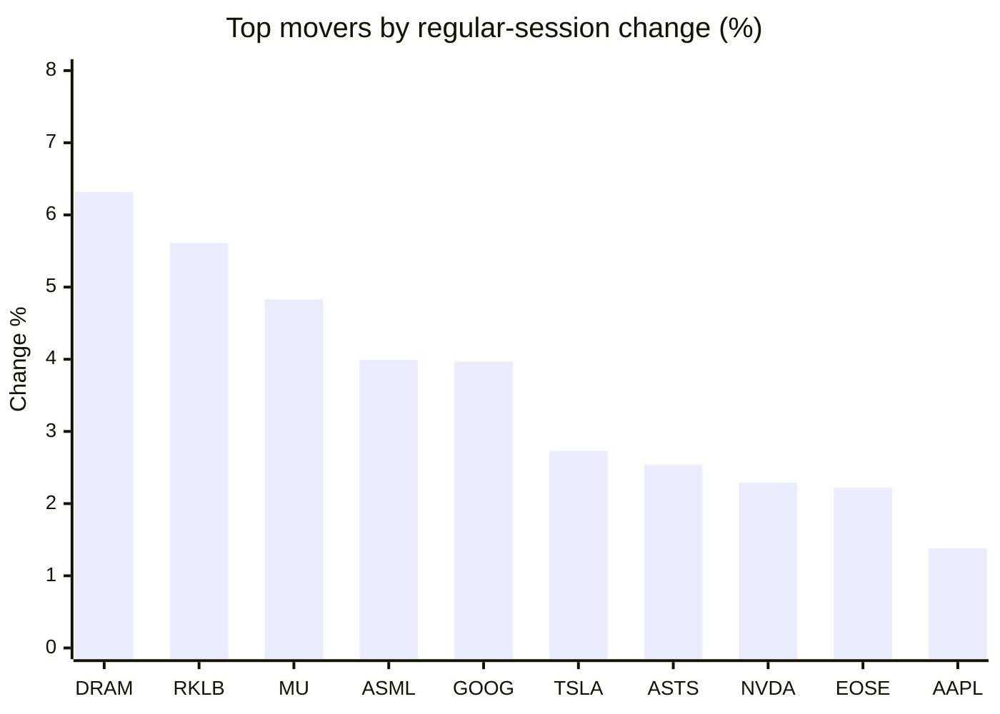
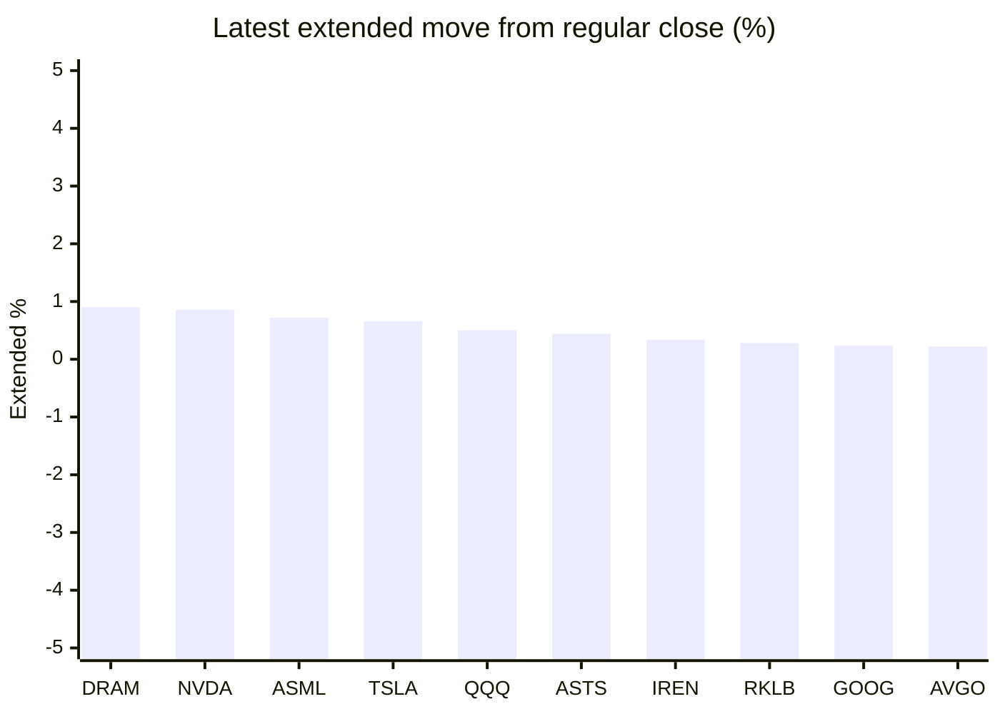

# Stock Brief - 2026-05-14

Generated at 2026-05-14 12:51 +07 from `watchlist.md`.
Prices are snapshots from Yahoo Finance public chart data. Extended/overnight is the latest available pre/post-market datapoint from the same feed.

## Market Snapshot

- SPY: close 742.31, latest extended 743.56, regular move +0.56%, extended move +0.17%
- QQQ: close 714.71, latest extended 718.29, regular move +1.06%, extended move +0.50%
- JEPQ: close 59.89, latest extended 59.94, regular move +0.39%, extended move +0.08%

## Watchlist Prices

| Ticker | Name | Regular close | Latest extended/overnight | Regular move | Extended move | Latest data time | Source |
|---|---|---:|---:|---:|---:|---|---|
| INTC | Intel Corporation | 120.29 USD | 120.01 USD | -0.27% | -0.23% | 2026-05-13 19:59 EDT | [Yahoo](https://finance.yahoo.com/quote/INTC/) |
| AVGO | Broadcom Inc. | 416.79 USD | 417.72 USD | -0.60% | +0.22% | 2026-05-13 19:59 EDT | [Yahoo](https://finance.yahoo.com/quote/AVGO/) |
| RKLB | Rocket Lab Corporation | 124.15 USD | 124.50 USD | +5.61% | +0.28% | 2026-05-13 19:59 EDT | [Yahoo](https://finance.yahoo.com/quote/RKLB/) |
| AAPL | Apple Inc. | 298.87 USD | 298.56 USD | +1.38% | -0.10% | 2026-05-13 19:59 EDT | [Yahoo](https://finance.yahoo.com/quote/AAPL/) |
| NVDA | NVIDIA Corporation | 225.83 USD | 227.78 USD | +2.29% | +0.86% | 2026-05-13 19:59 EDT | [Yahoo](https://finance.yahoo.com/quote/NVDA/) |
| TSLA | Tesla, Inc. | 445.27 USD | 448.20 USD | +2.73% | +0.66% | 2026-05-13 19:59 EDT | [Yahoo](https://finance.yahoo.com/quote/TSLA/) |
| SNDK | Sandisk Corporation | 1,447.23 USD | 1,442.00 USD | -0.33% | -0.36% | 2026-05-13 19:59 EDT | [Yahoo](https://finance.yahoo.com/quote/SNDK/) |
| QQQ | Invesco QQQ Trust, Series 1 | 714.71 USD | 718.29 USD | +1.06% | +0.50% | 2026-05-13 19:59 EDT | [Yahoo](https://finance.yahoo.com/quote/QQQ/) |
| SPY | State Street SPDR S&P 500 ETF T | 742.31 USD | 743.56 USD | +0.56% | +0.17% | 2026-05-13 19:59 EDT | [Yahoo](https://finance.yahoo.com/quote/SPY/) |
| JEPQ | JPMorgan Nasdaq Equity Premium  | 59.89 USD | 59.94 USD | +0.39% | +0.08% | 2026-05-13 19:59 EDT | [Yahoo](https://finance.yahoo.com/quote/JEPQ/) |
| ASTS | AST SpaceMobile, Inc. | 74.81 USD | 75.14 USD | +2.54% | +0.44% | 2026-05-13 19:59 EDT | [Yahoo](https://finance.yahoo.com/quote/ASTS/) |
| MU | Micron Technology, Inc. | 803.63 USD | 802.50 USD | +4.83% | -0.14% | 2026-05-13 19:59 EDT | [Yahoo](https://finance.yahoo.com/quote/MU/) |
| IREN | IREN LIMITED | 55.17 USD | 55.36 USD | -2.46% | +0.34% | 2026-05-13 19:59 EDT | [Yahoo](https://finance.yahoo.com/quote/IREN/) |
| EOSE | Eos Energy Enterprises, Inc. | 8.28 USD | 8.16 USD | +2.22% | -1.45% | 2026-05-13 19:59 EDT | [Yahoo](https://finance.yahoo.com/quote/EOSE/) |
| GOOG | Alphabet Inc. | 399.04 USD | 400.00 USD | +3.97% | +0.24% | 2026-05-13 19:59 EDT | [Yahoo](https://finance.yahoo.com/quote/GOOG/) |
| DRAM | Roundhill Memory ETF | 54.54 USD | 55.03 USD | +6.32% | +0.90% | 2026-05-13 19:59 EDT | [Yahoo](https://finance.yahoo.com/quote/DRAM/) |
| AMD | Advanced Micro Devices, Inc. | 445.50 USD | 446.40 USD | -0.62% | +0.20% | 2026-05-13 19:59 EDT | [Yahoo](https://finance.yahoo.com/quote/AMD/) |
| ASML | ASML Holding N.V. - New York Re | 1,581.58 USD | 1,593.00 USD | +3.99% | +0.72% | 2026-05-13 19:59 EDT | [Yahoo](https://finance.yahoo.com/quote/ASML/) |

## Charts

### Top Movers - Regular Session

### Extended / Overnight Move

### Quick Heatmap

| Group | Names in watchlist | Avg regular move | Avg extended move |
|---|---|---:|---:|
| Mega-cap tech | AVGO, AAPL, NVDA, TSLA, GOOG | +1.95% | +0.38% |
| Semis / memory | INTC, SNDK, MU, DRAM, AMD, ASML | +2.32% | +0.18% |
| Space / high beta | RKLB, ASTS, IREN, EOSE | +1.98% | -0.10% |
| ETFs | QQQ, SPY, JEPQ | +0.67% | +0.25% |

## News Headlines

- [Exclusive-US clears H200 chip sales to 10 China firms as Nvidia CEO looks for breakthrough](https://finance.yahoo.com/sectors/technology/articles/exclusive-us-clears-h200-chip-054811582.html?.tsrc=rss) (2026-05-14 12:48 Bangkok)
- [China's view on Elon Musk? Visionary, occasional villain](https://finance.yahoo.com/sectors/technology/articles/chinas-view-elon-musk-visionary-054321147.html?.tsrc=rss) (2026-05-14 12:43 Bangkok)
- [Nvidia Overtakes Silver To Become World's Second-Largest Asset At $5.52 Trillion, Market Commentator Calls It 'Historic Technological Revolution'](https://finance.yahoo.com/markets/stocks/articles/nvidia-overtakes-silver-become-worlds-052824490.html?.tsrc=rss) (2026-05-14 12:28 Bangkok)
- [Gavin Newsom Unveils $1 Billion EV Incentive Program That Could Benefit Elon Musk's Tesla Semi](https://finance.yahoo.com/economy/policy/articles/gavin-newsom-unveils-1-billion-052045626.html?.tsrc=rss) (2026-05-14 12:20 Bangkok)
- [My Top 2 AI Stocks Flying Under the Radar for May 2026](https://www.fool.com/investing/2026/05/14/my-top-2-ai-stocks-flying-under-the-radar-for-may/?.tsrc=rss) (2026-05-14 12:20 Bangkok)
- [AEye Inc (LIDR) Q1 2026 Earnings Call Highlights: Revenue Surge Amidst Strategic Partnerships](https://finance.yahoo.com/markets/stocks/articles/aeye-inc-lidr-q1-2026-050030213.html?.tsrc=rss) (2026-05-14 12:00 Bangkok)
- [Why I'd Rather Own Micron Stock Than Sandisk](https://www.fool.com/investing/2026/05/14/why-id-rather-own-micron-than-sandisk/?.tsrc=rss) (2026-05-14 11:50 Bangkok)
- [Apple China Talks Put Valuation And Growth Expectations In Sharper Focus](https://finance.yahoo.com/markets/stocks/articles/apple-china-talks-put-valuation-043706551.html?.tsrc=rss) (2026-05-14 11:37 Bangkok)

## Caveats

- This is not investment advice. Extended-hours prices can be thin and volatile.
- Yahoo public endpoints may lag official exchange data.
