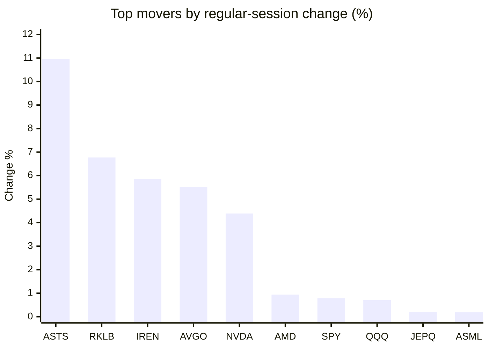
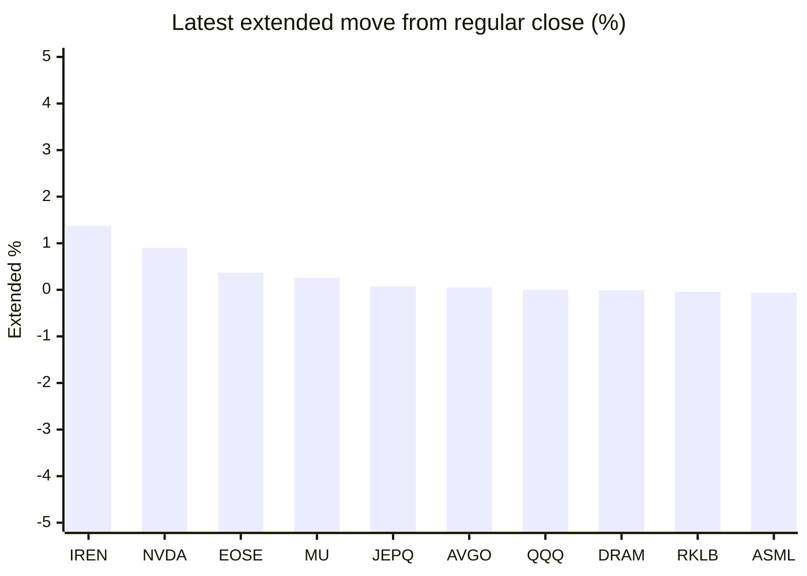

# Stock Brief - 2026-05-15

Generated at 2026-05-15 12:58 +07 from `watchlist.md`.
Prices are snapshots from Yahoo Finance public chart data. Extended/overnight is the latest available pre/post-market datapoint from the same feed.

## Market Snapshot

- SPY: close 748.17, latest extended 747.68, regular move +0.79%, extended move -0.07%
- QQQ: close 719.79, latest extended 719.76, regular move +0.71%, extended move -0.00%
- JEPQ: close 60.01, latest extended 60.05, regular move +0.20%, extended move +0.07%

## Watchlist Prices

| Ticker | Name | Regular close | Latest extended/overnight | Regular move | Extended move | Latest data time | Source |
|---|---|---:|---:|---:|---:|---|---|
| INTC | Intel Corporation | 115.93 USD | 114.33 USD | -3.62% | -1.38% | 2026-05-14 19:59 EDT | [Yahoo](https://finance.yahoo.com/quote/INTC/) |
| AVGO | Broadcom Inc. | 439.79 USD | 440.00 USD | +5.52% | +0.05% | 2026-05-14 19:59 EDT | [Yahoo](https://finance.yahoo.com/quote/AVGO/) |
| RKLB | Rocket Lab Corporation | 132.55 USD | 132.50 USD | +6.77% | -0.04% | 2026-05-14 19:59 EDT | [Yahoo](https://finance.yahoo.com/quote/RKLB/) |
| AAPL | Apple Inc. | 298.21 USD | 297.83 USD | -0.22% | -0.13% | 2026-05-14 19:59 EDT | [Yahoo](https://finance.yahoo.com/quote/AAPL/) |
| NVDA | NVIDIA Corporation | 235.74 USD | 237.87 USD | +4.39% | +0.90% | 2026-05-14 19:59 EDT | [Yahoo](https://finance.yahoo.com/quote/NVDA/) |
| TSLA | Tesla, Inc. | 443.30 USD | 442.40 USD | -0.44% | -0.20% | 2026-05-14 19:59 EDT | [Yahoo](https://finance.yahoo.com/quote/TSLA/) |
| SNDK | Sandisk Corporation | 1,382.72 USD | 1,370.00 USD | -4.46% | -0.92% | 2026-05-14 19:59 EDT | [Yahoo](https://finance.yahoo.com/quote/SNDK/) |
| QQQ | Invesco QQQ Trust, Series 1 | 719.79 USD | 719.76 USD | +0.71% | -0.00% | 2026-05-14 19:59 EDT | [Yahoo](https://finance.yahoo.com/quote/QQQ/) |
| SPY | State Street SPDR S&P 500 ETF T | 748.17 USD | 747.68 USD | +0.79% | -0.07% | 2026-05-14 19:59 EDT | [Yahoo](https://finance.yahoo.com/quote/SPY/) |
| JEPQ | JPMorgan Nasdaq Equity Premium  | 60.01 USD | 60.05 USD | +0.20% | +0.07% | 2026-05-14 19:59 EDT | [Yahoo](https://finance.yahoo.com/quote/JEPQ/) |
| ASTS | AST SpaceMobile, Inc. | 83.01 USD | 82.73 USD | +10.96% | -0.34% | 2026-05-14 19:59 EDT | [Yahoo](https://finance.yahoo.com/quote/ASTS/) |
| MU | Micron Technology, Inc. | 776.01 USD | 778.00 USD | -3.44% | +0.26% | 2026-05-14 19:59 EDT | [Yahoo](https://finance.yahoo.com/quote/MU/) |
| IREN | IREN LIMITED | 58.40 USD | 59.20 USD | +5.85% | +1.37% | 2026-05-14 19:59 EDT | [Yahoo](https://finance.yahoo.com/quote/IREN/) |
| EOSE | Eos Energy Enterprises, Inc. | 8.17 USD | 8.20 USD | -1.33% | +0.37% | 2026-05-14 19:59 EDT | [Yahoo](https://finance.yahoo.com/quote/EOSE/) |
| GOOG | Alphabet Inc. | 397.17 USD | 396.80 USD | -0.47% | -0.09% | 2026-05-14 19:59 EDT | [Yahoo](https://finance.yahoo.com/quote/GOOG/) |
| DRAM | Roundhill Memory ETF | 53.79 USD | 53.78 USD | -1.38% | -0.01% | 2026-05-14 19:59 EDT | [Yahoo](https://finance.yahoo.com/quote/DRAM/) |
| AMD | Advanced Micro Devices, Inc. | 449.70 USD | 447.50 USD | +0.94% | -0.49% | 2026-05-14 19:59 EDT | [Yahoo](https://finance.yahoo.com/quote/AMD/) |
| ASML | ASML Holding N.V. - New York Re | 1,584.51 USD | 1,583.50 USD | +0.19% | -0.06% | 2026-05-14 19:59 EDT | [Yahoo](https://finance.yahoo.com/quote/ASML/) |

## Charts

### Top Movers - Regular Session

### Extended / Overnight Move

### Quick Heatmap

| Group | Names in watchlist | Avg regular move | Avg extended move |
|---|---|---:|---:|
| Mega-cap tech | AVGO, AAPL, NVDA, TSLA, GOOG | +1.75% | +0.11% |
| Semis / memory | INTC, SNDK, MU, DRAM, AMD, ASML | -1.96% | -0.43% |
| Space / high beta | RKLB, ASTS, IREN, EOSE | +5.56% | +0.34% |
| ETFs | QQQ, SPY, JEPQ | +0.57% | -0.00% |

## News Headlines

- [Teva Stock Is at Its Highest Level in Nearly a Decade. Here's Why It Could Soar Even More.](https://www.fool.com/investing/2026/05/15/teva-stock-is-at-its-highest-level-in-nearly-a-dec/?.tsrc=rss) (2026-05-15 12:20 Bangkok)
- [The "Magnificent Seven" Has Gained $4.8 Trillion Since the Start of April. Here's Why That's a Risk to the S&P 500 and Nasdaq-100.](https://www.fool.com/investing/2026/05/15/magnificent-seven-growth-stocks-all-time-high/?.tsrc=rss) (2026-05-15 12:15 Bangkok)
- [Tesla, Toyota expose surprising auto industry truth](https://www.thestreet.com/automotive/tesla-toyota-expose-surprising-auto-industry-truth?.tsrc=rss) (2026-05-15 11:37 Bangkok)
- [Cerebras Just Pulled Off the Biggest IPO Of 2026 So Far. History Says This Happens Next.](https://www.fool.com/investing/2026/05/14/cerebras-just-pulled-off-the-biggest-ipo-of-2026-h/?.tsrc=rss) (2026-05-15 11:18 Bangkok)
- [Why are so many U.S. CEOs in China with Trump, and what do they want?](https://www.cbsnews.com/news/trump-china-trip-xi-jinping-us-ceos-business-interests/?.tsrc=rss) (2026-05-15 10:23 Bangkok)
- ["The Big Short's" Michael Burry vs. Renowned Economist Ed Yardeni: One Thinks the Stock Market Is Going to 8,250, and the Other Sees an Imminent "Bloody Car Crash."](https://www.fool.com/investing/2026/05/14/the-big-shorts-michael-burry-vs-renowned-economist/?.tsrc=rss) (2026-05-15 10:20 Bangkok)
- [Dow Jones Futures Fall, Yields Top 4.5% After Nvidia Runs, Cerebras IPO Soars; Trump-Xi Summit Continues](https://finance.yahoo.com/m/63a0367a-b214-3c30-957e-0363f7c21b2e/dow-jones-futures-fall%2C.html?.tsrc=rss) (2026-05-15 10:04 Bangkok)
- [As Nvidia Stock Hits New Highs, Is It Too Late to Buy?](https://www.fool.com/investing/2026/05/14/as-nvidia-stock-hits-new-highs-is-it-too-late-to-b/?.tsrc=rss) (2026-05-15 09:20 Bangkok)

## Caveats

- This is not investment advice. Extended-hours prices can be thin and volatile.
- Yahoo public endpoints may lag official exchange data.
