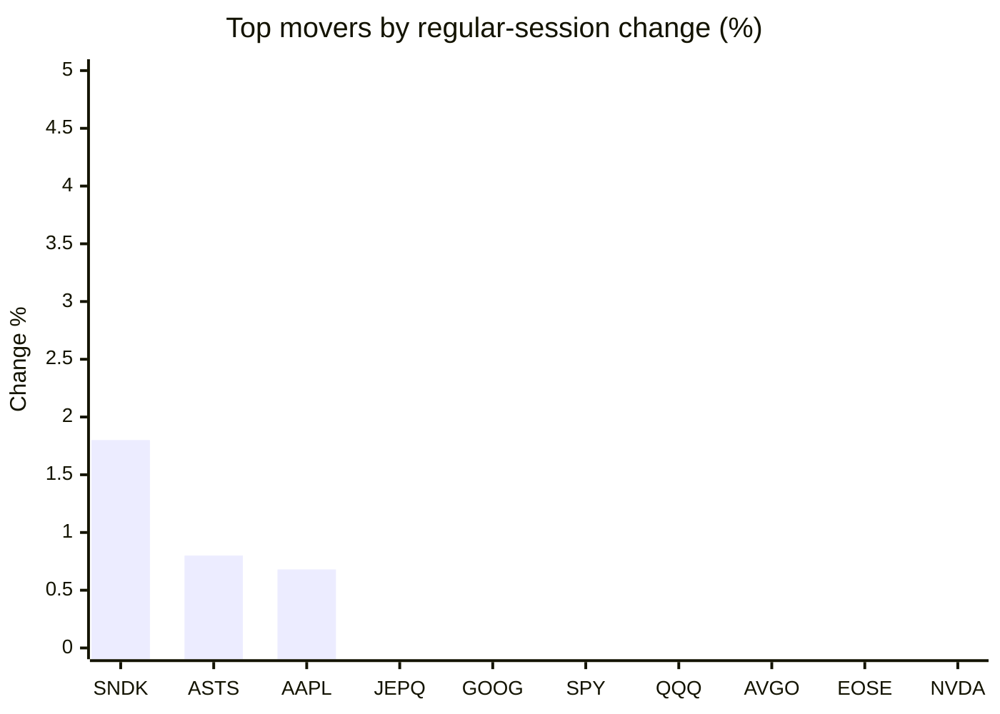
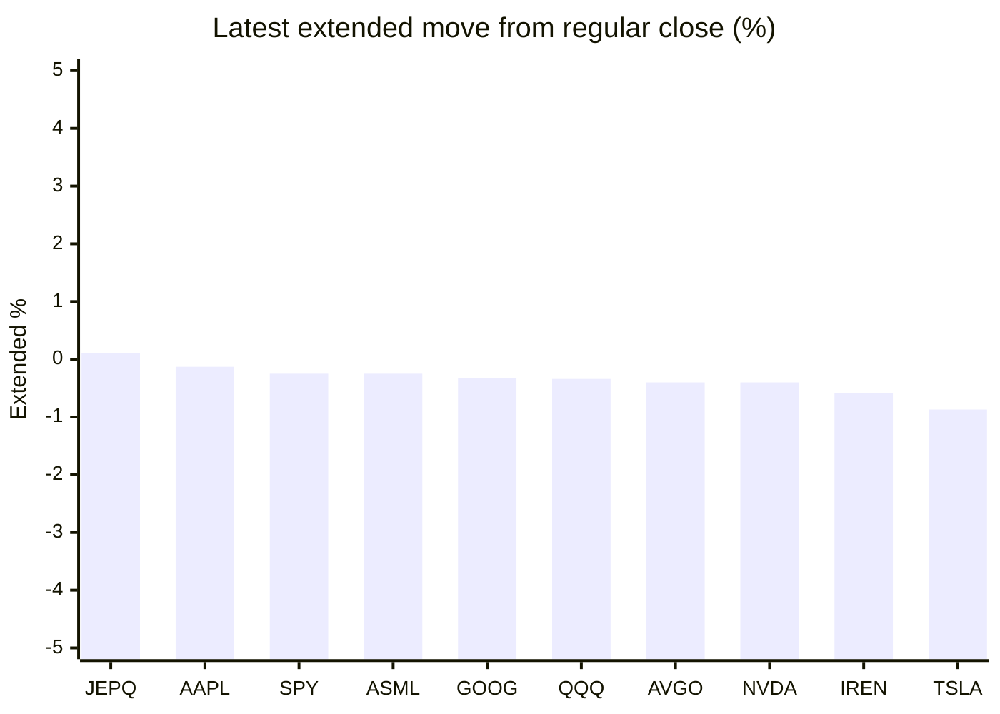

# Stock Brief - 2026-05-17

Generated at 2026-05-17 12:52 +07 from `watchlist.md`.
Prices are snapshots from Yahoo Finance public chart data. Extended/overnight is the latest available pre/post-market datapoint from the same feed.

## Market Snapshot

- SPY: close 739.17, latest extended 737.34, regular move -1.20%, extended move -0.25%
- QQQ: close 708.93, latest extended 706.49, regular move -1.51%, extended move -0.34%
- JEPQ: close 59.77, latest extended 59.84, regular move -0.40%, extended move +0.11%

## Watchlist Prices

| Ticker | Name | Regular close | Latest extended/overnight | Regular move | Extended move | Latest data time | Source |
|---|---|---:|---:|---:|---:|---|---|
| INTC | Intel Corporation | 108.77 USD | 106.91 USD | -6.18% | -1.71% | 2026-05-15 19:59 EDT | [Yahoo](https://finance.yahoo.com/quote/INTC/) |
| AVGO | Broadcom Inc. | 425.19 USD | 423.48 USD | -3.32% | -0.40% | 2026-05-15 19:59 EDT | [Yahoo](https://finance.yahoo.com/quote/AVGO/) |
| RKLB | Rocket Lab Corporation | 124.77 USD | 122.70 USD | -5.87% | -1.66% | 2026-05-15 19:59 EDT | [Yahoo](https://finance.yahoo.com/quote/RKLB/) |
| AAPL | Apple Inc. | 300.23 USD | 299.85 USD | +0.68% | -0.13% | 2026-05-15 19:59 EDT | [Yahoo](https://finance.yahoo.com/quote/AAPL/) |
| NVDA | NVIDIA Corporation | 225.32 USD | 224.41 USD | -4.42% | -0.40% | 2026-05-15 19:59 EDT | [Yahoo](https://finance.yahoo.com/quote/NVDA/) |
| TSLA | Tesla, Inc. | 422.24 USD | 418.57 USD | -4.75% | -0.87% | 2026-05-15 19:59 EDT | [Yahoo](https://finance.yahoo.com/quote/TSLA/) |
| SNDK | Sandisk Corporation | 1,407.61 USD | 1,380.93 USD | +1.80% | -1.90% | 2026-05-15 19:59 EDT | [Yahoo](https://finance.yahoo.com/quote/SNDK/) |
| QQQ | Invesco QQQ Trust, Series 1 | 708.93 USD | 706.49 USD | -1.51% | -0.34% | 2026-05-15 19:59 EDT | [Yahoo](https://finance.yahoo.com/quote/QQQ/) |
| SPY | State Street SPDR S&P 500 ETF T | 739.17 USD | 737.34 USD | -1.20% | -0.25% | 2026-05-15 19:59 EDT | [Yahoo](https://finance.yahoo.com/quote/SPY/) |
| JEPQ | JPMorgan Nasdaq Equity Premium  | 59.77 USD | 59.84 USD | -0.40% | +0.11% | 2026-05-15 19:59 EDT | [Yahoo](https://finance.yahoo.com/quote/JEPQ/) |
| ASTS | AST SpaceMobile, Inc. | 83.67 USD | 82.60 USD | +0.80% | -1.28% | 2026-05-15 19:59 EDT | [Yahoo](https://finance.yahoo.com/quote/ASTS/) |
| MU | Micron Technology, Inc. | 724.66 USD | 715.89 USD | -6.62% | -1.21% | 2026-05-15 19:59 EDT | [Yahoo](https://finance.yahoo.com/quote/MU/) |
| IREN | IREN LIMITED | 52.94 USD | 52.63 USD | -9.35% | -0.59% | 2026-05-15 19:59 EDT | [Yahoo](https://finance.yahoo.com/quote/IREN/) |
| EOSE | Eos Energy Enterprises, Inc. | 7.86 USD | 7.78 USD | -3.73% | -1.08% | 2026-05-15 19:59 EDT | [Yahoo](https://finance.yahoo.com/quote/EOSE/) |
| GOOG | Alphabet Inc. | 393.32 USD | 392.06 USD | -0.97% | -0.32% | 2026-05-15 19:59 EDT | [Yahoo](https://finance.yahoo.com/quote/GOOG/) |
| DRAM | Roundhill Memory ETF | 51.10 USD | 50.29 USD | -5.00% | -1.59% | 2026-05-15 19:59 EDT | [Yahoo](https://finance.yahoo.com/quote/DRAM/) |
| AMD | Advanced Micro Devices, Inc. | 424.10 USD | 420.19 USD | -5.69% | -0.92% | 2026-05-15 19:59 EDT | [Yahoo](https://finance.yahoo.com/quote/AMD/) |
| ASML | ASML Holding N.V. - New York Re | 1,501.81 USD | 1,498.00 USD | -5.22% | -0.25% | 2026-05-15 19:59 EDT | [Yahoo](https://finance.yahoo.com/quote/ASML/) |

## Charts

### Top Movers - Regular Session

### Extended / Overnight Move

### Quick Heatmap

| Group | Names in watchlist | Avg regular move | Avg extended move |
|---|---|---:|---:|
| Mega-cap tech | AVGO, AAPL, NVDA, TSLA, GOOG | -2.56% | -0.42% |
| Semis / memory | INTC, SNDK, MU, DRAM, AMD, ASML | -4.48% | -1.26% |
| Space / high beta | RKLB, ASTS, IREN, EOSE | -4.54% | -1.15% |
| ETFs | QQQ, SPY, JEPQ | -1.04% | -0.16% |

## News Headlines

- [Is It Too Late to Buy Broadcom Stock?](https://www.fool.com/investing/2026/05/16/is-it-too-late-to-buy-broadcom-stock/?.tsrc=rss) (2026-05-17 10:20 Bangkok)
- [AI boom fuels record memory-chip profits, but cyclical risks loom](https://finance.yahoo.com/sectors/technology/articles/ai-boom-fuels-record-memory-031857948.html?.tsrc=rss) (2026-05-17 10:18 Bangkok)
- [Dow Jones Futures: S&P 500, Nasdaq Still Near Highs But Note This; Nvidia, Walmart Earnings Loom](https://finance.yahoo.com/m/fb4e2544-bb05-342b-8de5-a2ec001e3c84/dow-jones-futures%3A-s%26p-500%2C.html?.tsrc=rss) (2026-05-17 08:41 Bangkok)
- [4 Congress Members Are Up On Micron Stock — 2 Made More Than Their Salaries](https://finance.yahoo.com/markets/stocks/articles/4-congress-members-micron-stock-013122730.html?.tsrc=rss) (2026-05-17 08:31 Bangkok)
- [Prediction: This Quantum Computing Stock Will Be Up More Than 20% by the End of 2026](https://www.fool.com/investing/2026/05/16/prediction-this-quantum-computing-stock-will-be-up/?.tsrc=rss) (2026-05-17 08:20 Bangkok)
- [Analyst Predicts Nvidia Stock Should Be 42% Higher](https://www.fool.com/investing/2026/05/16/analyst-predicts-nvidia-stock-should-be-42-higher/?.tsrc=rss) (2026-05-17 07:50 Bangkok)
- [Up 231%, Is RTX Proving Why It Was a Mistake for Honeywell to Replace RTX in the Dow Jones Industrial Average?](https://www.fool.com/investing/2026/05/16/rtx-honeywell-stock-dow-jones-industrial-average/?.tsrc=rss) (2026-05-17 07:20 Bangkok)
- [Why Coherent (COHR) Is Up 14.1% After Strong Q3 Results And Expanded NVIDIA AI Partnership](https://finance.yahoo.com/markets/stocks/articles/why-coherent-cohr-14-1-001704420.html?.tsrc=rss) (2026-05-17 07:17 Bangkok)

## Caveats

- This is not investment advice. Extended-hours prices can be thin and volatile.
- Yahoo public endpoints may lag official exchange data.
