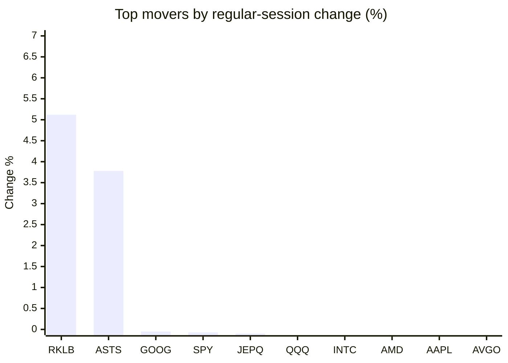
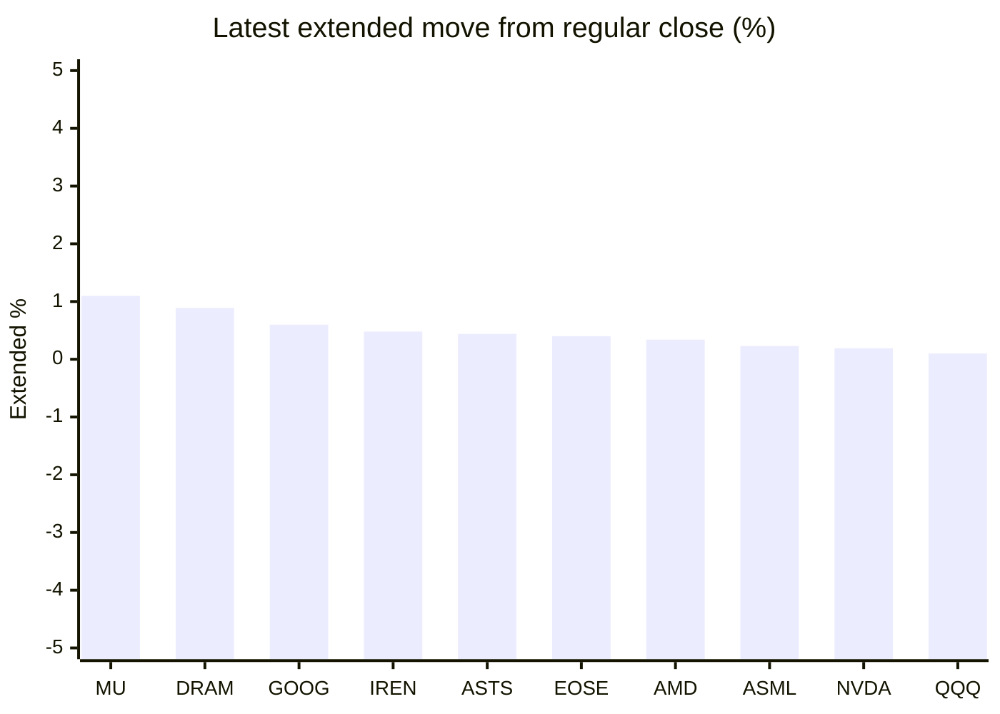

# Stock Brief - 2026-05-19

Generated at 2026-05-19 13:12 +07 from `watchlist.md`.
Prices are snapshots from Yahoo Finance public chart data. Extended/overnight is the latest available pre/post-market datapoint from the same feed.

## Market Snapshot

- SPY: close 738.65, latest extended 738.89, regular move -0.07%, extended move +0.03%
- QQQ: close 705.88, latest extended 706.57, regular move -0.43%, extended move +0.10%
- JEPQ: close 59.71, latest extended 59.72, regular move -0.10%, extended move +0.02%

## Watchlist Prices

| Ticker | Name | Regular close | Latest extended/overnight | Regular move | Extended move | Latest data time | Source |
|---|---|---:|---:|---:|---:|---|---|
| INTC | Intel Corporation | 108.17 USD | 108.14 USD | -0.55% | -0.03% | 2026-05-18 19:59 EDT | [Yahoo](https://finance.yahoo.com/quote/INTC/) |
| AVGO | Broadcom Inc. | 420.71 USD | 419.57 USD | -1.05% | -0.27% | 2026-05-18 19:59 EDT | [Yahoo](https://finance.yahoo.com/quote/AVGO/) |
| RKLB | Rocket Lab Corporation | 131.16 USD | 130.40 USD | +5.12% | -0.58% | 2026-05-18 19:59 EDT | [Yahoo](https://finance.yahoo.com/quote/RKLB/) |
| AAPL | Apple Inc. | 297.84 USD | 297.30 USD | -0.80% | -0.18% | 2026-05-18 19:59 EDT | [Yahoo](https://finance.yahoo.com/quote/AAPL/) |
| NVDA | NVIDIA Corporation | 222.32 USD | 222.75 USD | -1.33% | +0.19% | 2026-05-18 19:59 EDT | [Yahoo](https://finance.yahoo.com/quote/NVDA/) |
| TSLA | Tesla, Inc. | 409.99 USD | 409.47 USD | -2.90% | -0.13% | 2026-05-18 19:59 EDT | [Yahoo](https://finance.yahoo.com/quote/TSLA/) |
| SNDK | Sandisk Corporation | 1,333.01 USD | 1,322.53 USD | -5.30% | -0.79% | 2026-05-18 19:59 EDT | [Yahoo](https://finance.yahoo.com/quote/SNDK/) |
| QQQ | Invesco QQQ Trust, Series 1 | 705.88 USD | 706.57 USD | -0.43% | +0.10% | 2026-05-18 19:59 EDT | [Yahoo](https://finance.yahoo.com/quote/QQQ/) |
| SPY | State Street SPDR S&P 500 ETF T | 738.65 USD | 738.89 USD | -0.07% | +0.03% | 2026-05-18 19:59 EDT | [Yahoo](https://finance.yahoo.com/quote/SPY/) |
| JEPQ | JPMorgan Nasdaq Equity Premium  | 59.71 USD | 59.72 USD | -0.10% | +0.02% | 2026-05-18 19:59 EDT | [Yahoo](https://finance.yahoo.com/quote/JEPQ/) |
| ASTS | AST SpaceMobile, Inc. | 86.83 USD | 87.21 USD | +3.78% | +0.44% | 2026-05-18 19:59 EDT | [Yahoo](https://finance.yahoo.com/quote/ASTS/) |
| MU | Micron Technology, Inc. | 681.54 USD | 689.07 USD | -5.95% | +1.10% | 2026-05-18 19:59 EDT | [Yahoo](https://finance.yahoo.com/quote/MU/) |
| IREN | IREN LIMITED | 50.46 USD | 50.70 USD | -4.68% | +0.48% | 2026-05-18 19:59 EDT | [Yahoo](https://finance.yahoo.com/quote/IREN/) |
| EOSE | Eos Energy Enterprises, Inc. | 7.43 USD | 7.46 USD | -5.53% | +0.40% | 2026-05-18 19:59 EDT | [Yahoo](https://finance.yahoo.com/quote/EOSE/) |
| GOOG | Alphabet Inc. | 393.11 USD | 395.46 USD | -0.05% | +0.60% | 2026-05-18 19:59 EDT | [Yahoo](https://finance.yahoo.com/quote/GOOG/) |
| DRAM | Roundhill Memory ETF | 49.32 USD | 49.76 USD | -3.48% | +0.89% | 2026-05-18 19:59 EDT | [Yahoo](https://finance.yahoo.com/quote/DRAM/) |
| AMD | Advanced Micro Devices, Inc. | 420.99 USD | 422.41 USD | -0.73% | +0.34% | 2026-05-18 19:59 EDT | [Yahoo](https://finance.yahoo.com/quote/AMD/) |
| ASML | ASML Holding N.V. - New York Re | 1,472.39 USD | 1,475.75 USD | -1.96% | +0.23% | 2026-05-18 19:59 EDT | [Yahoo](https://finance.yahoo.com/quote/ASML/) |

## Charts

### Top Movers - Regular Session

### Extended / Overnight Move

### Quick Heatmap

| Group | Names in watchlist | Avg regular move | Avg extended move |
|---|---|---:|---:|
| Mega-cap tech | AVGO, AAPL, NVDA, TSLA, GOOG | -1.23% | +0.04% |
| Semis / memory | INTC, SNDK, MU, DRAM, AMD, ASML | -3.00% | +0.29% |
| Space / high beta | RKLB, ASTS, IREN, EOSE | -0.33% | +0.18% |
| ETFs | QQQ, SPY, JEPQ | -0.20% | +0.05% |

## News Headlines

- [Forget Nvidia. 1 of These 3 Hyperscalers Could Be the Top AI Stock Through 2030.](https://www.fool.com/investing/2026/05/19/forget-nvidia-1-of-these-3-hyperscalers-could-be-t/?.tsrc=rss) (2026-05-19 13:01 Bangkok)
- [SpaceX IPO Reshapes Tesla Investor Choices And Musk Ecosystem Exposure](https://finance.yahoo.com/markets/stocks/articles/spacex-ipo-reshapes-tesla-investor-051434706.html?.tsrc=rss) (2026-05-19 12:14 Bangkok)
- [I Have 90% of My Net Worth in One Stock. How Do I Diversify Without a Massive Tax Bill?](https://247wallst.com/investing/2026/05/19/i-have-90-of-my-net-worth-in-one-stock-how-do-i-diversify-without-a-massive-tax-bill/?.tsrc=rss) (2026-05-19 11:38 Bangkok)
- [Greg Abel Recently Bought $235 Million Worth of Warren Buffett's Favorite Stock](https://www.fool.com/investing/2026/05/18/greg-abel-bought-235-million-warren-buffetts-stock/?.tsrc=rss) (2026-05-19 10:50 Bangkok)
- [2 Momentum  Stocks Worth Your Attention and 1 That Underwhelm](https://finance.yahoo.com/markets/stocks/articles/2-momentum-stocks-worth-attention-032455694.html?.tsrc=rss) (2026-05-19 10:24 Bangkok)
- [Dow Jones Futures: Trump Iran Delay Saves Dow, But Sandisk, Bloom Energy, AI Leaders Sell Off](https://finance.yahoo.com/m/bdce288d-bb33-379d-941c-eb88f39f3701/dow-jones-futures%3A-trump-iran.html?.tsrc=rss) (2026-05-19 10:06 Bangkok)
- [China market for Nvidia AI chips to open 'over time': Huang](https://finance.yahoo.com/sectors/technology/articles/china-market-nvidia-ai-chips-030253929.html?.tsrc=rss) (2026-05-19 10:02 Bangkok)
- [UBS drops aggressive Broadcom stock price forecast](https://www.thestreet.com/investing/stocks/ubs-drops-aggressive-broadcom-stock-price-forecast?.tsrc=rss) (2026-05-19 09:37 Bangkok)

## Caveats

- This is not investment advice. Extended-hours prices can be thin and volatile.
- Yahoo public endpoints may lag official exchange data.
