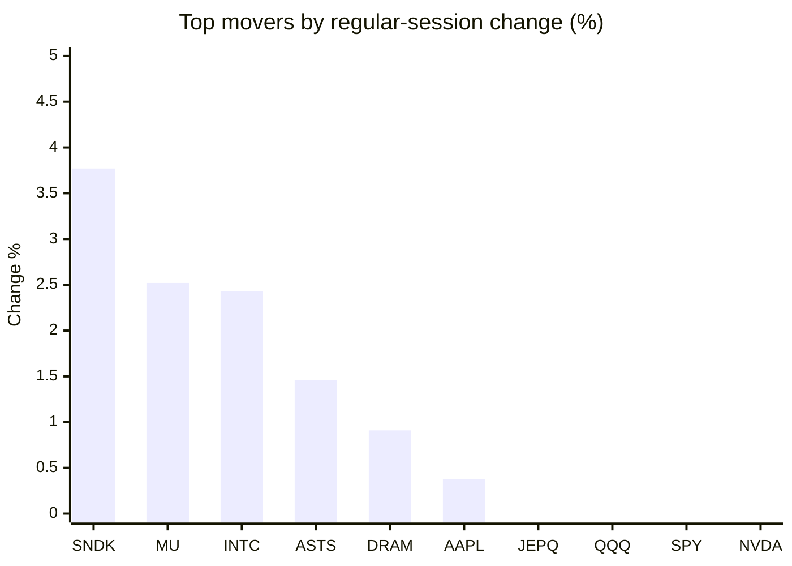
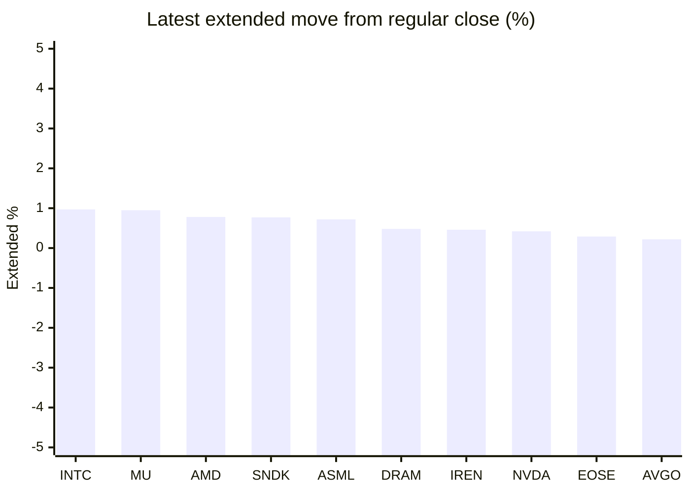

# Stock Brief - 2026-05-20

Generated at 2026-05-20 13:13 +07 from `watchlist.md`.
Prices are snapshots from Yahoo Finance public chart data. Extended/overnight is the latest available pre/post-market datapoint from the same feed.

## Market Snapshot

- SPY: close 733.73, latest extended 734.25, regular move -0.67%, extended move +0.07%
- QQQ: close 701.53, latest extended 702.26, regular move -0.62%, extended move +0.10%
- JEPQ: close 59.60, latest extended 59.60, regular move -0.18%, extended move +0.00%

## Watchlist Prices

| Ticker | Name | Regular close | Latest extended/overnight | Regular move | Extended move | Latest data time | Source |
|---|---|---:|---:|---:|---:|---|---|
| INTC | Intel Corporation | 110.80 USD | 111.87 USD | +2.43% | +0.97% | 2026-05-19 19:59 EDT | [Yahoo](https://finance.yahoo.com/quote/INTC/) |
| AVGO | Broadcom Inc. | 411.07 USD | 411.98 USD | -2.29% | +0.22% | 2026-05-19 19:59 EDT | [Yahoo](https://finance.yahoo.com/quote/AVGO/) |
| RKLB | Rocket Lab Corporation | 127.31 USD | 126.10 USD | -2.94% | -0.95% | 2026-05-19 19:59 EDT | [Yahoo](https://finance.yahoo.com/quote/RKLB/) |
| AAPL | Apple Inc. | 298.97 USD | 298.97 USD | +0.38% | -0.00% | 2026-05-19 19:59 EDT | [Yahoo](https://finance.yahoo.com/quote/AAPL/) |
| NVDA | NVIDIA Corporation | 220.61 USD | 221.54 USD | -0.77% | +0.42% | 2026-05-19 19:59 EDT | [Yahoo](https://finance.yahoo.com/quote/NVDA/) |
| TSLA | Tesla, Inc. | 404.11 USD | 404.68 USD | -1.43% | +0.14% | 2026-05-19 19:59 EDT | [Yahoo](https://finance.yahoo.com/quote/TSLA/) |
| SNDK | Sandisk Corporation | 1,383.29 USD | 1,394.00 USD | +3.77% | +0.77% | 2026-05-19 19:59 EDT | [Yahoo](https://finance.yahoo.com/quote/SNDK/) |
| QQQ | Invesco QQQ Trust, Series 1 | 701.53 USD | 702.26 USD | -0.62% | +0.10% | 2026-05-19 19:59 EDT | [Yahoo](https://finance.yahoo.com/quote/QQQ/) |
| SPY | State Street SPDR S&P 500 ETF T | 733.73 USD | 734.25 USD | -0.67% | +0.07% | 2026-05-19 19:59 EDT | [Yahoo](https://finance.yahoo.com/quote/SPY/) |
| JEPQ | JPMorgan Nasdaq Equity Premium  | 59.60 USD | 59.60 USD | -0.18% | +0.00% | 2026-05-19 19:58 EDT | [Yahoo](https://finance.yahoo.com/quote/JEPQ/) |
| ASTS | AST SpaceMobile, Inc. | 88.10 USD | 87.19 USD | +1.46% | -1.03% | 2026-05-19 19:59 EDT | [Yahoo](https://finance.yahoo.com/quote/ASTS/) |
| MU | Micron Technology, Inc. | 698.74 USD | 705.40 USD | +2.52% | +0.95% | 2026-05-19 19:59 EDT | [Yahoo](https://finance.yahoo.com/quote/MU/) |
| IREN | IREN LIMITED | 47.74 USD | 47.96 USD | -5.39% | +0.46% | 2026-05-19 19:59 EDT | [Yahoo](https://finance.yahoo.com/quote/IREN/) |
| EOSE | Eos Energy Enterprises, Inc. | 6.88 USD | 6.90 USD | -7.40% | +0.29% | 2026-05-19 19:59 EDT | [Yahoo](https://finance.yahoo.com/quote/EOSE/) |
| GOOG | Alphabet Inc. | 384.90 USD | 385.06 USD | -2.09% | +0.04% | 2026-05-19 19:59 EDT | [Yahoo](https://finance.yahoo.com/quote/GOOG/) |
| DRAM | Roundhill Memory ETF | 49.77 USD | 50.01 USD | +0.91% | +0.48% | 2026-05-19 19:59 EDT | [Yahoo](https://finance.yahoo.com/quote/DRAM/) |
| AMD | Advanced Micro Devices, Inc. | 414.05 USD | 417.28 USD | -1.65% | +0.78% | 2026-05-19 19:59 EDT | [Yahoo](https://finance.yahoo.com/quote/AMD/) |
| ASML | ASML Holding N.V. - New York Re | 1,459.44 USD | 1,470.00 USD | -0.88% | +0.72% | 2026-05-19 19:59 EDT | [Yahoo](https://finance.yahoo.com/quote/ASML/) |

## Charts

### Top Movers - Regular Session

### Extended / Overnight Move

### Quick Heatmap

| Group | Names in watchlist | Avg regular move | Avg extended move |
|---|---|---:|---:|
| Mega-cap tech | AVGO, AAPL, NVDA, TSLA, GOOG | -1.24% | +0.16% |
| Semis / memory | INTC, SNDK, MU, DRAM, AMD, ASML | +1.19% | +0.78% |
| Space / high beta | RKLB, ASTS, IREN, EOSE | -3.57% | -0.31% |
| ETFs | QQQ, SPY, JEPQ | -0.49% | +0.06% |

## News Headlines

- [Nvidia's Earnings Are Hours Away. Here Are 3 Things to Watch.](https://www.fool.com/investing/2026/05/20/nvidias-earnings-are-hours-away-here-are-3-things/?.tsrc=rss) (2026-05-20 12:46 Bangkok)
- [“4,000% or 5,000% Over Five or Six Years”: Why Patient Investors in NVDA, AMD, and LLY Are Winning](https://247wallst.com/investing/2026/05/20/4000-or-5000-over-five-or-six-years-why-patient-investors-in-nvda-amd-and-lly-are-winning/?.tsrc=rss) (2026-05-20 12:22 Bangkok)
- [The S&P 500 Just Completed Its 7th Straight Up Week. History Says It's Still Time to Buy.](https://www.fool.com/investing/2026/05/20/sp-500-7th-straight-up-week-history-says-to-buy/?.tsrc=rss) (2026-05-20 11:35 Bangkok)
- [Should You Buy Nvidia Stock Before Its Next Earnings Report?](https://www.fool.com/investing/2026/05/19/should-you-buy-nvidia-stock-before-its-next-earnin/?.tsrc=rss) (2026-05-20 11:11 Bangkok)
- [Broadcom Deepens LSEG Ties While Targeting US$100b In Custom AI Chips](https://finance.yahoo.com/markets/stocks/articles/broadcom-deepens-lseg-ties-while-031527572.html?.tsrc=rss) (2026-05-20 10:15 Bangkok)
- [Dow Jones Futures Fall With Nvidia Earnings Due; Micron, Sandisk, Astera Rise](https://finance.yahoo.com/m/1a78da30-53e1-396a-afe5-e4b0f2111416/dow-jones-futures-fall-with.html?.tsrc=rss) (2026-05-20 10:06 Bangkok)
- [Dave Ramsey on Why Index Funds vs. Mutual Funds Misses the Real Point About Building Wealth](https://247wallst.com/investing/2026/05/19/dave-ramsey-on-why-index-funds-vs-mutual-funds-misses-the-real-point-about-building-wealth/?.tsrc=rss) (2026-05-20 09:44 Bangkok)
- [Intel Tenstorrent Talks Highlight AI Ambitions And Valuation Questions](https://finance.yahoo.com/markets/stocks/articles/intel-tenstorrent-talks-highlight-ai-020914103.html?.tsrc=rss) (2026-05-20 09:09 Bangkok)

## Caveats

- This is not investment advice. Extended-hours prices can be thin and volatile.
- Yahoo public endpoints may lag official exchange data.
