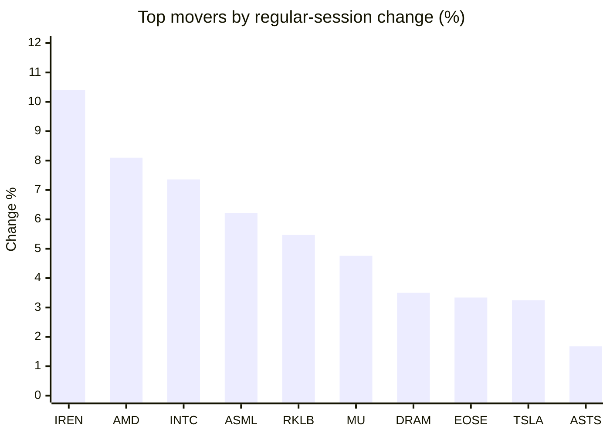
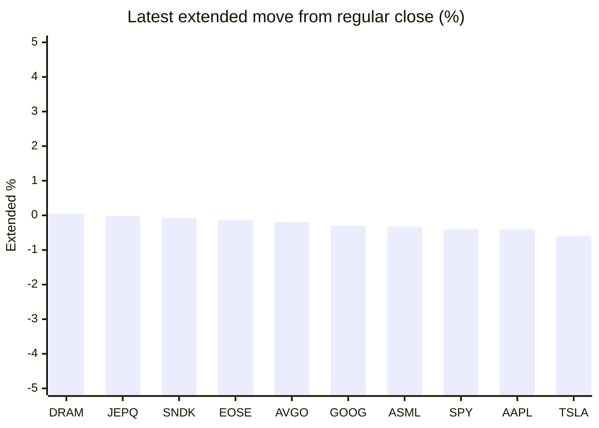

# Stock Brief - 2026-05-21

Generated at 2026-05-21 13:14 +07 from `watchlist.md`.
Prices are snapshots from Yahoo Finance public chart data. Extended/overnight is the latest available pre/post-market datapoint from the same feed.

## Market Snapshot

- SPY: close 741.25, latest extended 738.30, regular move +1.02%, extended move -0.40%
- QQQ: close 713.15, latest extended 708.26, regular move +1.66%, extended move -0.69%
- JEPQ: close 59.98, latest extended 59.97, regular move +0.64%, extended move -0.02%

## Watchlist Prices

| Ticker | Name | Regular close | Latest extended/overnight | Regular move | Extended move | Latest data time | Source |
|---|---|---:|---:|---:|---:|---|---|
| INTC | Intel Corporation | 118.96 USD | 116.89 USD | +7.36% | -1.74% | 2026-05-20 19:59 EDT | [Yahoo](https://finance.yahoo.com/quote/INTC/) |
| AVGO | Broadcom Inc. | 417.76 USD | 416.95 USD | +1.63% | -0.19% | 2026-05-20 19:59 EDT | [Yahoo](https://finance.yahoo.com/quote/AVGO/) |
| RKLB | Rocket Lab Corporation | 134.28 USD | 123.08 USD | +5.47% | -8.34% | 2026-05-20 19:59 EDT | [Yahoo](https://finance.yahoo.com/quote/RKLB/) |
| AAPL | Apple Inc. | 302.25 USD | 301.01 USD | +1.10% | -0.41% | 2026-05-20 19:59 EDT | [Yahoo](https://finance.yahoo.com/quote/AAPL/) |
| NVDA | NVIDIA Corporation | 223.47 USD | 220.66 USD | +1.30% | -1.26% | 2026-05-20 19:59 EDT | [Yahoo](https://finance.yahoo.com/quote/NVDA/) |
| TSLA | Tesla, Inc. | 417.26 USD | 414.75 USD | +3.25% | -0.60% | 2026-05-20 19:59 EDT | [Yahoo](https://finance.yahoo.com/quote/TSLA/) |
| SNDK | Sandisk Corporation | 1,392.56 USD | 1,391.39 USD | +0.67% | -0.08% | 2026-05-20 19:59 EDT | [Yahoo](https://finance.yahoo.com/quote/SNDK/) |
| QQQ | Invesco QQQ Trust, Series 1 | 713.15 USD | 708.26 USD | +1.66% | -0.69% | 2026-05-20 19:59 EDT | [Yahoo](https://finance.yahoo.com/quote/QQQ/) |
| SPY | State Street SPDR S&P 500 ETF T | 741.25 USD | 738.30 USD | +1.02% | -0.40% | 2026-05-20 19:59 EDT | [Yahoo](https://finance.yahoo.com/quote/SPY/) |
| JEPQ | JPMorgan Nasdaq Equity Premium  | 59.98 USD | 59.97 USD | +0.64% | -0.02% | 2026-05-20 19:57 EDT | [Yahoo](https://finance.yahoo.com/quote/JEPQ/) |
| ASTS | AST SpaceMobile, Inc. | 89.58 USD | 88.70 USD | +1.68% | -0.98% | 2026-05-20 19:59 EDT | [Yahoo](https://finance.yahoo.com/quote/ASTS/) |
| MU | Micron Technology, Inc. | 731.99 USD | 726.00 USD | +4.76% | -0.82% | 2026-05-20 19:59 EDT | [Yahoo](https://finance.yahoo.com/quote/MU/) |
| IREN | IREN LIMITED | 52.71 USD | 52.16 USD | +10.41% | -1.04% | 2026-05-20 19:59 EDT | [Yahoo](https://finance.yahoo.com/quote/IREN/) |
| EOSE | Eos Energy Enterprises, Inc. | 7.11 USD | 7.10 USD | +3.34% | -0.14% | 2026-05-20 19:58 EDT | [Yahoo](https://finance.yahoo.com/quote/EOSE/) |
| GOOG | Alphabet Inc. | 384.90 USD | 383.74 USD | +0.00% | -0.30% | 2026-05-20 19:59 EDT | [Yahoo](https://finance.yahoo.com/quote/GOOG/) |
| DRAM | Roundhill Memory ETF | 51.51 USD | 51.53 USD | +3.50% | +0.05% | 2026-05-20 19:59 EDT | [Yahoo](https://finance.yahoo.com/quote/DRAM/) |
| AMD | Advanced Micro Devices, Inc. | 447.58 USD | 439.69 USD | +8.10% | -1.76% | 2026-05-20 19:59 EDT | [Yahoo](https://finance.yahoo.com/quote/AMD/) |
| ASML | ASML Holding N.V. - New York Re | 1,550.13 USD | 1,544.95 USD | +6.21% | -0.33% | 2026-05-20 19:59 EDT | [Yahoo](https://finance.yahoo.com/quote/ASML/) |

## Charts

### Top Movers - Regular Session

### Extended / Overnight Move

### Quick Heatmap

| Group | Names in watchlist | Avg regular move | Avg extended move |
|---|---|---:|---:|
| Mega-cap tech | AVGO, AAPL, NVDA, TSLA, GOOG | +1.46% | -0.55% |
| Semis / memory | INTC, SNDK, MU, DRAM, AMD, ASML | +5.10% | -0.78% |
| Space / high beta | RKLB, ASTS, IREN, EOSE | +5.23% | -2.63% |
| ETFs | QQQ, SPY, JEPQ | +1.11% | -0.37% |

## News Headlines

- [SpaceX targets record flotation that could make Musk a trillionaire](https://uk.finance.yahoo.com/news/spacex-targets-record-flotation-could-060100720.html?.tsrc=rss) (2026-05-21 13:01 Bangkok)
- [NVIDIA Corp (NVDA) Q1 2027 Earnings Call Highlights: Record Revenue and Strategic Expansion](https://finance.yahoo.com/markets/stocks/articles/nvidia-corp-nvda-q1-2027-050040683.html?.tsrc=rss) (2026-05-21 12:00 Bangkok)
- [Nvidia bets on new data center chips as sales outlook tops estimates](https://finance.yahoo.com/video/nvidia-bets-data-center-chips-044442770.html?.tsrc=rss) (2026-05-21 11:44 Bangkok)
- [Intel Trust Authority Deal Puts Attestation At Heart Of AI Workloads](https://finance.yahoo.com/sectors/technology/articles/intel-trust-authority-deal-puts-043334914.html?.tsrc=rss) (2026-05-21 11:33 Bangkok)
- [Is Nvidia a Buy After Their Latest Earnings Report?](https://www.fool.com/investing/2026/05/21/is-nvidia-a-buy-after-their-latest-earnings-report/?.tsrc=rss) (2026-05-21 11:20 Bangkok)
- [Nvidia posts record quarter as AI demand surges, but muted guidance caps investor excitement](https://www.proactiveinvestors.com/companies/news/1092649/nvidia-posts-record-quarter-as-ai-demand-surges-but-muted-guidance-caps-investor-excitement-1092649.html?.tsrc=rss) (2026-05-21 11:17 Bangkok)
- [Micron CEO Sanjay Mehrotra Once Recalled How His Father Cornered A US Embassy Worker After 3 Visa Rejections To Get Him Into Berkeley: 'My Dad Said…'](https://finance.yahoo.com/sectors/technology/articles/micron-ceo-sanjay-mehrotra-once-033103386.html?.tsrc=rss) (2026-05-21 10:31 Bangkok)
- [Why MP Materials (MP) Is Down 11.3% After Apple and Pentagon Rare Earth Magnet Deals](https://finance.yahoo.com/markets/stocks/articles/why-mp-materials-mp-down-032000176.html?.tsrc=rss) (2026-05-21 10:20 Bangkok)

## Caveats

- This is not investment advice. Extended-hours prices can be thin and volatile.
- Yahoo public endpoints may lag official exchange data.
