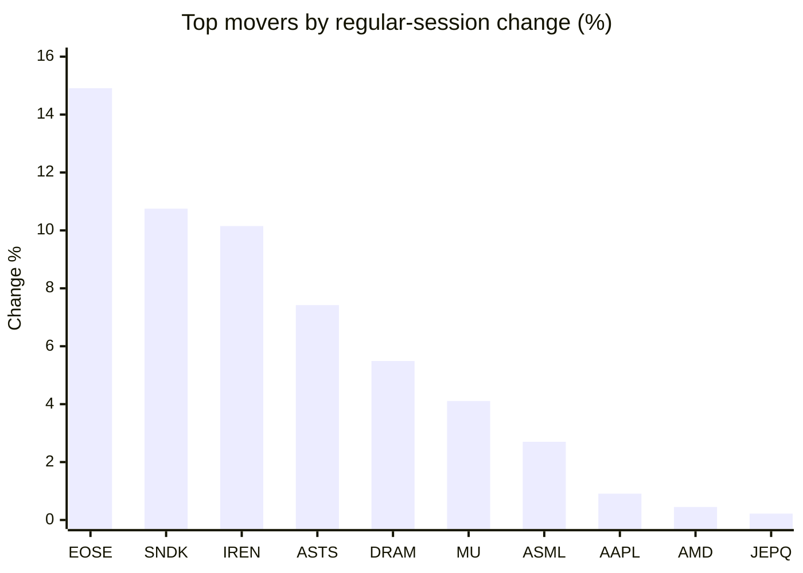
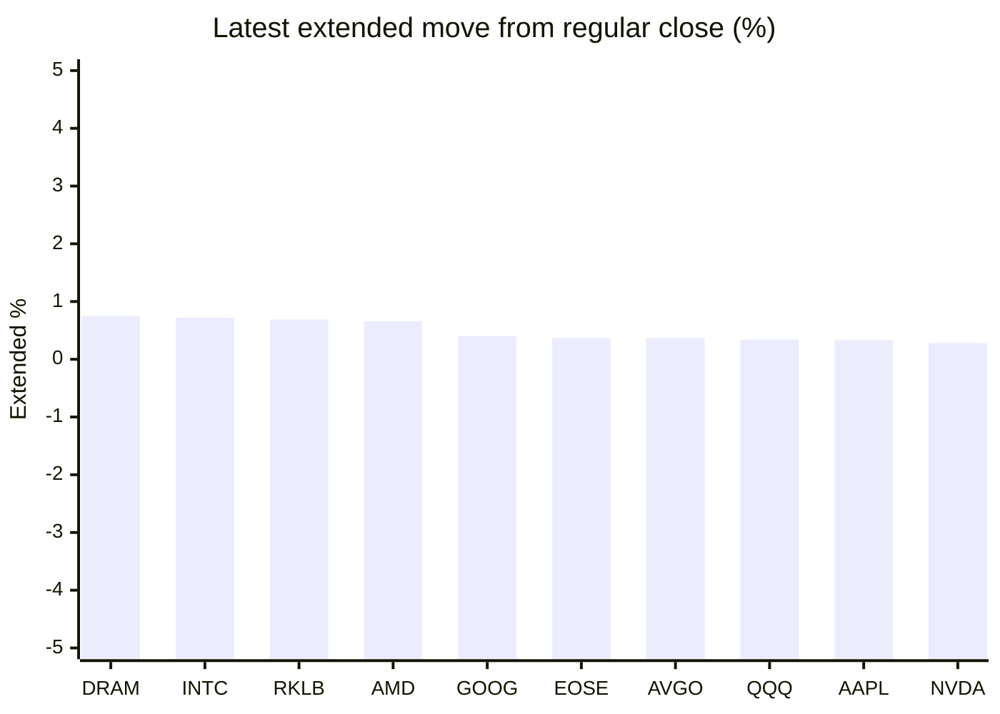

# Stock Brief - 2026-05-22

Generated at 2026-05-22 13:12 +07 from `watchlist.md`.
Prices are snapshots from Yahoo Finance public chart data. Extended/overnight is the latest available pre/post-market datapoint from the same feed.

## Market Snapshot

- SPY: close 742.72, latest extended 744.13, regular move +0.20%, extended move +0.19%
- QQQ: close 714.51, latest extended 716.94, regular move +0.19%, extended move +0.34%
- JEPQ: close 60.11, latest extended 60.16, regular move +0.22%, extended move +0.09%

## Watchlist Prices

| Ticker | Name | Regular close | Latest extended/overnight | Regular move | Extended move | Latest data time | Source |
|---|---|---:|---:|---:|---:|---|---|
| INTC | Intel Corporation | 118.50 USD | 119.35 USD | -0.39% | +0.72% | 2026-05-21 19:59 EDT | [Yahoo](https://finance.yahoo.com/quote/INTC/) |
| AVGO | Broadcom Inc. | 414.57 USD | 416.09 USD | -0.76% | +0.37% | 2026-05-21 19:59 EDT | [Yahoo](https://finance.yahoo.com/quote/AVGO/) |
| RKLB | Rocket Lab Corporation | 125.45 USD | 126.31 USD | -6.58% | +0.69% | 2026-05-21 19:59 EDT | [Yahoo](https://finance.yahoo.com/quote/RKLB/) |
| AAPL | Apple Inc. | 304.99 USD | 306.00 USD | +0.91% | +0.33% | 2026-05-21 19:59 EDT | [Yahoo](https://finance.yahoo.com/quote/AAPL/) |
| NVDA | NVIDIA Corporation | 219.51 USD | 220.12 USD | -1.77% | +0.28% | 2026-05-21 19:59 EDT | [Yahoo](https://finance.yahoo.com/quote/NVDA/) |
| TSLA | Tesla, Inc. | 417.85 USD | 418.39 USD | +0.14% | +0.13% | 2026-05-21 19:59 EDT | [Yahoo](https://finance.yahoo.com/quote/TSLA/) |
| SNDK | Sandisk Corporation | 1,542.24 USD | 1,535.01 USD | +10.75% | -0.47% | 2026-05-21 19:59 EDT | [Yahoo](https://finance.yahoo.com/quote/SNDK/) |
| QQQ | Invesco QQQ Trust, Series 1 | 714.51 USD | 716.94 USD | +0.19% | +0.34% | 2026-05-21 19:59 EDT | [Yahoo](https://finance.yahoo.com/quote/QQQ/) |
| SPY | State Street SPDR S&P 500 ETF T | 742.72 USD | 744.13 USD | +0.20% | +0.19% | 2026-05-21 19:59 EDT | [Yahoo](https://finance.yahoo.com/quote/SPY/) |
| JEPQ | JPMorgan Nasdaq Equity Premium  | 60.11 USD | 60.16 USD | +0.22% | +0.09% | 2026-05-21 19:56 EDT | [Yahoo](https://finance.yahoo.com/quote/JEPQ/) |
| ASTS | AST SpaceMobile, Inc. | 96.23 USD | 95.78 USD | +7.42% | -0.47% | 2026-05-21 19:59 EDT | [Yahoo](https://finance.yahoo.com/quote/ASTS/) |
| MU | Micron Technology, Inc. | 762.10 USD | 761.23 USD | +4.11% | -0.11% | 2026-05-21 19:59 EDT | [Yahoo](https://finance.yahoo.com/quote/MU/) |
| IREN | IREN LIMITED | 58.06 USD | 57.90 USD | +10.15% | -0.28% | 2026-05-21 19:59 EDT | [Yahoo](https://finance.yahoo.com/quote/IREN/) |
| EOSE | Eos Energy Enterprises, Inc. | 8.17 USD | 8.20 USD | +14.91% | +0.37% | 2026-05-21 19:59 EDT | [Yahoo](https://finance.yahoo.com/quote/EOSE/) |
| GOOG | Alphabet Inc. | 383.47 USD | 385.00 USD | -0.37% | +0.40% | 2026-05-21 19:59 EDT | [Yahoo](https://finance.yahoo.com/quote/GOOG/) |
| DRAM | Roundhill Memory ETF | 54.34 USD | 54.75 USD | +5.49% | +0.75% | 2026-05-21 19:59 EDT | [Yahoo](https://finance.yahoo.com/quote/DRAM/) |
| AMD | Advanced Micro Devices, Inc. | 449.59 USD | 452.55 USD | +0.45% | +0.66% | 2026-05-21 19:59 EDT | [Yahoo](https://finance.yahoo.com/quote/AMD/) |
| ASML | ASML Holding N.V. - New York Re | 1,592.00 USD | 1,595.99 USD | +2.70% | +0.25% | 2026-05-21 19:59 EDT | [Yahoo](https://finance.yahoo.com/quote/ASML/) |

## Charts

### Top Movers - Regular Session

### Extended / Overnight Move

### Quick Heatmap

| Group | Names in watchlist | Avg regular move | Avg extended move |
|---|---|---:|---:|
| Mega-cap tech | AVGO, AAPL, NVDA, TSLA, GOOG | -0.37% | +0.30% |
| Semis / memory | INTC, SNDK, MU, DRAM, AMD, ASML | +3.85% | +0.30% |
| Space / high beta | RKLB, ASTS, IREN, EOSE | +6.48% | +0.08% |
| ETFs | QQQ, SPY, JEPQ | +0.20% | +0.21% |

## News Headlines

- [Stocks making big moves yesterday: Cloudflare, Pinterest, AMD, Agilysys, and Intel](https://finance.yahoo.com/markets/stocks/articles/stocks-making-big-moves-yesterday-055655094.html?.tsrc=rss) (2026-05-22 12:56 Bangkok)
- [OpenAI Is Going Public But Is It for the Wrong Reasons?](https://www.fool.com/investing/2026/05/22/openai-is-going-public-but-is-it-for-the-wrong-rea/?.tsrc=rss) (2026-05-22 12:50 Bangkok)
- [Intel McLaren AI Deal Fuels Racing Ambitions But Raises Valuation Questions](https://finance.yahoo.com/markets/stocks/articles/intel-mclaren-ai-deal-fuels-051604781.html?.tsrc=rss) (2026-05-22 12:16 Bangkok)
- [Analysis-ECB, banks rift hampers Europe's efforts to loosen reliance on US payments giants](https://finance.yahoo.com/economy/policy/articles/analysis-ecb-banks-rift-hampers-050939101.html?.tsrc=rss) (2026-05-22 12:09 Bangkok)
- [French quantum firm Alice & Bob wins new investment from Nvidia venture arm](https://finance.yahoo.com/sectors/technology/articles/french-quantum-firm-alice-bob-050408354.html?.tsrc=rss) (2026-05-22 12:04 Bangkok)
- [No, Tesla Doesn't Need E.U. Approval to Sell Full Self-Driving (Supervised) in Europe](https://www.fool.com/investing/2026/05/22/no-tesla-doesnt-need-eu-approval-to-sell-full-self/?.tsrc=rss) (2026-05-22 11:59 Bangkok)
- [Dow Jones Futures Rise; Amazon, Credo Lead AI Stocks In Buy Areas](https://finance.yahoo.com/m/7df82031-d91e-3551-883c-4005821c4125/dow-jones-futures-rise%3B.html?.tsrc=rss) (2026-05-22 10:07 Bangkok)
- [Worried About a Recession? Here’s Why Selling When Economists Call It is Already Too Late](https://247wallst.com/investing/2026/05/21/worried-about-a-recession-heres-why-selling-when-economists-call-it-is-already-too-late-2/?.tsrc=rss) (2026-05-22 09:45 Bangkok)

## Caveats

- This is not investment advice. Extended-hours prices can be thin and volatile.
- Yahoo public endpoints may lag official exchange data.
