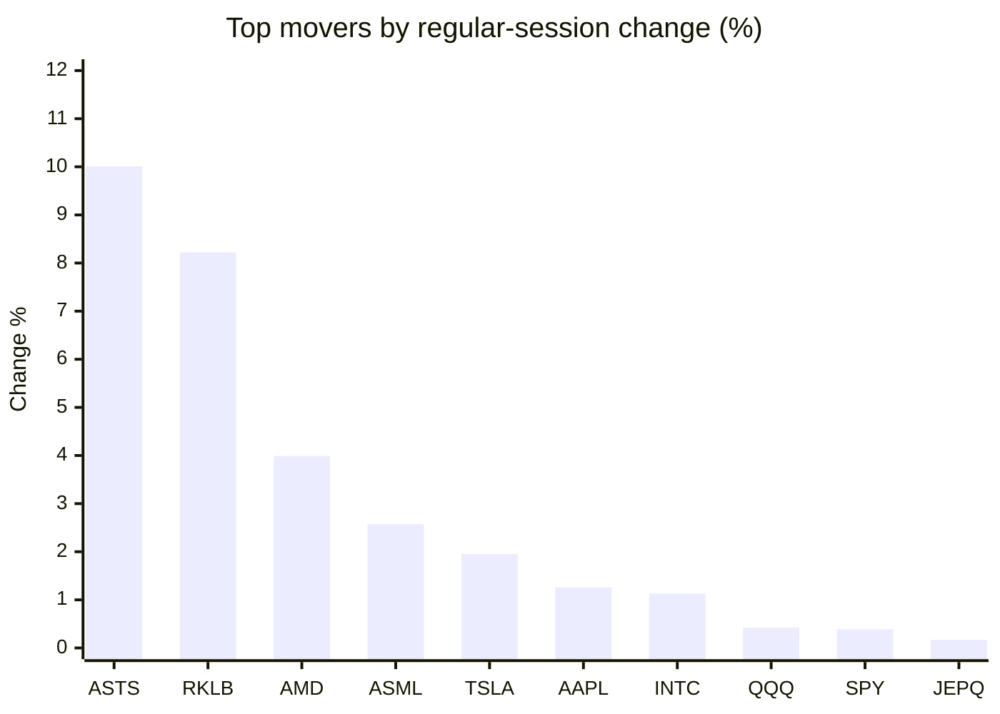
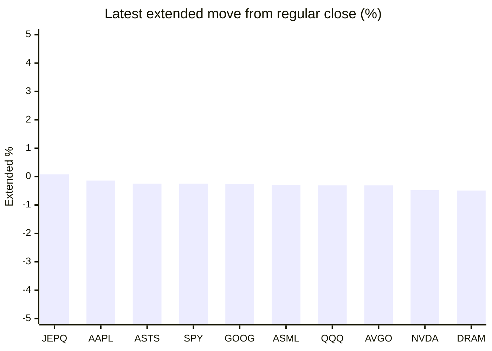

# Stock Brief - 2026-05-24

Generated at 2026-05-24 13:05 +07 from `watchlist.md`.
Prices are snapshots from Yahoo Finance public chart data. Extended/overnight is the latest available pre/post-market datapoint from the same feed.

## Market Snapshot

- SPY: close 745.64, latest extended 743.74, regular move +0.39%, extended move -0.25%
- QQQ: close 717.54, latest extended 715.31, regular move +0.42%, extended move -0.31%
- JEPQ: close 60.21, latest extended 60.26, regular move +0.17%, extended move +0.08%

## Watchlist Prices

| Ticker | Name | Regular close | Latest extended/overnight | Regular move | Extended move | Latest data time | Source |
|---|---|---:|---:|---:|---:|---|---|
| INTC | Intel Corporation | 119.84 USD | 118.15 USD | +1.13% | -1.41% | 2026-05-22 19:59 EDT | [Yahoo](https://finance.yahoo.com/quote/INTC/) |
| AVGO | Broadcom Inc. | 414.14 USD | 412.85 USD | -0.10% | -0.31% | 2026-05-22 19:59 EDT | [Yahoo](https://finance.yahoo.com/quote/AVGO/) |
| RKLB | Rocket Lab Corporation | 135.76 USD | 134.15 USD | +8.22% | -1.19% | 2026-05-22 19:59 EDT | [Yahoo](https://finance.yahoo.com/quote/RKLB/) |
| AAPL | Apple Inc. | 308.82 USD | 308.40 USD | +1.26% | -0.14% | 2026-05-22 19:59 EDT | [Yahoo](https://finance.yahoo.com/quote/AAPL/) |
| NVDA | NVIDIA Corporation | 215.33 USD | 214.30 USD | -1.90% | -0.48% | 2026-05-22 19:59 EDT | [Yahoo](https://finance.yahoo.com/quote/NVDA/) |
| TSLA | Tesla, Inc. | 426.01 USD | 423.68 USD | +1.95% | -0.55% | 2026-05-22 19:59 EDT | [Yahoo](https://finance.yahoo.com/quote/TSLA/) |
| SNDK | Sandisk Corporation | 1,478.69 USD | 1,466.96 USD | -4.12% | -0.79% | 2026-05-22 19:59 EDT | [Yahoo](https://finance.yahoo.com/quote/SNDK/) |
| QQQ | Invesco QQQ Trust, Series 1 | 717.54 USD | 715.31 USD | +0.42% | -0.31% | 2026-05-22 19:59 EDT | [Yahoo](https://finance.yahoo.com/quote/QQQ/) |
| SPY | State Street SPDR S&P 500 ETF T | 745.64 USD | 743.74 USD | +0.39% | -0.25% | 2026-05-22 19:59 EDT | [Yahoo](https://finance.yahoo.com/quote/SPY/) |
| JEPQ | JPMorgan Nasdaq Equity Premium  | 60.21 USD | 60.26 USD | +0.17% | +0.08% | 2026-05-22 19:59 EDT | [Yahoo](https://finance.yahoo.com/quote/JEPQ/) |
| ASTS | AST SpaceMobile, Inc. | 105.86 USD | 105.60 USD | +10.01% | -0.25% | 2026-05-22 19:59 EDT | [Yahoo](https://finance.yahoo.com/quote/ASTS/) |
| MU | Micron Technology, Inc. | 751.00 USD | 745.56 USD | -1.46% | -0.72% | 2026-05-22 19:59 EDT | [Yahoo](https://finance.yahoo.com/quote/MU/) |
| IREN | IREN LIMITED | 56.83 USD | 56.23 USD | -2.12% | -1.05% | 2026-05-22 19:59 EDT | [Yahoo](https://finance.yahoo.com/quote/IREN/) |
| EOSE | Eos Energy Enterprises, Inc. | 8.06 USD | 7.97 USD | -1.35% | -1.12% | 2026-05-22 19:59 EDT | [Yahoo](https://finance.yahoo.com/quote/EOSE/) |
| GOOG | Alphabet Inc. | 379.38 USD | 378.40 USD | -1.07% | -0.26% | 2026-05-22 19:59 EDT | [Yahoo](https://finance.yahoo.com/quote/GOOG/) |
| DRAM | Roundhill Memory ETF | 52.82 USD | 52.56 USD | -2.80% | -0.49% | 2026-05-22 19:59 EDT | [Yahoo](https://finance.yahoo.com/quote/DRAM/) |
| AMD | Advanced Micro Devices, Inc. | 467.51 USD | 462.75 USD | +3.99% | -1.02% | 2026-05-22 19:59 EDT | [Yahoo](https://finance.yahoo.com/quote/AMD/) |
| ASML | ASML Holding N.V. - New York Re | 1,632.90 USD | 1,628.07 USD | +2.57% | -0.30% | 2026-05-22 19:58 EDT | [Yahoo](https://finance.yahoo.com/quote/ASML/) |

## Charts

### Top Movers - Regular Session

### Extended / Overnight Move

### Quick Heatmap

| Group | Names in watchlist | Avg regular move | Avg extended move |
|---|---|---:|---:|
| Mega-cap tech | AVGO, AAPL, NVDA, TSLA, GOOG | +0.03% | -0.35% |
| Semis / memory | INTC, SNDK, MU, DRAM, AMD, ASML | -0.11% | -0.79% |
| Space / high beta | RKLB, ASTS, IREN, EOSE | +3.69% | -0.90% |
| ETFs | QQQ, SPY, JEPQ | +0.33% | -0.16% |

## News Headlines

- [5 Warren Buffett Stocks to Buy Hand Over Fist in May](https://www.fool.com/investing/2026/05/24/5-warren-buffett-stocks-to-buy-hand-over-fist-in-m/?.tsrc=rss) (2026-05-24 12:20 Bangkok)
- [3 Cryptocurrencies to Watch as the Clarity Act Heads to the Senate](https://www.fool.com/investing/2026/05/24/3-cryptocurrencies-to-watch-as-the-clarity-act-hea/?.tsrc=rss) (2026-05-24 11:50 Bangkok)
- [Ten things to know about humanoids](https://finance.yahoo.com/sectors/technology/articles/ten-things-know-humanoids-043738649.html?.tsrc=rss) (2026-05-24 11:37 Bangkok)
- [Ford Motor vs. Tesla: What Their Revenue Trends Tell Investors](https://www.fool.com/coverage/charts/2026/05/23/ford-motor-vs-tesla-what-their-revenue-trends-tell-investors/?.tsrc=rss) (2026-05-24 09:57 Bangkok)
- [As U.S. Markets Roar to Record All-Time Highs, ELEKTROS Gains Global Recognition Among Microcap and Penny Stock Investors for Its Vision of Hard Rock Lithium Mining and EV Patent Technology](https://finance.yahoo.com/markets/stocks/articles/u-markets-roar-record-time-023000924.html?.tsrc=rss) (2026-05-24 09:30 Bangkok)
- [Dow Jones Futures: Trump Says Iran Deal Near With Hormuz 'Opened'; Tesla, AI Stocks Near Buy Points](https://finance.yahoo.com/m/879072fd-2d18-3074-b2ec-2e92c37a571e/dow-jones-futures%3A-trump-says.html?.tsrc=rss) (2026-05-24 09:17 Bangkok)
- [Tesla News On India Exit Recall And SpaceX Links Tests Valuation](https://finance.yahoo.com/markets/stocks/articles/tesla-news-india-exit-recall-020759701.html?.tsrc=rss) (2026-05-24 09:07 Bangkok)
- [2 Stocks With Monster Potential to Hold Through the Next Decade of Uncertainty](https://www.fool.com/investing/2026/05/23/2-stocks-with-monster-potential-to-hold-through-th/?.tsrc=rss) (2026-05-24 08:50 Bangkok)

## Caveats

- This is not investment advice. Extended-hours prices can be thin and volatile.
- Yahoo public endpoints may lag official exchange data.
