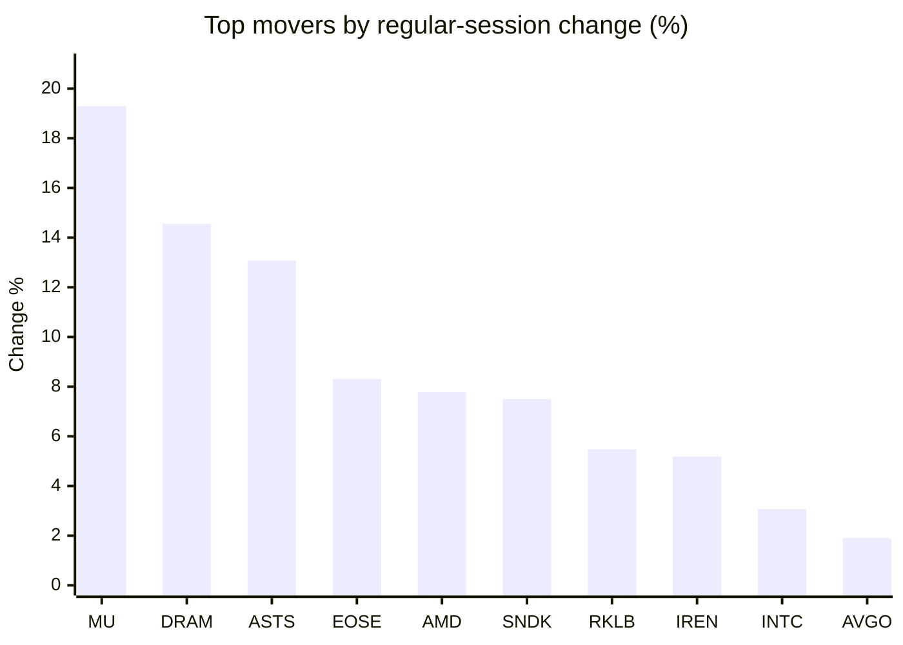
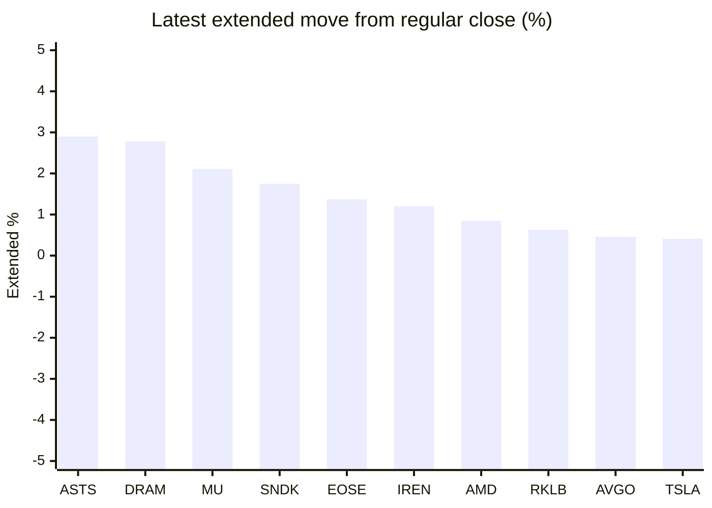

# Stock Brief - 2026-05-27

Generated at 2026-05-27 13:24 +07 from `watchlist.md`.
Prices are snapshots from Yahoo Finance public chart data. Extended/overnight is the latest available pre/post-market datapoint from the same feed.

## Market Snapshot

- SPY: close 750.59, latest extended 750.89, regular move +0.66%, extended move +0.04%
- QQQ: close 730.28, latest extended 730.65, regular move +1.78%, extended move +0.05%
- JEPQ: close 60.60, latest extended 60.64, regular move +0.65%, extended move +0.07%

## Watchlist Prices

| Ticker | Name | Regular close | Latest extended/overnight | Regular move | Extended move | Latest data time | Source |
|---|---|---:|---:|---:|---:|---|---|
| INTC | Intel Corporation | 123.52 USD | 123.09 USD | +3.07% | -0.34% | 2026-05-26 19:59 EDT | [Yahoo](https://finance.yahoo.com/quote/INTC/) |
| AVGO | Broadcom Inc. | 422.01 USD | 423.95 USD | +1.90% | +0.46% | 2026-05-26 19:59 EDT | [Yahoo](https://finance.yahoo.com/quote/AVGO/) |
| RKLB | Rocket Lab Corporation | 143.20 USD | 144.10 USD | +5.48% | +0.63% | 2026-05-26 19:59 EDT | [Yahoo](https://finance.yahoo.com/quote/RKLB/) |
| AAPL | Apple Inc. | 308.33 USD | 308.72 USD | -0.16% | +0.13% | 2026-05-26 19:59 EDT | [Yahoo](https://finance.yahoo.com/quote/AAPL/) |
| NVDA | NVIDIA Corporation | 214.86 USD | 213.95 USD | -0.22% | -0.42% | 2026-05-26 19:59 EDT | [Yahoo](https://finance.yahoo.com/quote/NVDA/) |
| TSLA | Tesla, Inc. | 433.59 USD | 435.37 USD | +1.78% | +0.41% | 2026-05-26 19:59 EDT | [Yahoo](https://finance.yahoo.com/quote/TSLA/) |
| SNDK | Sandisk Corporation | 1,589.55 USD | 1,617.31 USD | +7.50% | +1.75% | 2026-05-26 19:59 EDT | [Yahoo](https://finance.yahoo.com/quote/SNDK/) |
| QQQ | Invesco QQQ Trust, Series 1 | 730.28 USD | 730.65 USD | +1.78% | +0.05% | 2026-05-26 19:59 EDT | [Yahoo](https://finance.yahoo.com/quote/QQQ/) |
| SPY | State Street SPDR S&P 500 ETF T | 750.59 USD | 750.89 USD | +0.66% | +0.04% | 2026-05-26 19:59 EDT | [Yahoo](https://finance.yahoo.com/quote/SPY/) |
| JEPQ | JPMorgan Nasdaq Equity Premium  | 60.60 USD | 60.64 USD | +0.65% | +0.07% | 2026-05-26 19:58 EDT | [Yahoo](https://finance.yahoo.com/quote/JEPQ/) |
| ASTS | AST SpaceMobile, Inc. | 119.70 USD | 123.17 USD | +13.07% | +2.90% | 2026-05-26 19:59 EDT | [Yahoo](https://finance.yahoo.com/quote/ASTS/) |
| MU | Micron Technology, Inc. | 895.88 USD | 914.75 USD | +19.29% | +2.11% | 2026-05-26 19:59 EDT | [Yahoo](https://finance.yahoo.com/quote/MU/) |
| IREN | IREN LIMITED | 59.78 USD | 60.50 USD | +5.19% | +1.20% | 2026-05-26 19:59 EDT | [Yahoo](https://finance.yahoo.com/quote/IREN/) |
| EOSE | Eos Energy Enterprises, Inc. | 8.73 USD | 8.85 USD | +8.31% | +1.37% | 2026-05-26 19:59 EDT | [Yahoo](https://finance.yahoo.com/quote/EOSE/) |
| GOOG | Alphabet Inc. | 384.84 USD | 384.61 USD | +1.44% | -0.06% | 2026-05-26 19:59 EDT | [Yahoo](https://finance.yahoo.com/quote/GOOG/) |
| DRAM | Roundhill Memory ETF | 60.51 USD | 62.19 USD | +14.56% | +2.78% | 2026-05-26 19:59 EDT | [Yahoo](https://finance.yahoo.com/quote/DRAM/) |
| AMD | Advanced Micro Devices, Inc. | 503.89 USD | 508.15 USD | +7.78% | +0.85% | 2026-05-26 19:59 EDT | [Yahoo](https://finance.yahoo.com/quote/AMD/) |
| ASML | ASML Holding N.V. - New York Re | 1,632.03 USD | 1,633.50 USD | -0.05% | +0.09% | 2026-05-26 19:58 EDT | [Yahoo](https://finance.yahoo.com/quote/ASML/) |

## Charts

### Top Movers - Regular Session

### Extended / Overnight Move

### Quick Heatmap

| Group | Names in watchlist | Avg regular move | Avg extended move |
|---|---|---:|---:|
| Mega-cap tech | AVGO, AAPL, NVDA, TSLA, GOOG | +0.95% | +0.10% |
| Semis / memory | INTC, SNDK, MU, DRAM, AMD, ASML | +8.69% | +1.20% |
| Space / high beta | RKLB, ASTS, IREN, EOSE | +8.01% | +1.52% |
| ETFs | QQQ, SPY, JEPQ | +1.03% | +0.05% |

## News Headlines

- [The Conversation Nobody Is Having About Quantum Computing -- and the Stock at the Center of It](https://www.fool.com/investing/2026/05/27/the-conversation-nobody-is-having-about-quantum-co/?.tsrc=rss) (2026-05-27 12:20 Bangkok)
- [Nvidia to boost spending in Taiwan to $150 bn a year](https://finance.yahoo.com/sectors/technology/articles/nvidia-boost-spending-taiwan-150-051435822.html?.tsrc=rss) (2026-05-27 12:14 Bangkok)
- [AMD Worth Nearly As Much As JPMorgan After Stock Breaks $500 Level: Retail Confidence Climbs](https://stocktwits.com/news-articles/markets/equity/amd-worth-nearly-as-much-as-jp-morgan-after-stock-breaks-500-level-retail-confidence-climbs/cZgXzGTReAB?.tsrc=rss) (2026-05-27 12:00 Bangkok)
- [AI Spending Is Weighing on Stocks. Fight Back With This Options Strategy.](https://finance.yahoo.com/m/ef2cfb1d-3fb4-3956-9e24-b17f82a1a7c7/ai-spending-is-weighing-on.html?.tsrc=rss) (2026-05-27 12:00 Bangkok)
- [Value of South Korean chip giant SK hynix tops $1 tn](https://finance.yahoo.com/sectors/technology/articles/value-south-korean-chip-giant-041243863.html?.tsrc=rss) (2026-05-27 11:12 Bangkok)
- [Tesla Sales Have 'Bottomed,' Says Ross Gerber As Iran War-Driven Gas Price Spike Pushes More Drivers Toward EVs](https://finance.yahoo.com/markets/stocks/articles/tesla-sales-bottomed-says-ross-041149003.html?.tsrc=rss) (2026-05-27 11:11 Bangkok)
- [Costco Stock Has Been Pulling Back Again. Time to Buy?](https://www.fool.com/investing/2026/05/26/costco-stock-has-been-pulling-back-again-time-to-b/?.tsrc=rss) (2026-05-27 11:11 Bangkok)
- [Micron (MU) Hits All-Time High as $2B Virginia Facility Now on Full Gear](https://finance.yahoo.com/markets/stocks/articles/micron-mu-hits-time-high-040642607.html?.tsrc=rss) (2026-05-27 11:06 Bangkok)

## Caveats

- This is not investment advice. Extended-hours prices can be thin and volatile.
- Yahoo public endpoints may lag official exchange data.
