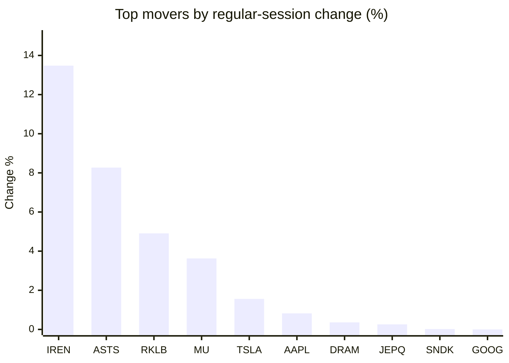
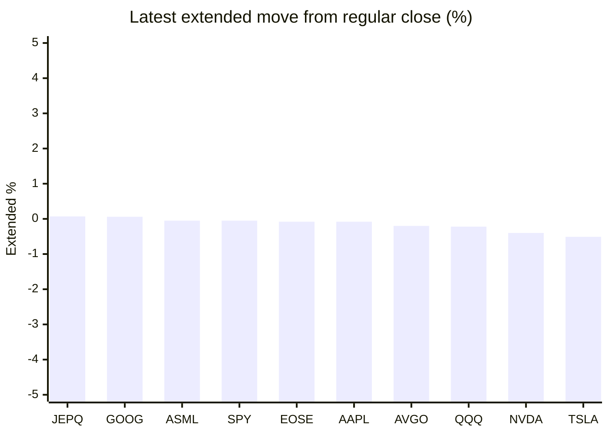

# Stock Brief - 2026-05-28

Generated at 2026-05-28 13:17 +07 from `watchlist.md`.
Prices are snapshots from Yahoo Finance public chart data. Extended/overnight is the latest available pre/post-market datapoint from the same feed.

## Market Snapshot

- SPY: close 750.46, latest extended 750.05, regular move -0.02%, extended move -0.05%
- QQQ: close 729.45, latest extended 727.82, regular move -0.11%, extended move -0.22%
- JEPQ: close 60.76, latest extended 60.80, regular move +0.26%, extended move +0.07%

## Watchlist Prices

| Ticker | Name | Regular close | Latest extended/overnight | Regular move | Extended move | Latest data time | Source |
|---|---|---:|---:|---:|---:|---|---|
| INTC | Intel Corporation | 121.77 USD | 119.70 USD | -1.42% | -1.70% | 2026-05-27 19:59 EDT | [Yahoo](https://finance.yahoo.com/quote/INTC/) |
| AVGO | Broadcom Inc. | 421.86 USD | 421.00 USD | -0.04% | -0.20% | 2026-05-27 19:59 EDT | [Yahoo](https://finance.yahoo.com/quote/AVGO/) |
| RKLB | Rocket Lab Corporation | 150.23 USD | 148.90 USD | +4.91% | -0.89% | 2026-05-27 19:59 EDT | [Yahoo](https://finance.yahoo.com/quote/RKLB/) |
| AAPL | Apple Inc. | 310.85 USD | 310.60 USD | +0.82% | -0.08% | 2026-05-27 19:59 EDT | [Yahoo](https://finance.yahoo.com/quote/AAPL/) |
| NVDA | NVIDIA Corporation | 212.60 USD | 211.74 USD | -1.05% | -0.40% | 2026-05-27 19:59 EDT | [Yahoo](https://finance.yahoo.com/quote/NVDA/) |
| TSLA | Tesla, Inc. | 440.36 USD | 438.13 USD | +1.56% | -0.51% | 2026-05-27 19:59 EDT | [Yahoo](https://finance.yahoo.com/quote/TSLA/) |
| SNDK | Sandisk Corporation | 1,589.94 USD | 1,556.32 USD | +0.02% | -2.11% | 2026-05-27 19:59 EDT | [Yahoo](https://finance.yahoo.com/quote/SNDK/) |
| QQQ | Invesco QQQ Trust, Series 1 | 729.45 USD | 727.82 USD | -0.11% | -0.22% | 2026-05-27 19:59 EDT | [Yahoo](https://finance.yahoo.com/quote/QQQ/) |
| SPY | State Street SPDR S&P 500 ETF T | 750.46 USD | 750.05 USD | -0.02% | -0.05% | 2026-05-27 19:59 EDT | [Yahoo](https://finance.yahoo.com/quote/SPY/) |
| JEPQ | JPMorgan Nasdaq Equity Premium  | 60.76 USD | 60.80 USD | +0.26% | +0.07% | 2026-05-27 19:59 EDT | [Yahoo](https://finance.yahoo.com/quote/JEPQ/) |
| ASTS | AST SpaceMobile, Inc. | 129.60 USD | 126.84 USD | +8.27% | -2.13% | 2026-05-27 19:59 EDT | [Yahoo](https://finance.yahoo.com/quote/ASTS/) |
| MU | Micron Technology, Inc. | 928.41 USD | 904.88 USD | +3.63% | -2.53% | 2026-05-27 19:59 EDT | [Yahoo](https://finance.yahoo.com/quote/MU/) |
| IREN | IREN LIMITED | 67.84 USD | 67.12 USD | +13.48% | -1.06% | 2026-05-27 19:59 EDT | [Yahoo](https://finance.yahoo.com/quote/IREN/) |
| EOSE | Eos Energy Enterprises, Inc. | 8.61 USD | 8.60 USD | -1.37% | -0.08% | 2026-05-27 19:59 EDT | [Yahoo](https://finance.yahoo.com/quote/EOSE/) |
| GOOG | Alphabet Inc. | 384.83 USD | 385.07 USD | -0.00% | +0.06% | 2026-05-27 19:59 EDT | [Yahoo](https://finance.yahoo.com/quote/GOOG/) |
| DRAM | Roundhill Memory ETF | 60.73 USD | 59.70 USD | +0.36% | -1.70% | 2026-05-27 19:59 EDT | [Yahoo](https://finance.yahoo.com/quote/DRAM/) |
| AMD | Advanced Micro Devices, Inc. | 495.54 USD | 490.00 USD | -1.66% | -1.12% | 2026-05-27 19:59 EDT | [Yahoo](https://finance.yahoo.com/quote/AMD/) |
| ASML | ASML Holding N.V. - New York Re | 1,597.87 USD | 1,597.00 USD | -2.09% | -0.05% | 2026-05-27 19:59 EDT | [Yahoo](https://finance.yahoo.com/quote/ASML/) |

## Charts

### Top Movers - Regular Session

### Extended / Overnight Move

### Quick Heatmap

| Group | Names in watchlist | Avg regular move | Avg extended move |
|---|---|---:|---:|
| Mega-cap tech | AVGO, AAPL, NVDA, TSLA, GOOG | +0.26% | -0.23% |
| Semis / memory | INTC, SNDK, MU, DRAM, AMD, ASML | -0.19% | -1.54% |
| Space / high beta | RKLB, ASTS, IREN, EOSE | +6.32% | -1.04% |
| ETFs | QQQ, SPY, JEPQ | +0.04% | -0.07% |

## News Headlines

- [Best Crypto To Buy With $100 Right Now](https://247wallst.com/investing/2026/05/28/best-crypto-to-buy-with-100-right-now/?.tsrc=rss) (2026-05-28 13:05 Bangkok)
- [Exclusive-ByteDance developing custom CPU chips to support AI rollout, sources say](https://finance.yahoo.com/sectors/technology/articles/exclusive-bytedance-developing-custom-cpu-055000517.html?.tsrc=rss) (2026-05-28 12:50 Bangkok)
- [Micron Is Nearing $1,000. Is a Stock Split Next?](https://www.fool.com/investing/2026/05/28/as-micron-approaches-1000-is-a-stock-split-next/?.tsrc=rss) (2026-05-28 12:50 Bangkok)
- [RKLB, ASTS Are Crushing Retail Space Trade On SpaceX IPO Buzz — But One Tiny Underdog Could Be The Real Moonshot](https://stocktwits.com/news-articles/markets/equity/rklb-asts-sidu-bsky-stocks-retail-spacex-ipo-underdog/cZgiE2iRes3?.tsrc=rss) (2026-05-28 12:36 Bangkok)
- [Should You Buy Gold While It's Under $5,000?](https://www.fool.com/investing/2026/05/28/should-you-buy-gold-while-its-under-5000/?.tsrc=rss) (2026-05-28 12:20 Bangkok)
- [SoFi's Tech Platform Revenue Is the Quiet Story Behind the Stock](https://www.fool.com/investing/2026/05/28/sofis-tech-platform-revenue-is-the-quiet-story-beh/?.tsrc=rss) (2026-05-28 11:50 Bangkok)
- [Trump Accounts App Built By BNY, Robinhood Launches Later Today: What Investors Need To Know](https://stocktwits.com/news-articles/markets/equity/trump-accounts-app-built-by-bny-robinhood-launches-what-investors-need-to-know/cZgi5tIRes5?.tsrc=rss) (2026-05-28 11:48 Bangkok)
- [Tesla SpaceX Merger Talk Grows As Capital And AI Questions Mount](https://finance.yahoo.com/markets/stocks/articles/tesla-spacex-merger-talk-grows-042627728.html?.tsrc=rss) (2026-05-28 11:26 Bangkok)

## Caveats

- This is not investment advice. Extended-hours prices can be thin and volatile.
- Yahoo public endpoints may lag official exchange data.
