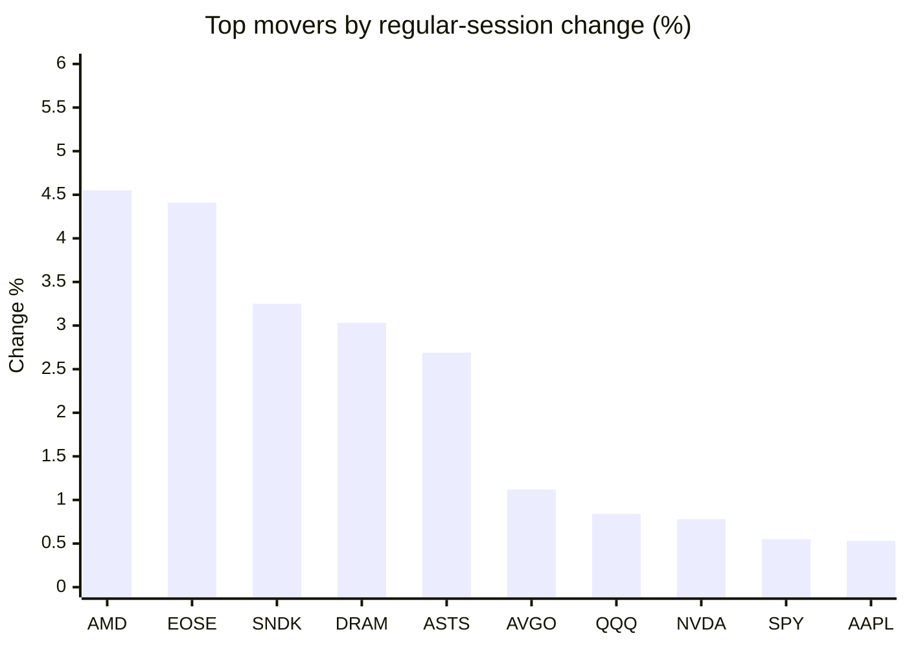
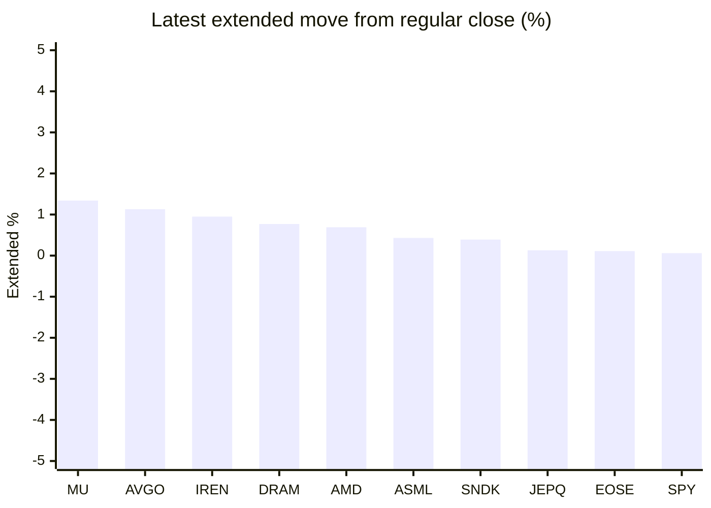

# Stock Brief - 2026-05-29

Generated at 2026-05-29 13:18 +07 from `watchlist.md`.
Prices are snapshots from Yahoo Finance public chart data. Extended/overnight is the latest available pre/post-market datapoint from the same feed.

## Market Snapshot

- SPY: close 754.60, latest extended 755.05, regular move +0.55%, extended move +0.06%
- QQQ: close 735.60, latest extended 735.54, regular move +0.84%, extended move -0.01%
- JEPQ: close 60.95, latest extended 61.03, regular move +0.31%, extended move +0.13%

## Watchlist Prices

| Ticker | Name | Regular close | Latest extended/overnight | Regular move | Extended move | Latest data time | Source |
|---|---|---:|---:|---:|---:|---|---|
| INTC | Intel Corporation | 120.89 USD | 120.92 USD | -0.72% | +0.02% | 2026-05-28 19:59 EDT | [Yahoo](https://finance.yahoo.com/quote/INTC/) |
| AVGO | Broadcom Inc. | 426.58 USD | 431.40 USD | +1.12% | +1.13% | 2026-05-28 19:59 EDT | [Yahoo](https://finance.yahoo.com/quote/AVGO/) |
| RKLB | Rocket Lab Corporation | 148.03 USD | 147.19 USD | -1.46% | -0.57% | 2026-05-28 19:59 EDT | [Yahoo](https://finance.yahoo.com/quote/RKLB/) |
| AAPL | Apple Inc. | 312.51 USD | 311.84 USD | +0.53% | -0.22% | 2026-05-28 19:59 EDT | [Yahoo](https://finance.yahoo.com/quote/AAPL/) |
| NVDA | NVIDIA Corporation | 214.25 USD | 214.15 USD | +0.78% | -0.05% | 2026-05-28 19:59 EDT | [Yahoo](https://finance.yahoo.com/quote/NVDA/) |
| TSLA | Tesla, Inc. | 442.10 USD | 440.27 USD | +0.40% | -0.41% | 2026-05-28 19:59 EDT | [Yahoo](https://finance.yahoo.com/quote/TSLA/) |
| SNDK | Sandisk Corporation | 1,641.64 USD | 1,648.00 USD | +3.25% | +0.39% | 2026-05-28 19:59 EDT | [Yahoo](https://finance.yahoo.com/quote/SNDK/) |
| QQQ | Invesco QQQ Trust, Series 1 | 735.60 USD | 735.54 USD | +0.84% | -0.01% | 2026-05-28 19:59 EDT | [Yahoo](https://finance.yahoo.com/quote/QQQ/) |
| SPY | State Street SPDR S&P 500 ETF T | 754.60 USD | 755.05 USD | +0.55% | +0.06% | 2026-05-28 19:59 EDT | [Yahoo](https://finance.yahoo.com/quote/SPY/) |
| JEPQ | JPMorgan Nasdaq Equity Premium  | 60.95 USD | 61.03 USD | +0.31% | +0.13% | 2026-05-28 19:59 EDT | [Yahoo](https://finance.yahoo.com/quote/JEPQ/) |
| ASTS | AST SpaceMobile, Inc. | 133.09 USD | 130.96 USD | +2.69% | -1.60% | 2026-05-28 19:59 EDT | [Yahoo](https://finance.yahoo.com/quote/ASTS/) |
| MU | Micron Technology, Inc. | 923.52 USD | 935.87 USD | -0.53% | +1.34% | 2026-05-28 19:59 EDT | [Yahoo](https://finance.yahoo.com/quote/MU/) |
| IREN | IREN LIMITED | 64.05 USD | 64.66 USD | -5.59% | +0.95% | 2026-05-28 19:59 EDT | [Yahoo](https://finance.yahoo.com/quote/IREN/) |
| EOSE | Eos Energy Enterprises, Inc. | 8.99 USD | 9.00 USD | +4.41% | +0.11% | 2026-05-28 19:59 EDT | [Yahoo](https://finance.yahoo.com/quote/EOSE/) |
| GOOG | Alphabet Inc. | 386.12 USD | 385.42 USD | +0.34% | -0.18% | 2026-05-28 19:59 EDT | [Yahoo](https://finance.yahoo.com/quote/GOOG/) |
| DRAM | Roundhill Memory ETF | 62.57 USD | 63.05 USD | +3.03% | +0.77% | 2026-05-28 19:59 EDT | [Yahoo](https://finance.yahoo.com/quote/DRAM/) |
| AMD | Advanced Micro Devices, Inc. | 518.09 USD | 521.66 USD | +4.55% | +0.69% | 2026-05-28 19:59 EDT | [Yahoo](https://finance.yahoo.com/quote/AMD/) |
| ASML | ASML Holding N.V. - New York Re | 1,605.77 USD | 1,612.60 USD | +0.49% | +0.43% | 2026-05-28 19:56 EDT | [Yahoo](https://finance.yahoo.com/quote/ASML/) |

## Charts

### Top Movers - Regular Session

### Extended / Overnight Move

### Quick Heatmap

| Group | Names in watchlist | Avg regular move | Avg extended move |
|---|---|---:|---:|
| Mega-cap tech | AVGO, AAPL, NVDA, TSLA, GOOG | +0.63% | +0.05% |
| Semis / memory | INTC, SNDK, MU, DRAM, AMD, ASML | +1.68% | +0.60% |
| Space / high beta | RKLB, ASTS, IREN, EOSE | +0.01% | -0.28% |
| ETFs | QQQ, SPY, JEPQ | +0.57% | +0.06% |

## News Headlines

- [If It Walks Like a Bubble and Quacks Like a Bubble, Then It’s Probably a Bubble](https://finance.yahoo.com/m/e6a988c6-fba7-35ee-9991-7f7e168ffe62/if-it-walks-like-a-bubble-and.html?.tsrc=rss) (2026-05-29 12:30 Bangkok)
- [The Chip Rally Has Gone Parabolic. It’s Time to Separate the Pillars From the Pretenders.](https://finance.yahoo.com/m/a7a5f8ca-cd6b-3fbc-91c5-ccca53a5eccb/the-chip-rally-has-gone.html?.tsrc=rss) (2026-05-29 12:00 Bangkok)
- [For the third time this month, a chip giant has joined the $1 trillion club](https://www.cnn.com/2026/05/29/business/sk-hynix-chips-trillion-dollar-club-intl-hnk?.tsrc=rss) (2026-05-29 11:33 Bangkok)
- [Assessing Applied Materials (AMAT) Valuation After Earnings Beat And New AI Chip Equipment Partnerships](https://finance.yahoo.com/markets/stocks/articles/assessing-applied-materials-amat-valuation-042906553.html?.tsrc=rss) (2026-05-29 11:29 Bangkok)
- [MU Stock Gets Anthropic Boost, More PT Hikes — Market Cap Holds Above $1 Trillion, But Analysts Foresee A Slide](https://stocktwits.com/news-articles/markets/equity/mu-stock-gets-anthropic-boost-more-pt-hikes-market-cap-holds-above-1-trillion-but-analysts-foresee-a-slide/cZgSOLhRetj?.tsrc=rss) (2026-05-29 11:28 Bangkok)
- [Assessing Tesla (TSLA) Valuation After Recent Share Price Strength And Bold Growth Narratives](https://finance.yahoo.com/markets/stocks/articles/assessing-tesla-tsla-valuation-recent-042614685.html?.tsrc=rss) (2026-05-29 11:26 Bangkok)
- [Best 3 Blue Chip Stocks to Buy After a Market Pullback -- Including Microsoft (MSFT) Stock](https://www.fool.com/investing/2026/05/29/best-3-blue-chip-stocks-to-buy-after-this-weeks-ma/?.tsrc=rss) (2026-05-29 11:20 Bangkok)
- [Why Super Micro (SMCI) Stock Is Up Today](https://finance.yahoo.com/markets/stocks/articles/why-super-micro-smci-stock-035800064.html?.tsrc=rss) (2026-05-29 10:58 Bangkok)

## Caveats

- This is not investment advice. Extended-hours prices can be thin and volatile.
- Yahoo public endpoints may lag official exchange data.
