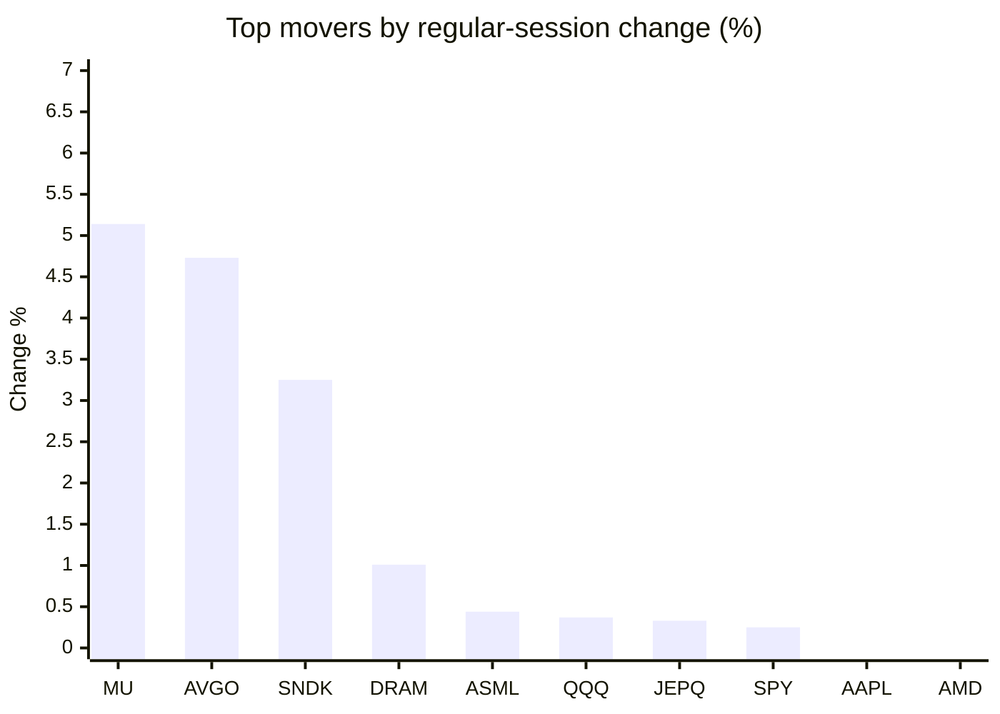
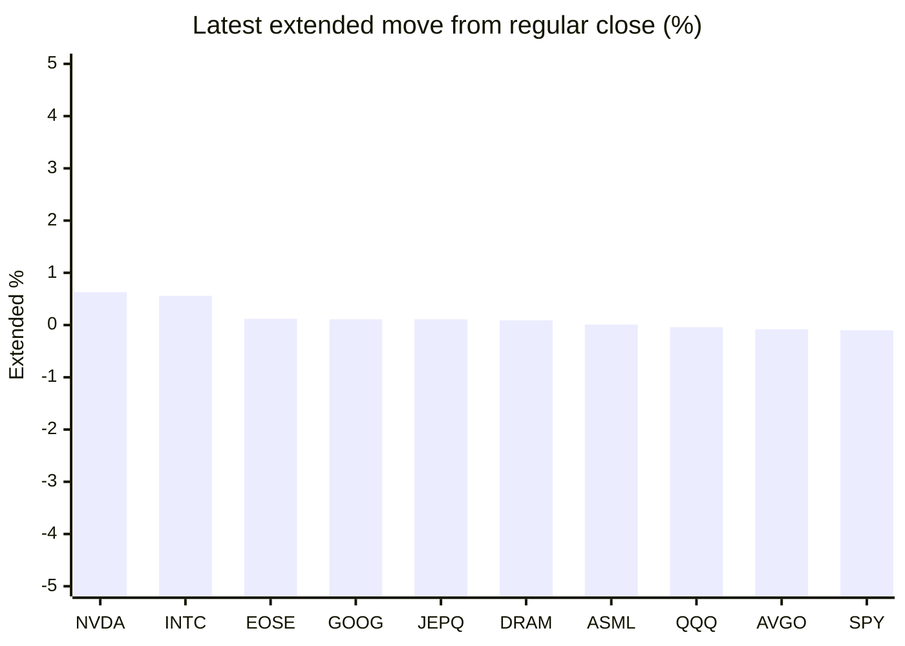

# Stock Brief - 2026-06-01

Generated at 2026-06-01 14:03 +07 from `watchlist.md`.
Prices are snapshots from Yahoo Finance public chart data. Extended/overnight is the latest available pre/post-market datapoint from the same feed.

## Market Snapshot

- SPY: close 756.48, latest extended 755.76, regular move +0.25%, extended move -0.10%
- QQQ: close 738.31, latest extended 737.98, regular move +0.37%, extended move -0.04%
- JEPQ: close 61.15, latest extended 61.22, regular move +0.33%, extended move +0.11%

## Watchlist Prices

| Ticker | Name | Regular close | Latest extended/overnight | Regular move | Extended move | Latest data time | Source |
|---|---|---:|---:|---:|---:|---|---|
| INTC | Intel Corporation | 114.68 USD | 115.33 USD | -5.14% | +0.56% | 2026-05-29 19:59 EDT | [Yahoo](https://finance.yahoo.com/quote/INTC/) |
| AVGO | Broadcom Inc. | 446.77 USD | 446.40 USD | +4.73% | -0.08% | 2026-05-29 19:59 EDT | [Yahoo](https://finance.yahoo.com/quote/AVGO/) |
| RKLB | Rocket Lab Corporation | 143.48 USD | 142.28 USD | -3.07% | -0.84% | 2026-05-29 19:59 EDT | [Yahoo](https://finance.yahoo.com/quote/RKLB/) |
| AAPL | Apple Inc. | 312.06 USD | 311.35 USD | -0.14% | -0.23% | 2026-05-29 19:59 EDT | [Yahoo](https://finance.yahoo.com/quote/AAPL/) |
| NVDA | NVIDIA Corporation | 211.14 USD | 212.48 USD | -1.45% | +0.63% | 2026-05-29 20:00 EDT | [Yahoo](https://finance.yahoo.com/quote/NVDA/) |
| TSLA | Tesla, Inc. | 435.79 USD | 434.35 USD | -1.43% | -0.33% | 2026-05-29 19:59 EDT | [Yahoo](https://finance.yahoo.com/quote/TSLA/) |
| SNDK | Sandisk Corporation | 1,694.98 USD | 1,683.81 USD | +3.25% | -0.66% | 2026-05-29 19:59 EDT | [Yahoo](https://finance.yahoo.com/quote/SNDK/) |
| QQQ | Invesco QQQ Trust, Series 1 | 738.31 USD | 737.98 USD | +0.37% | -0.04% | 2026-05-29 19:59 EDT | [Yahoo](https://finance.yahoo.com/quote/QQQ/) |
| SPY | State Street SPDR S&P 500 ETF T | 756.48 USD | 755.76 USD | +0.25% | -0.10% | 2026-05-29 19:59 EDT | [Yahoo](https://finance.yahoo.com/quote/SPY/) |
| JEPQ | JPMorgan Nasdaq Equity Premium  | 61.15 USD | 61.22 USD | +0.33% | +0.11% | 2026-05-29 19:59 EDT | [Yahoo](https://finance.yahoo.com/quote/JEPQ/) |
| ASTS | AST SpaceMobile, Inc. | 113.41 USD | 111.73 USD | -14.79% | -1.48% | 2026-05-29 19:59 EDT | [Yahoo](https://finance.yahoo.com/quote/ASTS/) |
| MU | Micron Technology, Inc. | 971.00 USD | 964.78 USD | +5.14% | -0.64% | 2026-05-29 19:59 EDT | [Yahoo](https://finance.yahoo.com/quote/MU/) |
| IREN | IREN LIMITED | 63.54 USD | 63.24 USD | -0.80% | -0.47% | 2026-05-29 19:59 EDT | [Yahoo](https://finance.yahoo.com/quote/IREN/) |
| EOSE | Eos Energy Enterprises, Inc. | 8.43 USD | 8.44 USD | -6.23% | +0.12% | 2026-05-29 19:59 EDT | [Yahoo](https://finance.yahoo.com/quote/EOSE/) |
| GOOG | Alphabet Inc. | 376.43 USD | 376.86 USD | -2.51% | +0.11% | 2026-05-29 19:59 EDT | [Yahoo](https://finance.yahoo.com/quote/GOOG/) |
| DRAM | Roundhill Memory ETF | 63.20 USD | 63.26 USD | +1.01% | +0.09% | 2026-05-29 19:59 EDT | [Yahoo](https://finance.yahoo.com/quote/DRAM/) |
| AMD | Advanced Micro Devices, Inc. | 516.10 USD | 515.15 USD | -0.38% | -0.18% | 2026-05-29 19:59 EDT | [Yahoo](https://finance.yahoo.com/quote/AMD/) |
| ASML | ASML Holding N.V. - New York Re | 1,612.76 USD | 1,613.00 USD | +0.44% | +0.01% | 2026-05-29 19:59 EDT | [Yahoo](https://finance.yahoo.com/quote/ASML/) |

## Charts

### Top Movers - Regular Session

### Extended / Overnight Move

### Quick Heatmap

| Group | Names in watchlist | Avg regular move | Avg extended move |
|---|---|---:|---:|
| Mega-cap tech | AVGO, AAPL, NVDA, TSLA, GOOG | -0.16% | +0.02% |
| Semis / memory | INTC, SNDK, MU, DRAM, AMD, ASML | +0.72% | -0.14% |
| Space / high beta | RKLB, ASTS, IREN, EOSE | -6.22% | -0.67% |
| ETFs | QQQ, SPY, JEPQ | +0.32% | -0.01% |

## News Headlines

- [Duolingo Is One of the Most Interesting AI Plays Nobody's Talking About](https://www.fool.com/investing/2026/06/01/duolingo-is-one-of-the-most-interesting-ai-plays/?.tsrc=rss) (2026-06-01 13:53 Bangkok)
- [Nvidia wages chip war on two new fronts. But can it hold the line on all of them?](https://www.proactiveinvestors.com/companies/news/1093189/nvidia-wages-chip-war-on-two-new-fronts-but-can-it-hold-the-line-on-all-of-them-1093189.html?.tsrc=rss) (2026-06-01 13:45 Bangkok)
- [4 Chip Stocks That Look Like Brilliant Buys](https://www.fool.com/investing/2026/06/01/4-chip-stocks-that-look-like-brilliant-buys/?.tsrc=rss) (2026-06-01 13:35 Bangkok)
- [TSLA Stock Slips Overnight: SpaceX IPO Hype Is Starting To Look Like Amazon's Dot-Com Bubble Peak In 2000, Warns Ex-Lehman Trader](https://stocktwits.com/news-articles/markets/equity/tsla-stock-spacex-ipo-dotcom-bubble-warning/cZ0g1ZMReuA?.tsrc=rss) (2026-06-01 13:08 Bangkok)
- [NVIDIA Says “Useful AI Has Arrived” as Vera Rubin Enters Full Production](https://www.marketbeat.com/instant-alerts/nvidia-says-useful-ai-has-arrived-as-vera-rubin-enters-full-production-2026-06-01/?utm_source=yahoofinance&utm_medium=yahoofinance&.tsrc=rss) (2026-06-01 13:04 Bangkok)
- [DDN Advances Secure AI Factories with AI-Native Data Intelligence Infrastructure at NVIDIA GTC Taipei at COMPUTEX 2026](https://finance.yahoo.com/sectors/technology/articles/ddn-advances-secure-ai-factories-060000141.html?.tsrc=rss) (2026-06-01 13:00 Bangkok)
- [AIC Collaborates with NVIDIA as Ecosystem Partner to Accelerate AI Infrastructure with NVIDIA BlueField Platform](https://finance.yahoo.com/sectors/technology/articles/aic-collaborates-nvidia-ecosystem-partner-060000595.html?.tsrc=rss) (2026-06-01 13:00 Bangkok)
- [Direct to Cell: Monthly Active Users to Reach Over 130 Million by 2031, But Usage Forecast to be Lower Than Anticipated](https://finance.yahoo.com/sectors/technology/articles/direct-cell-monthly-active-users-060000635.html?.tsrc=rss) (2026-06-01 13:00 Bangkok)

## Caveats

- This is not investment advice. Extended-hours prices can be thin and volatile.
- Yahoo public endpoints may lag official exchange data.
