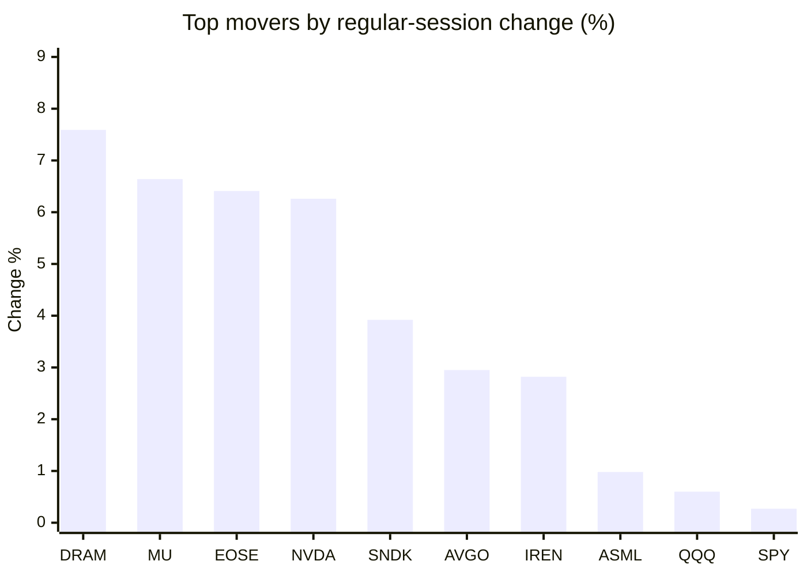
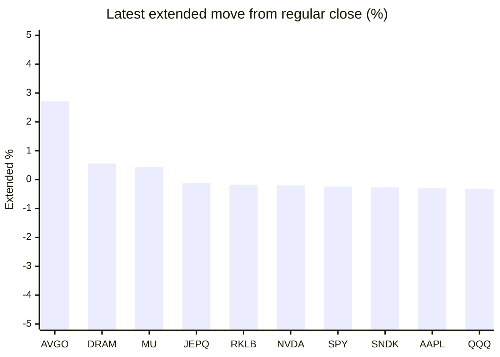

# Stock Brief - 2026-06-02

Generated at 2026-06-02 13:45 +07 from `watchlist.md`.
Prices are snapshots from Yahoo Finance public chart data. Extended/overnight is the latest available pre/post-market datapoint from the same feed.

## Market Snapshot

- SPY: close 758.54, latest extended 756.70, regular move +0.27%, extended move -0.24%
- QQQ: close 742.74, latest extended 740.28, regular move +0.60%, extended move -0.33%
- JEPQ: close 60.70, latest extended 60.63, regular move -0.74%, extended move -0.11%

## Watchlist Prices

| Ticker | Name | Regular close | Latest extended/overnight | Regular move | Extended move | Latest data time | Source |
|---|---|---:|---:|---:|---:|---|---|
| INTC | Intel Corporation | 109.33 USD | 108.60 USD | -4.67% | -0.67% | 2026-06-01 20:00 EDT | [Yahoo](https://finance.yahoo.com/quote/INTC/) |
| AVGO | Broadcom Inc. | 459.97 USD | 472.43 USD | +2.95% | +2.71% | 2026-06-01 19:59 EDT | [Yahoo](https://finance.yahoo.com/quote/AVGO/) |
| RKLB | Rocket Lab Corporation | 122.39 USD | 122.17 USD | -14.70% | -0.18% | 2026-06-01 19:59 EDT | [Yahoo](https://finance.yahoo.com/quote/RKLB/) |
| AAPL | Apple Inc. | 306.31 USD | 305.40 USD | -1.84% | -0.30% | 2026-06-01 19:59 EDT | [Yahoo](https://finance.yahoo.com/quote/AAPL/) |
| NVDA | NVIDIA Corporation | 224.36 USD | 223.92 USD | +6.26% | -0.20% | 2026-06-01 19:59 EDT | [Yahoo](https://finance.yahoo.com/quote/NVDA/) |
| TSLA | Tesla, Inc. | 415.88 USD | 413.55 USD | -4.57% | -0.56% | 2026-06-01 19:59 EDT | [Yahoo](https://finance.yahoo.com/quote/TSLA/) |
| SNDK | Sandisk Corporation | 1,761.43 USD | 1,756.62 USD | +3.92% | -0.27% | 2026-06-01 19:59 EDT | [Yahoo](https://finance.yahoo.com/quote/SNDK/) |
| QQQ | Invesco QQQ Trust, Series 1 | 742.74 USD | 740.28 USD | +0.60% | -0.33% | 2026-06-01 19:59 EDT | [Yahoo](https://finance.yahoo.com/quote/QQQ/) |
| SPY | State Street SPDR S&P 500 ETF T | 758.54 USD | 756.70 USD | +0.27% | -0.24% | 2026-06-01 19:59 EDT | [Yahoo](https://finance.yahoo.com/quote/SPY/) |
| JEPQ | JPMorgan Nasdaq Equity Premium  | 60.70 USD | 60.63 USD | -0.74% | -0.11% | 2026-06-01 19:59 EDT | [Yahoo](https://finance.yahoo.com/quote/JEPQ/) |
| ASTS | AST SpaceMobile, Inc. | 105.65 USD | 104.90 USD | -6.84% | -0.71% | 2026-06-01 19:59 EDT | [Yahoo](https://finance.yahoo.com/quote/ASTS/) |
| MU | Micron Technology, Inc. | 1,035.50 USD | 1,040.07 USD | +6.64% | +0.44% | 2026-06-01 19:59 EDT | [Yahoo](https://finance.yahoo.com/quote/MU/) |
| IREN | IREN LIMITED | 65.33 USD | 64.71 USD | +2.82% | -0.95% | 2026-06-01 19:59 EDT | [Yahoo](https://finance.yahoo.com/quote/IREN/) |
| EOSE | Eos Energy Enterprises, Inc. | 8.97 USD | 8.89 USD | +6.41% | -0.89% | 2026-06-01 19:59 EDT | [Yahoo](https://finance.yahoo.com/quote/EOSE/) |
| GOOG | Alphabet Inc. | 372.58 USD | 370.00 USD | -1.02% | -0.69% | 2026-06-01 19:59 EDT | [Yahoo](https://finance.yahoo.com/quote/GOOG/) |
| DRAM | Roundhill Memory ETF | 68.00 USD | 68.38 USD | +7.59% | +0.56% | 2026-06-01 19:59 EDT | [Yahoo](https://finance.yahoo.com/quote/DRAM/) |
| AMD | Advanced Micro Devices, Inc. | 510.13 USD | 506.96 USD | -1.16% | -0.62% | 2026-06-01 19:59 EDT | [Yahoo](https://finance.yahoo.com/quote/AMD/) |
| ASML | ASML Holding N.V. - New York Re | 1,628.57 USD | 1,623.13 USD | +0.98% | -0.33% | 2026-06-01 19:55 EDT | [Yahoo](https://finance.yahoo.com/quote/ASML/) |

## Charts

### Top Movers - Regular Session

### Extended / Overnight Move

### Quick Heatmap

| Group | Names in watchlist | Avg regular move | Avg extended move |
|---|---|---:|---:|
| Mega-cap tech | AVGO, AAPL, NVDA, TSLA, GOOG | +0.36% | +0.19% |
| Semis / memory | INTC, SNDK, MU, DRAM, AMD, ASML | +2.22% | -0.15% |
| Space / high beta | RKLB, ASTS, IREN, EOSE | -3.08% | -0.68% |
| ETFs | QQQ, SPY, JEPQ | +0.05% | -0.23% |

## News Headlines

- [Is the Arista Networks Post-Earnings Dip a Good Buying Opportunity?](https://www.fool.com/investing/2026/06/02/is-the-arista-networks-post-earnings-dip-a-good-bu/?.tsrc=rss) (2026-06-02 13:31 Bangkok)
- [Intel Announces New AI Innovations at Computex — Chip to Rackscale AI Solutions Delivered to Customers with the Help of Strategic Industry Partners](https://finance.yahoo.com/sectors/technology/articles/intel-announces-ai-innovations-computex-063000310.html?.tsrc=rss) (2026-06-02 13:30 Bangkok)
- [3 Things Broadcom and Nvidia Investors Should Look for When Broadcom Reports Earnings on June 3](https://www.fool.com/investing/2026/06/02/3-things-broadcom-and-nvidia-investors-should-look/?.tsrc=rss) (2026-06-02 13:20 Bangkok)
- [COMPUTEX 2026: Compal Accelerates Smart Hospital Physical AI Deployment with NVIDIA at COMPUTEX 2026](https://finance.yahoo.com/sectors/healthcare/articles/computex-2026-compal-accelerates-smart-060000619.html?.tsrc=rss) (2026-06-02 13:00 Bangkok)
- [3 Reasons Why Sandisk Stock Can Still Go Higher](https://www.fool.com/investing/2026/06/02/3-reasons-why-sandisk-stock-can-still-go-higher/?.tsrc=rss) (2026-06-02 12:51 Bangkok)
- [The Short Seller Who Took On GameStop Just Got Convicted Of Fraud – And Says ‘This Is Not Over’](https://stocktwits.com/news-articles/markets/equity/andrew-left-short-seller-citron-research-game-stop-says-this-is-not-over/cZ0i8E0Revw?.tsrc=rss) (2026-06-02 12:48 Bangkok)
- [MRVL Stock Is Ripping Overnight After Nvidia CEO Crowns It 'Next Trillion-Dollar Company'](https://stocktwits.com/news-articles/markets/equity/mrvl-stock-is-ripping-overnight-after-nvidia-ceo-crowns-it-next-trillion-dollar-company/cZ0iFDeRevv?.tsrc=rss) (2026-06-02 12:37 Bangkok)
- [The Market Overreacted to the DEA's Marijuana Rescheduling -- Here's What It Means for Canopy Growth Stock Now](https://www.fool.com/investing/2026/06/02/the-market-overreacted-to-the-deas-marijuana-resch/?.tsrc=rss) (2026-06-02 12:35 Bangkok)

## Caveats

- This is not investment advice. Extended-hours prices can be thin and volatile.
- Yahoo public endpoints may lag official exchange data.
