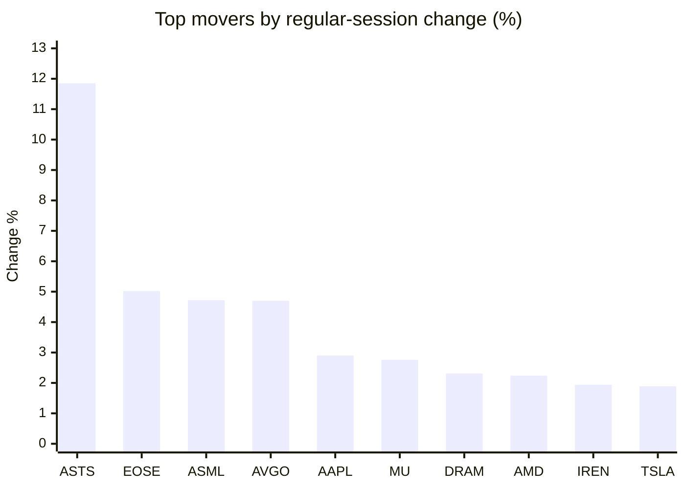
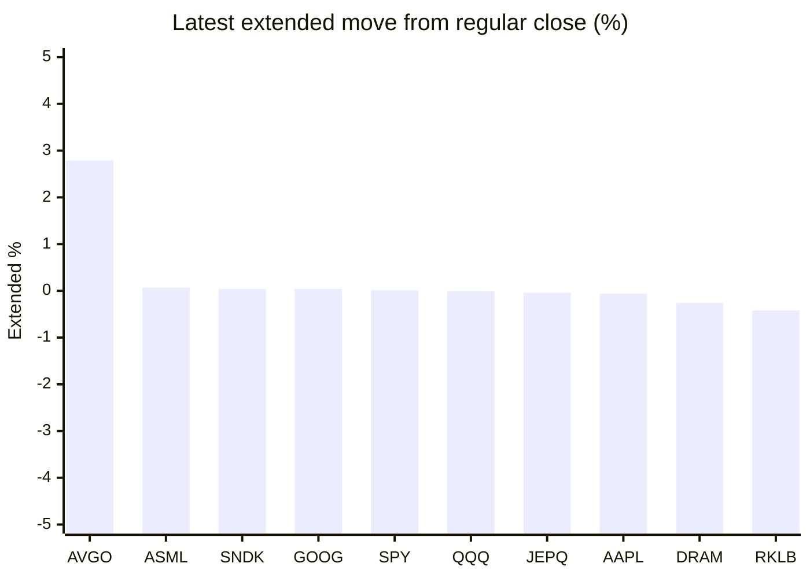

# Stock Brief - 2026-06-03

Generated at 2026-06-03 13:57 +07 from `watchlist.md`.
Prices are snapshots from Yahoo Finance public chart data. Extended/overnight is the latest available pre/post-market datapoint from the same feed.

## Market Snapshot

- SPY: close 759.57, latest extended 759.63, regular move +0.14%, extended move +0.01%
- QQQ: close 746.16, latest extended 746.06, regular move +0.46%, extended move -0.01%
- JEPQ: close 60.86, latest extended 60.84, regular move +0.26%, extended move -0.04%

## Watchlist Prices

| Ticker | Name | Regular close | Latest extended/overnight | Regular move | Extended move | Latest data time | Source |
|---|---|---:|---:|---:|---:|---|---|
| INTC | Intel Corporation | 107.93 USD | 106.15 USD | -1.28% | -1.65% | 2026-06-02 19:59 EDT | [Yahoo](https://finance.yahoo.com/quote/INTC/) |
| AVGO | Broadcom Inc. | 481.57 USD | 495.00 USD | +4.70% | +2.79% | 2026-06-02 19:59 EDT | [Yahoo](https://finance.yahoo.com/quote/AVGO/) |
| RKLB | Rocket Lab Corporation | 123.32 USD | 122.80 USD | +0.76% | -0.42% | 2026-06-02 19:59 EDT | [Yahoo](https://finance.yahoo.com/quote/RKLB/) |
| AAPL | Apple Inc. | 315.20 USD | 315.00 USD | +2.90% | -0.06% | 2026-06-02 19:59 EDT | [Yahoo](https://finance.yahoo.com/quote/AAPL/) |
| NVDA | NVIDIA Corporation | 222.82 USD | 221.80 USD | -0.69% | -0.46% | 2026-06-02 19:59 EDT | [Yahoo](https://finance.yahoo.com/quote/NVDA/) |
| TSLA | Tesla, Inc. | 423.74 USD | 421.77 USD | +1.89% | -0.46% | 2026-06-02 19:59 EDT | [Yahoo](https://finance.yahoo.com/quote/TSLA/) |
| SNDK | Sandisk Corporation | 1,716.36 USD | 1,717.11 USD | -2.56% | +0.04% | 2026-06-02 19:59 EDT | [Yahoo](https://finance.yahoo.com/quote/SNDK/) |
| QQQ | Invesco QQQ Trust, Series 1 | 746.16 USD | 746.06 USD | +0.46% | -0.01% | 2026-06-02 19:59 EDT | [Yahoo](https://finance.yahoo.com/quote/QQQ/) |
| SPY | State Street SPDR S&P 500 ETF T | 759.57 USD | 759.63 USD | +0.14% | +0.01% | 2026-06-02 19:59 EDT | [Yahoo](https://finance.yahoo.com/quote/SPY/) |
| JEPQ | JPMorgan Nasdaq Equity Premium  | 60.86 USD | 60.84 USD | +0.26% | -0.04% | 2026-06-02 19:59 EDT | [Yahoo](https://finance.yahoo.com/quote/JEPQ/) |
| ASTS | AST SpaceMobile, Inc. | 118.17 USD | 116.48 USD | +11.85% | -1.43% | 2026-06-02 19:59 EDT | [Yahoo](https://finance.yahoo.com/quote/ASTS/) |
| MU | Micron Technology, Inc. | 1,064.10 USD | 1,056.70 USD | +2.76% | -0.70% | 2026-06-02 19:59 EDT | [Yahoo](https://finance.yahoo.com/quote/MU/) |
| IREN | IREN LIMITED | 66.60 USD | 65.79 USD | +1.94% | -1.22% | 2026-06-02 19:59 EDT | [Yahoo](https://finance.yahoo.com/quote/IREN/) |
| EOSE | Eos Energy Enterprises, Inc. | 9.42 USD | 9.33 USD | +5.02% | -0.96% | 2026-06-02 19:59 EDT | [Yahoo](https://finance.yahoo.com/quote/EOSE/) |
| GOOG | Alphabet Inc. | 358.39 USD | 358.52 USD | -3.81% | +0.04% | 2026-06-02 19:59 EDT | [Yahoo](https://finance.yahoo.com/quote/GOOG/) |
| DRAM | Roundhill Memory ETF | 69.57 USD | 69.39 USD | +2.31% | -0.26% | 2026-06-02 19:59 EDT | [Yahoo](https://finance.yahoo.com/quote/DRAM/) |
| AMD | Advanced Micro Devices, Inc. | 521.54 USD | 518.75 USD | +2.24% | -0.53% | 2026-06-02 19:59 EDT | [Yahoo](https://finance.yahoo.com/quote/AMD/) |
| ASML | ASML Holding N.V. - New York Re | 1,705.37 USD | 1,706.50 USD | +4.72% | +0.07% | 2026-06-02 19:59 EDT | [Yahoo](https://finance.yahoo.com/quote/ASML/) |

## Charts

### Top Movers - Regular Session

### Extended / Overnight Move

### Quick Heatmap

| Group | Names in watchlist | Avg regular move | Avg extended move |
|---|---|---:|---:|
| Mega-cap tech | AVGO, AAPL, NVDA, TSLA, GOOG | +1.00% | +0.37% |
| Semis / memory | INTC, SNDK, MU, DRAM, AMD, ASML | +1.36% | -0.51% |
| Space / high beta | RKLB, ASTS, IREN, EOSE | +4.89% | -1.00% |
| ETFs | QQQ, SPY, JEPQ | +0.29% | -0.02% |

## News Headlines

- [Will Tesla Merge With SpaceX?](https://www.fool.com/investing/2026/06/03/will-tesla-merge-with-spacex/?.tsrc=rss) (2026-06-03 13:25 Bangkok)
- [Nvidia Optics Shift Puts Lumentum At Center Of AI Data Centers](https://finance.yahoo.com/markets/stocks/articles/nvidia-optics-shift-puts-lumentum-061120526.html?.tsrc=rss) (2026-06-03 13:11 Bangkok)
- [Does Fluence Energy’s (FLNC) Nvidia-Siemens Blueprint Tie Its Future to AI Data Center Power Needs?](https://finance.yahoo.com/sectors/energy/articles/does-fluence-energy-flnc-nvidia-061038088.html?.tsrc=rss) (2026-06-03 13:10 Bangkok)
- [AVGO Stock’s Big 2026 Rally Hits Its Moment Of Truth Today: Here's Where Wall Street And Retail Stand Ahead Of Q2 Earnings](https://stocktwits.com/news-articles/markets/equity/avgo-stock-s-big-2026-rally-hits-its-moment-of-truth-today-here-s-where-wall-street-and-retail-stand-ahead-of-q2-earnings/cZ0SvcbReDx?.tsrc=rss) (2026-06-03 12:38 Bangkok)
- [Wall Street Dumped This Magnificent ETF, but It's Making a Roaring Comeback With a 40% Gain Since April 10](https://www.fool.com/investing/2026/06/03/wall-street-dumped-etf-roaring-comeback-a-40-gain/?.tsrc=rss) (2026-06-03 12:27 Bangkok)
- [Nvidia’s RTX Spark AI PC Superchip Launch Might Change The Case For Investing In QUALCOMM (QCOM)](https://finance.yahoo.com/markets/stocks/articles/nvidia-rtx-spark-ai-pc-051225697.html?.tsrc=rss) (2026-06-03 12:12 Bangkok)
- [Gary Black Says Broadcom, Marvell Are 'Big Winners' As Focus Shifts To Custom AI Chips As Nvidia CEO Jensen Huang Touts 'Next Trillion-Dollar Company'](https://finance.yahoo.com/markets/stocks/articles/gary-black-says-broadcom-marvell-043646934.html?.tsrc=rss) (2026-06-03 11:36 Bangkok)
- [Aptiv (APTV) Is Up 25.7% After Deepening NVIDIA Edge AI Partnership – Has The Bull Case Changed?](https://finance.yahoo.com/markets/stocks/articles/aptiv-aptv-25-7-deepening-043125601.html?.tsrc=rss) (2026-06-03 11:31 Bangkok)

## Caveats

- This is not investment advice. Extended-hours prices can be thin and volatile.
- Yahoo public endpoints may lag official exchange data.
