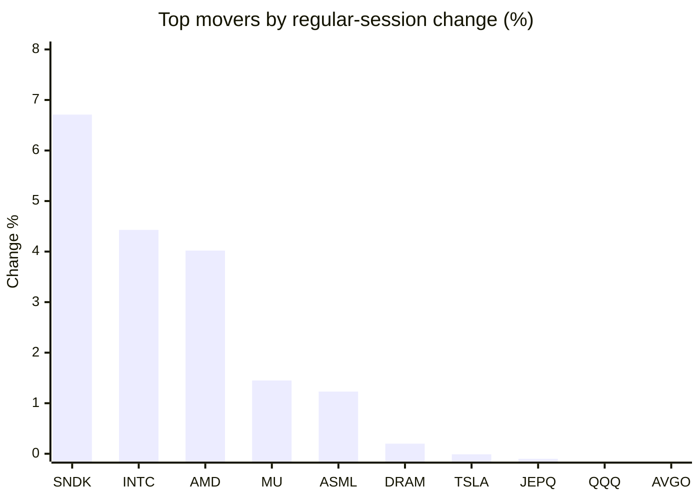
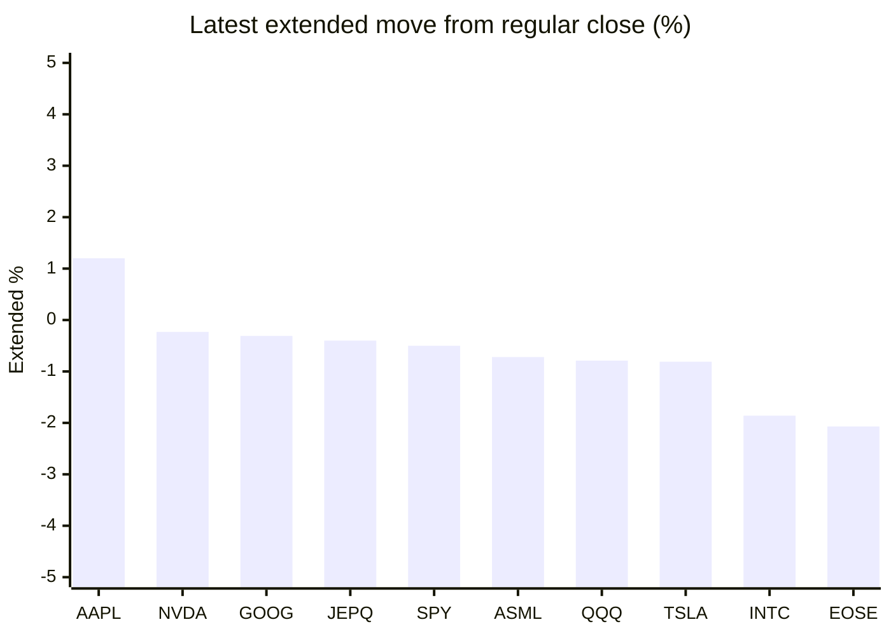

# Stock Brief - 2026-06-04

Generated at 2026-06-04 13:46 +07 from `watchlist.md`.
Prices are snapshots from Yahoo Finance public chart data. Extended/overnight is the latest available pre/post-market datapoint from the same feed.

## Market Snapshot

- SPY: close 754.24, latest extended 750.47, regular move -0.70%, extended move -0.50%
- QQQ: close 744.21, latest extended 738.34, regular move -0.26%, extended move -0.79%
- JEPQ: close 60.80, latest extended 60.56, regular move -0.10%, extended move -0.40%

## Watchlist Prices

| Ticker | Name | Regular close | Latest extended/overnight | Regular move | Extended move | Latest data time | Source |
|---|---|---:|---:|---:|---:|---|---|
| INTC | Intel Corporation | 112.71 USD | 110.61 USD | +4.43% | -1.86% | 2026-06-03 19:59 EDT | [Yahoo](https://finance.yahoo.com/quote/INTC/) |
| AVGO | Broadcom Inc. | 479.23 USD | 413.83 USD | -0.49% | -13.65% | 2026-06-03 19:59 EDT | [Yahoo](https://finance.yahoo.com/quote/AVGO/) |
| RKLB | Rocket Lab Corporation | 114.70 USD | 111.75 USD | -6.99% | -2.57% | 2026-06-03 19:59 EDT | [Yahoo](https://finance.yahoo.com/quote/RKLB/) |
| AAPL | Apple Inc. | 310.26 USD | 313.97 USD | -1.57% | +1.20% | 2026-06-03 19:59 EDT | [Yahoo](https://finance.yahoo.com/quote/AAPL/) |
| NVDA | NVIDIA Corporation | 214.75 USD | 214.26 USD | -3.62% | -0.23% | 2026-06-03 19:59 EDT | [Yahoo](https://finance.yahoo.com/quote/NVDA/) |
| TSLA | Tesla, Inc. | 423.70 USD | 420.25 USD | -0.01% | -0.81% | 2026-06-03 19:59 EDT | [Yahoo](https://finance.yahoo.com/quote/TSLA/) |
| SNDK | Sandisk Corporation | 1,831.50 USD | 1,783.37 USD | +6.71% | -2.63% | 2026-06-03 19:59 EDT | [Yahoo](https://finance.yahoo.com/quote/SNDK/) |
| QQQ | Invesco QQQ Trust, Series 1 | 744.21 USD | 738.34 USD | -0.26% | -0.79% | 2026-06-03 19:59 EDT | [Yahoo](https://finance.yahoo.com/quote/QQQ/) |
| SPY | State Street SPDR S&P 500 ETF T | 754.24 USD | 750.47 USD | -0.70% | -0.50% | 2026-06-03 19:59 EDT | [Yahoo](https://finance.yahoo.com/quote/SPY/) |
| JEPQ | JPMorgan Nasdaq Equity Premium  | 60.80 USD | 60.56 USD | -0.10% | -0.40% | 2026-06-03 19:59 EDT | [Yahoo](https://finance.yahoo.com/quote/JEPQ/) |
| ASTS | AST SpaceMobile, Inc. | 107.73 USD | 104.94 USD | -8.83% | -2.59% | 2026-06-03 19:59 EDT | [Yahoo](https://finance.yahoo.com/quote/ASTS/) |
| MU | Micron Technology, Inc. | 1,079.57 USD | 1,050.19 USD | +1.45% | -2.72% | 2026-06-03 20:00 EDT | [Yahoo](https://finance.yahoo.com/quote/MU/) |
| IREN | IREN LIMITED | 65.48 USD | 62.20 USD | -1.68% | -5.01% | 2026-06-03 19:59 EDT | [Yahoo](https://finance.yahoo.com/quote/IREN/) |
| EOSE | Eos Energy Enterprises, Inc. | 8.20 USD | 8.03 USD | -12.95% | -2.07% | 2026-06-03 19:59 EDT | [Yahoo](https://finance.yahoo.com/quote/EOSE/) |
| GOOG | Alphabet Inc. | 355.68 USD | 354.59 USD | -0.76% | -0.31% | 2026-06-03 19:59 EDT | [Yahoo](https://finance.yahoo.com/quote/GOOG/) |
| DRAM | Roundhill Memory ETF | 69.71 USD | 66.75 USD | +0.20% | -4.25% | 2026-06-03 19:59 EDT | [Yahoo](https://finance.yahoo.com/quote/DRAM/) |
| AMD | Advanced Micro Devices, Inc. | 542.52 USD | 525.00 USD | +4.02% | -3.23% | 2026-06-03 19:59 EDT | [Yahoo](https://finance.yahoo.com/quote/AMD/) |
| ASML | ASML Holding N.V. - New York Re | 1,726.36 USD | 1,713.90 USD | +1.23% | -0.72% | 2026-06-03 19:59 EDT | [Yahoo](https://finance.yahoo.com/quote/ASML/) |

## Charts

### Top Movers - Regular Session

### Extended / Overnight Move

### Quick Heatmap

| Group | Names in watchlist | Avg regular move | Avg extended move |
|---|---|---:|---:|
| Mega-cap tech | AVGO, AAPL, NVDA, TSLA, GOOG | -1.29% | -2.76% |
| Semis / memory | INTC, SNDK, MU, DRAM, AMD, ASML | +3.01% | -2.57% |
| Space / high beta | RKLB, ASTS, IREN, EOSE | -7.61% | -3.06% |
| ETFs | QQQ, SPY, JEPQ | -0.35% | -0.56% |

## News Headlines

- [SpaceX sets IPO price, valuing company at $1.75tn ahead of record debut](https://www.euronews.com/2026/06/04/spacex-sets-ipo-price-valuing-company-at-175tn-ahead-of-record-debut?utm_source=yahoo&utm_campaign=feeds_business_articles_2024&utm_medium=referral&.tsrc=rss) (2026-06-04 13:30 Bangkok)
- [What the SpaceX IPO Means for Starlink's Future](https://www.fool.com/investing/2026/06/04/what-the-spacex-ipo-means-for-starlinks-future/?.tsrc=rss) (2026-06-04 13:25 Bangkok)
- [Hewlett Packard Enterprise Just Delivered a Blowout Quarter. Is the AI Server Trade Heating Up?](https://www.fool.com/investing/2026/06/04/hewlett-packard-enterprise-just-delivered-a-blowou/?.tsrc=rss) (2026-06-04 13:11 Bangkok)
- [Foxconn announces strategic collaboration with Intel on next-gen AI infrastructure](https://finance.yahoo.com/sectors/technology/articles/foxconn-announces-strategic-collaboration-intel-060649984.html?.tsrc=rss) (2026-06-04 13:06 Bangkok)
- [【COMPUTEX 2026】Compal Integrates Quantum Technology and AI - Partnering with Top Universities and Pharmaceutical Firms to Build a Biotech AI Platform](https://finance.yahoo.com/sectors/healthcare/articles/computex-2026-compal-integrates-quantum-060000580.html?.tsrc=rss) (2026-06-04 13:00 Bangkok)
- [3 Top Bargain Artificial Intelligence (AI) Stocks to Buy Right Now](https://www.fool.com/investing/2026/06/04/3-top-bargain-ai-stocks-to-buy-right-now/?.tsrc=rss) (2026-06-04 12:38 Bangkok)
- [RKLB, LUNR, FLY, SIDU Reverse Losses Overnight: Jamie Dimon Takes SpaceX IPO Pitch To 2,500 Wealthy Clients This Week](https://stocktwits.com/news-articles/markets/equity/rklb-lunr-fly-sidu-jamie-dimon-spacex-pitch/cZ0ZTbBReUz?.tsrc=rss) (2026-06-04 12:31 Bangkok)
- [Broadcom Inc (AVGO) Q2 2026 Earnings Call Highlights: Record Revenue Driven by AI Semiconductor ...](https://finance.yahoo.com/markets/stocks/articles/broadcom-inc-avgo-q2-2026-050026685.html?.tsrc=rss) (2026-06-04 12:00 Bangkok)

## Caveats

- This is not investment advice. Extended-hours prices can be thin and volatile.
- Yahoo public endpoints may lag official exchange data.
