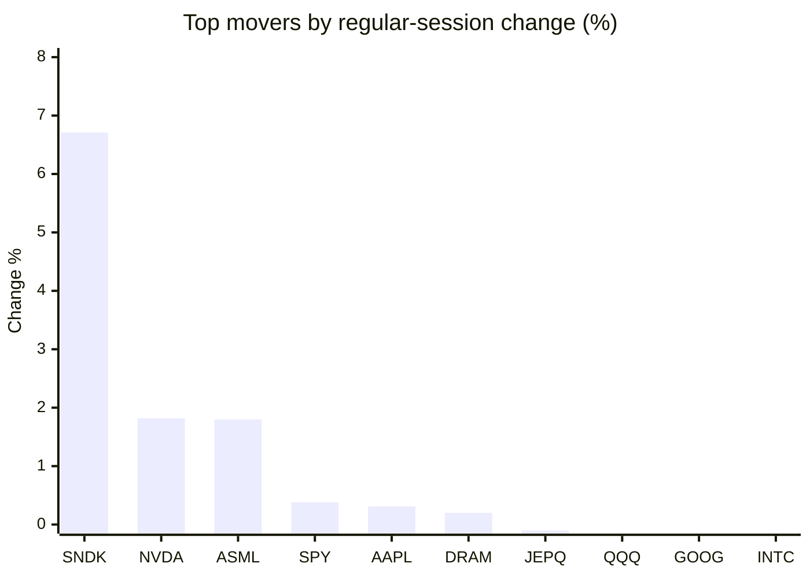
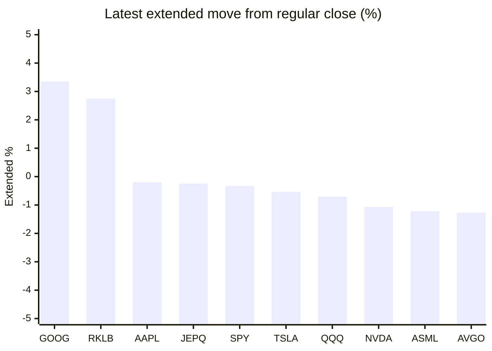

# Stock Brief - 2026-06-05

Generated at 2026-06-05 13:35 +07 from `watchlist.md`.
Prices are snapshots from Yahoo Finance public chart data. Extended/overnight is the latest available pre/post-market datapoint from the same feed.

## Market Snapshot

- SPY: close 757.09, latest extended 754.56, regular move +0.38%, extended move -0.33%
- QQQ: close 740.61, latest extended 735.37, regular move -0.48%, extended move -0.71%
- JEPQ: close 60.80, latest extended 60.65, regular move -0.10%, extended move -0.25%

## Watchlist Prices

| Ticker | Name | Regular close | Latest extended/overnight | Regular move | Extended move | Latest data time | Source |
|---|---|---:|---:|---:|---:|---|---|
| INTC | Intel Corporation | 111.78 USD | 109.85 USD | -0.83% | -1.73% | 2026-06-04 19:59 EDT | [Yahoo](https://finance.yahoo.com/quote/INTC/) |
| AVGO | Broadcom Inc. | 418.91 USD | 413.60 USD | -12.59% | -1.27% | 2026-06-04 19:59 EDT | [Yahoo](https://finance.yahoo.com/quote/AVGO/) |
| RKLB | Rocket Lab Corporation | 114.70 USD | 117.85 USD | -6.99% | +2.75% | 2026-06-04 19:59 EDT | [Yahoo](https://finance.yahoo.com/quote/RKLB/) |
| AAPL | Apple Inc. | 311.23 USD | 310.60 USD | +0.31% | -0.20% | 2026-06-04 19:59 EDT | [Yahoo](https://finance.yahoo.com/quote/AAPL/) |
| NVDA | NVIDIA Corporation | 218.66 USD | 216.31 USD | +1.82% | -1.07% | 2026-06-04 19:59 EDT | [Yahoo](https://finance.yahoo.com/quote/NVDA/) |
| TSLA | Tesla, Inc. | 418.45 USD | 416.19 USD | -1.24% | -0.54% | 2026-06-04 19:59 EDT | [Yahoo](https://finance.yahoo.com/quote/TSLA/) |
| SNDK | Sandisk Corporation | 1,831.50 USD | 1,730.99 USD | +6.71% | -5.49% | 2026-06-04 19:59 EDT | [Yahoo](https://finance.yahoo.com/quote/SNDK/) |
| QQQ | Invesco QQQ Trust, Series 1 | 740.61 USD | 735.37 USD | -0.48% | -0.71% | 2026-06-04 19:59 EDT | [Yahoo](https://finance.yahoo.com/quote/QQQ/) |
| SPY | State Street SPDR S&P 500 ETF T | 757.09 USD | 754.56 USD | +0.38% | -0.33% | 2026-06-04 19:59 EDT | [Yahoo](https://finance.yahoo.com/quote/SPY/) |
| JEPQ | JPMorgan Nasdaq Equity Premium  | 60.80 USD | 60.65 USD | -0.10% | -0.25% | 2026-06-04 19:59 EDT | [Yahoo](https://finance.yahoo.com/quote/JEPQ/) |
| ASTS | AST SpaceMobile, Inc. | 107.73 USD | 106.25 USD | -8.83% | -1.37% | 2026-06-04 19:59 EDT | [Yahoo](https://finance.yahoo.com/quote/ASTS/) |
| MU | Micron Technology, Inc. | 996.00 USD | 971.40 USD | -7.74% | -2.47% | 2026-06-04 20:00 EDT | [Yahoo](https://finance.yahoo.com/quote/MU/) |
| IREN | IREN LIMITED | 65.48 USD | 61.09 USD | -1.68% | -6.70% | 2026-06-04 19:59 EDT | [Yahoo](https://finance.yahoo.com/quote/IREN/) |
| EOSE | Eos Energy Enterprises, Inc. | 8.20 USD | 8.03 USD | -12.95% | -2.07% | 2026-06-04 19:59 EDT | [Yahoo](https://finance.yahoo.com/quote/EOSE/) |
| GOOG | Alphabet Inc. | 355.68 USD | 367.61 USD | -0.76% | +3.35% | 2026-06-04 19:59 EDT | [Yahoo](https://finance.yahoo.com/quote/GOOG/) |
| DRAM | Roundhill Memory ETF | 69.71 USD | 63.27 USD | +0.20% | -9.24% | 2026-06-04 19:59 EDT | [Yahoo](https://finance.yahoo.com/quote/DRAM/) |
| AMD | Advanced Micro Devices, Inc. | 523.20 USD | 514.15 USD | -3.56% | -1.73% | 2026-06-04 19:59 EDT | [Yahoo](https://finance.yahoo.com/quote/AMD/) |
| ASML | ASML Holding N.V. - New York Re | 1,757.47 USD | 1,736.00 USD | +1.80% | -1.22% | 2026-06-04 19:59 EDT | [Yahoo](https://finance.yahoo.com/quote/ASML/) |

## Charts

### Top Movers - Regular Session

### Extended / Overnight Move

### Quick Heatmap

| Group | Names in watchlist | Avg regular move | Avg extended move |
|---|---|---:|---:|
| Mega-cap tech | AVGO, AAPL, NVDA, TSLA, GOOG | -2.49% | +0.05% |
| Semis / memory | INTC, SNDK, MU, DRAM, AMD, ASML | -0.57% | -3.65% |
| Space / high beta | RKLB, ASTS, IREN, EOSE | -7.61% | -1.85% |
| ETFs | QQQ, SPY, JEPQ | -0.07% | -0.43% |

## News Headlines

- [Intel’s AI Rackscale Push And Agentic Clouds Confront Valuation Risks](https://finance.yahoo.com/markets/stocks/articles/intel-ai-rackscale-push-agentic-060733362.html?.tsrc=rss) (2026-06-05 13:07 Bangkok)
- [Why Is Jamie Dimon Giving the SpaceX IPO the Hard Sell?](https://www.fool.com/investing/2026/06/05/why-is-jamie-dimon-giving-the-spacex-ipo-the-hard/?.tsrc=rss) (2026-06-05 13:05 Bangkok)
- [What SpaceX’s IPO Means for Index Fund Investors](https://finance.yahoo.com/m/c13208ba-e62b-34de-89e8-2d9fd1dc87e3/what-spacex%E2%80%99s-ipo-means-for.html?.tsrc=rss) (2026-06-05 13:00 Bangkok)
- [This Former Bitcoin Miner May Be Sitting on a Hidden AI Opportunity](https://www.fool.com/investing/2026/06/05/this-former-bitcoin-miner-may-be-sitting-on-a-hidd/?.tsrc=rss) (2026-06-05 12:47 Bangkok)
- [Beyond Nvidia: Europe's best-performing AI stocks of 2026](https://www.euronews.com/2026/06/05/beyond-nvidia-europes-best-performing-ai-stocks-of-2026?utm_source=yahoo&utm_campaign=feeds_business_articles_2024&utm_medium=referral&.tsrc=rss) (2026-06-05 12:37 Bangkok)
- [Nvidia CEO sees robotics as next major sector in South Korea](https://finance.yahoo.com/sectors/technology/articles/nvidia-ceo-sees-robotics-next-051530964.html?.tsrc=rss) (2026-06-05 12:15 Bangkok)
- [Asian shares drop, with South Korea's Kospi down more than 5%](https://finance.yahoo.com/markets/world-indices/articles/asian-shares-drop-south-koreas-050334604.html?.tsrc=rss) (2026-06-05 12:03 Bangkok)
- [Is Lululemon Athletica a Buy After Its Latest Earnings Report?](https://www.fool.com/investing/2026/06/05/is-lululemon-athletica-a-buy-after-its-latest-earn/?.tsrc=rss) (2026-06-05 11:50 Bangkok)

## Caveats

- This is not investment advice. Extended-hours prices can be thin and volatile.
- Yahoo public endpoints may lag official exchange data.
