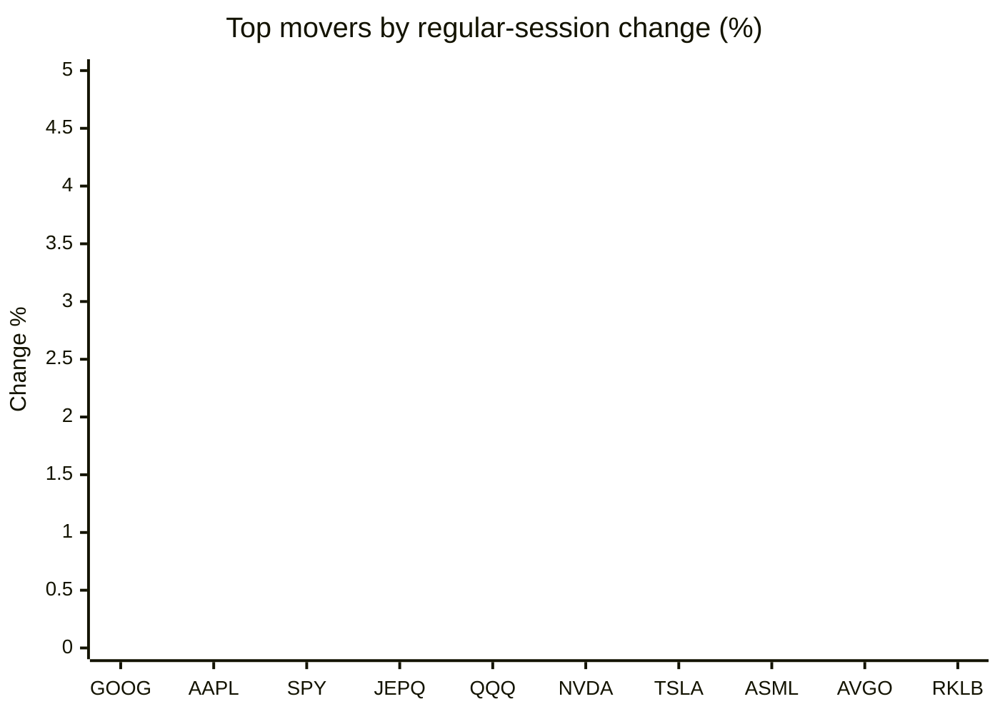
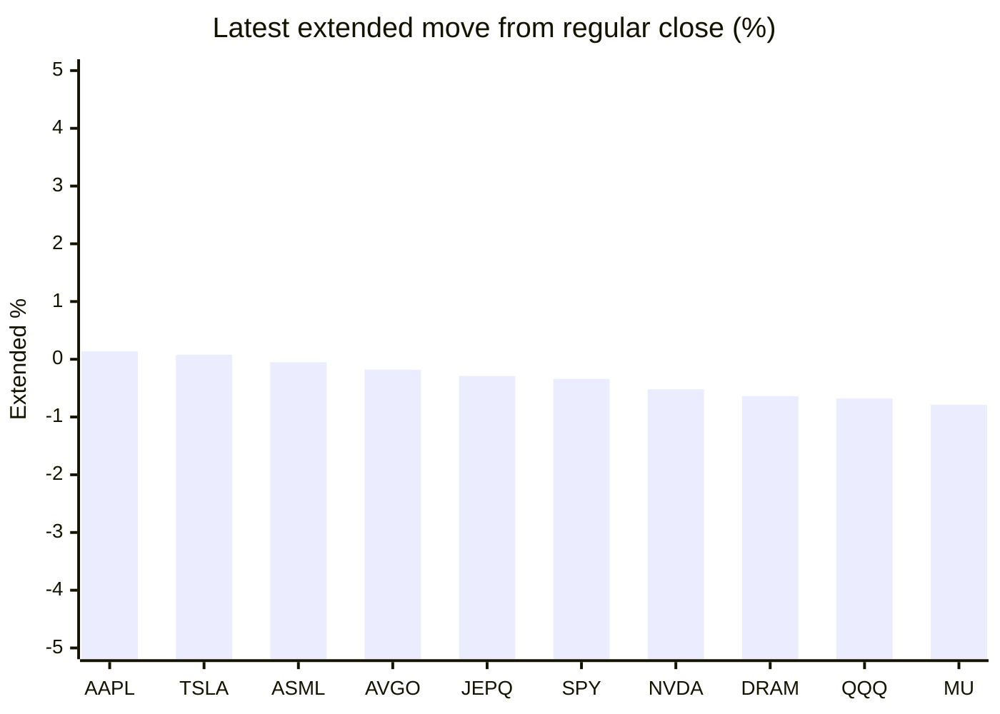

# Stock Brief - 2026-06-06

Generated at 2026-06-06 12:57 +07 from `watchlist.md`.
Prices are snapshots from Yahoo Finance public chart data. Extended/overnight is the latest available pre/post-market datapoint from the same feed.

## Market Snapshot

- SPY: close 737.55, latest extended 735.01, regular move -2.58%, extended move -0.34%
- QQQ: close 705.06, latest extended 700.30, regular move -4.80%, extended move -0.68%
- JEPQ: close 58.90, latest extended 58.73, regular move -3.01%, extended move -0.29%

## Watchlist Prices

| Ticker | Name | Regular close | Latest extended/overnight | Regular move | Extended move | Latest data time | Source |
|---|---|---:|---:|---:|---:|---|---|
| INTC | Intel Corporation | 99.17 USD | 96.90 USD | -11.28% | -2.29% | 2026-06-05 19:59 EDT | [Yahoo](https://finance.yahoo.com/quote/INTC/) |
| AVGO | Broadcom Inc. | 385.73 USD | 385.02 USD | -7.92% | -0.18% | 2026-06-05 19:59 EDT | [Yahoo](https://finance.yahoo.com/quote/AVGO/) |
| RKLB | Rocket Lab Corporation | 110.08 USD | 107.35 USD | -8.23% | -2.48% | 2026-06-05 19:59 EDT | [Yahoo](https://finance.yahoo.com/quote/RKLB/) |
| AAPL | Apple Inc. | 307.34 USD | 307.78 USD | -1.25% | +0.14% | 2026-06-05 19:59 EDT | [Yahoo](https://finance.yahoo.com/quote/AAPL/) |
| NVDA | NVIDIA Corporation | 205.10 USD | 204.04 USD | -6.20% | -0.52% | 2026-06-05 19:59 EDT | [Yahoo](https://finance.yahoo.com/quote/NVDA/) |
| TSLA | Tesla, Inc. | 391.00 USD | 391.32 USD | -6.56% | +0.08% | 2026-06-05 19:59 EDT | [Yahoo](https://finance.yahoo.com/quote/TSLA/) |
| SNDK | Sandisk Corporation | 1,559.32 USD | 1,529.50 USD | -11.39% | -1.91% | 2026-06-05 19:59 EDT | [Yahoo](https://finance.yahoo.com/quote/SNDK/) |
| QQQ | Invesco QQQ Trust, Series 1 | 705.06 USD | 700.30 USD | -4.80% | -0.68% | 2026-06-05 19:59 EDT | [Yahoo](https://finance.yahoo.com/quote/QQQ/) |
| SPY | State Street SPDR S&P 500 ETF T | 737.55 USD | 735.01 USD | -2.58% | -0.34% | 2026-06-05 19:59 EDT | [Yahoo](https://finance.yahoo.com/quote/SPY/) |
| JEPQ | JPMorgan Nasdaq Equity Premium  | 58.90 USD | 58.73 USD | -3.01% | -0.29% | 2026-06-05 19:59 EDT | [Yahoo](https://finance.yahoo.com/quote/JEPQ/) |
| ASTS | AST SpaceMobile, Inc. | 93.60 USD | 91.79 USD | -12.76% | -1.93% | 2026-06-05 19:59 EDT | [Yahoo](https://finance.yahoo.com/quote/ASTS/) |
| MU | Micron Technology, Inc. | 864.01 USD | 857.20 USD | -13.25% | -0.79% | 2026-06-05 19:59 EDT | [Yahoo](https://finance.yahoo.com/quote/MU/) |
| IREN | IREN LIMITED | 54.35 USD | 53.24 USD | -12.14% | -2.04% | 2026-06-05 19:59 EDT | [Yahoo](https://finance.yahoo.com/quote/IREN/) |
| EOSE | Eos Energy Enterprises, Inc. | 7.08 USD | 6.88 USD | -12.38% | -2.82% | 2026-06-05 19:59 EDT | [Yahoo](https://finance.yahoo.com/quote/EOSE/) |
| GOOG | Alphabet Inc. | 365.76 USD | 361.61 USD | -0.95% | -1.13% | 2026-06-05 19:59 EDT | [Yahoo](https://finance.yahoo.com/quote/GOOG/) |
| DRAM | Roundhill Memory ETF | 55.79 USD | 55.44 USD | -15.08% | -0.64% | 2026-06-05 19:59 EDT | [Yahoo](https://finance.yahoo.com/quote/DRAM/) |
| AMD | Advanced Micro Devices, Inc. | 466.38 USD | 458.66 USD | -10.86% | -1.65% | 2026-06-05 19:59 EDT | [Yahoo](https://finance.yahoo.com/quote/AMD/) |
| ASML | ASML Holding N.V. - New York Re | 1,641.74 USD | 1,640.84 USD | -6.59% | -0.05% | 2026-06-05 19:59 EDT | [Yahoo](https://finance.yahoo.com/quote/ASML/) |

## Charts

### Top Movers - Regular Session

### Extended / Overnight Move

### Quick Heatmap

| Group | Names in watchlist | Avg regular move | Avg extended move |
|---|---|---:|---:|
| Mega-cap tech | AVGO, AAPL, NVDA, TSLA, GOOG | -4.58% | -0.32% |
| Semis / memory | INTC, SNDK, MU, DRAM, AMD, ASML | -11.41% | -1.22% |
| Space / high beta | RKLB, ASTS, IREN, EOSE | -11.38% | -2.32% |
| ETFs | QQQ, SPY, JEPQ | -3.46% | -0.44% |

## News Headlines

- [Is AMD or Broadcom the Best AI Chip Stock After Nvidia?](https://www.fool.com/investing/2026/06/06/is-amd-or-broadcom-the-best-ai-chip-stock-after-nv/?.tsrc=rss) (2026-06-06 12:50 Bangkok)
- [Why Tesla (TSLA) Shares Are Trading Lower Today](https://finance.yahoo.com/markets/stocks/articles/why-tesla-tsla-shares-trading-053614027.html?.tsrc=rss) (2026-06-06 12:36 Bangkok)
- [Ferrari Is Still Under $400. Here's Whether Long-Term Investors Should Pounce.](https://www.fool.com/investing/2026/06/06/ferrari-stock-under-400-long-term-investors-pounce/?.tsrc=rss) (2026-06-06 12:25 Bangkok)
- [Photronics, Qorvo, and Texas Instruments Shares Are Falling, What You Need To Know](https://finance.yahoo.com/markets/stocks/articles/photronics-qorvo-texas-instruments-shares-045614097.html?.tsrc=rss) (2026-06-06 11:56 Bangkok)
- [Semtech, Impinj, and Western Digital Stocks Trade Down, What You Need To Know](https://finance.yahoo.com/markets/stocks/articles/semtech-impinj-western-digital-stocks-043214281.html?.tsrc=rss) (2026-06-06 11:32 Bangkok)
- [ETF Zoo: What Happens When Tech Eats the Entire Market?](http://www.etf.com/sections/podcasts/etf-zoo-what-happens-when-tech-eats-entire-market?utm_source=yahoo-finance&utm_medium=rss&utm_campaign=yahoo-finance-rss&.tsrc=rss) (2026-06-06 11:24 Bangkok)
- [The Market Has Only Done This 4 Times Since World War II. Here's What Comes Next.](https://www.fool.com/investing/2026/06/06/the-market-has-only-done-this-4-times-since-world/?.tsrc=rss) (2026-06-06 11:20 Bangkok)
- [MACOM, FormFactor, and Seagate Shares Are Falling, What You Need To Know](https://finance.yahoo.com/markets/stocks/articles/macom-formfactor-seagate-shares-falling-040014787.html?.tsrc=rss) (2026-06-06 11:00 Bangkok)

## Caveats

- This is not investment advice. Extended-hours prices can be thin and volatile.
- Yahoo public endpoints may lag official exchange data.
