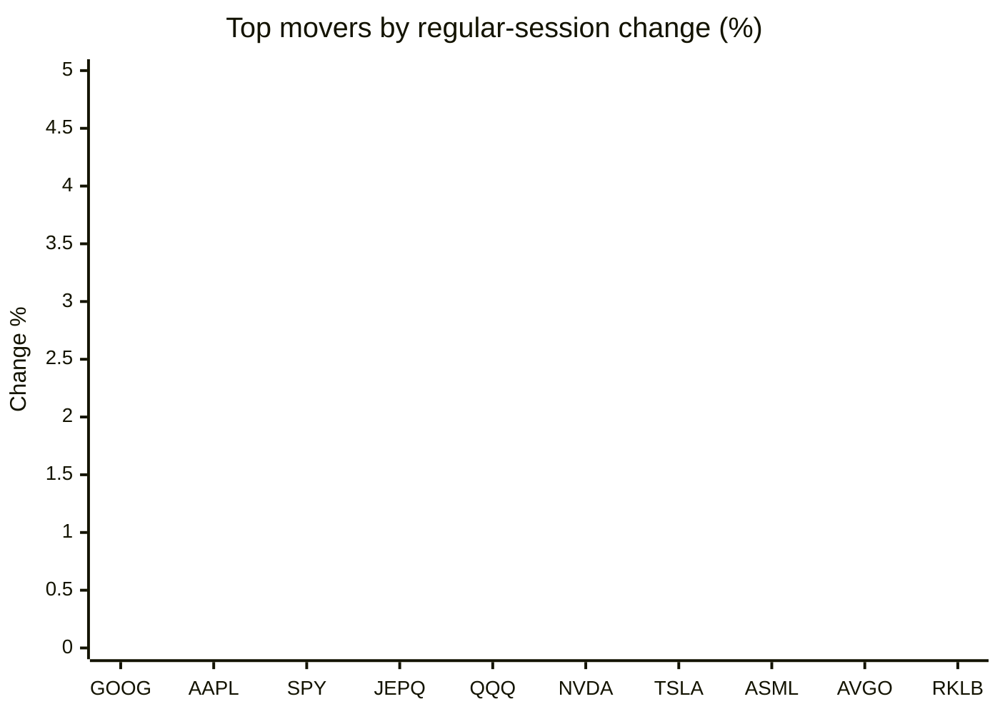
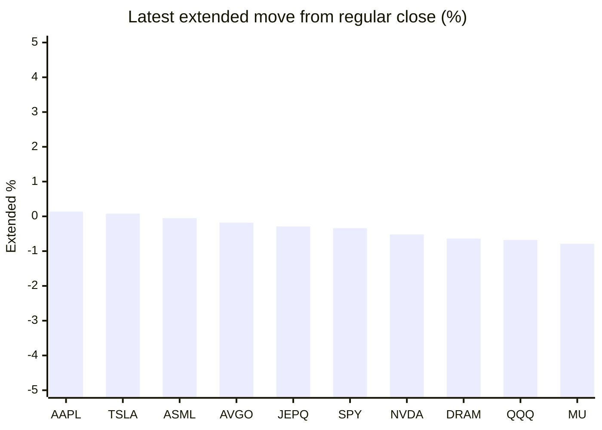

# Stock Brief - 2026-06-07

Generated at 2026-06-07 13:33 +07 from `watchlist.md`.
Prices are snapshots from Yahoo Finance public chart data. Extended/overnight is the latest available pre/post-market datapoint from the same feed.

## Market Snapshot

- SPY: close 737.55, latest extended 735.01, regular move -2.58%, extended move -0.34%
- QQQ: close 705.06, latest extended 700.30, regular move -4.80%, extended move -0.68%
- JEPQ: close 58.90, latest extended 58.73, regular move -3.01%, extended move -0.29%

## Watchlist Prices

| Ticker | Name | Regular close | Latest extended/overnight | Regular move | Extended move | Latest data time | Source |
|---|---|---:|---:|---:|---:|---|---|
| INTC | Intel Corporation | 99.17 USD | 96.90 USD | -11.28% | -2.29% | 2026-06-05 19:59 EDT | [Yahoo](https://finance.yahoo.com/quote/INTC/) |
| AVGO | Broadcom Inc. | 385.73 USD | 385.02 USD | -7.92% | -0.18% | 2026-06-05 19:59 EDT | [Yahoo](https://finance.yahoo.com/quote/AVGO/) |
| RKLB | Rocket Lab Corporation | 110.08 USD | 107.35 USD | -8.23% | -2.48% | 2026-06-05 19:59 EDT | [Yahoo](https://finance.yahoo.com/quote/RKLB/) |
| AAPL | Apple Inc. | 307.34 USD | 307.78 USD | -1.25% | +0.14% | 2026-06-05 19:59 EDT | [Yahoo](https://finance.yahoo.com/quote/AAPL/) |
| NVDA | NVIDIA Corporation | 205.10 USD | 204.04 USD | -6.20% | -0.52% | 2026-06-05 19:59 EDT | [Yahoo](https://finance.yahoo.com/quote/NVDA/) |
| TSLA | Tesla, Inc. | 391.00 USD | 391.32 USD | -6.56% | +0.08% | 2026-06-05 19:59 EDT | [Yahoo](https://finance.yahoo.com/quote/TSLA/) |
| SNDK | Sandisk Corporation | 1,559.32 USD | 1,529.50 USD | -11.39% | -1.91% | 2026-06-05 19:59 EDT | [Yahoo](https://finance.yahoo.com/quote/SNDK/) |
| QQQ | Invesco QQQ Trust, Series 1 | 705.06 USD | 700.30 USD | -4.80% | -0.68% | 2026-06-05 19:59 EDT | [Yahoo](https://finance.yahoo.com/quote/QQQ/) |
| SPY | State Street SPDR S&P 500 ETF T | 737.55 USD | 735.01 USD | -2.58% | -0.34% | 2026-06-05 19:59 EDT | [Yahoo](https://finance.yahoo.com/quote/SPY/) |
| JEPQ | JPMorgan Nasdaq Equity Premium  | 58.90 USD | 58.73 USD | -3.01% | -0.29% | 2026-06-05 19:59 EDT | [Yahoo](https://finance.yahoo.com/quote/JEPQ/) |
| ASTS | AST SpaceMobile, Inc. | 93.60 USD | 91.79 USD | -12.76% | -1.93% | 2026-06-05 19:59 EDT | [Yahoo](https://finance.yahoo.com/quote/ASTS/) |
| MU | Micron Technology, Inc. | 864.01 USD | 857.20 USD | -13.25% | -0.79% | 2026-06-05 19:59 EDT | [Yahoo](https://finance.yahoo.com/quote/MU/) |
| IREN | IREN LIMITED | 54.35 USD | 53.24 USD | -12.14% | -2.04% | 2026-06-05 19:59 EDT | [Yahoo](https://finance.yahoo.com/quote/IREN/) |
| EOSE | Eos Energy Enterprises, Inc. | 7.08 USD | 6.88 USD | -12.38% | -2.82% | 2026-06-05 19:59 EDT | [Yahoo](https://finance.yahoo.com/quote/EOSE/) |
| GOOG | Alphabet Inc. | 365.76 USD | 361.61 USD | -0.95% | -1.13% | 2026-06-05 19:59 EDT | [Yahoo](https://finance.yahoo.com/quote/GOOG/) |
| DRAM | Roundhill Memory ETF | 55.79 USD | 55.44 USD | -15.08% | -0.64% | 2026-06-05 19:59 EDT | [Yahoo](https://finance.yahoo.com/quote/DRAM/) |
| AMD | Advanced Micro Devices, Inc. | 466.38 USD | 458.66 USD | -10.86% | -1.65% | 2026-06-05 19:59 EDT | [Yahoo](https://finance.yahoo.com/quote/AMD/) |
| ASML | ASML Holding N.V. - New York Re | 1,641.74 USD | 1,640.84 USD | -6.59% | -0.05% | 2026-06-05 19:59 EDT | [Yahoo](https://finance.yahoo.com/quote/ASML/) |

## Charts

### Top Movers - Regular Session

### Extended / Overnight Move

### Quick Heatmap

| Group | Names in watchlist | Avg regular move | Avg extended move |
|---|---|---:|---:|
| Mega-cap tech | AVGO, AAPL, NVDA, TSLA, GOOG | -4.58% | -0.32% |
| Semis / memory | INTC, SNDK, MU, DRAM, AMD, ASML | -11.41% | -1.22% |
| Space / high beta | RKLB, ASTS, IREN, EOSE | -11.38% | -2.32% |
| ETFs | QQQ, SPY, JEPQ | -3.46% | -0.44% |

## News Headlines

- [Warren Buffett Offloaded a Chunk of His Biggest Holding. Here's Where the Money Went.](https://www.fool.com/investing/2026/06/07/warren-buffett-offloaded-a-chunk-of-his-biggest-ho/?.tsrc=rss) (2026-06-07 13:20 Bangkok)
- [Is Nvidia (NVDA) Fairly Priced After Its Recent Share Price Pullback?](https://finance.yahoo.com/markets/stocks/articles/nvidia-nvda-fairly-priced-recent-061237523.html?.tsrc=rss) (2026-06-07 13:12 Bangkok)
- [3 Dividend Stocks to Buy Hand Over Fist in June](https://www.fool.com/investing/2026/06/07/3-dividend-stocks-to-buy-hand-over-fist-in-june/?.tsrc=rss) (2026-06-07 12:50 Bangkok)
- [Prediction: SpaceX Will Be 19% of This Low-Cost Vanguard ETF Before the End of 2026](https://www.fool.com/investing/2026/06/07/prediction-spacex-will-be-19-of-this-low-cost-vang/?.tsrc=rss) (2026-06-07 12:20 Bangkok)
- [Prediction: XRP (Ripple) Will Be Worth This Much in 5 Years](https://www.fool.com/investing/2026/06/07/prediction-xrp-ripple-will-worth-this-much-5-years/?.tsrc=rss) (2026-06-07 11:50 Bangkok)
- [Here is Why Nvidia (NVDA) is One of the Best Quality Growth Stocks to Buy](https://finance.yahoo.com/markets/stocks/articles/why-nvidia-nvda-one-best-043942091.html?.tsrc=rss) (2026-06-07 11:39 Bangkok)
- [The Single Biggest Cannabis Catalyst in Years Is Rapidly Approaching: 2 Marijuana Stocks to Buy Now](https://www.fool.com/investing/2026/06/07/the-single-biggest-cannabis-catalyst-in-years-is-r/?.tsrc=rss) (2026-06-07 11:35 Bangkok)
- [The 4 Best "Magnificent Seven" Stocks to Buy Now](https://www.fool.com/investing/2026/06/06/the-4-best-magnificent-seven-stocks-to-buy-now/?.tsrc=rss) (2026-06-07 10:42 Bangkok)

## Caveats

- This is not investment advice. Extended-hours prices can be thin and volatile.
- Yahoo public endpoints may lag official exchange data.
