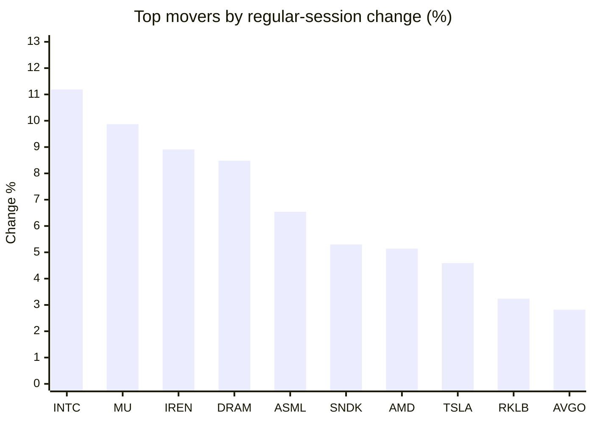
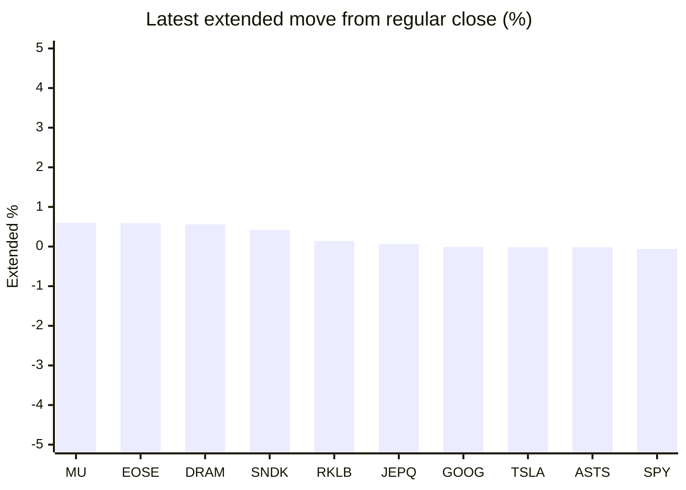

# Stock Brief - 2026-06-09

Generated at 2026-06-09 13:13 +07 from `watchlist.md`.
Prices are snapshots from Yahoo Finance public chart data. Extended/overnight is the latest available pre/post-market datapoint from the same feed.

## Market Snapshot

- SPY: close 739.22, latest extended 738.74, regular move +0.23%, extended move -0.06%
- QQQ: close 716.07, latest extended 715.40, regular move +1.56%, extended move -0.09%
- JEPQ: close 59.63, latest extended 59.66, regular move +1.24%, extended move +0.06%

## Watchlist Prices

| Ticker | Name | Regular close | Latest extended/overnight | Regular move | Extended move | Latest data time | Source |
|---|---|---:|---:|---:|---:|---|---|
| INTC | Intel Corporation | 110.27 USD | 109.82 USD | +11.19% | -0.41% | 2026-06-08 19:59 EDT | [Yahoo](https://finance.yahoo.com/quote/INTC/) |
| AVGO | Broadcom Inc. | 396.60 USD | 396.20 USD | +2.82% | -0.10% | 2026-06-08 19:59 EDT | [Yahoo](https://finance.yahoo.com/quote/AVGO/) |
| RKLB | Rocket Lab Corporation | 113.65 USD | 113.81 USD | +3.24% | +0.14% | 2026-06-08 19:59 EDT | [Yahoo](https://finance.yahoo.com/quote/RKLB/) |
| AAPL | Apple Inc. | 301.54 USD | 300.70 USD | -1.89% | -0.28% | 2026-06-08 19:59 EDT | [Yahoo](https://finance.yahoo.com/quote/AAPL/) |
| NVDA | NVIDIA Corporation | 208.64 USD | 207.65 USD | +1.73% | -0.47% | 2026-06-08 19:59 EDT | [Yahoo](https://finance.yahoo.com/quote/NVDA/) |
| TSLA | Tesla, Inc. | 408.95 USD | 408.87 USD | +4.59% | -0.02% | 2026-06-08 19:59 EDT | [Yahoo](https://finance.yahoo.com/quote/TSLA/) |
| SNDK | Sandisk Corporation | 1,642.00 USD | 1,648.97 USD | +5.30% | +0.42% | 2026-06-08 19:59 EDT | [Yahoo](https://finance.yahoo.com/quote/SNDK/) |
| QQQ | Invesco QQQ Trust, Series 1 | 716.07 USD | 715.40 USD | +1.56% | -0.09% | 2026-06-08 19:59 EDT | [Yahoo](https://finance.yahoo.com/quote/QQQ/) |
| SPY | State Street SPDR S&P 500 ETF T | 739.22 USD | 738.74 USD | +0.23% | -0.06% | 2026-06-08 19:59 EDT | [Yahoo](https://finance.yahoo.com/quote/SPY/) |
| JEPQ | JPMorgan Nasdaq Equity Premium  | 59.63 USD | 59.66 USD | +1.24% | +0.06% | 2026-06-08 19:59 EDT | [Yahoo](https://finance.yahoo.com/quote/JEPQ/) |
| ASTS | AST SpaceMobile, Inc. | 92.06 USD | 92.04 USD | -1.65% | -0.02% | 2026-06-08 19:59 EDT | [Yahoo](https://finance.yahoo.com/quote/ASTS/) |
| MU | Micron Technology, Inc. | 949.28 USD | 955.00 USD | +9.87% | +0.60% | 2026-06-08 19:59 EDT | [Yahoo](https://finance.yahoo.com/quote/MU/) |
| IREN | IREN LIMITED | 59.19 USD | 58.73 USD | +8.91% | -0.78% | 2026-06-08 19:59 EDT | [Yahoo](https://finance.yahoo.com/quote/IREN/) |
| EOSE | Eos Energy Enterprises, Inc. | 6.69 USD | 6.73 USD | -5.51% | +0.59% | 2026-06-08 19:59 EDT | [Yahoo](https://finance.yahoo.com/quote/EOSE/) |
| GOOG | Alphabet Inc. | 361.17 USD | 361.14 USD | -1.25% | -0.01% | 2026-06-08 19:59 EDT | [Yahoo](https://finance.yahoo.com/quote/GOOG/) |
| DRAM | Roundhill Memory ETF | 60.52 USD | 60.86 USD | +8.48% | +0.56% | 2026-06-08 19:59 EDT | [Yahoo](https://finance.yahoo.com/quote/DRAM/) |
| AMD | Advanced Micro Devices, Inc. | 490.33 USD | 489.56 USD | +5.14% | -0.16% | 2026-06-08 19:59 EDT | [Yahoo](https://finance.yahoo.com/quote/AMD/) |
| ASML | ASML Holding N.V. - New York Re | 1,749.04 USD | 1,745.51 USD | +6.54% | -0.20% | 2026-06-08 19:59 EDT | [Yahoo](https://finance.yahoo.com/quote/ASML/) |

## Charts

### Top Movers - Regular Session

### Extended / Overnight Move

### Quick Heatmap

| Group | Names in watchlist | Avg regular move | Avg extended move |
|---|---|---:|---:|
| Mega-cap tech | AVGO, AAPL, NVDA, TSLA, GOOG | +1.20% | -0.18% |
| Semis / memory | INTC, SNDK, MU, DRAM, AMD, ASML | +7.75% | +0.14% |
| Space / high beta | RKLB, ASTS, IREN, EOSE | +1.25% | -0.02% |
| ETFs | QQQ, SPY, JEPQ | +1.01% | -0.03% |

## News Headlines

- [IBIT vs. FBTC: Which Bitcoin ETF Is Better?](https://www.fool.com/investing/2026/06/09/ibit-vs-fbtc-which-bitcoin-etf-is-better/?.tsrc=rss) (2026-06-09 12:35 Bangkok)
- [SK hynix NVIDIA Alliance Puts AI Memory And Fabs In Focus](https://finance.yahoo.com/markets/stocks/articles/sk-hynix-nvidia-alliance-puts-051130538.html?.tsrc=rss) (2026-06-09 12:11 Bangkok)
- [This Sector Has Dominated ETF Returns So Far in 2026](https://www.fool.com/investing/2026/06/09/this-sector-has-dominated-etf-returns-so-far-in-20/?.tsrc=rss) (2026-06-09 12:05 Bangkok)
- [Nedap expands partnership with Albert Heijn with mobile access](https://finance.yahoo.com/sectors/technology/articles/nedap-expands-partnership-albert-heijn-050000977.html?.tsrc=rss) (2026-06-09 12:00 Bangkok)
- [History Says SpaceX Stock Will Do This in Its First Year of Trading](https://www.fool.com/investing/2026/06/09/history-says-spacex-stock-will-do-this-in-its-firs/?.tsrc=rss) (2026-06-09 11:50 Bangkok)
- [Intel stock makes eye-popping move on Google, Nvidia news](https://www.thestreet.com/investing/stocks/intel-stock-makes-eye-popping-move-on-google-nvidia-news?.tsrc=rss) (2026-06-09 11:37 Bangkok)
- [Defiance Launches MUZ: The First 2X Short ETF for Micron Technology, Inc.](https://finance.yahoo.com/markets/options/articles/defiance-launches-muz-first-2x-043700096.html?.tsrc=rss) (2026-06-09 11:37 Bangkok)
- [Nokia’s AI Pivot Draws €1b NVIDIA Backing And Shifts Investor Focus](https://finance.yahoo.com/markets/stocks/articles/nokia-ai-pivot-draws-1b-043352219.html?.tsrc=rss) (2026-06-09 11:33 Bangkok)

## Caveats

- This is not investment advice. Extended-hours prices can be thin and volatile.
- Yahoo public endpoints may lag official exchange data.
