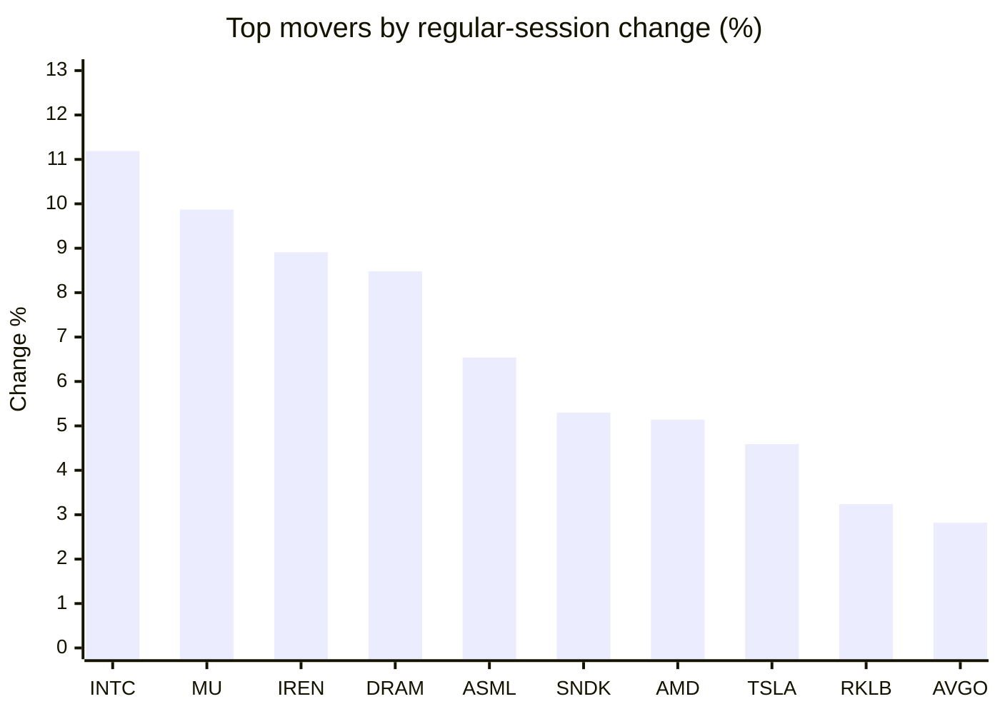
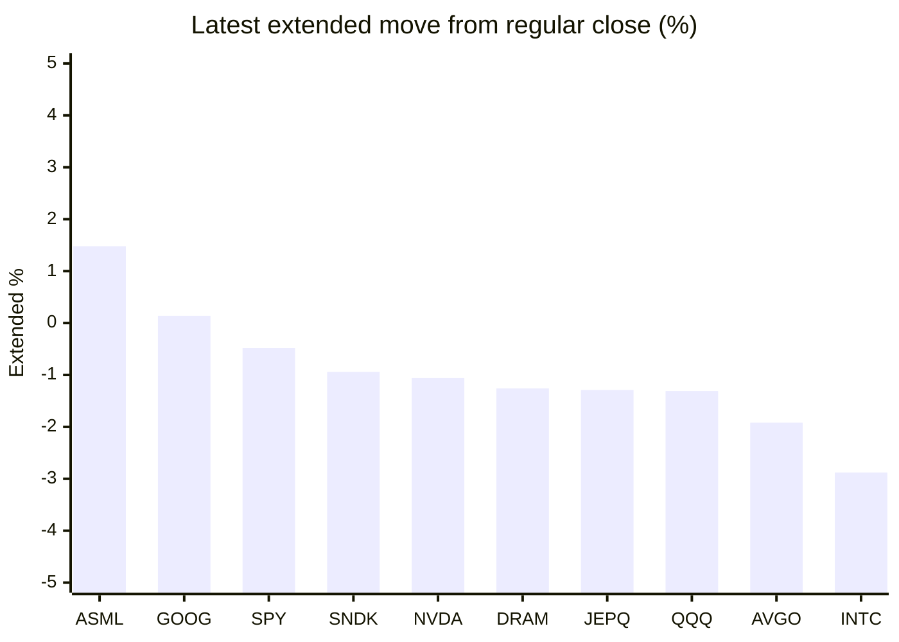

# Stock Brief - 2026-06-10

Generated at 2026-06-10 13:27 +07 from `watchlist.md`.
Prices are snapshots from Yahoo Finance public chart data. Extended/overnight is the latest available pre/post-market datapoint from the same feed.

## Market Snapshot

- SPY: close 739.22, latest extended 735.70, regular move +0.23%, extended move -0.48%
- QQQ: close 716.07, latest extended 706.67, regular move +1.56%, extended move -1.31%
- JEPQ: close 59.63, latest extended 58.86, regular move +1.24%, extended move -1.29%

## Watchlist Prices

| Ticker | Name | Regular close | Latest extended/overnight | Regular move | Extended move | Latest data time | Source |
|---|---|---:|---:|---:|---:|---|---|
| INTC | Intel Corporation | 110.27 USD | 107.09 USD | +11.19% | -2.88% | 2026-06-09 19:59 EDT | [Yahoo](https://finance.yahoo.com/quote/INTC/) |
| AVGO | Broadcom Inc. | 396.60 USD | 388.99 USD | +2.82% | -1.92% | 2026-06-09 19:59 EDT | [Yahoo](https://finance.yahoo.com/quote/AVGO/) |
| RKLB | Rocket Lab Corporation | 113.65 USD | 107.08 USD | +3.24% | -5.78% | 2026-06-09 19:59 EDT | [Yahoo](https://finance.yahoo.com/quote/RKLB/) |
| AAPL | Apple Inc. | 301.54 USD | 291.10 USD | -1.89% | -3.46% | 2026-06-09 19:59 EDT | [Yahoo](https://finance.yahoo.com/quote/AAPL/) |
| NVDA | NVIDIA Corporation | 208.64 USD | 206.43 USD | +1.73% | -1.06% | 2026-06-09 19:59 EDT | [Yahoo](https://finance.yahoo.com/quote/NVDA/) |
| TSLA | Tesla, Inc. | 408.95 USD | 395.89 USD | +4.59% | -3.19% | 2026-06-09 19:59 EDT | [Yahoo](https://finance.yahoo.com/quote/TSLA/) |
| SNDK | Sandisk Corporation | 1,642.00 USD | 1,626.54 USD | +5.30% | -0.94% | 2026-06-09 19:59 EDT | [Yahoo](https://finance.yahoo.com/quote/SNDK/) |
| QQQ | Invesco QQQ Trust, Series 1 | 716.07 USD | 706.67 USD | +1.56% | -1.31% | 2026-06-09 19:59 EDT | [Yahoo](https://finance.yahoo.com/quote/QQQ/) |
| SPY | State Street SPDR S&P 500 ETF T | 739.22 USD | 735.70 USD | +0.23% | -0.48% | 2026-06-09 19:59 EDT | [Yahoo](https://finance.yahoo.com/quote/SPY/) |
| JEPQ | JPMorgan Nasdaq Equity Premium  | 59.63 USD | 58.86 USD | +1.24% | -1.29% | 2026-06-09 19:59 EDT | [Yahoo](https://finance.yahoo.com/quote/JEPQ/) |
| ASTS | AST SpaceMobile, Inc. | 92.06 USD | 89.20 USD | -1.65% | -3.11% | 2026-06-09 19:59 EDT | [Yahoo](https://finance.yahoo.com/quote/ASTS/) |
| MU | Micron Technology, Inc. | 949.28 USD | 919.61 USD | +9.87% | -3.13% | 2026-06-09 19:59 EDT | [Yahoo](https://finance.yahoo.com/quote/MU/) |
| IREN | IREN LIMITED | 59.19 USD | 53.64 USD | +8.91% | -9.38% | 2026-06-09 19:59 EDT | [Yahoo](https://finance.yahoo.com/quote/IREN/) |
| EOSE | Eos Energy Enterprises, Inc. | 6.69 USD | 6.24 USD | -5.51% | -6.74% | 2026-06-09 19:58 EDT | [Yahoo](https://finance.yahoo.com/quote/EOSE/) |
| GOOG | Alphabet Inc. | 361.17 USD | 361.66 USD | -1.25% | +0.14% | 2026-06-09 19:59 EDT | [Yahoo](https://finance.yahoo.com/quote/GOOG/) |
| DRAM | Roundhill Memory ETF | 60.52 USD | 59.76 USD | +8.48% | -1.26% | 2026-06-09 19:59 EDT | [Yahoo](https://finance.yahoo.com/quote/DRAM/) |
| AMD | Advanced Micro Devices, Inc. | 490.33 USD | 472.00 USD | +5.14% | -3.74% | 2026-06-09 19:59 EDT | [Yahoo](https://finance.yahoo.com/quote/AMD/) |
| ASML | ASML Holding N.V. - New York Re | 1,749.04 USD | 1,775.00 USD | +6.54% | +1.48% | 2026-06-09 19:59 EDT | [Yahoo](https://finance.yahoo.com/quote/ASML/) |

## Charts

### Top Movers - Regular Session

### Extended / Overnight Move

### Quick Heatmap

| Group | Names in watchlist | Avg regular move | Avg extended move |
|---|---|---:|---:|
| Mega-cap tech | AVGO, AAPL, NVDA, TSLA, GOOG | +1.20% | -1.90% |
| Semis / memory | INTC, SNDK, MU, DRAM, AMD, ASML | +7.75% | -1.74% |
| Space / high beta | RKLB, ASTS, IREN, EOSE | +1.25% | -6.25% |
| ETFs | QQQ, SPY, JEPQ | +1.01% | -1.03% |

## News Headlines

- [SpaceX Believes Its IPO Is "Highly Dependent" on This 1 Catalyst](https://www.fool.com/investing/2026/06/10/spacex-believes-its-ipo-is-highly-dependent-on-thi/?.tsrc=rss) (2026-06-10 13:25 Bangkok)
- [Is Upstart's AI Lending Comeback the Real Deal?](https://www.fool.com/investing/2026/06/10/is-upstarts-ai-lending-comeback-the-real-deal/?.tsrc=rss) (2026-06-10 13:05 Bangkok)
- [Europe’s Payments Leaders Gather in London as Control, Fraud and AI Reshape the Industry](https://finance.yahoo.com/markets/crypto/articles/europe-payments-leaders-gather-london-060000220.html?.tsrc=rss) (2026-06-10 13:00 Bangkok)
- [SpaceX IPO Sparks More ETF Frenzy: BlackRock, ProShares Join The Rush With Space-Themed, Leveraged Funds](https://stocktwits.com/news-articles/markets/equity/spacex-ipo-etf-frenzy-blackrock-proshares-join-rush/cZ06ehER7TT?.tsrc=rss) (2026-06-10 12:12 Bangkok)
- [Taiwan Eyes Curbs on AI Chip Sales to China to Align With US](https://finance.yahoo.com/sectors/technology/articles/taiwan-eyes-curbs-ai-chip-125854688.html?.tsrc=rss) (2026-06-10 12:05 Bangkok)
- [South Korea’s Top Stock Index Crashes, Then Surges on AI Chip Rally](https://beincrypto.com/south-korea-stock-kospi-crash-and-recovery-ai-chip-drama/?.tsrc=rss) (2026-06-10 12:04 Bangkok)
- [Zoho Corporation Unveils Nathu La, a Designed-in-House Server, in a Move Towards Technological Sovereignty and Inference Cost Reduction](https://finance.yahoo.com/sectors/technology/articles/zoho-corporation-unveils-nathu-la-043000738.html?.tsrc=rss) (2026-06-10 11:30 Bangkok)
- [SpaceX’s IPO Could Buy Boeing and the S&P 500’s 11 Other Aerospace Companies](https://finance.yahoo.com/m/f0bc2949-f530-3919-ae79-4e203880efe7/spacex%E2%80%99s-ipo-could-buy-boeing.html?.tsrc=rss) (2026-06-10 11:30 Bangkok)

## Caveats

- This is not investment advice. Extended-hours prices can be thin and volatile.
- Yahoo public endpoints may lag official exchange data.
