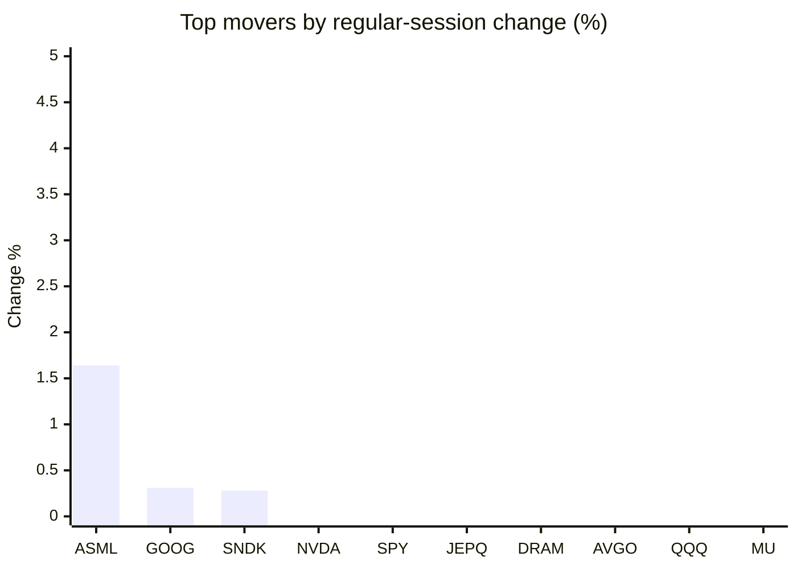
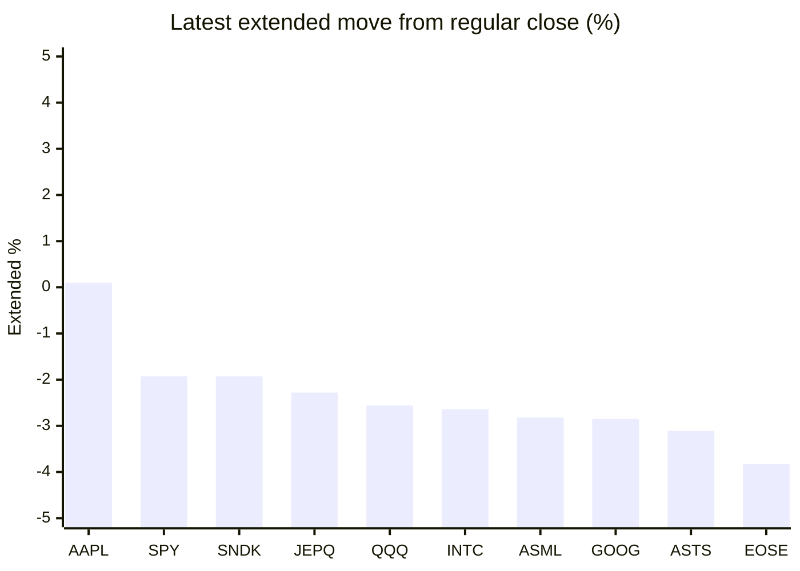

# Stock Brief - 2026-06-11

Generated at 2026-06-11 13:53 +07 from `watchlist.md`.
Prices are snapshots from Yahoo Finance public chart data. Extended/overnight is the latest available pre/post-market datapoint from the same feed.

## Market Snapshot

- SPY: close 737.05, latest extended 722.86, regular move -0.29%, extended move -1.93%
- QQQ: close 707.83, latest extended 689.73, regular move -1.15%, extended move -2.56%
- JEPQ: close 59.08, latest extended 57.73, regular move -0.92%, extended move -2.28%

## Watchlist Prices

| Ticker | Name | Regular close | Latest extended/overnight | Regular move | Extended move | Latest data time | Source |
|---|---|---:|---:|---:|---:|---|---|
| INTC | Intel Corporation | 107.92 USD | 105.07 USD | -2.13% | -2.64% | 2026-06-10 19:59 EDT | [Yahoo](https://finance.yahoo.com/quote/INTC/) |
| AVGO | Broadcom Inc. | 392.16 USD | 367.68 USD | -1.12% | -6.24% | 2026-06-10 19:59 EDT | [Yahoo](https://finance.yahoo.com/quote/AVGO/) |
| RKLB | Rocket Lab Corporation | 108.23 USD | 103.30 USD | -4.77% | -4.56% | 2026-06-10 19:59 EDT | [Yahoo](https://finance.yahoo.com/quote/RKLB/) |
| AAPL | Apple Inc. | 290.55 USD | 290.83 USD | -3.64% | +0.10% | 2026-06-10 19:59 EDT | [Yahoo](https://finance.yahoo.com/quote/AAPL/) |
| NVDA | NVIDIA Corporation | 208.19 USD | 199.20 USD | -0.22% | -4.32% | 2026-06-10 19:59 EDT | [Yahoo](https://finance.yahoo.com/quote/NVDA/) |
| TSLA | Tesla, Inc. | 396.68 USD | 378.80 USD | -3.00% | -4.51% | 2026-06-10 19:59 EDT | [Yahoo](https://finance.yahoo.com/quote/TSLA/) |
| SNDK | Sandisk Corporation | 1,646.54 USD | 1,614.77 USD | +0.28% | -1.93% | 2026-06-10 19:59 EDT | [Yahoo](https://finance.yahoo.com/quote/SNDK/) |
| QQQ | Invesco QQQ Trust, Series 1 | 707.83 USD | 689.73 USD | -1.15% | -2.56% | 2026-06-10 19:59 EDT | [Yahoo](https://finance.yahoo.com/quote/QQQ/) |
| SPY | State Street SPDR S&P 500 ETF T | 737.05 USD | 722.86 USD | -0.29% | -1.93% | 2026-06-10 19:59 EDT | [Yahoo](https://finance.yahoo.com/quote/SPY/) |
| JEPQ | JPMorgan Nasdaq Equity Premium  | 59.08 USD | 57.73 USD | -0.92% | -2.28% | 2026-06-10 19:59 EDT | [Yahoo](https://finance.yahoo.com/quote/JEPQ/) |
| ASTS | AST SpaceMobile, Inc. | 88.71 USD | 85.95 USD | -3.64% | -3.11% | 2026-06-10 19:59 EDT | [Yahoo](https://finance.yahoo.com/quote/ASTS/) |
| MU | Micron Technology, Inc. | 935.89 USD | 877.00 USD | -1.41% | -6.29% | 2026-06-10 19:59 EDT | [Yahoo](https://finance.yahoo.com/quote/MU/) |
| IREN | IREN LIMITED | 54.02 USD | 50.69 USD | -8.73% | -6.17% | 2026-06-10 19:59 EDT | [Yahoo](https://finance.yahoo.com/quote/IREN/) |
| EOSE | Eos Energy Enterprises, Inc. | 6.26 USD | 6.02 USD | -6.43% | -3.83% | 2026-06-10 19:59 EDT | [Yahoo](https://finance.yahoo.com/quote/EOSE/) |
| GOOG | Alphabet Inc. | 362.29 USD | 351.97 USD | +0.31% | -2.85% | 2026-06-10 19:59 EDT | [Yahoo](https://finance.yahoo.com/quote/GOOG/) |
| DRAM | Roundhill Memory ETF | 59.86 USD | 56.40 USD | -1.09% | -5.78% | 2026-06-10 19:59 EDT | [Yahoo](https://finance.yahoo.com/quote/DRAM/) |
| AMD | Advanced Micro Devices, Inc. | 475.51 USD | 440.59 USD | -3.02% | -7.34% | 2026-06-10 19:59 EDT | [Yahoo](https://finance.yahoo.com/quote/AMD/) |
| ASML | ASML Holding N.V. - New York Re | 1,777.77 USD | 1,727.69 USD | +1.64% | -2.82% | 2026-06-10 19:59 EDT | [Yahoo](https://finance.yahoo.com/quote/ASML/) |

## Charts

### Top Movers - Regular Session

### Extended / Overnight Move

### Quick Heatmap

| Group | Names in watchlist | Avg regular move | Avg extended move |
|---|---|---:|---:|
| Mega-cap tech | AVGO, AAPL, NVDA, TSLA, GOOG | -1.53% | -3.56% |
| Semis / memory | INTC, SNDK, MU, DRAM, AMD, ASML | -0.96% | -4.47% |
| Space / high beta | RKLB, ASTS, IREN, EOSE | -5.89% | -4.42% |
| ETFs | QQQ, SPY, JEPQ | -0.79% | -2.25% |

## News Headlines

- [Is Broadcom Stock Now a Better Buy Than Nvidia?](https://www.fool.com/investing/2026/06/11/is-broadcom-now-a-better-buy-than-nvidia/?.tsrc=rss) (2026-06-11 13:25 Bangkok)
- [Elon Musk Wants to Create a "Space-Faring Civilization." Here's What That Means for the SpaceX IPO.](https://www.fool.com/investing/2026/06/11/elon-musk-wants-to-create-a-space-faring-civilizat/?.tsrc=rss) (2026-06-11 13:20 Bangkok)
- [ASTS, LUNR, PL Rise Overnight: Musk-Backed Starship Thesis Signals A New Era Of Cheap Space Access](https://stocktwits.com/news-articles/markets/equity/asts-lunr-pl-musk-backed-starship-thesis-cheap-space-access/cZKThU3R7cs?.tsrc=rss) (2026-06-11 12:26 Bangkok)
- [Is Redwire a Millionaire-Maker Stock?](https://www.fool.com/investing/2026/06/11/is-redwire-a-millionaire-maker-stock/?.tsrc=rss) (2026-06-11 12:25 Bangkok)
- [IREN’s 5.8 GW Buildout And Nvidia Deal Reframe AI Growth Story](https://finance.yahoo.com/markets/stocks/articles/iren-5-8-gw-buildout-051330012.html?.tsrc=rss) (2026-06-11 12:13 Bangkok)
- [Is MaxLinear the Next AI Stock to 10X?](https://www.fool.com/investing/2026/06/11/is-maxlinear-the-next-ai-stock-to-10x/?.tsrc=rss) (2026-06-11 11:50 Bangkok)
- [Rocket Lab (RKLB) Is Down 8.4% After Sector Rotation Ahead of SpaceX IPO and Geopolitical Jitters](https://finance.yahoo.com/markets/stocks/articles/rocket-lab-rklb-down-8-043419103.html?.tsrc=rss) (2026-06-11 11:34 Bangkok)
- [ARKQ vs. QQQ: Which Tech Stock ETF is the Better Buy?](https://www.fool.com/investing/2026/06/11/arkq-vs-qqq-which-tech-stock-etf-is-the-better-buy/?.tsrc=rss) (2026-06-11 11:20 Bangkok)

## Caveats

- This is not investment advice. Extended-hours prices can be thin and volatile.
- Yahoo public endpoints may lag official exchange data.
