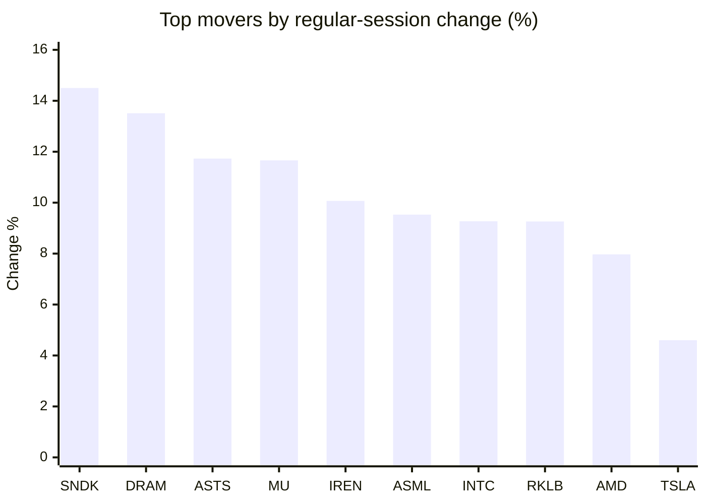
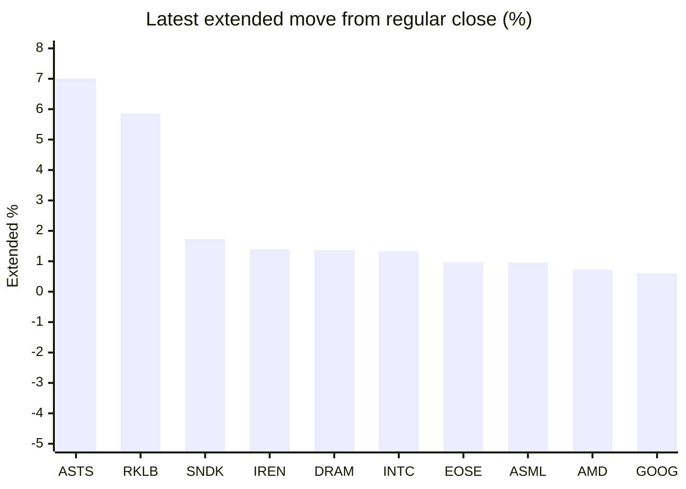

# Stock Brief - 2026-06-12

Generated at 2026-06-12 13:46 +07 from `watchlist.md`.
Prices are snapshots from Yahoo Finance public chart data. Extended/overnight is the latest available pre/post-market datapoint from the same feed.

## Market Snapshot

- SPY: close 737.76, latest extended 739.48, regular move +1.70%, extended move +0.23%
- QQQ: close 717.12, latest extended 719.38, regular move +3.38%, extended move +0.32%
- JEPQ: close 59.49, latest extended 59.59, regular move +2.59%, extended move +0.16%

## Watchlist Prices

| Ticker | Name | Regular close | Latest extended/overnight | Regular move | Extended move | Latest data time | Source |
|---|---|---:|---:|---:|---:|---|---|
| INTC | Intel Corporation | 116.96 USD | 118.51 USD | +9.27% | +1.33% | 2026-06-11 19:59 EDT | [Yahoo](https://finance.yahoo.com/quote/INTC/) |
| AVGO | Broadcom Inc. | 385.57 USD | 385.33 USD | +3.62% | -0.06% | 2026-06-11 19:59 EDT | [Yahoo](https://finance.yahoo.com/quote/AVGO/) |
| RKLB | Rocket Lab Corporation | 114.78 USD | 121.50 USD | +9.26% | +5.85% | 2026-06-11 19:59 EDT | [Yahoo](https://finance.yahoo.com/quote/RKLB/) |
| AAPL | Apple Inc. | 295.63 USD | 295.80 USD | +1.39% | +0.06% | 2026-06-11 19:59 EDT | [Yahoo](https://finance.yahoo.com/quote/AAPL/) |
| NVDA | NVIDIA Corporation | 204.87 USD | 205.98 USD | +2.22% | +0.54% | 2026-06-11 19:59 EDT | [Yahoo](https://finance.yahoo.com/quote/NVDA/) |
| TSLA | Tesla, Inc. | 399.15 USD | 399.00 USD | +4.60% | -0.04% | 2026-06-11 19:59 EDT | [Yahoo](https://finance.yahoo.com/quote/TSLA/) |
| SNDK | Sandisk Corporation | 1,881.51 USD | 1,914.00 USD | +14.50% | +1.73% | 2026-06-11 19:59 EDT | [Yahoo](https://finance.yahoo.com/quote/SNDK/) |
| QQQ | Invesco QQQ Trust, Series 1 | 717.12 USD | 719.38 USD | +3.38% | +0.32% | 2026-06-11 19:59 EDT | [Yahoo](https://finance.yahoo.com/quote/QQQ/) |
| SPY | State Street SPDR S&P 500 ETF T | 737.76 USD | 739.48 USD | +1.70% | +0.23% | 2026-06-11 19:59 EDT | [Yahoo](https://finance.yahoo.com/quote/SPY/) |
| JEPQ | JPMorgan Nasdaq Equity Premium  | 59.49 USD | 59.59 USD | +2.59% | +0.16% | 2026-06-11 19:58 EDT | [Yahoo](https://finance.yahoo.com/quote/JEPQ/) |
| ASTS | AST SpaceMobile, Inc. | 97.56 USD | 104.40 USD | +11.73% | +7.01% | 2026-06-11 19:59 EDT | [Yahoo](https://finance.yahoo.com/quote/ASTS/) |
| MU | Micron Technology, Inc. | 995.87 USD | 998.70 USD | +11.66% | +0.28% | 2026-06-11 19:59 EDT | [Yahoo](https://finance.yahoo.com/quote/MU/) |
| IREN | IREN LIMITED | 56.71 USD | 57.50 USD | +10.07% | +1.39% | 2026-06-11 19:59 EDT | [Yahoo](https://finance.yahoo.com/quote/IREN/) |
| EOSE | Eos Energy Enterprises, Inc. | 6.20 USD | 6.26 USD | +2.14% | +0.97% | 2026-06-11 19:59 EDT | [Yahoo](https://finance.yahoo.com/quote/EOSE/) |
| GOOG | Alphabet Inc. | 356.56 USD | 358.70 USD | +0.92% | +0.60% | 2026-06-11 19:59 EDT | [Yahoo](https://finance.yahoo.com/quote/GOOG/) |
| DRAM | Roundhill Memory ETF | 65.12 USD | 66.01 USD | +13.51% | +1.37% | 2026-06-11 19:59 EDT | [Yahoo](https://finance.yahoo.com/quote/DRAM/) |
| AMD | Advanced Micro Devices, Inc. | 488.45 USD | 491.95 USD | +7.97% | +0.72% | 2026-06-11 19:59 EDT | [Yahoo](https://finance.yahoo.com/quote/AMD/) |
| ASML | ASML Holding N.V. - New York Re | 1,899.48 USD | 1,917.56 USD | +9.53% | +0.95% | 2026-06-11 19:59 EDT | [Yahoo](https://finance.yahoo.com/quote/ASML/) |

## Charts

### Top Movers - Regular Session

### Extended / Overnight Move

### Quick Heatmap

| Group | Names in watchlist | Avg regular move | Avg extended move |
|---|---|---:|---:|
| Mega-cap tech | AVGO, AAPL, NVDA, TSLA, GOOG | +2.55% | +0.22% |
| Semis / memory | INTC, SNDK, MU, DRAM, AMD, ASML | +11.07% | +1.06% |
| Space / high beta | RKLB, ASTS, IREN, EOSE | +8.30% | +3.81% |
| ETFs | QQQ, SPY, JEPQ | +2.55% | +0.24% |

## News Headlines

- [Exclusive-Nvidia begins Vera CPU sales pitch to Chinese clients, sources say](https://finance.yahoo.com/sectors/technology/articles/exclusive-nvidia-begins-vera-cpu-061904079.html?.tsrc=rss) (2026-06-12 13:19 Bangkok)
- [I'm Sitting Out the SpaceX IPO. Here's What I'm Buying Instead.](https://www.fool.com/investing/2026/06/12/im-sitting-out-the-spacex-ipo-heres-what-im-buying/?.tsrc=rss) (2026-06-12 12:50 Bangkok)
- [Nokia Extends AI Networking And Quantum Security Push With 5G Partnership](https://finance.yahoo.com/sectors/technology/articles/nokia-extends-ai-networking-quantum-051229979.html?.tsrc=rss) (2026-06-12 12:12 Bangkok)
- [Hitachi Deepens Google And Intel Ties To Power Industrial AI Growth](https://finance.yahoo.com/markets/stocks/articles/hitachi-deepens-google-intel-ties-051133756.html?.tsrc=rss) (2026-06-12 12:11 Bangkok)
- [Rocket Lab Joins Nasdaq 100 As Index Upgrade Tests Growth Story](https://finance.yahoo.com/markets/stocks/articles/rocket-lab-joins-nasdaq-100-051113827.html?.tsrc=rss) (2026-06-12 12:11 Bangkok)
- [RKLB Stock Rallies After Earning Nasdaq 100 Spot – SpaceX Could Be Next Under New Rules](https://stocktwits.com/news-articles/markets/equity/rklb-stock-rallies-nasdaq-100-index-space-x-could-be-next-new-rules/cZK5NnnR7Pa?.tsrc=rss) (2026-06-12 12:10 Bangkok)
- [The SpaceX IPO Hinges on This $26.5 Trillion Growth Opportunity](https://www.fool.com/investing/2026/06/12/the-spacex-ipo-hinges-on-this-265-trillion-growth/?.tsrc=rss) (2026-06-12 11:50 Bangkok)
- [Robinhood Just Won Approval to Underwrite IPOs, Right Before SpaceX's Blockbuster Market Debut. Here's Why the Timing Matters.](https://www.fool.com/investing/2026/06/11/robinhood-just-won-approval-to-underwrite-ipos-rig/?.tsrc=rss) (2026-06-12 11:12 Bangkok)

## Caveats

- This is not investment advice. Extended-hours prices can be thin and volatile.
- Yahoo public endpoints may lag official exchange data.
