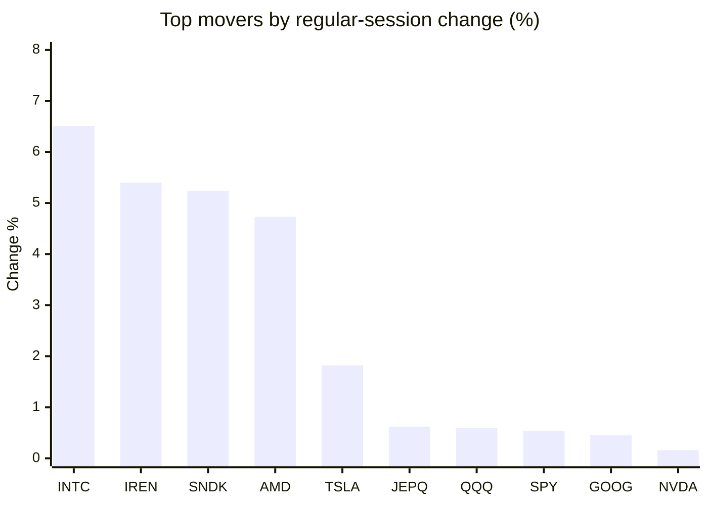
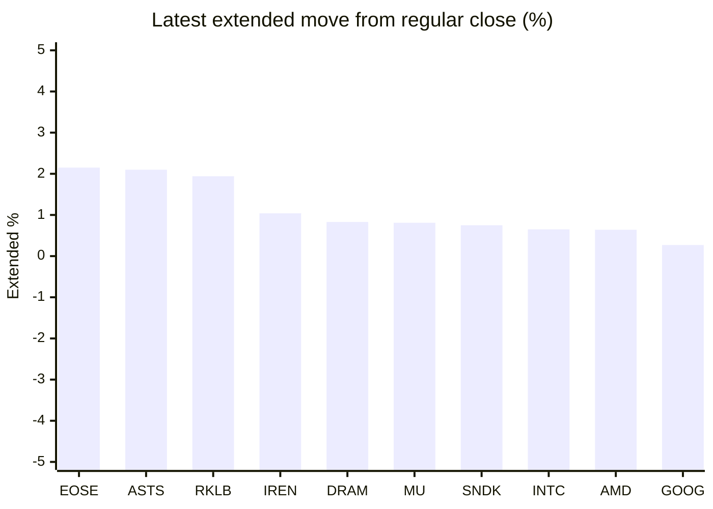

# Stock Brief - 2026-06-14

Generated at 2026-06-14 13:45 +07 from `watchlist.md`.
Prices are snapshots from Yahoo Finance public chart data. Extended/overnight is the latest available pre/post-market datapoint from the same feed.

## Market Snapshot

- SPY: close 741.75, latest extended 742.36, regular move +0.54%, extended move +0.08%
- QQQ: close 721.34, latest extended 722.98, regular move +0.59%, extended move +0.23%
- JEPQ: close 59.86, latest extended 59.92, regular move +0.62%, extended move +0.10%

## Watchlist Prices

| Ticker | Name | Regular close | Latest extended/overnight | Regular move | Extended move | Latest data time | Source |
|---|---|---:|---:|---:|---:|---|---|
| INTC | Intel Corporation | 124.57 USD | 125.38 USD | +6.51% | +0.65% | 2026-06-12 19:59 EDT | [Yahoo](https://finance.yahoo.com/quote/INTC/) |
| AVGO | Broadcom Inc. | 382.07 USD | 382.55 USD | -0.91% | +0.13% | 2026-06-12 19:59 EDT | [Yahoo](https://finance.yahoo.com/quote/AVGO/) |
| RKLB | Rocket Lab Corporation | 102.39 USD | 104.38 USD | -10.79% | +1.94% | 2026-06-12 19:59 EDT | [Yahoo](https://finance.yahoo.com/quote/RKLB/) |
| AAPL | Apple Inc. | 291.13 USD | 291.58 USD | -1.52% | +0.15% | 2026-06-12 19:59 EDT | [Yahoo](https://finance.yahoo.com/quote/AAPL/) |
| NVDA | NVIDIA Corporation | 205.19 USD | 205.42 USD | +0.16% | +0.11% | 2026-06-12 19:59 EDT | [Yahoo](https://finance.yahoo.com/quote/NVDA/) |
| TSLA | Tesla, Inc. | 406.43 USD | 406.10 USD | +1.82% | -0.08% | 2026-06-12 19:59 EDT | [Yahoo](https://finance.yahoo.com/quote/TSLA/) |
| SNDK | Sandisk Corporation | 1,980.10 USD | 1,994.95 USD | +5.24% | +0.75% | 2026-06-12 19:59 EDT | [Yahoo](https://finance.yahoo.com/quote/SNDK/) |
| QQQ | Invesco QQQ Trust, Series 1 | 721.34 USD | 722.98 USD | +0.59% | +0.23% | 2026-06-12 19:59 EDT | [Yahoo](https://finance.yahoo.com/quote/QQQ/) |
| SPY | State Street SPDR S&P 500 ETF T | 741.75 USD | 742.36 USD | +0.54% | +0.08% | 2026-06-12 19:59 EDT | [Yahoo](https://finance.yahoo.com/quote/SPY/) |
| JEPQ | JPMorgan Nasdaq Equity Premium  | 59.86 USD | 59.92 USD | +0.62% | +0.10% | 2026-06-12 19:59 EDT | [Yahoo](https://finance.yahoo.com/quote/JEPQ/) |
| ASTS | AST SpaceMobile, Inc. | 82.41 USD | 84.14 USD | -15.53% | +2.10% | 2026-06-12 19:59 EDT | [Yahoo](https://finance.yahoo.com/quote/ASTS/) |
| MU | Micron Technology, Inc. | 981.61 USD | 989.60 USD | -1.43% | +0.81% | 2026-06-12 19:59 EDT | [Yahoo](https://finance.yahoo.com/quote/MU/) |
| IREN | IREN LIMITED | 59.77 USD | 60.39 USD | +5.40% | +1.04% | 2026-06-12 19:59 EDT | [Yahoo](https://finance.yahoo.com/quote/IREN/) |
| EOSE | Eos Energy Enterprises, Inc. | 6.06 USD | 6.19 USD | -2.26% | +2.15% | 2026-06-12 19:59 EDT | [Yahoo](https://finance.yahoo.com/quote/EOSE/) |
| GOOG | Alphabet Inc. | 358.16 USD | 359.12 USD | +0.45% | +0.27% | 2026-06-12 19:59 EDT | [Yahoo](https://finance.yahoo.com/quote/GOOG/) |
| DRAM | Roundhill Memory ETF | 65.01 USD | 65.55 USD | -0.17% | +0.83% | 2026-06-12 19:59 EDT | [Yahoo](https://finance.yahoo.com/quote/DRAM/) |
| AMD | Advanced Micro Devices, Inc. | 511.57 USD | 514.87 USD | +4.73% | +0.64% | 2026-06-12 19:59 EDT | [Yahoo](https://finance.yahoo.com/quote/AMD/) |
| ASML | ASML Holding N.V. - New York Re | 1,863.55 USD | 1,863.09 USD | -1.89% | -0.02% | 2026-06-12 19:59 EDT | [Yahoo](https://finance.yahoo.com/quote/ASML/) |

## Charts

### Top Movers - Regular Session

### Extended / Overnight Move

### Quick Heatmap

| Group | Names in watchlist | Avg regular move | Avg extended move |
|---|---|---:|---:|
| Mega-cap tech | AVGO, AAPL, NVDA, TSLA, GOOG | -0.00% | +0.12% |
| Semis / memory | INTC, SNDK, MU, DRAM, AMD, ASML | +2.16% | +0.61% |
| Space / high beta | RKLB, ASTS, IREN, EOSE | -5.80% | +1.81% |
| ETFs | QQQ, SPY, JEPQ | +0.58% | +0.14% |

## News Headlines

- [SpaceX, Anthropic, or OpenAI: Which IPO Is the Better Buy?](https://www.fool.com/investing/2026/06/14/spacex-anthropic-or-openai-which-ipo-is-the-better/?.tsrc=rss) (2026-06-14 12:20 Bangkok)
- [Can Rivian Beat Tesla in the Long Term?](https://www.fool.com/investing/2026/06/13/can-rivian-beat-tesla-in-the-long-term/?.tsrc=rss) (2026-06-14 09:53 Bangkok)
- [Want a Lifetime of Passive Income? Buy Coca-Cola in June and Never Sell.](https://www.fool.com/investing/2026/06/13/want-a-lifetime-of-passive-income-buy-stock-in-jun/?.tsrc=rss) (2026-06-14 09:46 Bangkok)
- [Is Nvidia Stock a Buy?](https://www.fool.com/investing/2026/06/13/is-nvidia-stock-a-buy/?.tsrc=rss) (2026-06-14 09:21 Bangkok)
- [Oracle's Stock Is Plummeting. Is This an Opportunity or a Red Flag?](https://www.fool.com/investing/2026/06/13/oracles-stock-is-plummeting-is-this-an-opportunity/?.tsrc=rss) (2026-06-14 08:51 Bangkok)
- [Elon Musk Is Now the World's First Trillionaire. For Tesla Shareholders, the More Important Question Is What Comes Next.](https://www.fool.com/investing/2026/06/13/elon-musk-is-now-the-worlds-first-trillionaire-for/?.tsrc=rss) (2026-06-14 08:31 Bangkok)
- [Americans Are Looking at a 40% Social Security Tax Hike Unless This Happens](https://www.fool.com/retirement/2026/06/13/americans-are-looking-at-a-40-social-security-tax/?.tsrc=rss) (2026-06-14 07:50 Bangkok)
- [With Bitcoin Down 21% in 1 Month, Is It Still Worth Buying and Holding Forever?](https://www.fool.com/investing/2026/06/13/with-bitcoin-down-21-in-1-month-is-it-still-a-buy/?.tsrc=rss) (2026-06-14 07:41 Bangkok)

## Caveats

- This is not investment advice. Extended-hours prices can be thin and volatile.
- Yahoo public endpoints may lag official exchange data.
