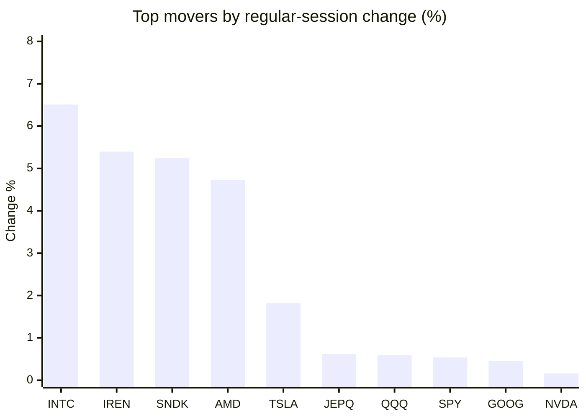
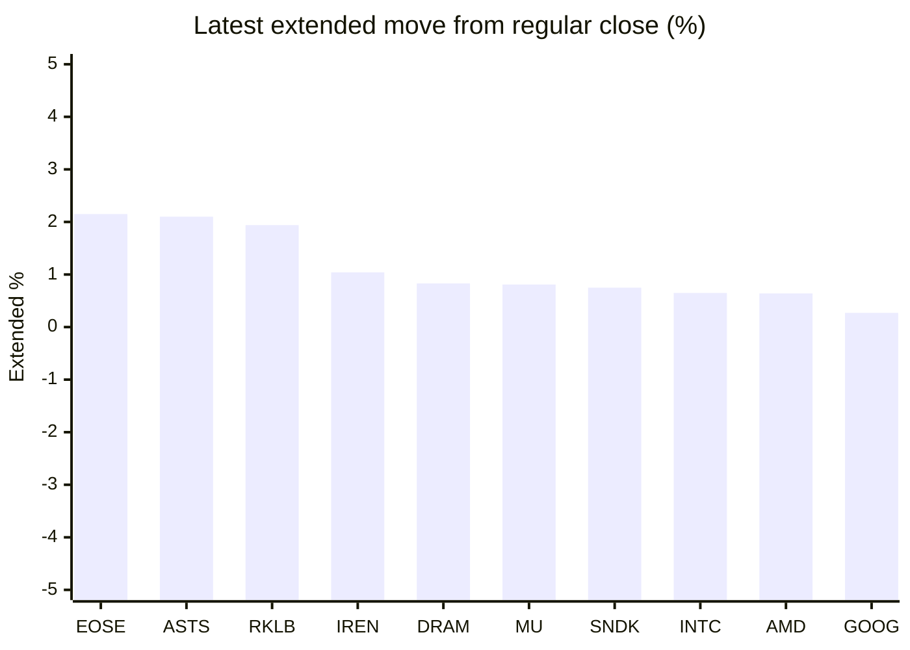

# Stock Brief - 2026-06-15

Generated at 2026-06-15 14:25 +07 from `watchlist.md`.
Prices are snapshots from Yahoo Finance public chart data. Extended/overnight is the latest available pre/post-market datapoint from the same feed.

## Market Snapshot

- SPY: close 741.75, latest extended 742.36, regular move +0.54%, extended move +0.08%
- QQQ: close 721.34, latest extended 722.98, regular move +0.59%, extended move +0.23%
- JEPQ: close 59.86, latest extended 59.92, regular move +0.62%, extended move +0.10%

## Watchlist Prices

| Ticker | Name | Regular close | Latest extended/overnight | Regular move | Extended move | Latest data time | Source |
|---|---|---:|---:|---:|---:|---|---|
| INTC | Intel Corporation | 124.57 USD | 125.38 USD | +6.51% | +0.65% | 2026-06-12 19:59 EDT | [Yahoo](https://finance.yahoo.com/quote/INTC/) |
| AVGO | Broadcom Inc. | 382.07 USD | 382.55 USD | -0.91% | +0.13% | 2026-06-12 19:59 EDT | [Yahoo](https://finance.yahoo.com/quote/AVGO/) |
| RKLB | Rocket Lab Corporation | 102.39 USD | 104.38 USD | -10.79% | +1.94% | 2026-06-12 19:59 EDT | [Yahoo](https://finance.yahoo.com/quote/RKLB/) |
| AAPL | Apple Inc. | 291.13 USD | 291.58 USD | -1.52% | +0.15% | 2026-06-12 19:59 EDT | [Yahoo](https://finance.yahoo.com/quote/AAPL/) |
| NVDA | NVIDIA Corporation | 205.19 USD | 205.42 USD | +0.16% | +0.11% | 2026-06-12 19:59 EDT | [Yahoo](https://finance.yahoo.com/quote/NVDA/) |
| TSLA | Tesla, Inc. | 406.43 USD | 406.10 USD | +1.82% | -0.08% | 2026-06-12 19:59 EDT | [Yahoo](https://finance.yahoo.com/quote/TSLA/) |
| SNDK | Sandisk Corporation | 1,980.10 USD | 1,994.95 USD | +5.24% | +0.75% | 2026-06-12 19:59 EDT | [Yahoo](https://finance.yahoo.com/quote/SNDK/) |
| QQQ | Invesco QQQ Trust, Series 1 | 721.34 USD | 722.98 USD | +0.59% | +0.23% | 2026-06-12 19:59 EDT | [Yahoo](https://finance.yahoo.com/quote/QQQ/) |
| SPY | State Street SPDR S&P 500 ETF T | 741.75 USD | 742.36 USD | +0.54% | +0.08% | 2026-06-12 19:59 EDT | [Yahoo](https://finance.yahoo.com/quote/SPY/) |
| JEPQ | JPMorgan Nasdaq Equity Premium  | 59.86 USD | 59.92 USD | +0.62% | +0.10% | 2026-06-12 19:59 EDT | [Yahoo](https://finance.yahoo.com/quote/JEPQ/) |
| ASTS | AST SpaceMobile, Inc. | 82.41 USD | 84.14 USD | -15.53% | +2.10% | 2026-06-12 19:59 EDT | [Yahoo](https://finance.yahoo.com/quote/ASTS/) |
| MU | Micron Technology, Inc. | 981.61 USD | 989.60 USD | -1.43% | +0.81% | 2026-06-12 19:59 EDT | [Yahoo](https://finance.yahoo.com/quote/MU/) |
| IREN | IREN LIMITED | 59.77 USD | 60.39 USD | +5.40% | +1.04% | 2026-06-12 19:59 EDT | [Yahoo](https://finance.yahoo.com/quote/IREN/) |
| EOSE | Eos Energy Enterprises, Inc. | 6.06 USD | 6.19 USD | -2.26% | +2.15% | 2026-06-12 19:59 EDT | [Yahoo](https://finance.yahoo.com/quote/EOSE/) |
| GOOG | Alphabet Inc. | 358.16 USD | 359.12 USD | +0.45% | +0.27% | 2026-06-12 19:59 EDT | [Yahoo](https://finance.yahoo.com/quote/GOOG/) |
| DRAM | Roundhill Memory ETF | 65.01 USD | 65.55 USD | -0.17% | +0.83% | 2026-06-12 19:59 EDT | [Yahoo](https://finance.yahoo.com/quote/DRAM/) |
| AMD | Advanced Micro Devices, Inc. | 511.57 USD | 514.87 USD | +4.73% | +0.64% | 2026-06-12 19:59 EDT | [Yahoo](https://finance.yahoo.com/quote/AMD/) |
| ASML | ASML Holding N.V. - New York Re | 1,863.55 USD | 1,863.09 USD | -1.89% | -0.02% | 2026-06-12 19:59 EDT | [Yahoo](https://finance.yahoo.com/quote/ASML/) |

## Charts

### Top Movers - Regular Session

### Extended / Overnight Move

### Quick Heatmap

| Group | Names in watchlist | Avg regular move | Avg extended move |
|---|---|---:|---:|
| Mega-cap tech | AVGO, AAPL, NVDA, TSLA, GOOG | -0.00% | +0.12% |
| Semis / memory | INTC, SNDK, MU, DRAM, AMD, ASML | +2.16% | +0.61% |
| Space / high beta | RKLB, ASTS, IREN, EOSE | -5.80% | +1.81% |
| ETFs | QQQ, SPY, JEPQ | +0.58% | +0.14% |

## News Headlines

- [Progressive Keeps Beating the Insurance Industry at Its Own Game. Can It Last?](https://www.fool.com/investing/2026/06/15/progressive-keeps-beating-the-insurance-industry-a/?.tsrc=rss) (2026-06-15 13:50 Bangkok)
- [Satellite Stocks Are Flying on SpaceX, Spectrum-Sale Hopes. Time Is Running Out.](https://finance.yahoo.com/m/9874ee40-988a-3259-8180-646bff8204aa/satellite-stocks-are-flying.html?.tsrc=rss) (2026-06-15 13:00 Bangkok)
- [Musk says SpaceX could bring $1 trillion in revenue by 2030](https://finance.yahoo.com/markets/stocks/articles/musk-says-spacex-could-bring-054636977.html?.tsrc=rss) (2026-06-15 12:46 Bangkok)
- [Want $1 Million in Retirement? Start With This Index Fund.](https://www.fool.com/investing/2026/06/15/want-1-million-retirement-start-with-vanguard-vti/?.tsrc=rss) (2026-06-15 12:20 Bangkok)
- [ASTS Stock Jumps Overnight: Retail Eyes Potential Win As Japan's $1B 'Starlink' Award Nears Decision](https://stocktwits.com/news-articles/markets/equity/asts-retail-eyes-win-japans-1b-starlink-award/cZKf4wOR7di?.tsrc=rss) (2026-06-15 12:02 Bangkok)
- [The Best Cryptocurrency to Buy With $135 Right Now](https://www.fool.com/investing/2026/06/15/the-best-cryptocurrency-to-buy-with-135-right-now/?.tsrc=rss) (2026-06-15 11:50 Bangkok)
- [Higher Interest Rates May Be Coming. Here's Why That's Bearish for Crypto.](https://www.fool.com/investing/2026/06/15/higher-interest-rates-may-be-coming-heres-why-that/?.tsrc=rss) (2026-06-15 11:35 Bangkok)
- [RIVN Stock Jumps Overnight: CEO Teases Self-Driving System 'Very Similar To Tesla's FSD' This Year](https://stocktwits.com/news-articles/markets/equity/rivn-stock-jumps-ceo-teases-tesla-fsd-like-system/cZKf3NkR7dX?.tsrc=rss) (2026-06-15 11:15 Bangkok)

## Caveats

- This is not investment advice. Extended-hours prices can be thin and volatile.
- Yahoo public endpoints may lag official exchange data.
