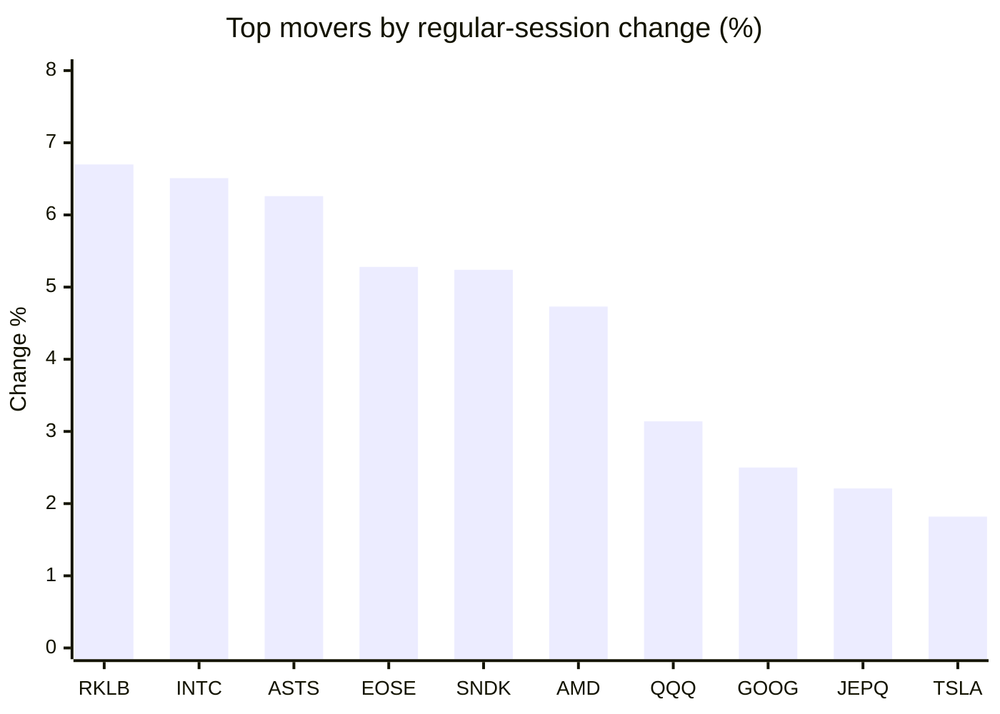
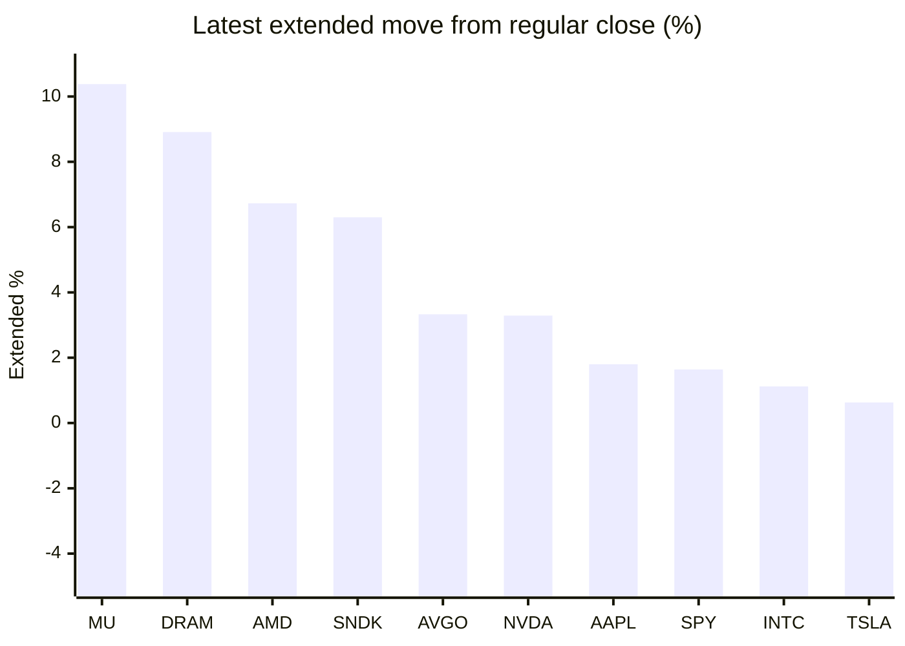

# Stock Brief - 2026-06-16

Generated at 2026-06-16 14:31 +07 from `watchlist.md`.
Prices are snapshots from Yahoo Finance public chart data. Extended/overnight is the latest available pre/post-market datapoint from the same feed.

## Market Snapshot

- SPY: close 741.75, latest extended 753.92, regular move +0.54%, extended move +1.64%
- QQQ: close 744.00, latest extended 742.88, regular move +3.14%, extended move -0.15%
- JEPQ: close 61.18, latest extended 61.09, regular move +2.21%, extended move -0.14%

## Watchlist Prices

| Ticker | Name | Regular close | Latest extended/overnight | Regular move | Extended move | Latest data time | Source |
|---|---|---:|---:|---:|---:|---|---|
| INTC | Intel Corporation | 124.57 USD | 125.97 USD | +6.51% | +1.12% | 2026-06-15 19:59 EDT | [Yahoo](https://finance.yahoo.com/quote/INTC/) |
| AVGO | Broadcom Inc. | 382.07 USD | 394.81 USD | -0.91% | +3.33% | 2026-06-15 19:59 EDT | [Yahoo](https://finance.yahoo.com/quote/AVGO/) |
| RKLB | Rocket Lab Corporation | 109.25 USD | 108.62 USD | +6.70% | -0.58% | 2026-06-15 19:59 EDT | [Yahoo](https://finance.yahoo.com/quote/RKLB/) |
| AAPL | Apple Inc. | 291.13 USD | 296.36 USD | -1.52% | +1.80% | 2026-06-15 19:59 EDT | [Yahoo](https://finance.yahoo.com/quote/AAPL/) |
| NVDA | NVIDIA Corporation | 205.19 USD | 211.94 USD | +0.16% | +3.29% | 2026-06-15 19:59 EDT | [Yahoo](https://finance.yahoo.com/quote/NVDA/) |
| TSLA | Tesla, Inc. | 406.43 USD | 408.98 USD | +1.82% | +0.63% | 2026-06-15 19:59 EDT | [Yahoo](https://finance.yahoo.com/quote/TSLA/) |
| SNDK | Sandisk Corporation | 1,980.10 USD | 2,104.78 USD | +5.24% | +6.30% | 2026-06-15 19:59 EDT | [Yahoo](https://finance.yahoo.com/quote/SNDK/) |
| QQQ | Invesco QQQ Trust, Series 1 | 744.00 USD | 742.88 USD | +3.14% | -0.15% | 2026-06-15 19:59 EDT | [Yahoo](https://finance.yahoo.com/quote/QQQ/) |
| SPY | State Street SPDR S&P 500 ETF T | 741.75 USD | 753.92 USD | +0.54% | +1.64% | 2026-06-15 19:59 EDT | [Yahoo](https://finance.yahoo.com/quote/SPY/) |
| JEPQ | JPMorgan Nasdaq Equity Premium  | 61.18 USD | 61.09 USD | +2.21% | -0.14% | 2026-06-15 19:58 EDT | [Yahoo](https://finance.yahoo.com/quote/JEPQ/) |
| ASTS | AST SpaceMobile, Inc. | 87.57 USD | 87.45 USD | +6.26% | -0.14% | 2026-06-15 19:59 EDT | [Yahoo](https://finance.yahoo.com/quote/ASTS/) |
| MU | Micron Technology, Inc. | 981.61 USD | 1,083.52 USD | -1.43% | +10.38% | 2026-06-15 19:59 EDT | [Yahoo](https://finance.yahoo.com/quote/MU/) |
| IREN | IREN LIMITED | 60.85 USD | 60.78 USD | +1.81% | -0.12% | 2026-06-15 19:59 EDT | [Yahoo](https://finance.yahoo.com/quote/IREN/) |
| EOSE | Eos Energy Enterprises, Inc. | 6.38 USD | 6.37 USD | +5.28% | -0.16% | 2026-06-15 19:59 EDT | [Yahoo](https://finance.yahoo.com/quote/EOSE/) |
| GOOG | Alphabet Inc. | 367.11 USD | 366.85 USD | +2.50% | -0.07% | 2026-06-15 19:59 EDT | [Yahoo](https://finance.yahoo.com/quote/GOOG/) |
| DRAM | Roundhill Memory ETF | 65.01 USD | 70.80 USD | -0.17% | +8.91% | 2026-06-15 19:59 EDT | [Yahoo](https://finance.yahoo.com/quote/DRAM/) |
| AMD | Advanced Micro Devices, Inc. | 511.57 USD | 546.00 USD | +4.73% | +6.73% | 2026-06-15 19:59 EDT | [Yahoo](https://finance.yahoo.com/quote/AMD/) |
| ASML | ASML Holding N.V. - New York Re | 1,892.66 USD | 1,892.00 USD | +1.56% | -0.03% | 2026-06-15 19:59 EDT | [Yahoo](https://finance.yahoo.com/quote/ASML/) |

## Charts

### Top Movers - Regular Session

### Extended / Overnight Move

### Quick Heatmap

| Group | Names in watchlist | Avg regular move | Avg extended move |
|---|---|---:|---:|
| Mega-cap tech | AVGO, AAPL, NVDA, TSLA, GOOG | +0.41% | +1.80% |
| Semis / memory | INTC, SNDK, MU, DRAM, AMD, ASML | +2.74% | +5.57% |
| Space / high beta | RKLB, ASTS, IREN, EOSE | +5.01% | -0.25% |
| ETFs | QQQ, SPY, JEPQ | +1.96% | +0.45% |

## News Headlines

- [Legacy global automakers falter in ambition despite momentum in the EV transition](https://finance.yahoo.com/energy/articles/legacy-global-automakers-falter-ambition-070000213.html?.tsrc=rss) (2026-06-16 14:00 Bangkok)
- [This Top Oil Stock Expects an Unlikely Source to Help It Double Its Free Cash Flow by 2029.](https://www.fool.com/investing/2026/06/16/this-top-oil-stock-expects-an-unlikely-source-to-h/?.tsrc=rss) (2026-06-16 13:50 Bangkok)
- [TD Cowen, Maxim Reiterate Bullish Outlook on Apple Inc. (AAPL) Following WWDC26](https://finance.yahoo.com/markets/stocks/articles/td-cowen-maxim-reiterate-bullish-062804123.html?.tsrc=rss) (2026-06-16 13:28 Bangkok)
- [BlueBird 8, 9, and 10 Satellites to be Launched on June 17, Announces AST SpaceMobile, Inc. (ASTS)](https://finance.yahoo.com/markets/stocks/articles/bluebird-8-9-10-satellites-062754807.html?.tsrc=rss) (2026-06-16 13:27 Bangkok)
- [Rocket Lab Corporation (RKLB): Among Stocks ChatGPT Predicts Could Make You Wealthy in 3 Years](https://finance.yahoo.com/markets/stocks/articles/rocket-lab-corporation-rklb-among-062752656.html?.tsrc=rss) (2026-06-16 13:27 Bangkok)
- [Nebius Group N.V. (NBIS) a Moderate Buy, Per Wall Street](https://finance.yahoo.com/markets/stocks/articles/nebius-group-n-v-nbis-062748509.html?.tsrc=rss) (2026-06-16 13:27 Bangkok)
- [Italy's antitrust regulator probes Apple over cloud services under Digital Market rules](https://finance.yahoo.com/technology/articles/italys-antitrust-regulator-probes-apple-062015050.html?.tsrc=rss) (2026-06-16 13:20 Bangkok)
- [SMCZ vs. SMCX: Betting Against or All-In on Super Micro?](https://247wallst.com/investing/2026/06/16/smcz-vs-smcx-betting-against-or-all-in-on-super-micro/?.tsrc=rss) (2026-06-16 12:38 Bangkok)

## Caveats

- This is not investment advice. Extended-hours prices can be thin and volatile.
- Yahoo public endpoints may lag official exchange data.
