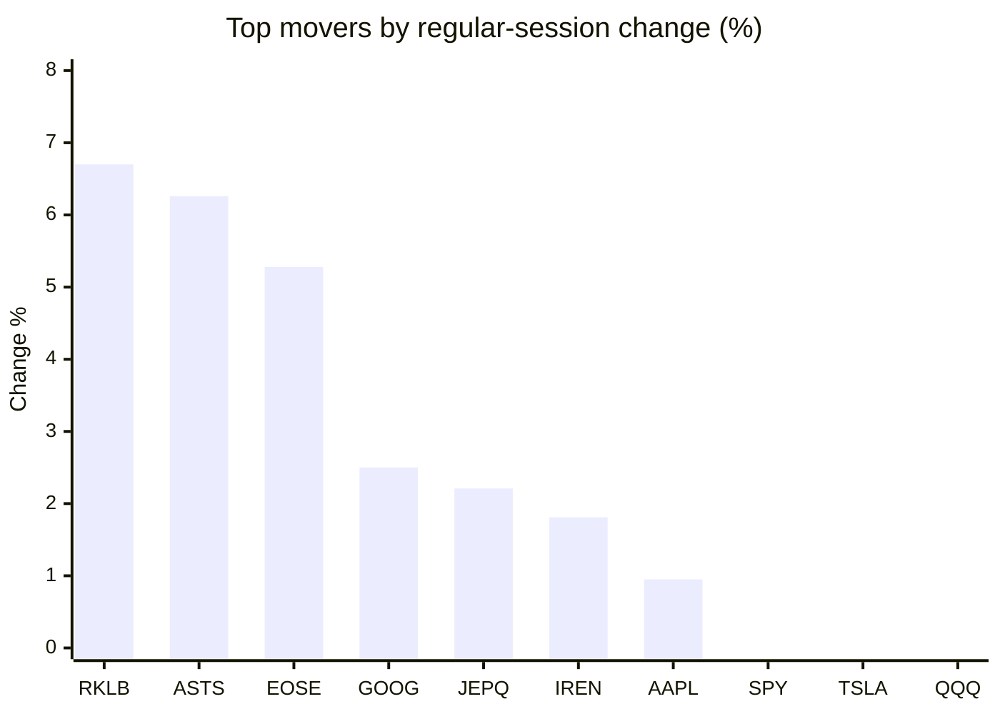
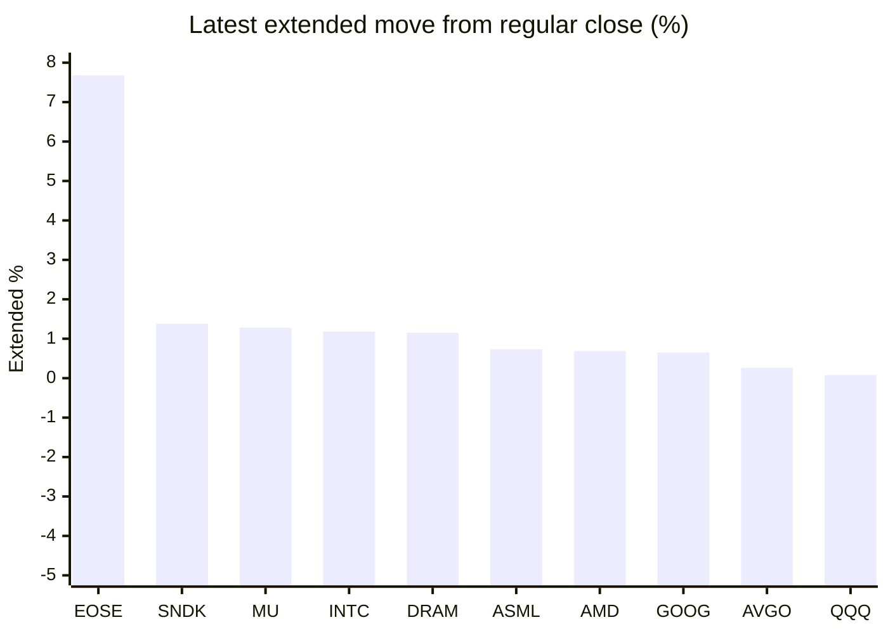

# Stock Brief - 2026-06-17

Generated at 2026-06-17 14:15 +07 from `watchlist.md`.
Prices are snapshots from Yahoo Finance public chart data. Extended/overnight is the latest available pre/post-market datapoint from the same feed.

## Market Snapshot

- SPY: close 750.33, latest extended 750.78, regular move -0.60%, extended move +0.06%
- QQQ: close 729.86, latest extended 730.44, regular move -1.90%, extended move +0.08%
- JEPQ: close 61.18, latest extended 60.98, regular move +2.21%, extended move -0.33%

## Watchlist Prices

| Ticker | Name | Regular close | Latest extended/overnight | Regular move | Extended move | Latest data time | Source |
|---|---|---:|---:|---:|---:|---|---|
| INTC | Intel Corporation | 117.05 USD | 118.43 USD | -8.45% | +1.18% | 2026-06-16 19:59 EDT | [Yahoo](https://finance.yahoo.com/quote/INTC/) |
| AVGO | Broadcom Inc. | 376.71 USD | 377.71 USD | -4.37% | +0.26% | 2026-06-16 19:59 EDT | [Yahoo](https://finance.yahoo.com/quote/AVGO/) |
| RKLB | Rocket Lab Corporation | 109.25 USD | 104.57 USD | +6.70% | -4.28% | 2026-06-16 19:59 EDT | [Yahoo](https://finance.yahoo.com/quote/RKLB/) |
| AAPL | Apple Inc. | 299.24 USD | 298.90 USD | +0.95% | -0.11% | 2026-06-16 19:59 EDT | [Yahoo](https://finance.yahoo.com/quote/AAPL/) |
| NVDA | NVIDIA Corporation | 207.41 USD | 207.55 USD | -2.37% | +0.07% | 2026-06-16 19:59 EDT | [Yahoo](https://finance.yahoo.com/quote/NVDA/) |
| TSLA | Tesla, Inc. | 404.66 USD | 402.84 USD | -1.58% | -0.45% | 2026-06-16 19:59 EDT | [Yahoo](https://finance.yahoo.com/quote/TSLA/) |
| SNDK | Sandisk Corporation | 1,991.55 USD | 2,019.00 USD | -5.52% | +1.38% | 2026-06-16 19:59 EDT | [Yahoo](https://finance.yahoo.com/quote/SNDK/) |
| QQQ | Invesco QQQ Trust, Series 1 | 729.86 USD | 730.44 USD | -1.90% | +0.08% | 2026-06-16 19:59 EDT | [Yahoo](https://finance.yahoo.com/quote/QQQ/) |
| SPY | State Street SPDR S&P 500 ETF T | 750.33 USD | 750.78 USD | -0.60% | +0.06% | 2026-06-16 19:59 EDT | [Yahoo](https://finance.yahoo.com/quote/SPY/) |
| JEPQ | JPMorgan Nasdaq Equity Premium  | 61.18 USD | 60.98 USD | +2.21% | -0.33% | 2026-06-16 19:59 EDT | [Yahoo](https://finance.yahoo.com/quote/JEPQ/) |
| ASTS | AST SpaceMobile, Inc. | 87.57 USD | 84.16 USD | +6.26% | -3.89% | 2026-06-16 19:59 EDT | [Yahoo](https://finance.yahoo.com/quote/ASTS/) |
| MU | Micron Technology, Inc. | 1,020.76 USD | 1,033.88 USD | -6.18% | +1.28% | 2026-06-16 19:59 EDT | [Yahoo](https://finance.yahoo.com/quote/MU/) |
| IREN | IREN LIMITED | 60.85 USD | 58.80 USD | +1.81% | -3.37% | 2026-06-16 19:59 EDT | [Yahoo](https://finance.yahoo.com/quote/IREN/) |
| EOSE | Eos Energy Enterprises, Inc. | 6.38 USD | 6.87 USD | +5.28% | +7.68% | 2026-06-16 19:59 EDT | [Yahoo](https://finance.yahoo.com/quote/EOSE/) |
| GOOG | Alphabet Inc. | 367.11 USD | 369.51 USD | +2.50% | +0.65% | 2026-06-16 19:59 EDT | [Yahoo](https://finance.yahoo.com/quote/GOOG/) |
| DRAM | Roundhill Memory ETF | 68.12 USD | 68.90 USD | -4.15% | +1.15% | 2026-06-16 19:59 EDT | [Yahoo](https://finance.yahoo.com/quote/DRAM/) |
| AMD | Advanced Micro Devices, Inc. | 507.29 USD | 510.77 USD | -7.30% | +0.69% | 2026-06-16 19:59 EDT | [Yahoo](https://finance.yahoo.com/quote/AMD/) |
| ASML | ASML Holding N.V. - New York Re | 1,803.89 USD | 1,817.07 USD | -4.69% | +0.73% | 2026-06-16 19:59 EDT | [Yahoo](https://finance.yahoo.com/quote/ASML/) |

## Charts

### Top Movers - Regular Session

### Extended / Overnight Move

### Quick Heatmap

| Group | Names in watchlist | Avg regular move | Avg extended move |
|---|---|---:|---:|
| Mega-cap tech | AVGO, AAPL, NVDA, TSLA, GOOG | -0.97% | +0.08% |
| Semis / memory | INTC, SNDK, MU, DRAM, AMD, ASML | -6.05% | +1.07% |
| Space / high beta | RKLB, ASTS, IREN, EOSE | +5.01% | -0.97% |
| ETFs | QQQ, SPY, JEPQ | -0.10% | -0.06% |

## News Headlines

- [Apollo and Blackstone Just Closed a $35 Billion Private Credit Deal to Finance Anthropic's Compute Expansion. Here's What It Means for Micron and Nvidia.](https://www.fool.com/investing/2026/06/17/apollo-and-blackstone-just-closed-a-35-billion-pri/?.tsrc=rss) (2026-06-17 14:02 Bangkok)
- [How America Got to SpaceX: The Long Trail of Big IPOs That Began in 1783](https://finance.yahoo.com/m/4ee0e1c0-1d36-302b-97c3-aacc9c50d415/how-america-got-to-spacex%3A.html?.tsrc=rss) (2026-06-17 14:00 Bangkok)
- [This Stock Is Up 58% This Year. Is It too Late to Buy?](https://www.fool.com/investing/2026/06/17/this-stock-is-up-58-this-year-is-it-too-late-to-bu/?.tsrc=rss) (2026-06-17 13:50 Bangkok)
- [Prediction: This Could Be Nvidia's Stock Price By the End of 2027](https://www.fool.com/investing/2026/06/17/prediction-this-could-be-nvidias-stock-price-by-th/?.tsrc=rss) (2026-06-17 13:48 Bangkok)
- [SpaceX's IPO Reshapes Space Trade — Here's Why Shorts Are Piling Into ASTS And SPCE](https://stocktwits.com/news-articles/markets/equity/spacex-ipo-reshapes-space-trade-shorts-piling-into-asts-spce/cZK0nmWR7IJ?.tsrc=rss) (2026-06-17 13:33 Bangkok)
- [2 Industrial Stocks Worth Watching](https://www.fool.com/investing/2026/06/17/2-industrial-stocks-worth-watching/?.tsrc=rss) (2026-06-17 13:33 Bangkok)
- [RKLB Stock Jumps Overnight: Retail Unfazed By Launch Delay Of Rocket Lab's 90th Electron Mission](https://stocktwits.com/news-articles/markets/equity/rklb-retail-unfazed-launch-delay-90th-electron-mission/cZK0NX8R7Ie?.tsrc=rss) (2026-06-17 12:48 Bangkok)
- [Intel (INTC) Stock Could Be 10% Undervalued After BofA Double Upgrade](https://finance.yahoo.com/markets/stocks/articles/intel-intc-stock-could-10-051029950.html?.tsrc=rss) (2026-06-17 12:10 Bangkok)

## Caveats

- This is not investment advice. Extended-hours prices can be thin and volatile.
- Yahoo public endpoints may lag official exchange data.
