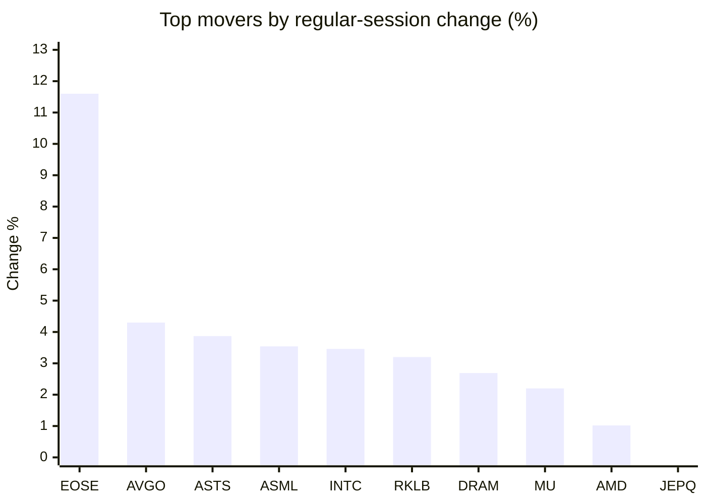
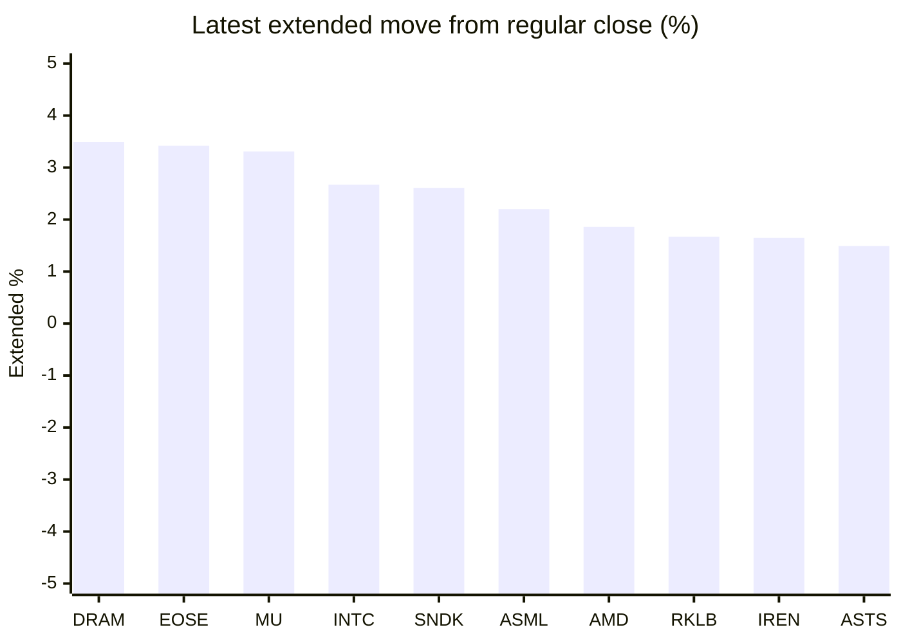

# Stock Brief - 2026-06-18

Generated at 2026-06-18 13:57 +07 from `watchlist.md`.
Prices are snapshots from Yahoo Finance public chart data. Extended/overnight is the latest available pre/post-market datapoint from the same feed.

## Market Snapshot

- SPY: close 740.96, latest extended 744.69, regular move -1.25%, extended move +0.50%
- QQQ: close 722.51, latest extended 729.96, regular move -1.01%, extended move +1.03%
- JEPQ: close 60.37, latest extended 60.80, regular move -0.67%, extended move +0.71%

## Watchlist Prices

| Ticker | Name | Regular close | Latest extended/overnight | Regular move | Extended move | Latest data time | Source |
|---|---|---:|---:|---:|---:|---|---|
| INTC | Intel Corporation | 121.10 USD | 124.33 USD | +3.46% | +2.67% | 2026-06-17 20:00 EDT | [Yahoo](https://finance.yahoo.com/quote/INTC/) |
| AVGO | Broadcom Inc. | 392.90 USD | 398.31 USD | +4.30% | +1.38% | 2026-06-17 19:59 EDT | [Yahoo](https://finance.yahoo.com/quote/AVGO/) |
| RKLB | Rocket Lab Corporation | 107.98 USD | 109.78 USD | +3.20% | +1.67% | 2026-06-17 19:59 EDT | [Yahoo](https://finance.yahoo.com/quote/RKLB/) |
| AAPL | Apple Inc. | 295.95 USD | 297.14 USD | -1.10% | +0.40% | 2026-06-17 19:59 EDT | [Yahoo](https://finance.yahoo.com/quote/AAPL/) |
| NVDA | NVIDIA Corporation | 204.65 USD | 206.30 USD | -1.33% | +0.81% | 2026-06-17 19:59 EDT | [Yahoo](https://finance.yahoo.com/quote/NVDA/) |
| TSLA | Tesla, Inc. | 396.38 USD | 397.75 USD | -2.05% | +0.35% | 2026-06-17 19:59 EDT | [Yahoo](https://finance.yahoo.com/quote/TSLA/) |
| SNDK | Sandisk Corporation | 1,958.80 USD | 2,009.99 USD | -1.64% | +2.61% | 2026-06-17 19:59 EDT | [Yahoo](https://finance.yahoo.com/quote/SNDK/) |
| QQQ | Invesco QQQ Trust, Series 1 | 722.51 USD | 729.96 USD | -1.01% | +1.03% | 2026-06-17 19:59 EDT | [Yahoo](https://finance.yahoo.com/quote/QQQ/) |
| SPY | State Street SPDR S&P 500 ETF T | 740.96 USD | 744.69 USD | -1.25% | +0.50% | 2026-06-17 20:00 EDT | [Yahoo](https://finance.yahoo.com/quote/SPY/) |
| JEPQ | JPMorgan Nasdaq Equity Premium  | 60.37 USD | 60.80 USD | -0.67% | +0.71% | 2026-06-17 19:59 EDT | [Yahoo](https://finance.yahoo.com/quote/JEPQ/) |
| ASTS | AST SpaceMobile, Inc. | 85.43 USD | 86.70 USD | +3.87% | +1.49% | 2026-06-17 19:59 EDT | [Yahoo](https://finance.yahoo.com/quote/ASTS/) |
| MU | Micron Technology, Inc. | 1,043.19 USD | 1,077.70 USD | +2.20% | +3.31% | 2026-06-17 19:59 EDT | [Yahoo](https://finance.yahoo.com/quote/MU/) |
| IREN | IREN LIMITED | 58.11 USD | 59.07 USD | -1.81% | +1.65% | 2026-06-17 19:59 EDT | [Yahoo](https://finance.yahoo.com/quote/IREN/) |
| EOSE | Eos Energy Enterprises, Inc. | 7.60 USD | 7.86 USD | +11.60% | +3.42% | 2026-06-17 19:59 EDT | [Yahoo](https://finance.yahoo.com/quote/EOSE/) |
| GOOG | Alphabet Inc. | 362.10 USD | 363.99 USD | -2.43% | +0.52% | 2026-06-17 19:59 EDT | [Yahoo](https://finance.yahoo.com/quote/GOOG/) |
| DRAM | Roundhill Memory ETF | 69.95 USD | 72.39 USD | +2.69% | +3.49% | 2026-06-17 19:59 EDT | [Yahoo](https://finance.yahoo.com/quote/DRAM/) |
| AMD | Advanced Micro Devices, Inc. | 512.48 USD | 521.99 USD | +1.02% | +1.86% | 2026-06-17 19:59 EDT | [Yahoo](https://finance.yahoo.com/quote/AMD/) |
| ASML | ASML Holding N.V. - New York Re | 1,867.83 USD | 1,909.00 USD | +3.54% | +2.20% | 2026-06-17 19:59 EDT | [Yahoo](https://finance.yahoo.com/quote/ASML/) |

## Charts

### Top Movers - Regular Session

### Extended / Overnight Move

### Quick Heatmap

| Group | Names in watchlist | Avg regular move | Avg extended move |
|---|---|---:|---:|
| Mega-cap tech | AVGO, AAPL, NVDA, TSLA, GOOG | -0.52% | +0.69% |
| Semis / memory | INTC, SNDK, MU, DRAM, AMD, ASML | +1.88% | +2.69% |
| Space / high beta | RKLB, ASTS, IREN, EOSE | +4.22% | +2.06% |
| ETFs | QQQ, SPY, JEPQ | -0.98% | +0.75% |

## News Headlines

- [SpaceX Made Elon Musk a Trillionaire. Can SpaceX Stock Make You a Millionaire? (Hint: Yes, but There's a Catch)](https://www.fool.com/investing/2026/06/18/spacex-made-elon-musk-a-trillionaire-can-spacex-st/?.tsrc=rss) (2026-06-18 13:35 Bangkok)
- [Is the SpaceX IPO Enough to Rescue Robinhood Stock?](https://www.fool.com/investing/2026/06/18/is-the-spacex-ipo-enough-to-rescue-robinhood-stock/?.tsrc=rss) (2026-06-18 13:25 Bangkok)
- [Intel Stock Rips Nearly 6% Overnight After Trump Confirms Apple Chip Manufacturing Deal](https://stocktwits.com/news-articles/markets/equity/intel-stock-rips-nearly-6-overnight-after-trump-confirms-apple-chip-manufacturing-deal/cZKjuEyR7ep?.tsrc=rss) (2026-06-18 13:12 Bangkok)
- [Elon Musk Is the World's First Trillionaire. Here's Where His Wealth Is Stored.](https://www.fool.com/investing/2026/06/18/musk-is-the-worlds-first-trillionaire-heres-where/?.tsrc=rss) (2026-06-18 13:07 Bangkok)
- [Elon Musk, The World's First Trillionaire, Holds Bitcoin And 'Some' Dogecoin — 'Let That Sink In,' Says Popular Analyst](https://finance.yahoo.com/markets/crypto/articles/elon-musk-worlds-first-trillionaire-060337862.html?.tsrc=rss) (2026-06-18 13:03 Bangkok)
- [TSLA Stock Eyes Red Week: Elon Musk Says Tesla’s FSD Could Soon Take Directions Like An Uber Driver](https://stocktwits.com/news-articles/markets/equity/tsla-red-week-musk-fsd-directions-like-uber-driver/cZKjtlpR7eY?.tsrc=rss) (2026-06-18 12:50 Bangkok)
- [These 3 Stocks Have Crushed the Market This Year. Here's Why There Is More Upside Ahead](https://www.fool.com/investing/2026/06/18/these-3-stocks-have-crushed-the-market-this-year-h/?.tsrc=rss) (2026-06-18 12:50 Bangkok)
- [Apple price rises are ‘unavoidable’, CEO warns, as AI chip costs surge](https://www.euronews.com/2026/06/18/apple-price-rises-are-unavoidable-ceo-warns-as-ai-chip-costs-surge?.tsrc=rss) (2026-06-18 12:34 Bangkok)

## Caveats

- This is not investment advice. Extended-hours prices can be thin and volatile.
- Yahoo public endpoints may lag official exchange data.
