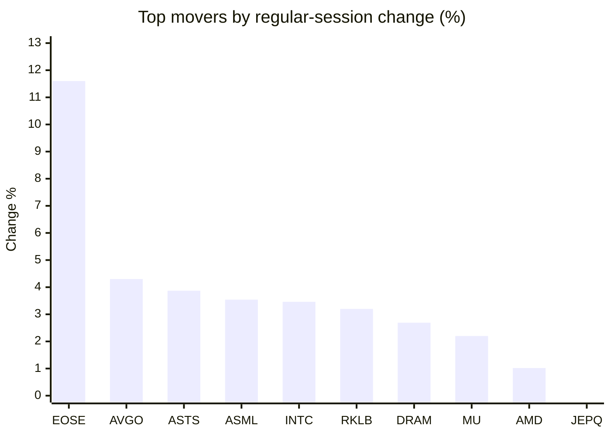
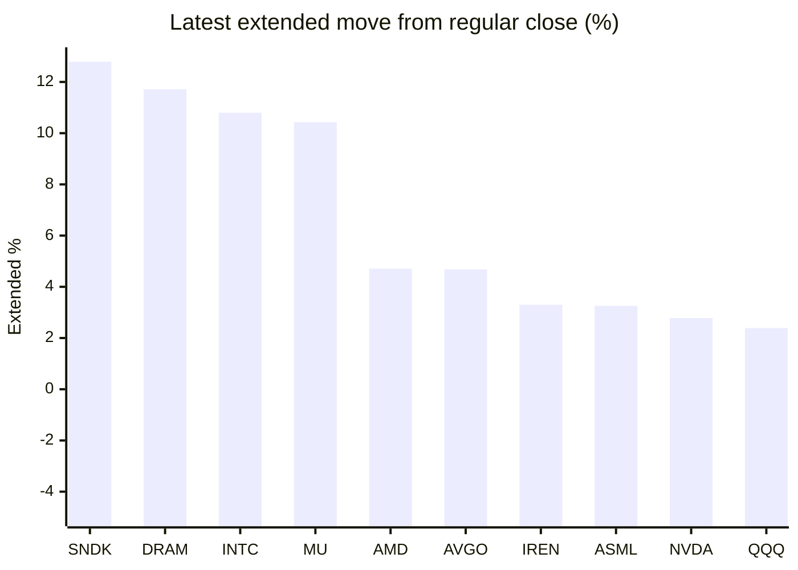

# Stock Brief - 2026-06-19

Generated at 2026-06-19 14:12 +07 from `watchlist.md`.
Prices are snapshots from Yahoo Finance public chart data. Extended/overnight is the latest available pre/post-market datapoint from the same feed.

## Market Snapshot

- SPY: close 740.96, latest extended 746.94, regular move -1.25%, extended move +0.81%
- QQQ: close 722.51, latest extended 739.78, regular move -1.01%, extended move +2.39%
- JEPQ: close 60.37, latest extended 61.36, regular move -0.67%, extended move +1.64%

## Watchlist Prices

| Ticker | Name | Regular close | Latest extended/overnight | Regular move | Extended move | Latest data time | Source |
|---|---|---:|---:|---:|---:|---|---|
| INTC | Intel Corporation | 121.10 USD | 134.18 USD | +3.46% | +10.80% | 2026-06-18 19:59 EDT | [Yahoo](https://finance.yahoo.com/quote/INTC/) |
| AVGO | Broadcom Inc. | 392.90 USD | 411.30 USD | +4.30% | +4.68% | 2026-06-18 20:00 EDT | [Yahoo](https://finance.yahoo.com/quote/AVGO/) |
| RKLB | Rocket Lab Corporation | 107.98 USD | 106.20 USD | +3.20% | -1.65% | 2026-06-18 19:59 EDT | [Yahoo](https://finance.yahoo.com/quote/RKLB/) |
| AAPL | Apple Inc. | 295.95 USD | 297.20 USD | -1.10% | +0.42% | 2026-06-18 19:59 EDT | [Yahoo](https://finance.yahoo.com/quote/AAPL/) |
| NVDA | NVIDIA Corporation | 204.65 USD | 210.33 USD | -1.33% | +2.78% | 2026-06-18 19:59 EDT | [Yahoo](https://finance.yahoo.com/quote/NVDA/) |
| TSLA | Tesla, Inc. | 396.38 USD | 398.73 USD | -2.05% | +0.59% | 2026-06-18 19:59 EDT | [Yahoo](https://finance.yahoo.com/quote/TSLA/) |
| SNDK | Sandisk Corporation | 1,958.80 USD | 2,209.28 USD | -1.64% | +12.79% | 2026-06-18 19:59 EDT | [Yahoo](https://finance.yahoo.com/quote/SNDK/) |
| QQQ | Invesco QQQ Trust, Series 1 | 722.51 USD | 739.78 USD | -1.01% | +2.39% | 2026-06-18 19:59 EDT | [Yahoo](https://finance.yahoo.com/quote/QQQ/) |
| SPY | State Street SPDR S&P 500 ETF T | 740.96 USD | 746.94 USD | -1.25% | +0.81% | 2026-06-18 19:59 EDT | [Yahoo](https://finance.yahoo.com/quote/SPY/) |
| JEPQ | JPMorgan Nasdaq Equity Premium  | 60.37 USD | 61.36 USD | -0.67% | +1.64% | 2026-06-18 19:59 EDT | [Yahoo](https://finance.yahoo.com/quote/JEPQ/) |
| ASTS | AST SpaceMobile, Inc. | 85.43 USD | 80.40 USD | +3.87% | -5.89% | 2026-06-18 19:59 EDT | [Yahoo](https://finance.yahoo.com/quote/ASTS/) |
| MU | Micron Technology, Inc. | 1,043.19 USD | 1,151.95 USD | +2.20% | +10.43% | 2026-06-18 19:59 EDT | [Yahoo](https://finance.yahoo.com/quote/MU/) |
| IREN | IREN LIMITED | 58.11 USD | 60.03 USD | -1.81% | +3.30% | 2026-06-18 19:59 EDT | [Yahoo](https://finance.yahoo.com/quote/IREN/) |
| EOSE | Eos Energy Enterprises, Inc. | 7.60 USD | 7.67 USD | +11.60% | +0.87% | 2026-06-18 19:59 EDT | [Yahoo](https://finance.yahoo.com/quote/EOSE/) |
| GOOG | Alphabet Inc. | 362.10 USD | 365.04 USD | -2.43% | +0.81% | 2026-06-18 19:59 EDT | [Yahoo](https://finance.yahoo.com/quote/GOOG/) |
| DRAM | Roundhill Memory ETF | 69.95 USD | 78.15 USD | +2.69% | +11.72% | 2026-06-18 19:59 EDT | [Yahoo](https://finance.yahoo.com/quote/DRAM/) |
| AMD | Advanced Micro Devices, Inc. | 512.48 USD | 536.62 USD | +1.02% | +4.71% | 2026-06-18 19:59 EDT | [Yahoo](https://finance.yahoo.com/quote/AMD/) |
| ASML | ASML Holding N.V. - New York Re | 1,867.83 USD | 1,928.69 USD | +3.54% | +3.26% | 2026-06-18 19:59 EDT | [Yahoo](https://finance.yahoo.com/quote/ASML/) |

## Charts

### Top Movers - Regular Session

### Extended / Overnight Move

### Quick Heatmap

| Group | Names in watchlist | Avg regular move | Avg extended move |
|---|---|---:|---:|
| Mega-cap tech | AVGO, AAPL, NVDA, TSLA, GOOG | -0.52% | +1.86% |
| Semis / memory | INTC, SNDK, MU, DRAM, AMD, ASML | +1.88% | +8.95% |
| Space / high beta | RKLB, ASTS, IREN, EOSE | +4.22% | -0.84% |
| ETFs | QQQ, SPY, JEPQ | -0.98% | +1.61% |

## News Headlines

- [3 Reasons to Buy Apple Stock](https://www.fool.com/investing/2026/06/19/3-reasons-to-buy-apple-stock/?.tsrc=rss) (2026-06-19 14:05 Bangkok)
- [Meet the Magnificent Vanguard ETF Obliterating the S&P 500 in 2026 Because of Its Unique Momentum-Driven Strategy](https://www.fool.com/investing/2026/06/19/meet-vanguard-etf-obliterating-the-sp-500-in-2026/?.tsrc=rss) (2026-06-19 13:50 Bangkok)
- [China tightens indium export checks as AI demand increases](https://finance.yahoo.com/technology/ai/articles/china-tightens-indium-export-checks-063922632.html?.tsrc=rss) (2026-06-19 13:39 Bangkok)
- [Suze Orman Lashes Out Against This Bad Social Security Advice](https://www.fool.com/retirement/2026/06/19/suze-orman-lashes-out-against-bad-social-security/?.tsrc=rss) (2026-06-19 13:20 Bangkok)
- [If You Have $1,000 to Invest Today, Should It Go Into SpaceX or the S&P 500? History Has a Clear Answer.](https://www.fool.com/investing/2026/06/19/if-you-have-1000-to-invest-today-should-it-go-into/?.tsrc=rss) (2026-06-19 12:50 Bangkok)
- [Is GoDaddy a Value Stock?](https://www.fool.com/investing/2026/06/19/is-godaddy-a-value-stock/?.tsrc=rss) (2026-06-19 12:20 Bangkok)
- [Tim Draper Says Elon Musk Made The World See SpaceX Differently Just Like He Did With Tesla And PayPal: 'Opened Our Minds…'](https://finance.yahoo.com/markets/stocks/articles/tim-draper-says-elon-musk-051758806.html?.tsrc=rss) (2026-06-19 12:17 Bangkok)
- [Jensen Huang’s Nvidia Is About to Break a Global Earnings Record. That’s No Accident.](https://finance.yahoo.com/m/c8ab739f-a4ef-3386-be91-afdf5198b594/jensen-huang%E2%80%99s-nvidia-is.html?.tsrc=rss) (2026-06-19 12:00 Bangkok)

## Caveats

- This is not investment advice. Extended-hours prices can be thin and volatile.
- Yahoo public endpoints may lag official exchange data.
