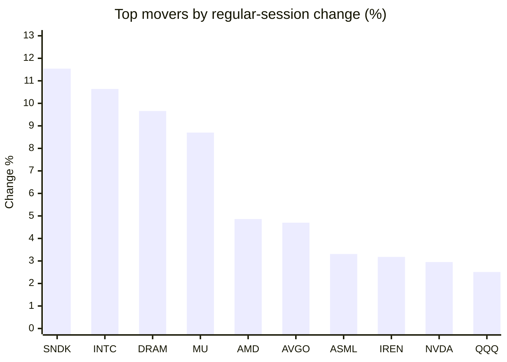
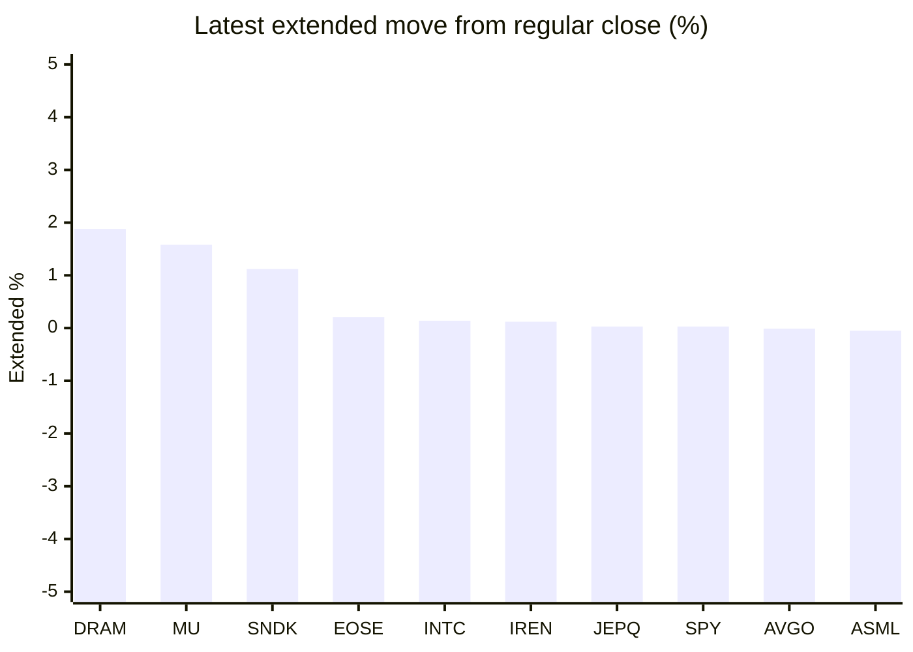

# Stock Brief - 2026-06-20

Generated at 2026-06-20 13:25 +07 from `watchlist.md`.
Prices are snapshots from Yahoo Finance public chart data. Extended/overnight is the latest available pre/post-market datapoint from the same feed.

## Market Snapshot

- SPY: close 746.74, latest extended 746.94, regular move +0.78%, extended move +0.03%
- QQQ: close 740.62, latest extended 739.78, regular move +2.51%, extended move -0.11%
- JEPQ: close 61.34, latest extended 61.36, regular move +1.61%, extended move +0.03%

## Watchlist Prices

| Ticker | Name | Regular close | Latest extended/overnight | Regular move | Extended move | Latest data time | Source |
|---|---|---:|---:|---:|---:|---|---|
| INTC | Intel Corporation | 133.99 USD | 134.18 USD | +10.64% | +0.14% | 2026-06-18 19:59 EDT | [Yahoo](https://finance.yahoo.com/quote/INTC/) |
| AVGO | Broadcom Inc. | 411.35 USD | 411.30 USD | +4.70% | -0.01% | 2026-06-18 20:00 EDT | [Yahoo](https://finance.yahoo.com/quote/AVGO/) |
| RKLB | Rocket Lab Corporation | 107.24 USD | 106.20 USD | -0.69% | -0.97% | 2026-06-18 19:59 EDT | [Yahoo](https://finance.yahoo.com/quote/RKLB/) |
| AAPL | Apple Inc. | 298.01 USD | 297.20 USD | +0.70% | -0.27% | 2026-06-18 19:59 EDT | [Yahoo](https://finance.yahoo.com/quote/AAPL/) |
| NVDA | NVIDIA Corporation | 210.69 USD | 210.33 USD | +2.95% | -0.17% | 2026-06-18 19:59 EDT | [Yahoo](https://finance.yahoo.com/quote/NVDA/) |
| TSLA | Tesla, Inc. | 400.49 USD | 398.73 USD | +1.04% | -0.44% | 2026-06-18 19:59 EDT | [Yahoo](https://finance.yahoo.com/quote/TSLA/) |
| SNDK | Sandisk Corporation | 2,184.75 USD | 2,209.28 USD | +11.54% | +1.12% | 2026-06-18 19:59 EDT | [Yahoo](https://finance.yahoo.com/quote/SNDK/) |
| QQQ | Invesco QQQ Trust, Series 1 | 740.62 USD | 739.78 USD | +2.51% | -0.11% | 2026-06-18 19:59 EDT | [Yahoo](https://finance.yahoo.com/quote/QQQ/) |
| SPY | State Street SPDR S&P 500 ETF T | 746.74 USD | 746.94 USD | +0.78% | +0.03% | 2026-06-18 19:59 EDT | [Yahoo](https://finance.yahoo.com/quote/SPY/) |
| JEPQ | JPMorgan Nasdaq Equity Premium  | 61.34 USD | 61.36 USD | +1.61% | +0.03% | 2026-06-18 19:59 EDT | [Yahoo](https://finance.yahoo.com/quote/JEPQ/) |
| ASTS | AST SpaceMobile, Inc. | 80.66 USD | 80.40 USD | -5.58% | -0.32% | 2026-06-18 19:59 EDT | [Yahoo](https://finance.yahoo.com/quote/ASTS/) |
| MU | Micron Technology, Inc. | 1,133.99 USD | 1,151.95 USD | +8.70% | +1.58% | 2026-06-18 19:59 EDT | [Yahoo](https://finance.yahoo.com/quote/MU/) |
| IREN | IREN LIMITED | 59.96 USD | 60.03 USD | +3.18% | +0.12% | 2026-06-18 19:59 EDT | [Yahoo](https://finance.yahoo.com/quote/IREN/) |
| EOSE | Eos Energy Enterprises, Inc. | 7.65 USD | 7.67 USD | +0.66% | +0.21% | 2026-06-18 19:59 EDT | [Yahoo](https://finance.yahoo.com/quote/EOSE/) |
| GOOG | Alphabet Inc. | 367.46 USD | 365.04 USD | +1.48% | -0.66% | 2026-06-18 19:59 EDT | [Yahoo](https://finance.yahoo.com/quote/GOOG/) |
| DRAM | Roundhill Memory ETF | 76.71 USD | 78.15 USD | +9.66% | +1.88% | 2026-06-18 19:59 EDT | [Yahoo](https://finance.yahoo.com/quote/DRAM/) |
| AMD | Advanced Micro Devices, Inc. | 537.37 USD | 536.62 USD | +4.86% | -0.14% | 2026-06-18 19:59 EDT | [Yahoo](https://finance.yahoo.com/quote/AMD/) |
| ASML | ASML Holding N.V. - New York Re | 1,929.68 USD | 1,928.69 USD | +3.31% | -0.05% | 2026-06-18 19:59 EDT | [Yahoo](https://finance.yahoo.com/quote/ASML/) |

## Charts

### Top Movers - Regular Session

### Extended / Overnight Move

### Quick Heatmap

| Group | Names in watchlist | Avg regular move | Avg extended move |
|---|---|---:|---:|
| Mega-cap tech | AVGO, AAPL, NVDA, TSLA, GOOG | +2.17% | -0.31% |
| Semis / memory | INTC, SNDK, MU, DRAM, AMD, ASML | +8.12% | +0.76% |
| Space / high beta | RKLB, ASTS, IREN, EOSE | -0.61% | -0.24% |
| ETFs | QQQ, SPY, JEPQ | +1.63% | -0.02% |

## News Headlines

- [Vertex Has a Head Start in Non-Opioid Pain. Eli Lilly Just Spent Billions to Catch Up. Here's What That Means for Both Stocks.](https://www.fool.com/investing/2026/06/20/vertex-has-a-head-start-in-non-opioid-pain-eli-lil/?.tsrc=rss) (2026-06-20 13:20 Bangkok)
- [Is Cardano Too Cheap to Ignore at Today's Price?](https://www.fool.com/investing/2026/06/20/is-cardano-too-cheap-to-ignore-at-todays-price/?.tsrc=rss) (2026-06-20 12:57 Bangkok)
- [Greenstone Biosciences, Inc. and Intel Corp. Launch Strategic Collaboration to Scale Human-Centric Drug Discovery](https://finance.yahoo.com/healthcare/articles/greenstone-biosciences-inc-intel-corp-053900534.html?.tsrc=rss) (2026-06-20 12:39 Bangkok)
- [Why is the US more exuberant than China?](https://finance.yahoo.com/economy/articles/why-us-more-exuberant-china-043256170.html?.tsrc=rss) (2026-06-20 11:32 Bangkok)
- [3 "Magnificent Seven" Stocks to Buy and Hold Right Now](https://www.fool.com/investing/2026/06/20/3-magnificent-seven-stocks-to-buy-and-hold-right-n/?.tsrc=rss) (2026-06-20 11:20 Bangkok)
- [SpaceX Has a Glaring Problem. Here's What Investors Can Do About It.](https://www.fool.com/investing/2026/06/19/spacex-has-a-glaring-problem/?.tsrc=rss) (2026-06-20 10:33 Bangkok)
- [This Billionaire Says Bitcoin Is a Better Investment Than Real Estate. Is He Right?](https://www.fool.com/investing/2026/06/19/billionaire-says-bitcoin-better-than-real-estate/?.tsrc=rss) (2026-06-20 09:53 Bangkok)
- [1 Top AI Stock to Buy and Hold for the Next Decade](https://www.fool.com/investing/2026/06/19/1-top-ai-stock-to-buy-and-hold-for-the-next-decade/?.tsrc=rss) (2026-06-20 09:51 Bangkok)

## Caveats

- This is not investment advice. Extended-hours prices can be thin and volatile.
- Yahoo public endpoints may lag official exchange data.
