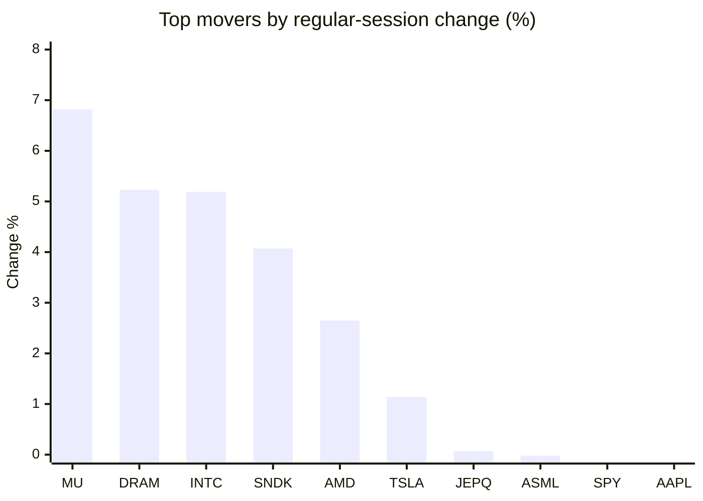
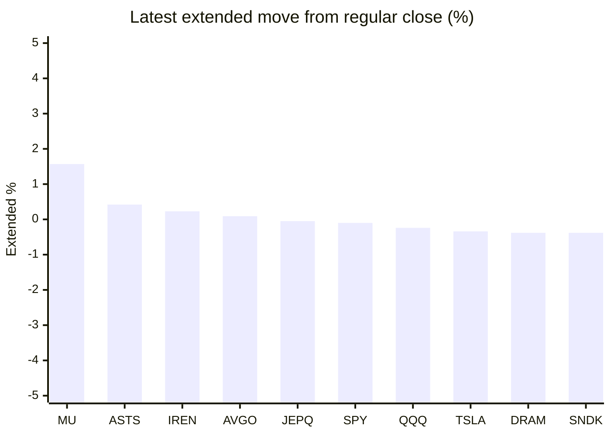

# Stock Brief - 2026-06-23

Generated at 2026-06-23 13:11 +07 from `watchlist.md`.
Prices are snapshots from Yahoo Finance public chart data. Extended/overnight is the latest available pre/post-market datapoint from the same feed.

## Market Snapshot

- SPY: close 744.39, latest extended 743.68, regular move -0.31%, extended move -0.10%
- QQQ: close 737.95, latest extended 736.17, regular move -0.36%, extended move -0.24%
- JEPQ: close 61.38, latest extended 61.35, regular move +0.07%, extended move -0.05%

## Watchlist Prices

| Ticker | Name | Regular close | Latest extended/overnight | Regular move | Extended move | Latest data time | Source |
|---|---|---:|---:|---:|---:|---|---|
| INTC | Intel Corporation | 140.94 USD | 139.00 USD | +5.19% | -1.38% | 2026-06-22 19:59 EDT | [Yahoo](https://finance.yahoo.com/quote/INTC/) |
| AVGO | Broadcom Inc. | 392.13 USD | 392.50 USD | -4.67% | +0.09% | 2026-06-22 19:59 EDT | [Yahoo](https://finance.yahoo.com/quote/AVGO/) |
| RKLB | Rocket Lab Corporation | 100.29 USD | 99.16 USD | -6.48% | -1.13% | 2026-06-22 19:59 EDT | [Yahoo](https://finance.yahoo.com/quote/RKLB/) |
| AAPL | Apple Inc. | 297.01 USD | 295.65 USD | -0.34% | -0.46% | 2026-06-22 19:59 EDT | [Yahoo](https://finance.yahoo.com/quote/AAPL/) |
| NVDA | NVIDIA Corporation | 208.65 USD | 207.82 USD | -0.97% | -0.40% | 2026-06-22 19:59 EDT | [Yahoo](https://finance.yahoo.com/quote/NVDA/) |
| TSLA | Tesla, Inc. | 405.05 USD | 403.66 USD | +1.14% | -0.34% | 2026-06-22 19:59 EDT | [Yahoo](https://finance.yahoo.com/quote/TSLA/) |
| SNDK | Sandisk Corporation | 2,273.73 USD | 2,265.00 USD | +4.07% | -0.38% | 2026-06-22 19:59 EDT | [Yahoo](https://finance.yahoo.com/quote/SNDK/) |
| QQQ | Invesco QQQ Trust, Series 1 | 737.95 USD | 736.17 USD | -0.36% | -0.24% | 2026-06-22 19:59 EDT | [Yahoo](https://finance.yahoo.com/quote/QQQ/) |
| SPY | State Street SPDR S&P 500 ETF T | 744.39 USD | 743.68 USD | -0.31% | -0.10% | 2026-06-22 19:59 EDT | [Yahoo](https://finance.yahoo.com/quote/SPY/) |
| JEPQ | JPMorgan Nasdaq Equity Premium  | 61.38 USD | 61.35 USD | +0.07% | -0.05% | 2026-06-22 19:59 EDT | [Yahoo](https://finance.yahoo.com/quote/JEPQ/) |
| ASTS | AST SpaceMobile, Inc. | 73.19 USD | 73.50 USD | -9.26% | +0.42% | 2026-06-22 19:59 EDT | [Yahoo](https://finance.yahoo.com/quote/ASTS/) |
| MU | Micron Technology, Inc. | 1,211.38 USD | 1,230.43 USD | +6.82% | +1.57% | 2026-06-22 19:59 EDT | [Yahoo](https://finance.yahoo.com/quote/MU/) |
| IREN | IREN LIMITED | 56.87 USD | 57.00 USD | -5.15% | +0.23% | 2026-06-22 19:59 EDT | [Yahoo](https://finance.yahoo.com/quote/IREN/) |
| EOSE | Eos Energy Enterprises, Inc. | 7.34 USD | 7.30 USD | -4.05% | -0.54% | 2026-06-22 19:57 EDT | [Yahoo](https://finance.yahoo.com/quote/EOSE/) |
| GOOG | Alphabet Inc. | 348.78 USD | 345.40 USD | -5.08% | -0.97% | 2026-06-22 19:59 EDT | [Yahoo](https://finance.yahoo.com/quote/GOOG/) |
| DRAM | Roundhill Memory ETF | 80.72 USD | 80.41 USD | +5.23% | -0.38% | 2026-06-22 20:00 EDT | [Yahoo](https://finance.yahoo.com/quote/DRAM/) |
| AMD | Advanced Micro Devices, Inc. | 551.63 USD | 546.50 USD | +2.65% | -0.93% | 2026-06-22 19:59 EDT | [Yahoo](https://finance.yahoo.com/quote/AMD/) |
| ASML | ASML Holding N.V. - New York Re | 1,929.25 USD | 1,920.68 USD | -0.02% | -0.44% | 2026-06-22 19:59 EDT | [Yahoo](https://finance.yahoo.com/quote/ASML/) |

## Charts

### Top Movers - Regular Session

### Extended / Overnight Move

### Quick Heatmap

| Group | Names in watchlist | Avg regular move | Avg extended move |
|---|---|---:|---:|
| Mega-cap tech | AVGO, AAPL, NVDA, TSLA, GOOG | -1.98% | -0.41% |
| Semis / memory | INTC, SNDK, MU, DRAM, AMD, ASML | +3.99% | -0.32% |
| Space / high beta | RKLB, ASTS, IREN, EOSE | -6.24% | -0.25% |
| ETFs | QQQ, SPY, JEPQ | -0.20% | -0.13% |

## News Headlines

- [3 Dividend Stocks to Buy Right Now and Hold Forever](https://www.fool.com/investing/2026/06/23/3-dividend-stocks-to-buy-right-now-and-hold-foreve/?.tsrc=rss) (2026-06-23 12:50 Bangkok)
- [Is SpaceX Outrageously Overvalued or a Long-Term Investment With Unmatched Potential?](https://www.fool.com/investing/2026/06/23/is-spacex-outrageously-overvalued-or-a-long-term-i/?.tsrc=rss) (2026-06-23 12:35 Bangkok)
- [Kevin Warsh Is Shifting the Future of the Fed in 1 Major Way -- and It Might Rattle Wall Street](https://www.fool.com/investing/2026/06/23/kevin-warsh-is-shifting-the-future-of-the-fed-in-1/?.tsrc=rss) (2026-06-23 12:20 Bangkok)
- [Tesla headed for its biggest fight in Europe yet](https://www.thestreet.com/automotive/tesla-fsd-fight-europe-sweden?.tsrc=rss) (2026-06-23 12:07 Bangkok)
- [Is Viking Therapeutics Stock a No-Brainer Buy Below $35?](https://www.fool.com/investing/2026/06/23/is-viking-therapeutics-stock-a-no-brainer-buy-belo/?.tsrc=rss) (2026-06-23 11:50 Bangkok)
- [Did SpaceX Stock Just Peak? Here's What History Says.](https://www.fool.com/investing/2026/06/23/spacex-stock-is-the-top-in/?.tsrc=rss) (2026-06-23 11:35 Bangkok)
- [Sandisk (SNDK) Is Up 7.9% After AI Deals Cement Its Pure-Play NAND Pivot - What's Changed](https://finance.yahoo.com/technology/ai/articles/sandisk-sndk-7-9-ai-043015620.html?.tsrc=rss) (2026-06-23 11:30 Bangkok)
- [Tesla Stock Heads For Red June — Jefferies Warns It Could Become a SpaceX Proxy As Merger Talk Builds](https://stocktwits.com/news-articles/markets/equity/tesla-red-june-jefferies-spacex-proxy-merger-talk/cZKvq2WR79j?.tsrc=rss) (2026-06-23 11:27 Bangkok)

## Caveats

- This is not investment advice. Extended-hours prices can be thin and volatile.
- Yahoo public endpoints may lag official exchange data.
