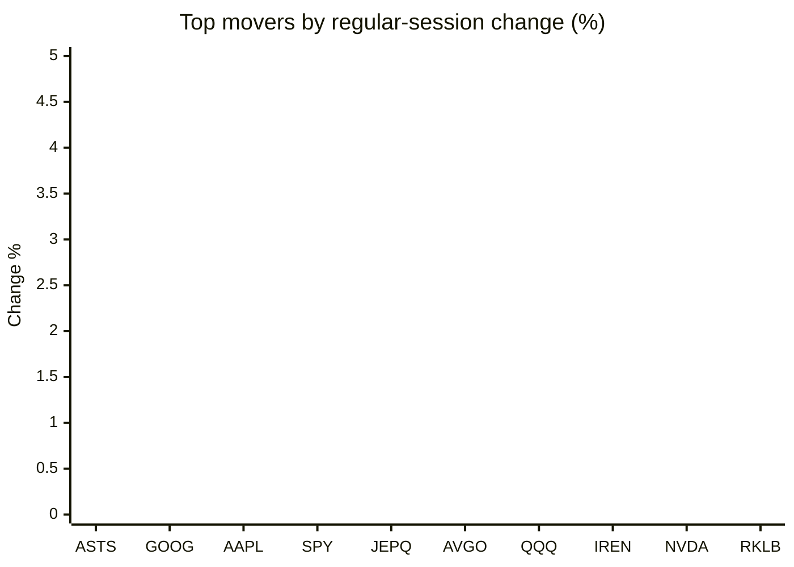
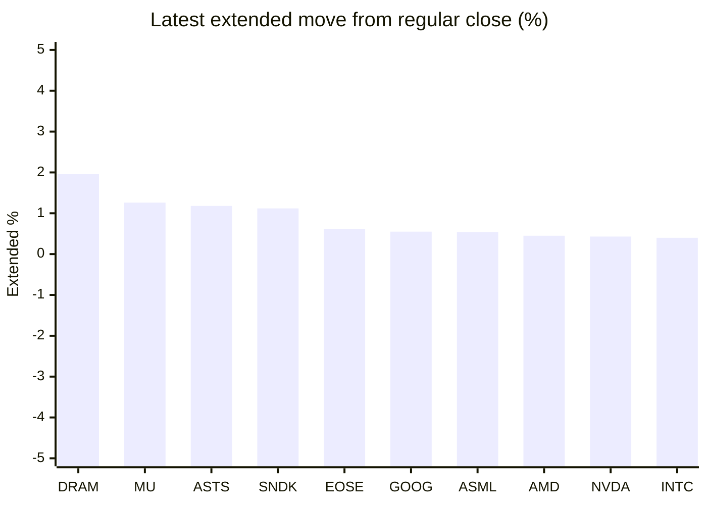

# Stock Brief - 2026-06-24

Generated at 2026-06-24 13:10 +07 from `watchlist.md`.
Prices are snapshots from Yahoo Finance public chart data. Extended/overnight is the latest available pre/post-market datapoint from the same feed.

## Market Snapshot

- SPY: close 733.58, latest extended 735.02, regular move -1.45%, extended move +0.20%
- QQQ: close 713.65, latest extended 716.04, regular move -3.29%, extended move +0.33%
- JEPQ: close 59.86, latest extended 60.05, regular move -2.48%, extended move +0.32%

## Watchlist Prices

| Ticker | Name | Regular close | Latest extended/overnight | Regular move | Extended move | Latest data time | Source |
|---|---|---:|---:|---:|---:|---|---|
| INTC | Intel Corporation | 132.28 USD | 132.81 USD | -6.14% | +0.40% | 2026-06-23 19:59 EDT | [Yahoo](https://finance.yahoo.com/quote/INTC/) |
| AVGO | Broadcom Inc. | 380.15 USD | 381.50 USD | -3.06% | +0.36% | 2026-06-23 19:59 EDT | [Yahoo](https://finance.yahoo.com/quote/AVGO/) |
| RKLB | Rocket Lab Corporation | 95.12 USD | 94.76 USD | -5.16% | -0.38% | 2026-06-23 19:59 EDT | [Yahoo](https://finance.yahoo.com/quote/RKLB/) |
| AAPL | Apple Inc. | 294.30 USD | 294.69 USD | -0.91% | +0.13% | 2026-06-23 19:59 EDT | [Yahoo](https://finance.yahoo.com/quote/AAPL/) |
| NVDA | NVIDIA Corporation | 200.04 USD | 200.90 USD | -4.13% | +0.43% | 2026-06-23 19:59 EDT | [Yahoo](https://finance.yahoo.com/quote/NVDA/) |
| TSLA | Tesla, Inc. | 381.61 USD | 382.46 USD | -5.79% | +0.22% | 2026-06-23 19:59 EDT | [Yahoo](https://finance.yahoo.com/quote/TSLA/) |
| SNDK | Sandisk Corporation | 1,963.60 USD | 1,985.60 USD | -13.64% | +1.12% | 2026-06-23 19:59 EDT | [Yahoo](https://finance.yahoo.com/quote/SNDK/) |
| QQQ | Invesco QQQ Trust, Series 1 | 713.65 USD | 716.04 USD | -3.29% | +0.33% | 2026-06-23 19:59 EDT | [Yahoo](https://finance.yahoo.com/quote/QQQ/) |
| SPY | State Street SPDR S&P 500 ETF T | 733.58 USD | 735.02 USD | -1.45% | +0.20% | 2026-06-23 19:59 EDT | [Yahoo](https://finance.yahoo.com/quote/SPY/) |
| JEPQ | JPMorgan Nasdaq Equity Premium  | 59.86 USD | 60.05 USD | -2.48% | +0.32% | 2026-06-23 19:59 EDT | [Yahoo](https://finance.yahoo.com/quote/JEPQ/) |
| ASTS | AST SpaceMobile, Inc. | 72.87 USD | 73.73 USD | -0.44% | +1.18% | 2026-06-23 19:59 EDT | [Yahoo](https://finance.yahoo.com/quote/ASTS/) |
| MU | Micron Technology, Inc. | 1,051.77 USD | 1,065.00 USD | -13.18% | +1.26% | 2026-06-23 19:59 EDT | [Yahoo](https://finance.yahoo.com/quote/MU/) |
| IREN | IREN LIMITED | 54.72 USD | 54.90 USD | -3.78% | +0.33% | 2026-06-23 19:59 EDT | [Yahoo](https://finance.yahoo.com/quote/IREN/) |
| EOSE | Eos Energy Enterprises, Inc. | 6.49 USD | 6.53 USD | -11.58% | +0.62% | 2026-06-23 19:59 EDT | [Yahoo](https://finance.yahoo.com/quote/EOSE/) |
| GOOG | Alphabet Inc. | 346.08 USD | 348.00 USD | -0.77% | +0.55% | 2026-06-23 19:59 EDT | [Yahoo](https://finance.yahoo.com/quote/GOOG/) |
| DRAM | Roundhill Memory ETF | 69.22 USD | 70.58 USD | -14.25% | +1.96% | 2026-06-23 19:59 EDT | [Yahoo](https://finance.yahoo.com/quote/DRAM/) |
| AMD | Advanced Micro Devices, Inc. | 519.85 USD | 522.20 USD | -5.76% | +0.45% | 2026-06-23 19:59 EDT | [Yahoo](https://finance.yahoo.com/quote/AMD/) |
| ASML | ASML Holding N.V. - New York Re | 1,778.46 USD | 1,788.00 USD | -7.82% | +0.54% | 2026-06-23 19:59 EDT | [Yahoo](https://finance.yahoo.com/quote/ASML/) |

## Charts

### Top Movers - Regular Session

### Extended / Overnight Move

### Quick Heatmap

| Group | Names in watchlist | Avg regular move | Avg extended move |
|---|---|---:|---:|
| Mega-cap tech | AVGO, AAPL, NVDA, TSLA, GOOG | -2.93% | +0.34% |
| Semis / memory | INTC, SNDK, MU, DRAM, AMD, ASML | -10.13% | +0.96% |
| Space / high beta | RKLB, ASTS, IREN, EOSE | -5.24% | +0.44% |
| ETFs | QQQ, SPY, JEPQ | -2.41% | +0.28% |

## News Headlines

- [1 Striking Reason This Trillion-Dollar Cloud Pioneer Is a Better Artificial Intelligence (AI) Buy Than Apple Right Now](https://www.fool.com/investing/2026/06/24/1-striking-reason-this-trillion-dollar-cloud-pione/?.tsrc=rss) (2026-06-24 12:50 Bangkok)
- [BofA Says Apple’s (AAPL) New Siri Strategy Could Strengthen its AI Position](https://finance.yahoo.com/technology/ai/articles/bofa-says-apple-aapl-siri-053634927.html?.tsrc=rss) (2026-06-24 12:36 Bangkok)
- [SpaceX Stock Soared on Day One. Is the Stock a Buy at $2 Trillion?](https://www.fool.com/investing/2026/06/24/spacex-stock-soared-on-day-one-is-the-stock-a-buy/?.tsrc=rss) (2026-06-24 12:25 Bangkok)
- [KOSPI’s Recovery Fades as Early Gains Evaporate from SK Hynix](https://beincrypto.com/kospi-recovery-fades-sk-hynix-losses/?.tsrc=rss) (2026-06-24 12:16 Bangkok)
- [Qualcomm in talks to provide custom chip-design services to ByteDance, sources say](https://finance.yahoo.com/technology/articles/qualcomm-talks-custom-chip-design-043638832.html?.tsrc=rss) (2026-06-24 11:36 Bangkok)
- [Why SpaceX Could Become the Most Important AI Company Investors Aren't Calling an AI Company](https://www.fool.com/investing/2026/06/24/why-spacex-could-become-the-most-important-ai-comp/?.tsrc=rss) (2026-06-24 11:20 Bangkok)
- [Tesla stock has a SpaceX problem, veteran analyst says](https://www.thestreet.com/investing/stocks/tesla-stock-has-a-spacex-problem-veteran-analyst-says?.tsrc=rss) (2026-06-24 11:03 Bangkok)
- [Netflix Is Down 32% Since Reed Hastings Said He Was Leaving. Should You Buy the Dip or Is It a Red Flag?](https://www.fool.com/investing/2026/06/23/netflix-is-down-32-since-reed-hastings-said-he-was/?.tsrc=rss) (2026-06-24 10:50 Bangkok)

## Caveats

- This is not investment advice. Extended-hours prices can be thin and volatile.
- Yahoo public endpoints may lag official exchange data.
