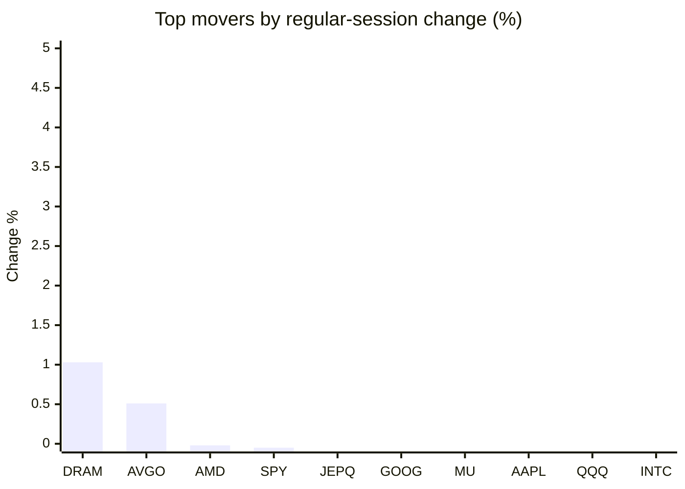
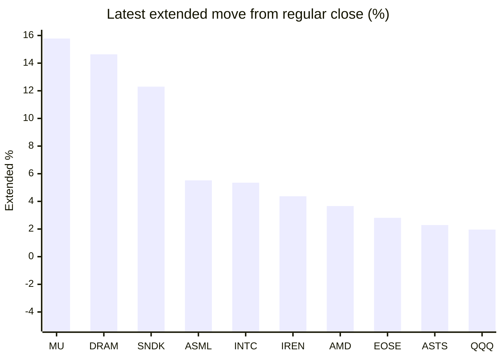

# Stock Brief - 2026-06-25

Generated at 2026-06-25 13:11 +07 from `watchlist.md`.
Prices are snapshots from Yahoo Finance public chart data. Extended/overnight is the latest available pre/post-market datapoint from the same feed.

## Market Snapshot

- SPY: close 733.24, latest extended 737.22, regular move -0.05%, extended move +0.54%
- QQQ: close 710.62, latest extended 724.54, regular move -0.42%, extended move +1.96%
- JEPQ: close 59.69, latest extended 60.60, regular move -0.28%, extended move +1.52%

## Watchlist Prices

| Ticker | Name | Regular close | Latest extended/overnight | Regular move | Extended move | Latest data time | Source |
|---|---|---:|---:|---:|---:|---|---|
| INTC | Intel Corporation | 131.65 USD | 138.69 USD | -0.48% | +5.35% | 2026-06-24 19:59 EDT | [Yahoo](https://finance.yahoo.com/quote/INTC/) |
| AVGO | Broadcom Inc. | 382.07 USD | 389.55 USD | +0.51% | +1.96% | 2026-06-24 19:59 EDT | [Yahoo](https://finance.yahoo.com/quote/AVGO/) |
| RKLB | Rocket Lab Corporation | 85.41 USD | 86.79 USD | -10.21% | +1.62% | 2026-06-24 19:59 EDT | [Yahoo](https://finance.yahoo.com/quote/RKLB/) |
| AAPL | Apple Inc. | 293.08 USD | 290.80 USD | -0.41% | -0.78% | 2026-06-24 19:59 EDT | [Yahoo](https://finance.yahoo.com/quote/AAPL/) |
| NVDA | NVIDIA Corporation | 199.00 USD | 200.69 USD | -0.52% | +0.85% | 2026-06-24 19:59 EDT | [Yahoo](https://finance.yahoo.com/quote/NVDA/) |
| TSLA | Tesla, Inc. | 375.53 USD | 378.00 USD | -1.59% | +0.66% | 2026-06-24 19:59 EDT | [Yahoo](https://finance.yahoo.com/quote/TSLA/) |
| SNDK | Sandisk Corporation | 1,914.46 USD | 2,150.02 USD | -2.50% | +12.30% | 2026-06-24 19:59 EDT | [Yahoo](https://finance.yahoo.com/quote/SNDK/) |
| QQQ | Invesco QQQ Trust, Series 1 | 710.62 USD | 724.54 USD | -0.42% | +1.96% | 2026-06-24 19:59 EDT | [Yahoo](https://finance.yahoo.com/quote/QQQ/) |
| SPY | State Street SPDR S&P 500 ETF T | 733.24 USD | 737.22 USD | -0.05% | +0.54% | 2026-06-24 19:59 EDT | [Yahoo](https://finance.yahoo.com/quote/SPY/) |
| JEPQ | JPMorgan Nasdaq Equity Premium  | 59.69 USD | 60.60 USD | -0.28% | +1.52% | 2026-06-24 19:59 EDT | [Yahoo](https://finance.yahoo.com/quote/JEPQ/) |
| ASTS | AST SpaceMobile, Inc. | 68.01 USD | 69.57 USD | -6.67% | +2.29% | 2026-06-24 19:59 EDT | [Yahoo](https://finance.yahoo.com/quote/ASTS/) |
| MU | Micron Technology, Inc. | 1,048.51 USD | 1,213.96 USD | -0.31% | +15.78% | 2026-06-24 19:59 EDT | [Yahoo](https://finance.yahoo.com/quote/MU/) |
| IREN | IREN LIMITED | 50.30 USD | 52.50 USD | -8.08% | +4.37% | 2026-06-24 19:59 EDT | [Yahoo](https://finance.yahoo.com/quote/IREN/) |
| EOSE | Eos Energy Enterprises, Inc. | 6.06 USD | 6.23 USD | -6.63% | +2.81% | 2026-06-24 19:59 EDT | [Yahoo](https://finance.yahoo.com/quote/EOSE/) |
| GOOG | Alphabet Inc. | 345.04 USD | 342.00 USD | -0.30% | -0.88% | 2026-06-24 19:59 EDT | [Yahoo](https://finance.yahoo.com/quote/GOOG/) |
| DRAM | Roundhill Memory ETF | 69.93 USD | 80.17 USD | +1.03% | +14.64% | 2026-06-24 19:59 EDT | [Yahoo](https://finance.yahoo.com/quote/DRAM/) |
| AMD | Advanced Micro Devices, Inc. | 519.74 USD | 538.78 USD | -0.02% | +3.66% | 2026-06-24 19:59 EDT | [Yahoo](https://finance.yahoo.com/quote/AMD/) |
| ASML | ASML Holding N.V. - New York Re | 1,762.77 USD | 1,860.00 USD | -0.88% | +5.52% | 2026-06-24 19:59 EDT | [Yahoo](https://finance.yahoo.com/quote/ASML/) |

## Charts

### Top Movers - Regular Session

### Extended / Overnight Move

### Quick Heatmap

| Group | Names in watchlist | Avg regular move | Avg extended move |
|---|---|---:|---:|
| Mega-cap tech | AVGO, AAPL, NVDA, TSLA, GOOG | -0.46% | +0.36% |
| Semis / memory | INTC, SNDK, MU, DRAM, AMD, ASML | -0.53% | +9.54% |
| Space / high beta | RKLB, ASTS, IREN, EOSE | -7.90% | +2.77% |
| ETFs | QQQ, SPY, JEPQ | -0.25% | +1.34% |

## News Headlines

- [2 Wide-Moat Dividend Stocks to Buy and Hold Forever](https://www.fool.com/investing/2026/06/25/2-wide-moat-dividend-stocks-to-buy-and-hold-foreve/?.tsrc=rss) (2026-06-25 13:05 Bangkok)
- [This ETF Has More Than Doubled the S&P 500's Returns Over the Past Decade. Is It a Buy for the Next Decade?](https://www.fool.com/investing/2026/06/25/this-etf-has-more-than-doubled-the-sp-500s-returns/?.tsrc=rss) (2026-06-25 12:50 Bangkok)
- [1 Stock Has Utterly Failed for a Decade: 3 Reasons It's Finally a Buy](https://www.fool.com/investing/2026/06/25/1-stock-has-utterly-failed-for-a-decade-3-reasons/?.tsrc=rss) (2026-06-25 12:25 Bangkok)
- [I Correctly Predicted Alphabet Would Join the Dow Jones Industrial Average in June. Here's What the Index Shake-Up Means for Investors.](https://www.fool.com/investing/2026/06/25/i-correctly-predicted-alphabet-would-join-the-dow/?.tsrc=rss) (2026-06-25 12:20 Bangkok)
- [Corning (GLW) Lands Amazon Fiber Deal As AI Data Center Demand Builds](https://finance.yahoo.com/markets/stocks/articles/corning-glw-lands-amazon-fiber-050633661.html?.tsrc=rss) (2026-06-25 12:06 Bangkok)
- [4 Blowout Numbers From Micron's Earnings Investors Need To See](https://www.fool.com/investing/2026/06/25/x-blowout-numbers-from-microns-earnings-investors/?.tsrc=rss) (2026-06-25 12:05 Bangkok)
- [Micron Technology Inc (MU) Q3 2026 Earnings Call Highlights: Record Revenue and Strategic ...](https://finance.yahoo.com/markets/stocks/articles/micron-technology-inc-mu-q3-050020645.html?.tsrc=rss) (2026-06-25 12:00 Bangkok)
- [Rebound in tech shares pushes Asian shares higher, while oil prices fall](https://finance.yahoo.com/markets/world-indices/articles/rebound-tech-shares-pushes-asian-045345595.html?.tsrc=rss) (2026-06-25 11:53 Bangkok)

## Caveats

- This is not investment advice. Extended-hours prices can be thin and volatile.
- Yahoo public endpoints may lag official exchange data.
