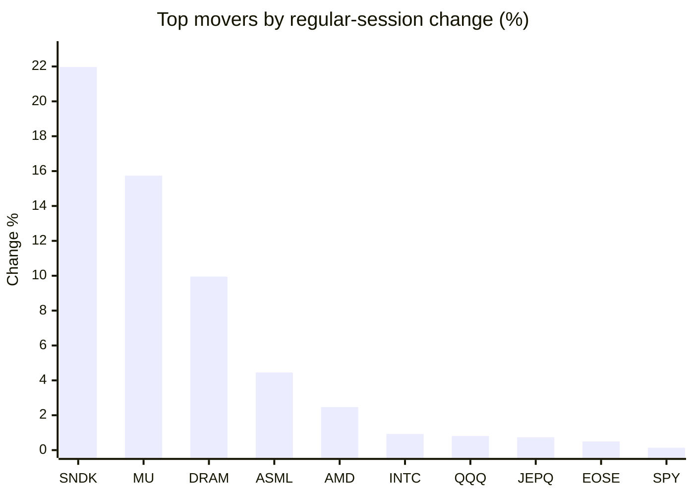
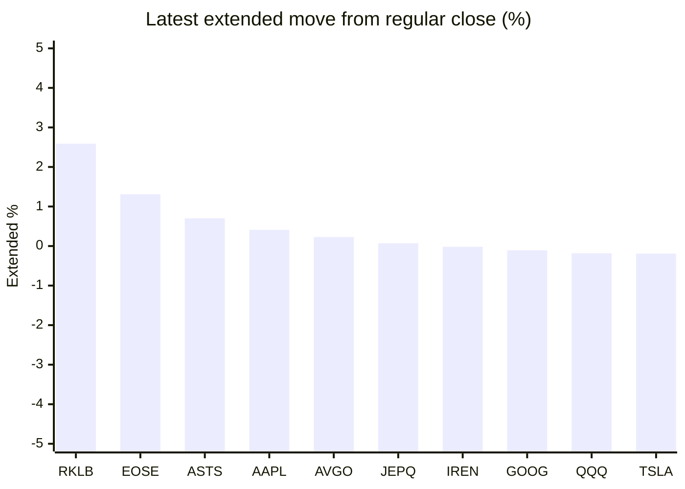

# Stock Brief - 2026-06-26

Generated at 2026-06-26 13:14 +07 from `watchlist.md`.
Prices are snapshots from Yahoo Finance public chart data. Extended/overnight is the latest available pre/post-market datapoint from the same feed.

## Market Snapshot

- SPY: close 734.30, latest extended 732.89, regular move +0.14%, extended move -0.19%
- QQQ: close 716.38, latest extended 715.10, regular move +0.81%, extended move -0.18%
- JEPQ: close 60.13, latest extended 60.17, regular move +0.74%, extended move +0.07%

## Watchlist Prices

| Ticker | Name | Regular close | Latest extended/overnight | Regular move | Extended move | Latest data time | Source |
|---|---|---:|---:|---:|---:|---|---|
| INTC | Intel Corporation | 132.87 USD | 131.81 USD | +0.93% | -0.80% | 2026-06-25 19:59 EDT | [Yahoo](https://finance.yahoo.com/quote/INTC/) |
| AVGO | Broadcom Inc. | 378.91 USD | 379.80 USD | -0.83% | +0.23% | 2026-06-25 19:59 EDT | [Yahoo](https://finance.yahoo.com/quote/AVGO/) |
| RKLB | Rocket Lab Corporation | 80.69 USD | 82.78 USD | -5.53% | +2.59% | 2026-06-25 19:59 EDT | [Yahoo](https://finance.yahoo.com/quote/RKLB/) |
| AAPL | Apple Inc. | 275.15 USD | 276.29 USD | -6.12% | +0.41% | 2026-06-25 19:59 EDT | [Yahoo](https://finance.yahoo.com/quote/AAPL/) |
| NVDA | NVIDIA Corporation | 195.74 USD | 194.80 USD | -1.64% | -0.48% | 2026-06-25 19:59 EDT | [Yahoo](https://finance.yahoo.com/quote/NVDA/) |
| TSLA | Tesla, Inc. | 375.12 USD | 374.40 USD | -0.11% | -0.19% | 2026-06-25 19:59 EDT | [Yahoo](https://finance.yahoo.com/quote/TSLA/) |
| SNDK | Sandisk Corporation | 2,335.00 USD | 2,316.95 USD | +21.97% | -0.77% | 2026-06-25 19:59 EDT | [Yahoo](https://finance.yahoo.com/quote/SNDK/) |
| QQQ | Invesco QQQ Trust, Series 1 | 716.38 USD | 715.10 USD | +0.81% | -0.18% | 2026-06-25 19:59 EDT | [Yahoo](https://finance.yahoo.com/quote/QQQ/) |
| SPY | State Street SPDR S&P 500 ETF T | 734.30 USD | 732.89 USD | +0.14% | -0.19% | 2026-06-25 19:59 EDT | [Yahoo](https://finance.yahoo.com/quote/SPY/) |
| JEPQ | JPMorgan Nasdaq Equity Premium  | 60.13 USD | 60.17 USD | +0.74% | +0.07% | 2026-06-25 19:59 EDT | [Yahoo](https://finance.yahoo.com/quote/JEPQ/) |
| ASTS | AST SpaceMobile, Inc. | 65.62 USD | 66.08 USD | -3.51% | +0.70% | 2026-06-25 19:59 EDT | [Yahoo](https://finance.yahoo.com/quote/ASTS/) |
| MU | Micron Technology, Inc. | 1,213.56 USD | 1,188.08 USD | +15.74% | -2.10% | 2026-06-25 20:00 EDT | [Yahoo](https://finance.yahoo.com/quote/MU/) |
| IREN | IREN LIMITED | 47.74 USD | 47.73 USD | -5.09% | -0.02% | 2026-06-25 19:59 EDT | [Yahoo](https://finance.yahoo.com/quote/IREN/) |
| EOSE | Eos Energy Enterprises, Inc. | 6.09 USD | 6.17 USD | +0.50% | +1.31% | 2026-06-25 19:59 EDT | [Yahoo](https://finance.yahoo.com/quote/EOSE/) |
| GOOG | Alphabet Inc. | 342.19 USD | 341.82 USD | -0.83% | -0.11% | 2026-06-25 19:58 EDT | [Yahoo](https://finance.yahoo.com/quote/GOOG/) |
| DRAM | Roundhill Memory ETF | 76.89 USD | 76.54 USD | +9.95% | -0.45% | 2026-06-25 19:59 EDT | [Yahoo](https://finance.yahoo.com/quote/DRAM/) |
| AMD | Advanced Micro Devices, Inc. | 532.57 USD | 529.33 USD | +2.47% | -0.61% | 2026-06-25 19:59 EDT | [Yahoo](https://finance.yahoo.com/quote/AMD/) |
| ASML | ASML Holding N.V. - New York Re | 1,841.18 USD | 1,829.37 USD | +4.45% | -0.64% | 2026-06-25 19:59 EDT | [Yahoo](https://finance.yahoo.com/quote/ASML/) |

## Charts

### Top Movers - Regular Session

### Extended / Overnight Move

### Quick Heatmap

| Group | Names in watchlist | Avg regular move | Avg extended move |
|---|---|---:|---:|
| Mega-cap tech | AVGO, AAPL, NVDA, TSLA, GOOG | -1.90% | -0.03% |
| Semis / memory | INTC, SNDK, MU, DRAM, AMD, ASML | +9.25% | -0.90% |
| Space / high beta | RKLB, ASTS, IREN, EOSE | -3.41% | +1.15% |
| ETFs | QQQ, SPY, JEPQ | +0.56% | -0.10% |

## News Headlines

- [Micron Beats Meta in Market Cap: Can It Catch Nvidia Next?](https://beincrypto.com/micron-beats-meta-market-cap-catch-nvidia/?.tsrc=rss) (2026-06-26 12:59 Bangkok)
- [Morningstar's Fair Value for SpaceX (SPCX) Stock Is $62. The Stock Trades at $157. One of Them Is Wrong by $1.2 Trillion.](https://www.fool.com/investing/2026/06/26/morningstars-fair-value-of-spacex-stock-is-62-spcx/?.tsrc=rss) (2026-06-26 12:50 Bangkok)
- [Dow Jones Futures Fall, Techs Tumble After Mixed Market Signals; What To Do Now](https://finance.yahoo.com/m/39030516-de91-329d-8d9d-9e91b632c186/dow-jones-futures-fall%2C-techs.html?.tsrc=rss) (2026-06-26 12:44 Bangkok)
- [2 Excellent Stocks to Buy on the Dip](https://www.fool.com/investing/2026/06/26/2-excellent-stocks-to-buy-on-the-dip/?.tsrc=rss) (2026-06-26 12:35 Bangkok)
- [SpaceX May Be Eyeing US Mobile Market – Even As Musk Says ‘Star’ Branding Has Gone Too Far](https://stocktwits.com/news-articles/markets/equity/spacex-us-mobile-market-musk-star-branding/cZ1cXJ0R7g4?.tsrc=rss) (2026-06-26 12:32 Bangkok)
- [Dell To Officially Join Tesla, Oracle, Caterpillar In Texas As Stock Eyes Best Year Since Returning To Public Markets](https://stocktwits.com/news-articles/markets/equity/dell-to-officially-join-tesla-oracle-caterpillar-in-texas-as-stock-eyes-best-year-since-returning-to-public-markets/cZ1cXbeR7g3?.tsrc=rss) (2026-06-26 12:23 Bangkok)
- [This Stock Has Already Doubled This Year and Is Still Racing Towards a Major Catalyst](https://www.fool.com/investing/2026/06/26/this-stock-has-already-doubled-this-year-and-it-is/?.tsrc=rss) (2026-06-26 12:20 Bangkok)
- [Apple (AAPL) Faces £3 Billion UK iCloud Lawsuit As Class Action Moves Ahead](https://finance.yahoo.com/markets/stocks/articles/apple-aapl-faces-3-billion-050549139.html?.tsrc=rss) (2026-06-26 12:05 Bangkok)

## Caveats

- This is not investment advice. Extended-hours prices can be thin and volatile.
- Yahoo public endpoints may lag official exchange data.
