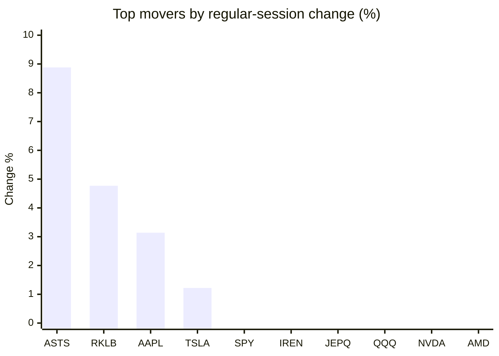
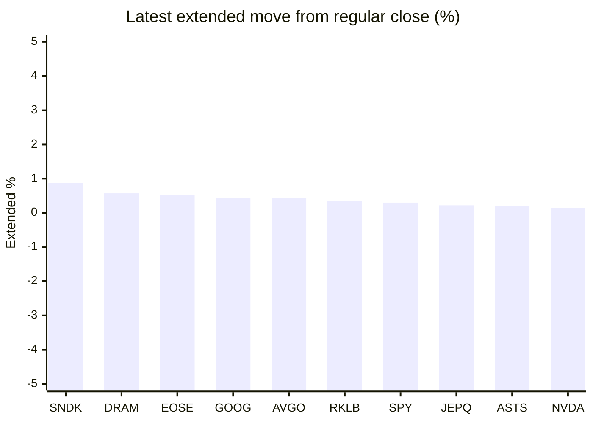

# Stock Brief - 2026-06-27

Generated at 2026-06-27 12:56 +07 from `watchlist.md`.
Prices are snapshots from Yahoo Finance public chart data. Extended/overnight is the latest available pre/post-market datapoint from the same feed.

## Market Snapshot

- SPY: close 728.99, latest extended 731.20, regular move -0.72%, extended move +0.30%
- QQQ: close 706.52, latest extended 706.14, regular move -1.38%, extended move -0.05%
- JEPQ: close 59.42, latest extended 59.55, regular move -1.18%, extended move +0.22%

## Watchlist Prices

| Ticker | Name | Regular close | Latest extended/overnight | Regular move | Extended move | Latest data time | Source |
|---|---|---:|---:|---:|---:|---|---|
| INTC | Intel Corporation | 128.32 USD | 127.62 USD | -3.42% | -0.55% | 2026-06-26 19:59 EDT | [Yahoo](https://finance.yahoo.com/quote/INTC/) |
| AVGO | Broadcom Inc. | 365.02 USD | 366.59 USD | -3.67% | +0.43% | 2026-06-26 19:59 EDT | [Yahoo](https://finance.yahoo.com/quote/AVGO/) |
| RKLB | Rocket Lab Corporation | 84.54 USD | 84.85 USD | +4.77% | +0.36% | 2026-06-26 19:59 EDT | [Yahoo](https://finance.yahoo.com/quote/RKLB/) |
| AAPL | Apple Inc. | 283.78 USD | 282.50 USD | +3.14% | -0.45% | 2026-06-26 19:59 EDT | [Yahoo](https://finance.yahoo.com/quote/AAPL/) |
| NVDA | NVIDIA Corporation | 192.53 USD | 192.79 USD | -1.64% | +0.14% | 2026-06-26 19:59 EDT | [Yahoo](https://finance.yahoo.com/quote/NVDA/) |
| TSLA | Tesla, Inc. | 379.71 USD | 377.86 USD | +1.22% | -0.49% | 2026-06-26 19:59 EDT | [Yahoo](https://finance.yahoo.com/quote/TSLA/) |
| SNDK | Sandisk Corporation | 2,090.71 USD | 2,109.01 USD | -10.46% | +0.88% | 2026-06-26 19:59 EDT | [Yahoo](https://finance.yahoo.com/quote/SNDK/) |
| QQQ | Invesco QQQ Trust, Series 1 | 706.52 USD | 706.14 USD | -1.38% | -0.05% | 2026-06-26 19:59 EDT | [Yahoo](https://finance.yahoo.com/quote/QQQ/) |
| SPY | State Street SPDR S&P 500 ETF T | 728.99 USD | 731.20 USD | -0.72% | +0.30% | 2026-06-26 19:59 EDT | [Yahoo](https://finance.yahoo.com/quote/SPY/) |
| JEPQ | JPMorgan Nasdaq Equity Premium  | 59.42 USD | 59.55 USD | -1.18% | +0.22% | 2026-06-26 19:59 EDT | [Yahoo](https://finance.yahoo.com/quote/JEPQ/) |
| ASTS | AST SpaceMobile, Inc. | 71.45 USD | 71.59 USD | +8.88% | +0.20% | 2026-06-26 19:59 EDT | [Yahoo](https://finance.yahoo.com/quote/ASTS/) |
| MU | Micron Technology, Inc. | 1,132.33 USD | 1,133.36 USD | -6.69% | +0.09% | 2026-06-26 19:59 EDT | [Yahoo](https://finance.yahoo.com/quote/MU/) |
| IREN | IREN LIMITED | 47.21 USD | 46.98 USD | -1.11% | -0.49% | 2026-06-26 19:59 EDT | [Yahoo](https://finance.yahoo.com/quote/IREN/) |
| EOSE | Eos Energy Enterprises, Inc. | 5.93 USD | 5.96 USD | -2.63% | +0.51% | 2026-06-26 19:59 EDT | [Yahoo](https://finance.yahoo.com/quote/EOSE/) |
| GOOG | Alphabet Inc. | 334.69 USD | 336.14 USD | -2.19% | +0.43% | 2026-06-26 19:59 EDT | [Yahoo](https://finance.yahoo.com/quote/GOOG/) |
| DRAM | Roundhill Memory ETF | 71.88 USD | 72.29 USD | -6.52% | +0.57% | 2026-06-26 19:59 EDT | [Yahoo](https://finance.yahoo.com/quote/DRAM/) |
| AMD | Advanced Micro Devices, Inc. | 521.58 USD | 518.70 USD | -2.06% | -0.55% | 2026-06-26 19:59 EDT | [Yahoo](https://finance.yahoo.com/quote/AMD/) |
| ASML | ASML Holding N.V. - New York Re | 1,794.62 USD | 1,793.00 USD | -2.53% | -0.09% | 2026-06-26 19:59 EDT | [Yahoo](https://finance.yahoo.com/quote/ASML/) |

## Charts

### Top Movers - Regular Session

### Extended / Overnight Move

### Quick Heatmap

| Group | Names in watchlist | Avg regular move | Avg extended move |
|---|---|---:|---:|
| Mega-cap tech | AVGO, AAPL, NVDA, TSLA, GOOG | -0.63% | +0.01% |
| Semis / memory | INTC, SNDK, MU, DRAM, AMD, ASML | -5.28% | +0.06% |
| Space / high beta | RKLB, ASTS, IREN, EOSE | +2.48% | +0.14% |
| ETFs | QQQ, SPY, JEPQ | -1.09% | +0.16% |

## News Headlines

- [2 Reasons Not to Invest in SpaceX -- and What to Buy Instead](https://www.fool.com/investing/2026/06/27/2-reasons-not-to-invest-in-spacex-and-what-to-buy/?.tsrc=rss) (2026-06-27 12:20 Bangkok)
- [Micron (MU) Lands $100 Billion In Customer Deals After Blowout Q3](https://finance.yahoo.com/markets/stocks/articles/micron-mu-lands-100-billion-050641920.html?.tsrc=rss) (2026-06-27 12:06 Bangkok)
- [Nvidia's Market Cap Just Fell Below $5 Trillion. Here's Why It's a Buying Opportunity](https://www.fool.com/investing/2026/06/27/nvidias-market-cap-just-fell-below-5-trillion-here/?.tsrc=rss) (2026-06-27 11:25 Bangkok)
- [3 Beaten-Down AI Chip Stocks to Consider Buying in the Sell-Off](https://www.fool.com/investing/2026/06/26/3-beaten-down-ai-chip-stocks-to-consider-buying-in/?.tsrc=rss) (2026-06-27 10:50 Bangkok)
- [From $135 to $154: Tracking SpaceX's Stock Volatility in Its First Weeks as a Public Company](https://www.fool.com/investing/2026/06/26/from-135-to-154-tracking-spacexs-stock-volatility/?.tsrc=rss) (2026-06-27 10:33 Bangkok)
- [Scott Bessent Defends Tariff Reboot, Unveils ‘3 Through 3’ Plan To Beat ‘Structural Inflation’](https://finance.yahoo.com/economy/policy/articles/scott-bessent-defends-tariff-reboot-033101799.html?.tsrc=rss) (2026-06-27 10:31 Bangkok)
- [Apple seeks approval to buy chips from blacklisted Chinese company, FT reports](https://finance.yahoo.com/technology/articles/apple-seeks-approval-buy-chips-032619573.html?.tsrc=rss) (2026-06-27 10:26 Bangkok)
- [Wedbush spots clear investor opportunities in tech stocks](https://www.thestreet.com/investing/stocks/wedbush-spots-clear-investor-opportunities-in-tech-stocks?.tsrc=rss) (2026-06-27 10:07 Bangkok)

## Caveats

- This is not investment advice. Extended-hours prices can be thin and volatile.
- Yahoo public endpoints may lag official exchange data.
