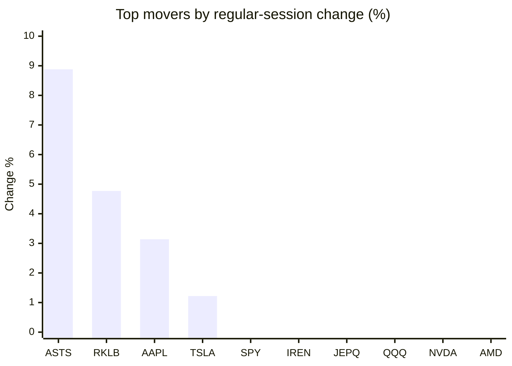
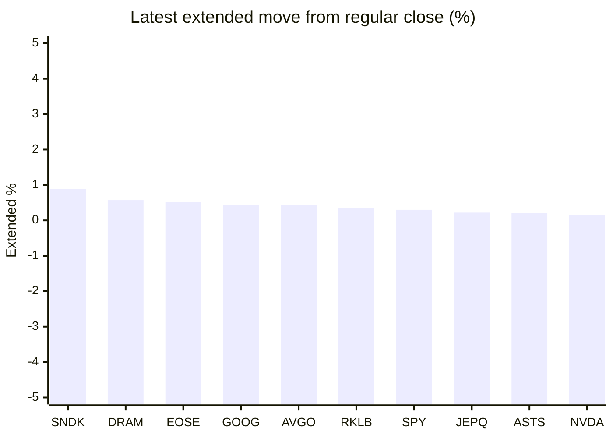

# Stock Brief - 2026-06-28

Generated at 2026-06-28 13:22 +07 from `watchlist.md`.
Prices are snapshots from Yahoo Finance public chart data. Extended/overnight is the latest available pre/post-market datapoint from the same feed.

## Market Snapshot

- SPY: close 728.99, latest extended 731.20, regular move -0.72%, extended move +0.30%
- QQQ: close 706.52, latest extended 706.14, regular move -1.38%, extended move -0.05%
- JEPQ: close 59.42, latest extended 59.55, regular move -1.18%, extended move +0.22%

## Watchlist Prices

| Ticker | Name | Regular close | Latest extended/overnight | Regular move | Extended move | Latest data time | Source |
|---|---|---:|---:|---:|---:|---|---|
| INTC | Intel Corporation | 128.32 USD | 127.62 USD | -3.42% | -0.55% | 2026-06-26 19:59 EDT | [Yahoo](https://finance.yahoo.com/quote/INTC/) |
| AVGO | Broadcom Inc. | 365.02 USD | 366.59 USD | -3.67% | +0.43% | 2026-06-26 19:59 EDT | [Yahoo](https://finance.yahoo.com/quote/AVGO/) |
| RKLB | Rocket Lab Corporation | 84.54 USD | 84.85 USD | +4.77% | +0.36% | 2026-06-26 19:59 EDT | [Yahoo](https://finance.yahoo.com/quote/RKLB/) |
| AAPL | Apple Inc. | 283.78 USD | 282.50 USD | +3.14% | -0.45% | 2026-06-26 19:59 EDT | [Yahoo](https://finance.yahoo.com/quote/AAPL/) |
| NVDA | NVIDIA Corporation | 192.53 USD | 192.79 USD | -1.64% | +0.14% | 2026-06-26 19:59 EDT | [Yahoo](https://finance.yahoo.com/quote/NVDA/) |
| TSLA | Tesla, Inc. | 379.71 USD | 377.86 USD | +1.22% | -0.49% | 2026-06-26 19:59 EDT | [Yahoo](https://finance.yahoo.com/quote/TSLA/) |
| SNDK | Sandisk Corporation | 2,090.71 USD | 2,109.01 USD | -10.46% | +0.88% | 2026-06-26 19:59 EDT | [Yahoo](https://finance.yahoo.com/quote/SNDK/) |
| QQQ | Invesco QQQ Trust, Series 1 | 706.52 USD | 706.14 USD | -1.38% | -0.05% | 2026-06-26 19:59 EDT | [Yahoo](https://finance.yahoo.com/quote/QQQ/) |
| SPY | State Street SPDR S&P 500 ETF T | 728.99 USD | 731.20 USD | -0.72% | +0.30% | 2026-06-26 19:59 EDT | [Yahoo](https://finance.yahoo.com/quote/SPY/) |
| JEPQ | JPMorgan Nasdaq Equity Premium  | 59.42 USD | 59.55 USD | -1.18% | +0.22% | 2026-06-26 19:59 EDT | [Yahoo](https://finance.yahoo.com/quote/JEPQ/) |
| ASTS | AST SpaceMobile, Inc. | 71.45 USD | 71.59 USD | +8.88% | +0.20% | 2026-06-26 19:59 EDT | [Yahoo](https://finance.yahoo.com/quote/ASTS/) |
| MU | Micron Technology, Inc. | 1,132.33 USD | 1,133.36 USD | -6.69% | +0.09% | 2026-06-26 19:59 EDT | [Yahoo](https://finance.yahoo.com/quote/MU/) |
| IREN | IREN LIMITED | 47.21 USD | 46.98 USD | -1.11% | -0.49% | 2026-06-26 19:59 EDT | [Yahoo](https://finance.yahoo.com/quote/IREN/) |
| EOSE | Eos Energy Enterprises, Inc. | 5.93 USD | 5.96 USD | -2.63% | +0.51% | 2026-06-26 19:59 EDT | [Yahoo](https://finance.yahoo.com/quote/EOSE/) |
| GOOG | Alphabet Inc. | 334.69 USD | 336.14 USD | -2.19% | +0.43% | 2026-06-26 19:59 EDT | [Yahoo](https://finance.yahoo.com/quote/GOOG/) |
| DRAM | Roundhill Memory ETF | 71.88 USD | 72.29 USD | -6.52% | +0.57% | 2026-06-26 19:59 EDT | [Yahoo](https://finance.yahoo.com/quote/DRAM/) |
| AMD | Advanced Micro Devices, Inc. | 521.58 USD | 518.70 USD | -2.06% | -0.55% | 2026-06-26 19:59 EDT | [Yahoo](https://finance.yahoo.com/quote/AMD/) |
| ASML | ASML Holding N.V. - New York Re | 1,794.62 USD | 1,793.00 USD | -2.53% | -0.09% | 2026-06-26 19:59 EDT | [Yahoo](https://finance.yahoo.com/quote/ASML/) |

## Charts

### Top Movers - Regular Session

### Extended / Overnight Move

### Quick Heatmap

| Group | Names in watchlist | Avg regular move | Avg extended move |
|---|---|---:|---:|
| Mega-cap tech | AVGO, AAPL, NVDA, TSLA, GOOG | -0.63% | +0.01% |
| Semis / memory | INTC, SNDK, MU, DRAM, AMD, ASML | -5.28% | +0.06% |
| Space / high beta | RKLB, ASTS, IREN, EOSE | +2.48% | +0.14% |
| ETFs | QQQ, SPY, JEPQ | -1.09% | +0.16% |

## News Headlines

- [Odine Partners with Supermicro (SMCI) to Accelerate AI Infrastructure Development in Türkiye](https://finance.yahoo.com/technology/ai/articles/odine-partners-supermicro-smci-accelerate-060845617.html?.tsrc=rss) (2026-06-28 13:08 Bangkok)
- [This Artificial Intelligence (AI) Stock Has Dropped 13% in 1 Month. Here's Why It's a Buy](https://www.fool.com/investing/2026/06/28/this-artificial-intelligence-ai-stock-has-dropped/?.tsrc=rss) (2026-06-28 12:50 Bangkok)
- [Bitcoin Just Dropped Below $60,000. History Says This Is What Happens Next.](https://www.fool.com/investing/2026/06/28/bitcoin-below-60000-history-says-this-happens-next/?.tsrc=rss) (2026-06-28 12:37 Bangkok)
- [3 Artificial Intelligence (AI) Stocks I'd Buy Now and Never Sell](https://www.fool.com/investing/2026/06/28/3-artificial-intelligence-ai-stocks-id-buy-now-and/?.tsrc=rss) (2026-06-28 11:25 Bangkok)
- [The Smartest Dividend Stocks to Buy With $5,000 Right Now](https://www.fool.com/investing/2026/06/28/the-smartest-dividend-stocks-to-buy-with-5000-righ/?.tsrc=rss) (2026-06-28 11:20 Bangkok)
- [Broadcom (AVGO) And OpenAI Launch Jalapeño AI Chip In Nine Months](https://finance.yahoo.com/technology/ai/articles/broadcom-avgo-openai-launch-jalape-041540441.html?.tsrc=rss) (2026-06-28 11:15 Bangkok)
- [Qualcomm (QCOM) Unveils AI Data Center Push With Meta Microsoft And Modular](https://finance.yahoo.com/technology/ai/articles/qualcomm-qcom-unveils-ai-data-041507851.html?.tsrc=rss) (2026-06-28 11:15 Bangkok)
- [Deutsche Bank Raises Micron (MU) Price Forecast as Revenue and Margins Surge](https://finance.yahoo.com/markets/stocks/articles/deutsche-bank-raises-micron-mu-040349085.html?.tsrc=rss) (2026-06-28 11:03 Bangkok)

## Caveats

- This is not investment advice. Extended-hours prices can be thin and volatile.
- Yahoo public endpoints may lag official exchange data.
