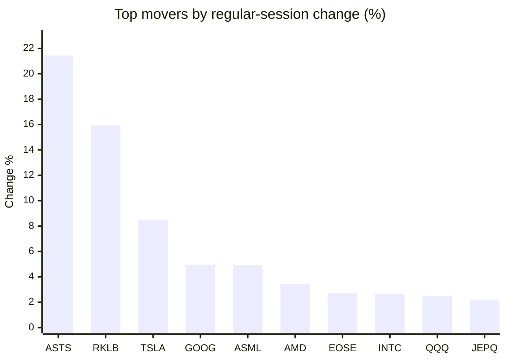
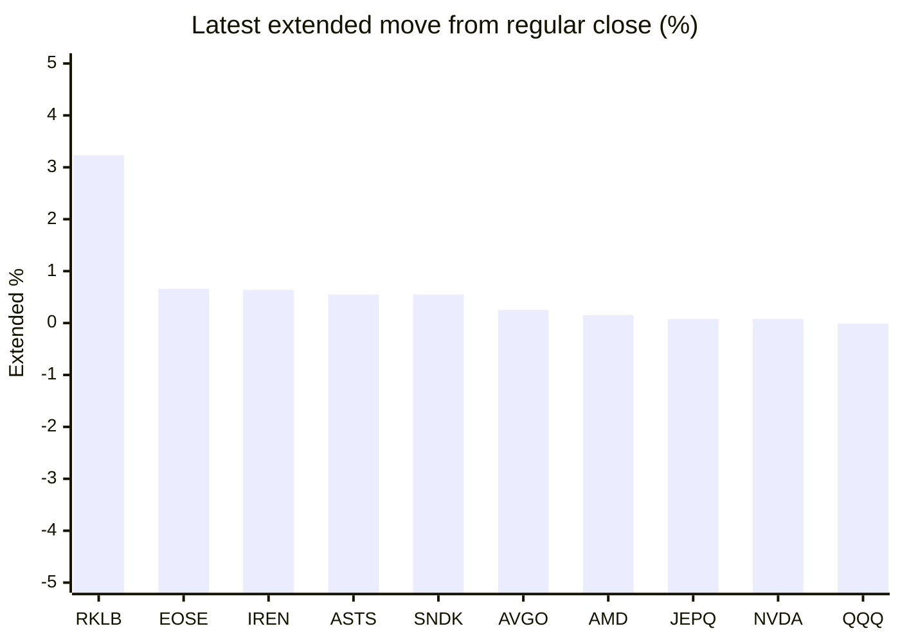

# Stock Brief - 2026-06-30

Generated at 2026-06-30 13:16 +07 from `watchlist.md`.
Prices are snapshots from Yahoo Finance public chart data. Extended/overnight is the latest available pre/post-market datapoint from the same feed.

## Market Snapshot

- SPY: close 741.00, latest extended 740.76, regular move +1.65%, extended move -0.03%
- QQQ: close 724.08, latest extended 724.02, regular move +2.49%, extended move -0.01%
- JEPQ: close 60.70, latest extended 60.75, regular move +2.15%, extended move +0.08%

## Watchlist Prices

| Ticker | Name | Regular close | Latest extended/overnight | Regular move | Extended move | Latest data time | Source |
|---|---|---:|---:|---:|---:|---|---|
| INTC | Intel Corporation | 131.72 USD | 131.68 USD | +2.65% | -0.03% | 2026-06-29 19:59 EDT | [Yahoo](https://finance.yahoo.com/quote/INTC/) |
| AVGO | Broadcom Inc. | 372.45 USD | 373.38 USD | +2.04% | +0.25% | 2026-06-29 19:59 EDT | [Yahoo](https://finance.yahoo.com/quote/AVGO/) |
| RKLB | Rocket Lab Corporation | 98.01 USD | 101.18 USD | +15.93% | +3.23% | 2026-06-29 19:59 EDT | [Yahoo](https://finance.yahoo.com/quote/RKLB/) |
| AAPL | Apple Inc. | 281.74 USD | 281.26 USD | -0.72% | -0.17% | 2026-06-29 19:59 EDT | [Yahoo](https://finance.yahoo.com/quote/AAPL/) |
| NVDA | NVIDIA Corporation | 194.97 USD | 195.12 USD | +1.27% | +0.08% | 2026-06-29 19:59 EDT | [Yahoo](https://finance.yahoo.com/quote/NVDA/) |
| TSLA | Tesla, Inc. | 411.84 USD | 409.00 USD | +8.46% | -0.69% | 2026-06-29 19:59 EDT | [Yahoo](https://finance.yahoo.com/quote/TSLA/) |
| SNDK | Sandisk Corporation | 2,050.39 USD | 2,061.71 USD | -1.93% | +0.55% | 2026-06-29 19:59 EDT | [Yahoo](https://finance.yahoo.com/quote/SNDK/) |
| QQQ | Invesco QQQ Trust, Series 1 | 724.08 USD | 724.02 USD | +2.49% | -0.01% | 2026-06-29 19:59 EDT | [Yahoo](https://finance.yahoo.com/quote/QQQ/) |
| SPY | State Street SPDR S&P 500 ETF T | 741.00 USD | 740.76 USD | +1.65% | -0.03% | 2026-06-29 19:59 EDT | [Yahoo](https://finance.yahoo.com/quote/SPY/) |
| JEPQ | JPMorgan Nasdaq Equity Premium  | 60.70 USD | 60.75 USD | +2.15% | +0.08% | 2026-06-29 19:59 EDT | [Yahoo](https://finance.yahoo.com/quote/JEPQ/) |
| ASTS | AST SpaceMobile, Inc. | 86.77 USD | 87.25 USD | +21.44% | +0.55% | 2026-06-29 19:59 EDT | [Yahoo](https://finance.yahoo.com/quote/ASTS/) |
| MU | Micron Technology, Inc. | 1,145.28 USD | 1,138.65 USD | +1.14% | -0.58% | 2026-06-29 19:59 EDT | [Yahoo](https://finance.yahoo.com/quote/MU/) |
| IREN | IREN LIMITED | 45.91 USD | 46.21 USD | -2.75% | +0.64% | 2026-06-29 19:59 EDT | [Yahoo](https://finance.yahoo.com/quote/IREN/) |
| EOSE | Eos Energy Enterprises, Inc. | 6.09 USD | 6.13 USD | +2.70% | +0.66% | 2026-06-29 19:58 EDT | [Yahoo](https://finance.yahoo.com/quote/EOSE/) |
| GOOG | Alphabet Inc. | 351.28 USD | 350.89 USD | +4.96% | -0.11% | 2026-06-29 19:59 EDT | [Yahoo](https://finance.yahoo.com/quote/GOOG/) |
| DRAM | Roundhill Memory ETF | 71.94 USD | 71.77 USD | +0.08% | -0.24% | 2026-06-29 19:59 EDT | [Yahoo](https://finance.yahoo.com/quote/DRAM/) |
| AMD | Advanced Micro Devices, Inc. | 539.49 USD | 540.28 USD | +3.43% | +0.15% | 2026-06-29 19:59 EDT | [Yahoo](https://finance.yahoo.com/quote/AMD/) |
| ASML | ASML Holding N.V. - New York Re | 1,883.11 USD | 1,880.00 USD | +4.93% | -0.17% | 2026-06-29 19:59 EDT | [Yahoo](https://finance.yahoo.com/quote/ASML/) |

## Charts

### Top Movers - Regular Session

### Extended / Overnight Move

### Quick Heatmap

| Group | Names in watchlist | Avg regular move | Avg extended move |
|---|---|---:|---:|
| Mega-cap tech | AVGO, AAPL, NVDA, TSLA, GOOG | +3.20% | -0.13% |
| Semis / memory | INTC, SNDK, MU, DRAM, AMD, ASML | +1.72% | -0.05% |
| Space / high beta | RKLB, ASTS, IREN, EOSE | +9.33% | +1.27% |
| ETFs | QQQ, SPY, JEPQ | +2.10% | +0.01% |

## News Headlines

- [KBC Group: KBC appoints Kris Vervaet as Group CIO](https://finance.yahoo.com/technology/articles/kbc-group-kbc-appoints-kris-061000387.html?.tsrc=rss) (2026-06-30 13:10 Bangkok)
- [Alphabet Just Replaced Verizon in the Dow. Could Nike Be the Next Dow Stock to Be Deleted?](https://www.fool.com/investing/2026/06/30/alphabet-just-replaced-verizon-in-dow-nike-stock/?.tsrc=rss) (2026-06-30 12:50 Bangkok)
- [AVGO Stock Heads For Worst Month In 7 Years: Co-Founder’s Quarterly Stake Sales Top $720M](https://stocktwits.com/news-articles/markets/equity/avgo-stock-heads-for-worst-month-in-7-years-co-founder-s-quarterly-stake-sales-top-720-m/cZ1QdqrR7iP?.tsrc=rss) (2026-06-30 12:28 Bangkok)
- [Dow Closes Above 52,000 for First Time as Alphabet Debuts](https://beincrypto.com/dow-52000-record-alphabet-debut-semis/?.tsrc=rss) (2026-06-30 12:24 Bangkok)
- [TSLA Q2 Deliveries May Miss Estimates, But Cantor Says AI, Robotics, Chips Could Drive 'Transformational' 2026](https://stocktwits.com/news-articles/markets/equity/tsla-q2-deliveries-cantor-miss-estimates-bullish-2026/cZ1QdGVR7iT?.tsrc=rss) (2026-06-30 12:00 Bangkok)
- [Prediction: Tesla Stock Could Go Parabolic After July 2](https://www.fool.com/investing/2026/06/30/prediction-tesla-stock-could-go-parabolic-after-ju/?.tsrc=rss) (2026-06-30 11:50 Bangkok)
- [Here's Why the Market Could Crash Under Trump](https://www.fool.com/investing/2026/06/30/heres-why-the-market-could-crash-under-trump/?.tsrc=rss) (2026-06-30 11:20 Bangkok)
- [Nike Just Hit an 11-Year Low. Will Its Turnaround Finally Start on Wednesday?](https://www.fool.com/investing/2026/06/29/nike-just-hit-an-11-year-low-will-its-turnaround-f/?.tsrc=rss) (2026-06-30 11:05 Bangkok)

## Caveats

- This is not investment advice. Extended-hours prices can be thin and volatile.
- Yahoo public endpoints may lag official exchange data.
