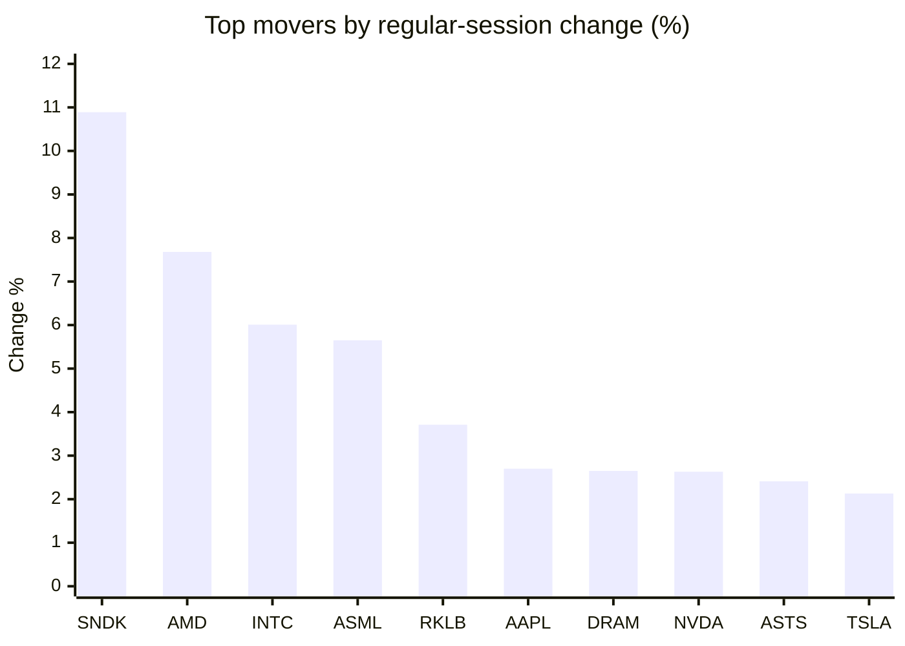
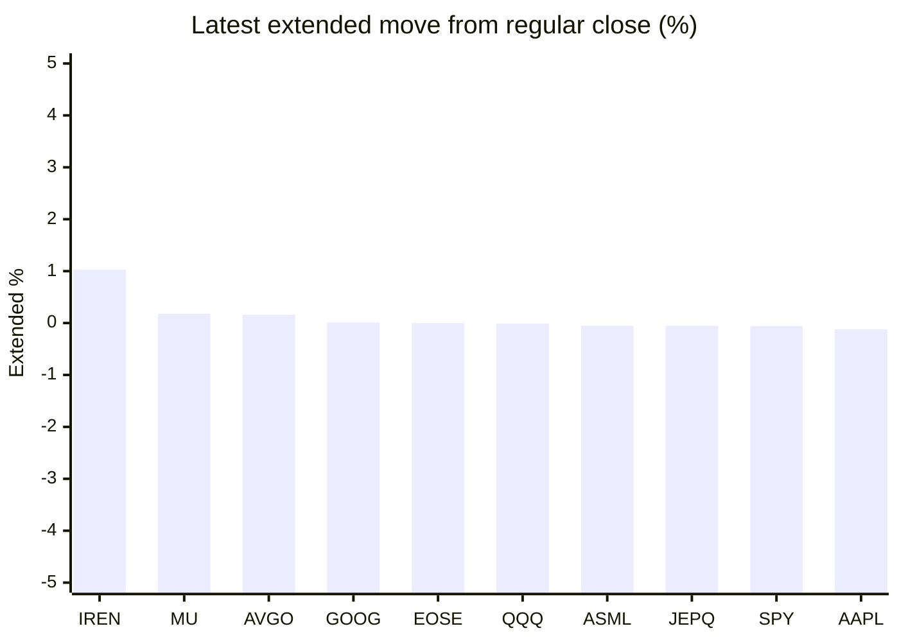

# Stock Brief - 2026-07-01

Generated at 2026-07-01 13:37 +07 from `watchlist.md`.
Prices are snapshots from Yahoo Finance public chart data. Extended/overnight is the latest available pre/post-market datapoint from the same feed.

## Market Snapshot

- SPY: close 746.77, latest extended 746.30, regular move +0.78%, extended move -0.06%
- QQQ: close 736.40, latest extended 736.29, regular move +1.70%, extended move -0.01%
- JEPQ: close 61.46, latest extended 61.43, regular move +1.25%, extended move -0.05%

## Watchlist Prices

| Ticker | Name | Regular close | Latest extended/overnight | Regular move | Extended move | Latest data time | Source |
|---|---|---:|---:|---:|---:|---|---|
| INTC | Intel Corporation | 139.63 USD | 139.40 USD | +6.01% | -0.17% | 2026-06-30 19:59 EDT | [Yahoo](https://finance.yahoo.com/quote/INTC/) |
| AVGO | Broadcom Inc. | 377.75 USD | 378.35 USD | +1.42% | +0.16% | 2026-06-30 19:59 EDT | [Yahoo](https://finance.yahoo.com/quote/AVGO/) |
| RKLB | Rocket Lab Corporation | 101.65 USD | 101.50 USD | +3.71% | -0.15% | 2026-06-30 19:59 EDT | [Yahoo](https://finance.yahoo.com/quote/RKLB/) |
| AAPL | Apple Inc. | 289.36 USD | 289.00 USD | +2.70% | -0.12% | 2026-06-30 19:59 EDT | [Yahoo](https://finance.yahoo.com/quote/AAPL/) |
| NVDA | NVIDIA Corporation | 200.09 USD | 199.53 USD | +2.63% | -0.28% | 2026-06-30 19:59 EDT | [Yahoo](https://finance.yahoo.com/quote/NVDA/) |
| TSLA | Tesla, Inc. | 420.60 USD | 415.99 USD | +2.13% | -1.10% | 2026-06-30 19:59 EDT | [Yahoo](https://finance.yahoo.com/quote/TSLA/) |
| SNDK | Sandisk Corporation | 2,273.73 USD | 2,247.00 USD | +10.89% | -1.18% | 2026-06-30 19:59 EDT | [Yahoo](https://finance.yahoo.com/quote/SNDK/) |
| QQQ | Invesco QQQ Trust, Series 1 | 736.40 USD | 736.29 USD | +1.70% | -0.01% | 2026-06-30 19:59 EDT | [Yahoo](https://finance.yahoo.com/quote/QQQ/) |
| SPY | State Street SPDR S&P 500 ETF T | 746.77 USD | 746.30 USD | +0.78% | -0.06% | 2026-06-30 19:59 EDT | [Yahoo](https://finance.yahoo.com/quote/SPY/) |
| JEPQ | JPMorgan Nasdaq Equity Premium  | 61.46 USD | 61.43 USD | +1.25% | -0.05% | 2026-06-30 19:59 EDT | [Yahoo](https://finance.yahoo.com/quote/JEPQ/) |
| ASTS | AST SpaceMobile, Inc. | 88.86 USD | 87.77 USD | +2.41% | -1.23% | 2026-06-30 19:59 EDT | [Yahoo](https://finance.yahoo.com/quote/ASTS/) |
| MU | Micron Technology, Inc. | 1,154.29 USD | 1,156.42 USD | +0.79% | +0.18% | 2026-06-30 19:59 EDT | [Yahoo](https://finance.yahoo.com/quote/MU/) |
| IREN | IREN LIMITED | 45.73 USD | 46.20 USD | -0.39% | +1.03% | 2026-06-30 19:59 EDT | [Yahoo](https://finance.yahoo.com/quote/IREN/) |
| EOSE | Eos Energy Enterprises, Inc. | 5.88 USD | 5.88 USD | -3.45% | -0.00% | 2026-06-30 19:59 EDT | [Yahoo](https://finance.yahoo.com/quote/EOSE/) |
| GOOG | Alphabet Inc. | 353.33 USD | 353.38 USD | +0.58% | +0.01% | 2026-06-30 19:59 EDT | [Yahoo](https://finance.yahoo.com/quote/GOOG/) |
| DRAM | Roundhill Memory ETF | 73.85 USD | 73.40 USD | +2.65% | -0.61% | 2026-06-30 19:59 EDT | [Yahoo](https://finance.yahoo.com/quote/DRAM/) |
| AMD | Advanced Micro Devices, Inc. | 580.91 USD | 579.54 USD | +7.68% | -0.24% | 2026-06-30 19:59 EDT | [Yahoo](https://finance.yahoo.com/quote/AMD/) |
| ASML | ASML Holding N.V. - New York Re | 1,989.44 USD | 1,988.50 USD | +5.65% | -0.05% | 2026-06-30 19:59 EDT | [Yahoo](https://finance.yahoo.com/quote/ASML/) |

## Charts

### Top Movers - Regular Session

### Extended / Overnight Move

### Quick Heatmap

| Group | Names in watchlist | Avg regular move | Avg extended move |
|---|---|---:|---:|
| Mega-cap tech | AVGO, AAPL, NVDA, TSLA, GOOG | +1.89% | -0.27% |
| Semis / memory | INTC, SNDK, MU, DRAM, AMD, ASML | +5.61% | -0.34% |
| Space / high beta | RKLB, ASTS, IREN, EOSE | +0.57% | -0.09% |
| ETFs | QQQ, SPY, JEPQ | +1.24% | -0.04% |

## News Headlines

- [Sezzle Still Looks Attractive at Its Current Level](https://www.fool.com/investing/2026/07/01/sezzle-still-looks-attractive-at-its-current-level/?.tsrc=rss) (2026-07-01 13:25 Bangkok)
- [SpaceX Nears a Major Milestone Within 15 Days, and Investors Should Pay Attention](https://www.fool.com/investing/2026/07/01/spacex-nears-a-major-milestone-within-15-days-and/?.tsrc=rss) (2026-07-01 12:50 Bangkok)
- [This Bond Maven Is Worried About ‘Excesses’ in the Market. How He’s Investing.](https://finance.yahoo.com/m/20bb45d5-9a3e-3f78-a3da-9dae54d36974/this-bond-maven-is-worried.html?.tsrc=rss) (2026-07-01 12:30 Bangkok)
- [Prediction: NuScale Power Stock Is a Buy Before August](https://www.fool.com/investing/2026/07/01/prediction-hot-ticker-stock-is-a-buy-before-august/?.tsrc=rss) (2026-07-01 12:20 Bangkok)
- [Flex Ltd. (FLEX) Introduces Three New Power Solutions at COMPUTEX 2026](https://finance.yahoo.com/technology/ai/articles/flex-ltd-flex-introduces-three-044154695.html?.tsrc=rss) (2026-07-01 11:41 Bangkok)
- [Coherent (COHR): Top 10 Stock To Buy That Was Added to the S&P 500 Recently?](https://finance.yahoo.com/markets/stocks/articles/coherent-cohr-top-10-stock-044147114.html?.tsrc=rss) (2026-07-01 11:41 Bangkok)
- [Here is Why Lumentum Holdings (LITE) Is Among the Best Stocks To Invest In](https://finance.yahoo.com/markets/stocks/articles/why-lumentum-holdings-lite-among-044144998.html?.tsrc=rss) (2026-07-01 11:41 Bangkok)
- [If You'd Invested $1,000 in Nvidia 5 Years Ago, Here's How Much You'd Have Today](https://www.fool.com/investing/2026/07/01/if-youd-invested-1000-in-hot-ticker-5-years-ago-he/?.tsrc=rss) (2026-07-01 11:35 Bangkok)

## Caveats

- This is not investment advice. Extended-hours prices can be thin and volatile.
- Yahoo public endpoints may lag official exchange data.
