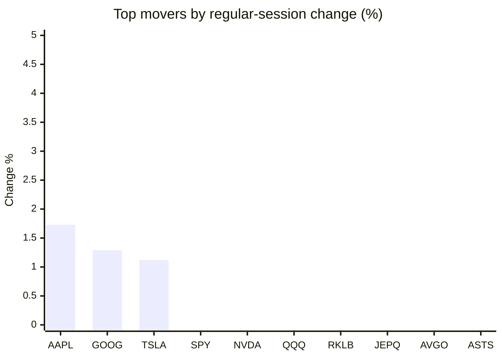
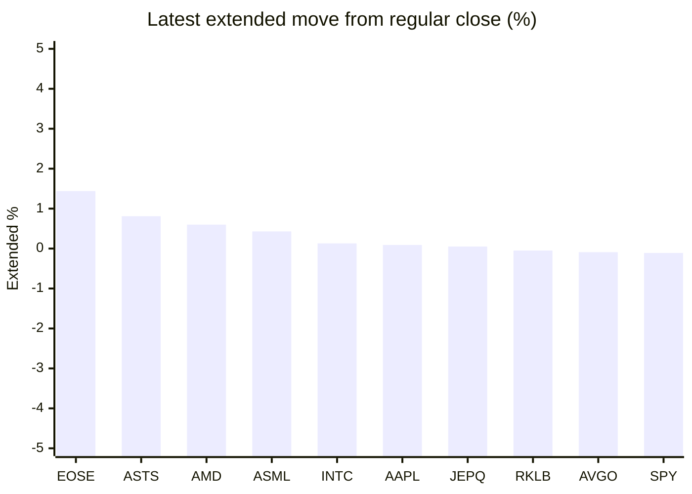

# Stock Brief - 2026-07-02

Generated at 2026-07-02 13:03 +07 from `watchlist.md`.
Prices are snapshots from Yahoo Finance public chart data. Extended/overnight is the latest available pre/post-market datapoint from the same feed.

## Market Snapshot

- SPY: close 745.76, latest extended 744.97, regular move -0.14%, extended move -0.11%
- QQQ: close 725.17, latest extended 724.36, regular move -1.52%, extended move -0.11%
- JEPQ: close 60.20, latest extended 60.23, regular move -2.05%, extended move +0.05%

## Watchlist Prices

| Ticker | Name | Regular close | Latest extended/overnight | Regular move | Extended move | Latest data time | Source |
|---|---|---:|---:|---:|---:|---|---|
| INTC | Intel Corporation | 127.02 USD | 127.18 USD | -9.03% | +0.13% | 2026-07-01 19:59 EDT | [Yahoo](https://finance.yahoo.com/quote/INTC/) |
| AVGO | Broadcom Inc. | 369.34 USD | 369.00 USD | -2.23% | -0.09% | 2026-07-01 19:59 EDT | [Yahoo](https://finance.yahoo.com/quote/AVGO/) |
| RKLB | Rocket Lab Corporation | 100.07 USD | 100.02 USD | -1.55% | -0.05% | 2026-07-01 19:59 EDT | [Yahoo](https://finance.yahoo.com/quote/RKLB/) |
| AAPL | Apple Inc. | 294.38 USD | 294.64 USD | +1.73% | +0.09% | 2026-07-01 19:59 EDT | [Yahoo](https://finance.yahoo.com/quote/AAPL/) |
| NVDA | NVIDIA Corporation | 197.58 USD | 197.04 USD | -1.25% | -0.27% | 2026-07-01 19:59 EDT | [Yahoo](https://finance.yahoo.com/quote/NVDA/) |
| TSLA | Tesla, Inc. | 425.30 USD | 423.19 USD | +1.12% | -0.50% | 2026-07-01 19:59 EDT | [Yahoo](https://finance.yahoo.com/quote/TSLA/) |
| SNDK | Sandisk Corporation | 2,032.22 USD | 2,014.20 USD | -10.62% | -0.89% | 2026-07-01 19:59 EDT | [Yahoo](https://finance.yahoo.com/quote/SNDK/) |
| QQQ | Invesco QQQ Trust, Series 1 | 725.17 USD | 724.36 USD | -1.52% | -0.11% | 2026-07-01 19:59 EDT | [Yahoo](https://finance.yahoo.com/quote/QQQ/) |
| SPY | State Street SPDR S&P 500 ETF T | 745.76 USD | 744.97 USD | -0.14% | -0.11% | 2026-07-01 19:59 EDT | [Yahoo](https://finance.yahoo.com/quote/SPY/) |
| JEPQ | JPMorgan Nasdaq Equity Premium  | 60.20 USD | 60.23 USD | -2.05% | +0.05% | 2026-07-01 19:59 EDT | [Yahoo](https://finance.yahoo.com/quote/JEPQ/) |
| ASTS | AST SpaceMobile, Inc. | 86.10 USD | 86.80 USD | -3.11% | +0.81% | 2026-07-01 19:59 EDT | [Yahoo](https://finance.yahoo.com/quote/ASTS/) |
| MU | Micron Technology, Inc. | 1,032.28 USD | 1,020.10 USD | -10.57% | -1.18% | 2026-07-01 19:59 EDT | [Yahoo](https://finance.yahoo.com/quote/MU/) |
| IREN | IREN LIMITED | 43.32 USD | 43.22 USD | -5.27% | -0.23% | 2026-07-01 19:59 EDT | [Yahoo](https://finance.yahoo.com/quote/IREN/) |
| EOSE | Eos Energy Enterprises, Inc. | 5.55 USD | 5.63 USD | -5.61% | +1.44% | 2026-07-01 19:59 EDT | [Yahoo](https://finance.yahoo.com/quote/EOSE/) |
| GOOG | Alphabet Inc. | 357.89 USD | 357.25 USD | +1.29% | -0.18% | 2026-07-01 19:58 EDT | [Yahoo](https://finance.yahoo.com/quote/GOOG/) |
| DRAM | Roundhill Memory ETF | 65.86 USD | 64.85 USD | -10.82% | -1.53% | 2026-07-01 19:59 EDT | [Yahoo](https://finance.yahoo.com/quote/DRAM/) |
| AMD | Advanced Micro Devices, Inc. | 540.88 USD | 544.10 USD | -6.89% | +0.60% | 2026-07-01 19:59 EDT | [Yahoo](https://finance.yahoo.com/quote/AMD/) |
| ASML | ASML Holding N.V. - New York Re | 1,843.04 USD | 1,850.90 USD | -7.36% | +0.43% | 2026-07-01 19:59 EDT | [Yahoo](https://finance.yahoo.com/quote/ASML/) |

## Charts

### Top Movers - Regular Session

### Extended / Overnight Move

### Quick Heatmap

| Group | Names in watchlist | Avg regular move | Avg extended move |
|---|---|---:|---:|
| Mega-cap tech | AVGO, AAPL, NVDA, TSLA, GOOG | +0.13% | -0.19% |
| Semis / memory | INTC, SNDK, MU, DRAM, AMD, ASML | -9.22% | -0.41% |
| Space / high beta | RKLB, ASTS, IREN, EOSE | -3.89% | +0.49% |
| ETFs | QQQ, SPY, JEPQ | -1.24% | -0.05% |

## News Headlines

- [Why has Wall Street fallen out of love with the 'Magnificent Seven'?](https://www.euronews.com/2026/07/02/why-has-wall-street-fallen-out-of-love-with-the-magnificent-seven?.tsrc=rss) (2026-07-02 12:30 Bangkok)
- [The Stock Market Is on the Verge of Doing Something for the First Time in 155 Years, and History Is Crystal Clear on What It Could Mean for Investors](https://www.fool.com/investing/2026/07/02/the-stock-market-is-on-the-verge-of-doing-somethin/?.tsrc=rss) (2026-07-02 12:20 Bangkok)
- [Top Broadcom insider unloads eye-popping number of shares](https://www.thestreet.com/investing/stocks/avgo-broadcom-insider-stock-sale?.tsrc=rss) (2026-07-02 12:07 Bangkok)
- [AI Funds Were Unstoppable in the Second Quarter](https://finance.yahoo.com/m/575b6ad9-dd31-38a5-98c0-2f7545716506/ai-funds-were-unstoppable-in.html?.tsrc=rss) (2026-07-02 12:00 Bangkok)
- [How to AI-Proof Your Fund Portfolio](https://finance.yahoo.com/m/35d3d156-b19f-3aac-85fa-9619503f2b10/how-to-ai-proof-your-fund.html?.tsrc=rss) (2026-07-02 12:00 Bangkok)
- [ASTS Stock Eases After 3-Day Run: FCC Opens Door For Direct Phone-To-Satellite Connectivity Using 800 MHz Spectrum](https://stocktwits.com/news-articles/markets/equity/asts-fcc-direct-phone-to-satellite-800mhz-spectrum/cZmeIMOR71M?.tsrc=rss) (2026-07-02 11:35 Bangkok)
- [1 Artificial Intelligence Stock You Can Buy and Hold for the Next Decade](https://www.fool.com/investing/2026/07/02/1-artificial-intelligence-stock-you-can-buy-and-ho/?.tsrc=rss) (2026-07-02 11:20 Bangkok)
- [Is Nike Inc a Buy After Its Latest Earnings Report?](https://www.fool.com/investing/2026/07/01/is-nike-inc-a-buy-after-its-latest-earnings-report/?.tsrc=rss) (2026-07-02 11:05 Bangkok)

## Caveats

- This is not investment advice. Extended-hours prices can be thin and volatile.
- Yahoo public endpoints may lag official exchange data.
