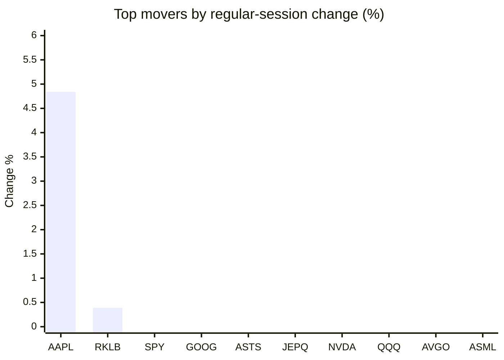
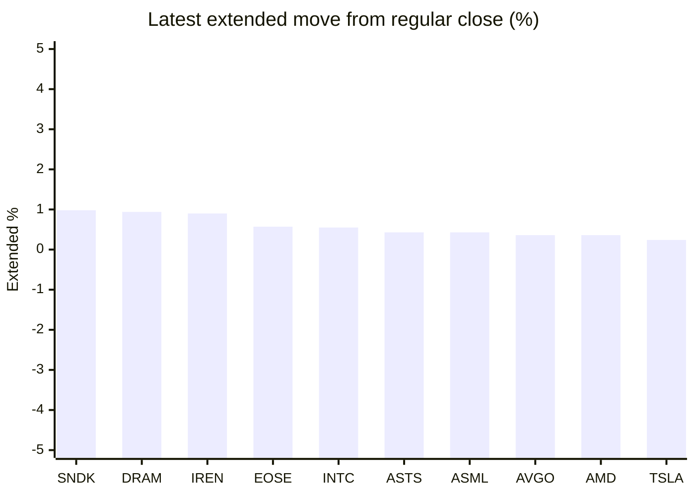

# Stock Brief - 2026-07-04

Generated at 2026-07-04 12:50 +07 from `watchlist.md`.
Prices are snapshots from Yahoo Finance public chart data. Extended/overnight is the latest available pre/post-market datapoint from the same feed.

## Market Snapshot

- SPY: close 744.78, latest extended 745.74, regular move -0.13%, extended move +0.13%
- QQQ: close 712.60, latest extended 714.18, regular move -1.73%, extended move +0.22%
- JEPQ: close 59.39, latest extended 59.45, regular move -1.35%, extended move +0.10%

## Watchlist Prices

| Ticker | Name | Regular close | Latest extended/overnight | Regular move | Extended move | Latest data time | Source |
|---|---|---:|---:|---:|---:|---|---|
| INTC | Intel Corporation | 120.35 USD | 121.01 USD | -5.25% | +0.55% | 2026-07-02 19:59 EDT | [Yahoo](https://finance.yahoo.com/quote/INTC/) |
| AVGO | Broadcom Inc. | 360.45 USD | 361.75 USD | -2.41% | +0.36% | 2026-07-02 19:59 EDT | [Yahoo](https://finance.yahoo.com/quote/AVGO/) |
| RKLB | Rocket Lab Corporation | 100.46 USD | 100.20 USD | +0.39% | -0.26% | 2026-07-02 19:59 EDT | [Yahoo](https://finance.yahoo.com/quote/RKLB/) |
| AAPL | Apple Inc. | 308.63 USD | 308.44 USD | +4.84% | -0.06% | 2026-07-02 19:59 EDT | [Yahoo](https://finance.yahoo.com/quote/AAPL/) |
| NVDA | NVIDIA Corporation | 194.83 USD | 194.40 USD | -1.39% | -0.22% | 2026-07-02 19:59 EDT | [Yahoo](https://finance.yahoo.com/quote/NVDA/) |
| TSLA | Tesla, Inc. | 393.45 USD | 394.40 USD | -7.49% | +0.24% | 2026-07-02 19:59 EDT | [Yahoo](https://finance.yahoo.com/quote/TSLA/) |
| SNDK | Sandisk Corporation | 1,745.00 USD | 1,762.07 USD | -14.13% | +0.98% | 2026-07-02 19:59 EDT | [Yahoo](https://finance.yahoo.com/quote/SNDK/) |
| QQQ | Invesco QQQ Trust, Series 1 | 712.60 USD | 714.18 USD | -1.73% | +0.22% | 2026-07-02 19:59 EDT | [Yahoo](https://finance.yahoo.com/quote/QQQ/) |
| SPY | State Street SPDR S&P 500 ETF T | 744.78 USD | 745.74 USD | -0.13% | +0.13% | 2026-07-02 19:59 EDT | [Yahoo](https://finance.yahoo.com/quote/SPY/) |
| JEPQ | JPMorgan Nasdaq Equity Premium  | 59.39 USD | 59.45 USD | -1.35% | +0.10% | 2026-07-02 19:59 EDT | [Yahoo](https://finance.yahoo.com/quote/JEPQ/) |
| ASTS | AST SpaceMobile, Inc. | 85.13 USD | 85.50 USD | -1.13% | +0.43% | 2026-07-02 19:59 EDT | [Yahoo](https://finance.yahoo.com/quote/ASTS/) |
| MU | Micron Technology, Inc. | 975.56 USD | 977.00 USD | -5.49% | +0.15% | 2026-07-02 19:59 EDT | [Yahoo](https://finance.yahoo.com/quote/MU/) |
| IREN | IREN LIMITED | 38.82 USD | 39.17 USD | -10.39% | +0.90% | 2026-07-02 19:59 EDT | [Yahoo](https://finance.yahoo.com/quote/IREN/) |
| EOSE | Eos Energy Enterprises, Inc. | 5.23 USD | 5.26 USD | -5.77% | +0.57% | 2026-07-02 19:59 EDT | [Yahoo](https://finance.yahoo.com/quote/EOSE/) |
| GOOG | Alphabet Inc. | 356.18 USD | 355.11 USD | -0.48% | -0.30% | 2026-07-02 19:59 EDT | [Yahoo](https://finance.yahoo.com/quote/GOOG/) |
| DRAM | Roundhill Memory ETF | 60.63 USD | 61.20 USD | -7.94% | +0.94% | 2026-07-02 19:59 EDT | [Yahoo](https://finance.yahoo.com/quote/DRAM/) |
| AMD | Advanced Micro Devices, Inc. | 517.82 USD | 519.68 USD | -4.26% | +0.36% | 2026-07-02 19:59 EDT | [Yahoo](https://finance.yahoo.com/quote/AMD/) |
| ASML | ASML Holding N.V. - New York Re | 1,769.32 USD | 1,776.98 USD | -4.00% | +0.43% | 2026-07-02 19:59 EDT | [Yahoo](https://finance.yahoo.com/quote/ASML/) |

## Charts

### Top Movers - Regular Session

### Extended / Overnight Move

### Quick Heatmap

| Group | Names in watchlist | Avg regular move | Avg extended move |
|---|---|---:|---:|
| Mega-cap tech | AVGO, AAPL, NVDA, TSLA, GOOG | -1.38% | +0.00% |
| Semis / memory | INTC, SNDK, MU, DRAM, AMD, ASML | -6.85% | +0.57% |
| Space / high beta | RKLB, ASTS, IREN, EOSE | -4.22% | +0.41% |
| ETFs | QQQ, SPY, JEPQ | -1.07% | +0.15% |

## News Headlines

- [Warren Buffett Just Sent Investors an 11-Word Warning About the Stock Market. History Says He's Right.](https://www.fool.com/investing/2026/07/04/warren-buffett-just-sent-investors-an-11-word-warn/?.tsrc=rss) (2026-07-04 12:20 Bangkok)
- [Wall Street Analysts Are Predicting Something Never Seen Before, and It Should Come as a Huge Warning for Investors](https://www.fool.com/investing/2026/07/04/wall-street-analysts-are-predicting-something-weve/?.tsrc=rss) (2026-07-04 11:20 Bangkok)
- [Micron Earned $24.67 Per Share Last Quarter. Its Dividend Is Still 15 Cents. Something Has to Give.](https://www.fool.com/investing/2026/07/03/micron-earned-2467-per-share-last-quarter-its-divi/?.tsrc=rss) (2026-07-04 10:52 Bangkok)
- [The Rise of Active ETFs: Can Fund Managers Outperform Passive Investing?](https://www.fool.com/investing/2026/07/03/the-rise-of-active-etfs-can-fund-managers-outperfo/?.tsrc=rss) (2026-07-04 10:20 Bangkok)
- [SpaceX Is Finally Public. Here's How Much a $1,000 Investment Would Get You.](https://www.fool.com/investing/2026/07/03/spacex-is-finally-public-heres-how-much-a-1000-inv/?.tsrc=rss) (2026-07-04 09:46 Bangkok)
- [Stifel Backs Equinix (EQIX) as AI Infrastructure Demand Drives Data Center Growth](https://finance.yahoo.com/technology/ai/articles/stifel-backs-equinix-eqix-ai-023350592.html?.tsrc=rss) (2026-07-04 09:33 Bangkok)
- [Dow Jones Futures: Techs' Rise Signal AI Trend Isn't Over; Apple, Robinhood Flash Buy Signals](https://finance.yahoo.com/m/c5c7ee9b-1c12-3518-9e81-d4125388c16f/dow-jones-futures%3A-techs%27.html?.tsrc=rss) (2026-07-04 08:47 Bangkok)
- [Why FNGU’s 0.95% Fee Is Only Half the Hidden Cost](https://247wallst.com/investing/2026/07/03/why-fngus-0-95-fee-is-only-half-the-hidden-cost/?.tsrc=rss) (2026-07-04 08:40 Bangkok)

## Caveats

- This is not investment advice. Extended-hours prices can be thin and volatile.
- Yahoo public endpoints may lag official exchange data.
