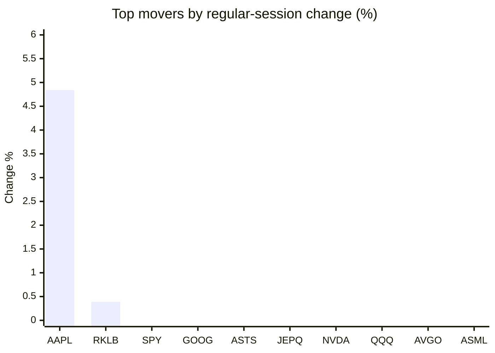
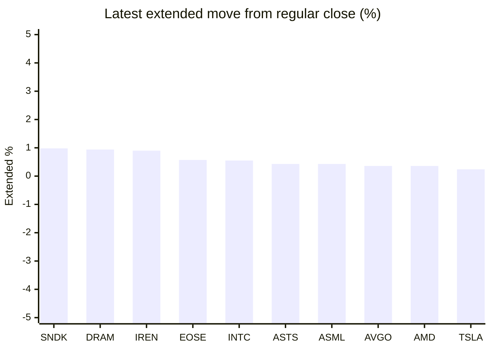

# Stock Brief - 2026-07-05

Generated at 2026-07-05 13:09 +07 from `watchlist.md`.
Prices are snapshots from Yahoo Finance public chart data. Extended/overnight is the latest available pre/post-market datapoint from the same feed.

## Market Snapshot

- SPY: close 744.78, latest extended 745.74, regular move -0.13%, extended move +0.13%
- QQQ: close 712.60, latest extended 714.18, regular move -1.73%, extended move +0.22%
- JEPQ: close 59.39, latest extended 59.45, regular move -1.35%, extended move +0.10%

## Watchlist Prices

| Ticker | Name | Regular close | Latest extended/overnight | Regular move | Extended move | Latest data time | Source |
|---|---|---:|---:|---:|---:|---|---|
| INTC | Intel Corporation | 120.35 USD | 121.01 USD | -5.25% | +0.55% | 2026-07-02 19:59 EDT | [Yahoo](https://finance.yahoo.com/quote/INTC/) |
| AVGO | Broadcom Inc. | 360.45 USD | 361.75 USD | -2.41% | +0.36% | 2026-07-02 19:59 EDT | [Yahoo](https://finance.yahoo.com/quote/AVGO/) |
| RKLB | Rocket Lab Corporation | 100.46 USD | 100.20 USD | +0.39% | -0.26% | 2026-07-02 19:59 EDT | [Yahoo](https://finance.yahoo.com/quote/RKLB/) |
| AAPL | Apple Inc. | 308.63 USD | 308.44 USD | +4.84% | -0.06% | 2026-07-02 19:59 EDT | [Yahoo](https://finance.yahoo.com/quote/AAPL/) |
| NVDA | NVIDIA Corporation | 194.83 USD | 194.40 USD | -1.39% | -0.22% | 2026-07-02 19:59 EDT | [Yahoo](https://finance.yahoo.com/quote/NVDA/) |
| TSLA | Tesla, Inc. | 393.45 USD | 394.40 USD | -7.49% | +0.24% | 2026-07-02 19:59 EDT | [Yahoo](https://finance.yahoo.com/quote/TSLA/) |
| SNDK | Sandisk Corporation | 1,745.00 USD | 1,762.07 USD | -14.13% | +0.98% | 2026-07-02 19:59 EDT | [Yahoo](https://finance.yahoo.com/quote/SNDK/) |
| QQQ | Invesco QQQ Trust, Series 1 | 712.60 USD | 714.18 USD | -1.73% | +0.22% | 2026-07-02 19:59 EDT | [Yahoo](https://finance.yahoo.com/quote/QQQ/) |
| SPY | State Street SPDR S&P 500 ETF T | 744.78 USD | 745.74 USD | -0.13% | +0.13% | 2026-07-02 19:59 EDT | [Yahoo](https://finance.yahoo.com/quote/SPY/) |
| JEPQ | JPMorgan Nasdaq Equity Premium  | 59.39 USD | 59.45 USD | -1.35% | +0.10% | 2026-07-02 19:59 EDT | [Yahoo](https://finance.yahoo.com/quote/JEPQ/) |
| ASTS | AST SpaceMobile, Inc. | 85.13 USD | 85.50 USD | -1.13% | +0.43% | 2026-07-02 19:59 EDT | [Yahoo](https://finance.yahoo.com/quote/ASTS/) |
| MU | Micron Technology, Inc. | 975.56 USD | 977.00 USD | -5.49% | +0.15% | 2026-07-02 19:59 EDT | [Yahoo](https://finance.yahoo.com/quote/MU/) |
| IREN | IREN LIMITED | 38.82 USD | 39.17 USD | -10.39% | +0.90% | 2026-07-02 19:59 EDT | [Yahoo](https://finance.yahoo.com/quote/IREN/) |
| EOSE | Eos Energy Enterprises, Inc. | 5.23 USD | 5.26 USD | -5.77% | +0.57% | 2026-07-02 19:59 EDT | [Yahoo](https://finance.yahoo.com/quote/EOSE/) |
| GOOG | Alphabet Inc. | 356.18 USD | 355.11 USD | -0.48% | -0.30% | 2026-07-02 19:59 EDT | [Yahoo](https://finance.yahoo.com/quote/GOOG/) |
| DRAM | Roundhill Memory ETF | 60.63 USD | 61.20 USD | -7.94% | +0.94% | 2026-07-02 19:59 EDT | [Yahoo](https://finance.yahoo.com/quote/DRAM/) |
| AMD | Advanced Micro Devices, Inc. | 517.82 USD | 519.68 USD | -4.26% | +0.36% | 2026-07-02 19:59 EDT | [Yahoo](https://finance.yahoo.com/quote/AMD/) |
| ASML | ASML Holding N.V. - New York Re | 1,769.32 USD | 1,776.98 USD | -4.00% | +0.43% | 2026-07-02 19:59 EDT | [Yahoo](https://finance.yahoo.com/quote/ASML/) |

## Charts

### Top Movers - Regular Session

### Extended / Overnight Move

### Quick Heatmap

| Group | Names in watchlist | Avg regular move | Avg extended move |
|---|---|---:|---:|
| Mega-cap tech | AVGO, AAPL, NVDA, TSLA, GOOG | -1.38% | +0.00% |
| Semis / memory | INTC, SNDK, MU, DRAM, AMD, ASML | -6.85% | +0.57% |
| Space / high beta | RKLB, ASTS, IREN, EOSE | -4.22% | +0.41% |
| ETFs | QQQ, SPY, JEPQ | -1.07% | +0.15% |

## News Headlines

- [Is AMD Stock a Buy Before July 22?](https://www.fool.com/investing/2026/07/05/is-amd-stock-a-buy-before-july-22/?.tsrc=rss) (2026-07-05 12:50 Bangkok)
- [How Much Could $1,000 Invested in Viking Therapeutics Be Worth by 2030?](https://www.fool.com/investing/2026/07/05/how-much-could-1000-invested-in-viking-therapeutic/?.tsrc=rss) (2026-07-05 12:25 Bangkok)
- [VTI vs. IWM: Which Broad Index ETF Is the Better Buy?](https://www.fool.com/investing/2026/07/05/vti-vs-iwm-which-broad-index-etf-is-the-better-buy/?.tsrc=rss) (2026-07-05 12:20 Bangkok)
- [Warren Buffett Just Offered 11 Words of Warning That Could Reshape Your Investing Strategy](https://www.fool.com/investing/2026/07/05/warren-buffett-11-words-warning-investing-strategy/?.tsrc=rss) (2026-07-05 11:50 Bangkok)
- ["Big Short" Investor Michael Burry Is Now Betting Against Micron, Nvidia, and Tesla. Should You Be Worried?](https://www.fool.com/investing/2026/07/04/big-short-investor-michael-burry-is-now-betting-ag/?.tsrc=rss) (2026-07-05 11:10 Bangkok)
- [What Rare Earths Stock Can Best Deliver Gains From America's Reshoring Boom?](https://www.fool.com/investing/2026/07/04/what-rare-earths-stock-can-best-deliver-gains-from/?.tsrc=rss) (2026-07-05 10:35 Bangkok)
- [Axon and Rocket Lab rallied while chip stocks sank](https://www.thestreet.com/investing/stocks/sandisk-bank-of-america-bubble-risk-week?.tsrc=rss) (2026-07-05 10:17 Bangkok)
- [Michael Burry doubles down on AI chip bubble with Micron short](https://www.thestreet.com/investing/stocks/mu-michael-burry-doubles-down-on-ai-chip-bubble-with-micron-short?.tsrc=rss) (2026-07-05 09:03 Bangkok)

## Caveats

- This is not investment advice. Extended-hours prices can be thin and volatile.
- Yahoo public endpoints may lag official exchange data.
