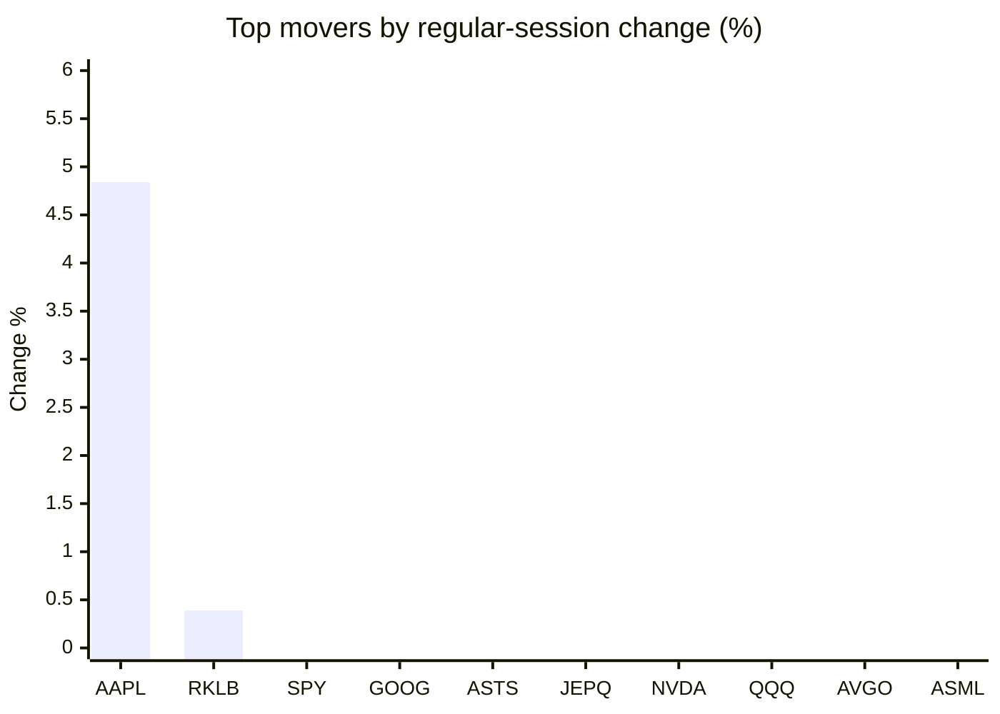
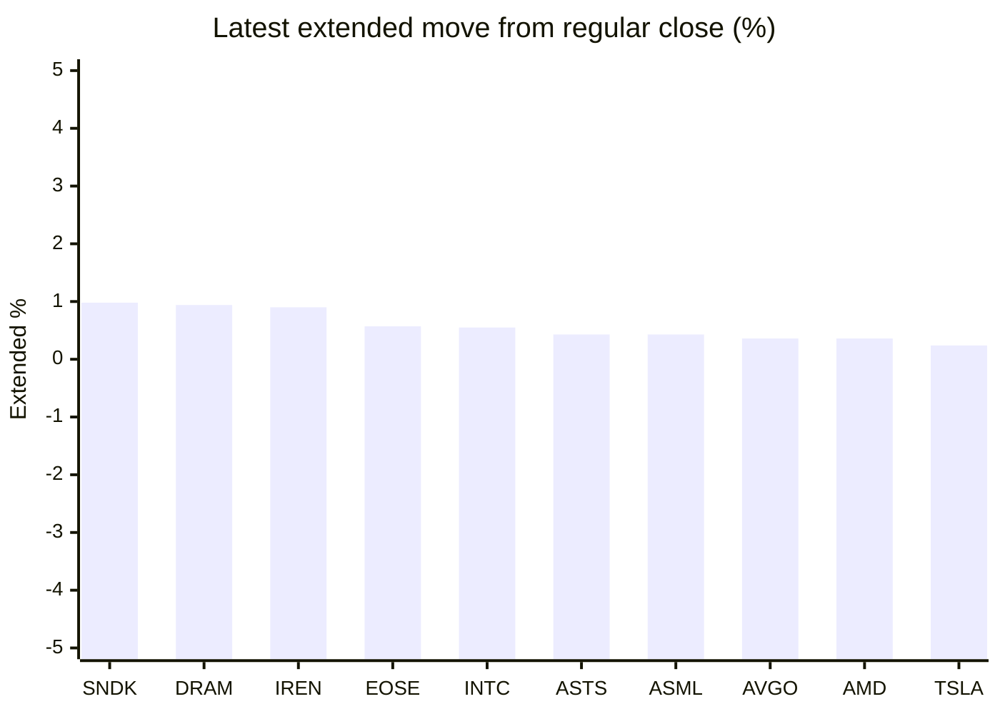

# Stock Brief - 2026-07-06

Generated at 2026-07-06 13:40 +07 from `watchlist.md`.
Prices are snapshots from Yahoo Finance public chart data. Extended/overnight is the latest available pre/post-market datapoint from the same feed.

## Market Snapshot

- SPY: close 744.78, latest extended 745.74, regular move -0.13%, extended move +0.13%
- QQQ: close 712.60, latest extended 714.18, regular move -1.73%, extended move +0.22%
- JEPQ: close 59.39, latest extended 59.45, regular move -1.35%, extended move +0.10%

## Watchlist Prices

| Ticker | Name | Regular close | Latest extended/overnight | Regular move | Extended move | Latest data time | Source |
|---|---|---:|---:|---:|---:|---|---|
| INTC | Intel Corporation | 120.35 USD | 121.01 USD | -5.25% | +0.55% | 2026-07-02 19:59 EDT | [Yahoo](https://finance.yahoo.com/quote/INTC/) |
| AVGO | Broadcom Inc. | 360.45 USD | 361.75 USD | -2.41% | +0.36% | 2026-07-02 19:59 EDT | [Yahoo](https://finance.yahoo.com/quote/AVGO/) |
| RKLB | Rocket Lab Corporation | 100.46 USD | 100.20 USD | +0.39% | -0.26% | 2026-07-02 19:59 EDT | [Yahoo](https://finance.yahoo.com/quote/RKLB/) |
| AAPL | Apple Inc. | 308.63 USD | 308.44 USD | +4.84% | -0.06% | 2026-07-02 19:59 EDT | [Yahoo](https://finance.yahoo.com/quote/AAPL/) |
| NVDA | NVIDIA Corporation | 194.83 USD | 194.40 USD | -1.39% | -0.22% | 2026-07-02 19:59 EDT | [Yahoo](https://finance.yahoo.com/quote/NVDA/) |
| TSLA | Tesla, Inc. | 393.45 USD | 394.40 USD | -7.49% | +0.24% | 2026-07-02 19:59 EDT | [Yahoo](https://finance.yahoo.com/quote/TSLA/) |
| SNDK | Sandisk Corporation | 1,745.00 USD | 1,762.07 USD | -14.13% | +0.98% | 2026-07-02 19:59 EDT | [Yahoo](https://finance.yahoo.com/quote/SNDK/) |
| QQQ | Invesco QQQ Trust, Series 1 | 712.60 USD | 714.18 USD | -1.73% | +0.22% | 2026-07-02 19:59 EDT | [Yahoo](https://finance.yahoo.com/quote/QQQ/) |
| SPY | State Street SPDR S&P 500 ETF T | 744.78 USD | 745.74 USD | -0.13% | +0.13% | 2026-07-02 19:59 EDT | [Yahoo](https://finance.yahoo.com/quote/SPY/) |
| JEPQ | JPMorgan Nasdaq Equity Premium  | 59.39 USD | 59.45 USD | -1.35% | +0.10% | 2026-07-02 19:59 EDT | [Yahoo](https://finance.yahoo.com/quote/JEPQ/) |
| ASTS | AST SpaceMobile, Inc. | 85.13 USD | 85.50 USD | -1.13% | +0.43% | 2026-07-02 19:59 EDT | [Yahoo](https://finance.yahoo.com/quote/ASTS/) |
| MU | Micron Technology, Inc. | 975.56 USD | 977.00 USD | -5.49% | +0.15% | 2026-07-02 19:59 EDT | [Yahoo](https://finance.yahoo.com/quote/MU/) |
| IREN | IREN LIMITED | 38.82 USD | 39.17 USD | -10.39% | +0.90% | 2026-07-02 19:59 EDT | [Yahoo](https://finance.yahoo.com/quote/IREN/) |
| EOSE | Eos Energy Enterprises, Inc. | 5.23 USD | 5.26 USD | -5.77% | +0.57% | 2026-07-02 19:59 EDT | [Yahoo](https://finance.yahoo.com/quote/EOSE/) |
| GOOG | Alphabet Inc. | 356.18 USD | 355.11 USD | -0.48% | -0.30% | 2026-07-02 19:59 EDT | [Yahoo](https://finance.yahoo.com/quote/GOOG/) |
| DRAM | Roundhill Memory ETF | 60.63 USD | 61.20 USD | -7.94% | +0.94% | 2026-07-02 19:59 EDT | [Yahoo](https://finance.yahoo.com/quote/DRAM/) |
| AMD | Advanced Micro Devices, Inc. | 517.82 USD | 519.68 USD | -4.26% | +0.36% | 2026-07-02 19:59 EDT | [Yahoo](https://finance.yahoo.com/quote/AMD/) |
| ASML | ASML Holding N.V. - New York Re | 1,769.32 USD | 1,776.98 USD | -4.00% | +0.43% | 2026-07-02 19:59 EDT | [Yahoo](https://finance.yahoo.com/quote/ASML/) |

## Charts

### Top Movers - Regular Session

### Extended / Overnight Move

### Quick Heatmap

| Group | Names in watchlist | Avg regular move | Avg extended move |
|---|---|---:|---:|
| Mega-cap tech | AVGO, AAPL, NVDA, TSLA, GOOG | -1.38% | +0.00% |
| Semis / memory | INTC, SNDK, MU, DRAM, AMD, ASML | -6.85% | +0.57% |
| Space / high beta | RKLB, ASTS, IREN, EOSE | -4.22% | +0.41% |
| ETFs | QQQ, SPY, JEPQ | -1.07% | +0.15% |

## News Headlines

- [SK Hynix to launch $28 billion US listing to ride global AI wave](https://finance.yahoo.com/video/sk-hynix-launch-28-billion-062348085.html?.tsrc=rss) (2026-07-06 13:23 Bangkok)
- [VeriSign Controls the Internet's Address Book, But AI Disruption and a Key Contract Renewal Loom Large](https://www.fool.com/investing/2026/07/06/verisign-controls-the-internets-address-book-but-a/?.tsrc=rss) (2026-07-06 13:05 Bangkok)
- [NVDA, AAPL Stocks In Focus: Foxconn Beats Q2 Revenue Estimates But Sounds Caution On Geopolitics](https://stocktwits.com/news-articles/markets/equity/nvda-aapl-stocks-in-focus-foxconn-beats-q2-revenue-estimates-but-sounds-caution-on-geopolitics/cZm1ReOR7ks?.tsrc=rss) (2026-07-06 12:44 Bangkok)
- [If You Invested $1,000 in SpaceX at Its IPO, Here Is What It Is Worth Today](https://www.fool.com/investing/2026/07/06/if-you-invested-1000-in-spacex-at-its-ipo-here-is/?.tsrc=rss) (2026-07-06 12:25 Bangkok)
- [ASTS Stock Rises Overnight: Vodafone Ireland Trial Shows AST Tech Can Support Emergency Services During Outages](https://stocktwits.com/news-articles/markets/equity/asts-vodafone-ireland-trial-emergency-services/cZm1baGR7kp?.tsrc=rss) (2026-07-06 12:08 Bangkok)
- [Bitcoin's Price Tumbled 18% in June. Here's Why It's Still a Buy This Summer.](https://www.fool.com/investing/2026/07/06/bitcoins-price-tumbled-18-in-june-heres-why-its-st/?.tsrc=rss) (2026-07-06 11:50 Bangkok)
- [Q2 Earnings Season Is About to Kick Off. These 5 Reports Will Set the Market's Tone.](https://www.fool.com/investing/2026/07/06/q2-earnings-season-is-about-to-kick-off-these-5-re/?.tsrc=rss) (2026-07-06 11:22 Bangkok)
- [SNDK, WDC, MU: US Memory Stocks Rebound Overnight After Anthropic-Driven Selloff; Traders Eye Samsung Results Next Week](https://stocktwits.com/news-articles/markets/equity/sndk-wdc-mu-us-memory-stocks-rebound-overnight-after-anthropic-driven-selloff-traders-eye-samsung-results-next-week/cZmKyYuR7kN?.tsrc=rss) (2026-07-06 10:32 Bangkok)

## Caveats

- This is not investment advice. Extended-hours prices can be thin and volatile.
- Yahoo public endpoints may lag official exchange data.
