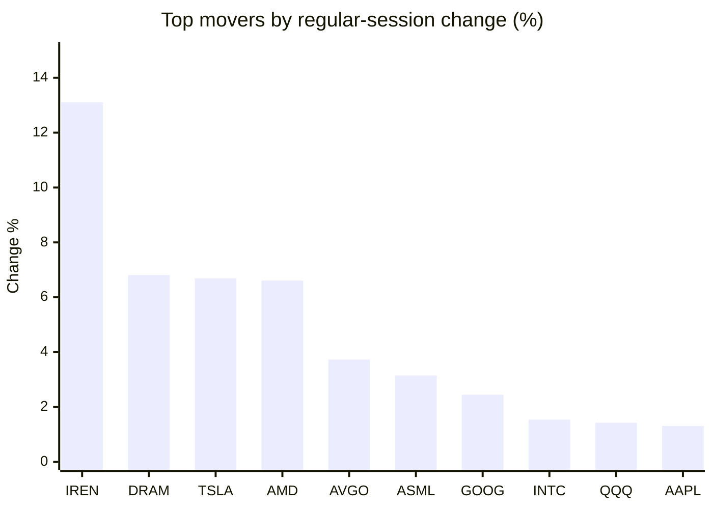
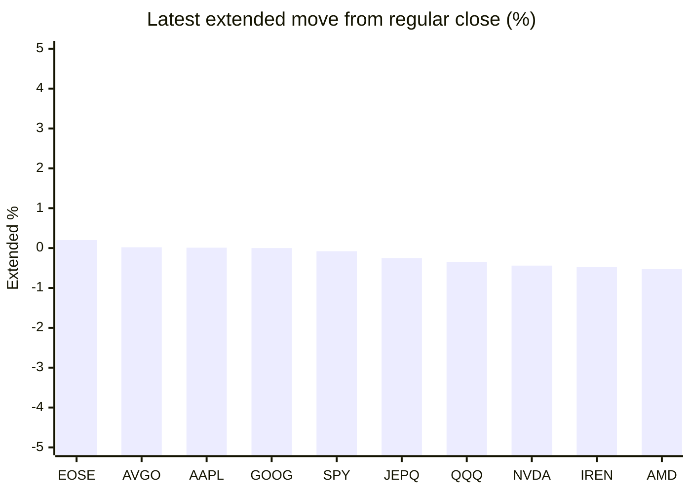

# Stock Brief - 2026-07-07

Generated at 2026-07-07 13:12 +07 from `watchlist.md`.
Prices are snapshots from Yahoo Finance public chart data. Extended/overnight is the latest available pre/post-market datapoint from the same feed.

## Market Snapshot

- SPY: close 751.28, latest extended 750.66, regular move +0.87%, extended move -0.08%
- QQQ: close 722.82, latest extended 720.27, regular move +1.43%, extended move -0.35%
- JEPQ: close 60.16, latest extended 60.01, regular move +1.30%, extended move -0.25%

## Watchlist Prices

| Ticker | Name | Regular close | Latest extended/overnight | Regular move | Extended move | Latest data time | Source |
|---|---|---:|---:|---:|---:|---|---|
| INTC | Intel Corporation | 122.20 USD | 121.13 USD | +1.54% | -0.88% | 2026-07-06 19:59 EDT | [Yahoo](https://finance.yahoo.com/quote/INTC/) |
| AVGO | Broadcom Inc. | 373.90 USD | 373.99 USD | +3.73% | +0.02% | 2026-07-06 19:59 EDT | [Yahoo](https://finance.yahoo.com/quote/AVGO/) |
| RKLB | Rocket Lab Corporation | 93.09 USD | 91.50 USD | -7.34% | -1.71% | 2026-07-06 19:59 EDT | [Yahoo](https://finance.yahoo.com/quote/RKLB/) |
| AAPL | Apple Inc. | 312.66 USD | 312.70 USD | +1.31% | +0.01% | 2026-07-06 19:59 EDT | [Yahoo](https://finance.yahoo.com/quote/AAPL/) |
| NVDA | NVIDIA Corporation | 195.55 USD | 194.70 USD | +0.37% | -0.44% | 2026-07-06 19:59 EDT | [Yahoo](https://finance.yahoo.com/quote/NVDA/) |
| TSLA | Tesla, Inc. | 419.77 USD | 416.99 USD | +6.69% | -0.66% | 2026-07-06 19:59 EDT | [Yahoo](https://finance.yahoo.com/quote/TSLA/) |
| SNDK | Sandisk Corporation | 1,744.43 USD | 1,689.56 USD | -0.03% | -3.15% | 2026-07-06 19:59 EDT | [Yahoo](https://finance.yahoo.com/quote/SNDK/) |
| QQQ | Invesco QQQ Trust, Series 1 | 722.82 USD | 720.27 USD | +1.43% | -0.35% | 2026-07-06 19:59 EDT | [Yahoo](https://finance.yahoo.com/quote/QQQ/) |
| SPY | State Street SPDR S&P 500 ETF T | 751.28 USD | 750.66 USD | +0.87% | -0.08% | 2026-07-06 19:59 EDT | [Yahoo](https://finance.yahoo.com/quote/SPY/) |
| JEPQ | JPMorgan Nasdaq Equity Premium  | 60.16 USD | 60.01 USD | +1.30% | -0.25% | 2026-07-06 19:59 EDT | [Yahoo](https://finance.yahoo.com/quote/JEPQ/) |
| ASTS | AST SpaceMobile, Inc. | 80.64 USD | 79.53 USD | -5.27% | -1.38% | 2026-07-06 19:59 EDT | [Yahoo](https://finance.yahoo.com/quote/ASTS/) |
| MU | Micron Technology, Inc. | 984.75 USD | 960.00 USD | +0.94% | -2.51% | 2026-07-06 19:59 EDT | [Yahoo](https://finance.yahoo.com/quote/MU/) |
| IREN | IREN LIMITED | 43.91 USD | 43.70 USD | +13.11% | -0.48% | 2026-07-06 19:59 EDT | [Yahoo](https://finance.yahoo.com/quote/IREN/) |
| EOSE | Eos Energy Enterprises, Inc. | 5.06 USD | 5.07 USD | -3.25% | +0.20% | 2026-07-06 19:59 EDT | [Yahoo](https://finance.yahoo.com/quote/EOSE/) |
| GOOG | Alphabet Inc. | 364.90 USD | 364.90 USD | +2.45% | +0.00% | 2026-07-06 19:59 EDT | [Yahoo](https://finance.yahoo.com/quote/GOOG/) |
| DRAM | Roundhill Memory ETF | 64.76 USD | 62.19 USD | +6.81% | -3.97% | 2026-07-06 19:59 EDT | [Yahoo](https://finance.yahoo.com/quote/DRAM/) |
| AMD | Advanced Micro Devices, Inc. | 552.05 USD | 549.15 USD | +6.61% | -0.53% | 2026-07-06 19:59 EDT | [Yahoo](https://finance.yahoo.com/quote/AMD/) |
| ASML | ASML Holding N.V. - New York Re | 1,825.07 USD | 1,813.95 USD | +3.15% | -0.61% | 2026-07-06 19:59 EDT | [Yahoo](https://finance.yahoo.com/quote/ASML/) |

## Charts

### Top Movers - Regular Session

### Extended / Overnight Move

### Quick Heatmap

| Group | Names in watchlist | Avg regular move | Avg extended move |
|---|---|---:|---:|
| Mega-cap tech | AVGO, AAPL, NVDA, TSLA, GOOG | +2.91% | -0.21% |
| Semis / memory | INTC, SNDK, MU, DRAM, AMD, ASML | +3.17% | -1.94% |
| Space / high beta | RKLB, ASTS, IREN, EOSE | -0.69% | -0.84% |
| ETFs | QQQ, SPY, JEPQ | +1.20% | -0.23% |

## News Headlines

- [Where Will TMC The Metals Company Be By This Time Next Year?](https://www.fool.com/investing/2026/07/07/where-will-tmc-the-metals-company-be-by-this-time/?.tsrc=rss) (2026-07-07 12:35 Bangkok)
- [Micron Technology (MU) Lands Ford And GM Deals, Is The Upside Already Priced In?](https://finance.yahoo.com/markets/stocks/articles/micron-technology-mu-lands-ford-052826864.html?.tsrc=rss) (2026-07-07 12:28 Bangkok)
- [Broadcom (AVGO) Extends Apple Deal Following A Fresh Look At Its Fair Value](https://finance.yahoo.com/markets/stocks/articles/broadcom-avgo-extends-apple-deal-052756072.html?.tsrc=rss) (2026-07-07 12:27 Bangkok)
- [This Unstoppable Artificial Intelligence (AI) Stock Just Hit a New All-Time High. Is It Too Late to Buy?](https://www.fool.com/investing/2026/07/07/this-unstoppable-artificial-intelligence-ai-stock/?.tsrc=rss) (2026-07-07 12:20 Bangkok)
- [S&P 500, Nasdaq, Dow Futures Mixed After Record Session: Why MU, SNDK, RIVN, SPCX Stocks Are Trending Overnight](https://stocktwits.com/news-articles/markets/equity/s-and-p-500-nasdaq-dow-futures-mixed-after-record-session-why-mu-sndk-rivn-spcx-stocks-are-trending-overnight/cZmleiCR7ma?.tsrc=rss) (2026-07-07 12:09 Bangkok)
- [A $5,000 Investment in SoundHound AI Made at the Start of the Year Doesn't Look Good Now. Can It Rebound in the Second Half?](https://www.fool.com/investing/2026/07/07/a-5000-investment-in-soundhound-ai-made-at-the-sta/?.tsrc=rss) (2026-07-07 12:09 Bangkok)
- [5 AI Stocks to Buy Before the Next Leg of the Rally](https://www.fool.com/investing/2026/07/07/5-ai-stocks-to-buy-before-the-next-leg-of-the-rall/?.tsrc=rss) (2026-07-07 11:50 Bangkok)
- [Is Apple (AAPL) Already Priced In Following Its Broadcom Deal And New iPhone Plans?](https://finance.yahoo.com/markets/stocks/articles/apple-aapl-already-priced-following-043938669.html?.tsrc=rss) (2026-07-07 11:39 Bangkok)

## Caveats

- This is not investment advice. Extended-hours prices can be thin and volatile.
- Yahoo public endpoints may lag official exchange data.
