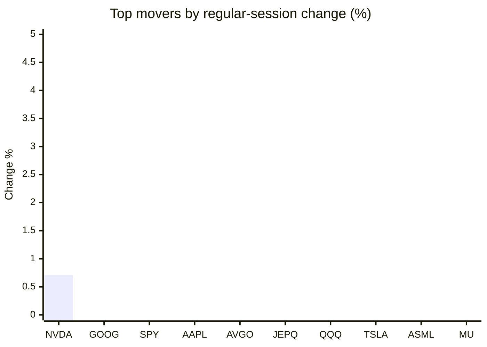
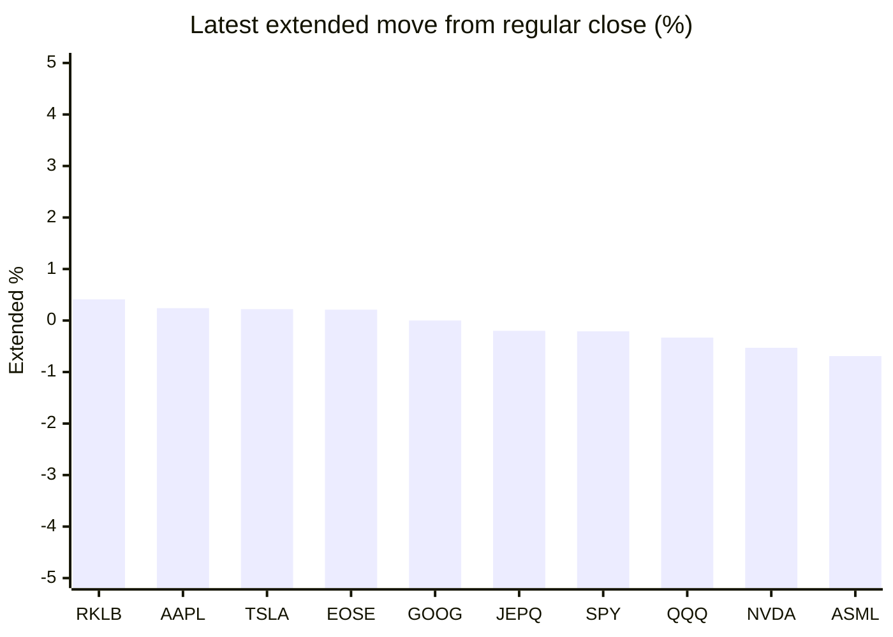

# Stock Brief - 2026-07-08

Generated at 2026-07-08 12:25 +07 from `watchlist.md`.
Prices are snapshots from Yahoo Finance public chart data. Extended/overnight is the latest available pre/post-market datapoint from the same feed.

## Market Snapshot

- SPY: close 747.71, latest extended 746.15, regular move -0.48%, extended move -0.21%
- QQQ: close 709.43, latest extended 707.08, regular move -1.85%, extended move -0.33%
- JEPQ: close 59.32, latest extended 59.20, regular move -1.40%, extended move -0.20%

## Watchlist Prices

| Ticker | Name | Regular close | Latest extended/overnight | Regular move | Extended move | Latest data time | Source |
|---|---|---:|---:|---:|---:|---|---|
| INTC | Intel Corporation | 110.39 USD | 108.20 USD | -9.66% | -1.99% | 2026-07-07 19:59 EDT | [Yahoo](https://finance.yahoo.com/quote/INTC/) |
| AVGO | Broadcom Inc. | 370.78 USD | 367.87 USD | -0.83% | -0.78% | 2026-07-07 19:59 EDT | [Yahoo](https://finance.yahoo.com/quote/AVGO/) |
| RKLB | Rocket Lab Corporation | 83.41 USD | 83.75 USD | -10.40% | +0.41% | 2026-07-07 19:59 EDT | [Yahoo](https://finance.yahoo.com/quote/RKLB/) |
| AAPL | Apple Inc. | 310.66 USD | 311.42 USD | -0.64% | +0.24% | 2026-07-07 19:59 EDT | [Yahoo](https://finance.yahoo.com/quote/AAPL/) |
| NVDA | NVIDIA Corporation | 196.93 USD | 195.89 USD | +0.71% | -0.53% | 2026-07-07 19:59 EDT | [Yahoo](https://finance.yahoo.com/quote/NVDA/) |
| TSLA | Tesla, Inc. | 402.90 USD | 403.78 USD | -4.02% | +0.22% | 2026-07-07 19:59 EDT | [Yahoo](https://finance.yahoo.com/quote/TSLA/) |
| SNDK | Sandisk Corporation | 1,617.70 USD | 1,579.00 USD | -7.26% | -2.39% | 2026-07-07 19:59 EDT | [Yahoo](https://finance.yahoo.com/quote/SNDK/) |
| QQQ | Invesco QQQ Trust, Series 1 | 709.43 USD | 707.08 USD | -1.85% | -0.33% | 2026-07-07 19:59 EDT | [Yahoo](https://finance.yahoo.com/quote/QQQ/) |
| SPY | State Street SPDR S&P 500 ETF T | 747.71 USD | 746.15 USD | -0.48% | -0.21% | 2026-07-07 19:59 EDT | [Yahoo](https://finance.yahoo.com/quote/SPY/) |
| JEPQ | JPMorgan Nasdaq Equity Premium  | 59.32 USD | 59.20 USD | -1.40% | -0.20% | 2026-07-07 19:58 EDT | [Yahoo](https://finance.yahoo.com/quote/JEPQ/) |
| ASTS | AST SpaceMobile, Inc. | 74.21 USD | 73.63 USD | -7.97% | -0.78% | 2026-07-07 19:59 EDT | [Yahoo](https://finance.yahoo.com/quote/ASTS/) |
| MU | Micron Technology, Inc. | 938.38 USD | 914.87 USD | -4.71% | -2.51% | 2026-07-07 19:59 EDT | [Yahoo](https://finance.yahoo.com/quote/MU/) |
| IREN | IREN LIMITED | 39.81 USD | 39.40 USD | -9.33% | -1.04% | 2026-07-07 19:59 EDT | [Yahoo](https://finance.yahoo.com/quote/IREN/) |
| EOSE | Eos Energy Enterprises, Inc. | 4.74 USD | 4.75 USD | -6.32% | +0.21% | 2026-07-07 19:59 EDT | [Yahoo](https://finance.yahoo.com/quote/EOSE/) |
| GOOG | Alphabet Inc. | 363.62 USD | 363.62 USD | -0.35% | +0.00% | 2026-07-07 19:59 EDT | [Yahoo](https://finance.yahoo.com/quote/GOOG/) |
| DRAM | Roundhill Memory ETF | 60.59 USD | 59.06 USD | -6.44% | -2.53% | 2026-07-07 19:59 EDT | [Yahoo](https://finance.yahoo.com/quote/DRAM/) |
| AMD | Advanced Micro Devices, Inc. | 516.11 USD | 512.37 USD | -6.51% | -0.73% | 2026-07-07 19:59 EDT | [Yahoo](https://finance.yahoo.com/quote/AMD/) |
| ASML | ASML Holding N.V. - New York Re | 1,747.28 USD | 1,735.19 USD | -4.26% | -0.69% | 2026-07-07 19:59 EDT | [Yahoo](https://finance.yahoo.com/quote/ASML/) |

## Charts

### Top Movers - Regular Session

### Extended / Overnight Move

### Quick Heatmap

| Group | Names in watchlist | Avg regular move | Avg extended move |
|---|---|---:|---:|
| Mega-cap tech | AVGO, AAPL, NVDA, TSLA, GOOG | -1.03% | -0.17% |
| Semis / memory | INTC, SNDK, MU, DRAM, AMD, ASML | -6.47% | -1.81% |
| Space / high beta | RKLB, ASTS, IREN, EOSE | -8.51% | -0.30% |
| ETFs | QQQ, SPY, JEPQ | -1.24% | -0.25% |

## News Headlines

- [Should You Buy SpaceX Stock Right Now?](https://www.fool.com/investing/2026/07/08/should-you-buy-spacex-stock-right-now/?.tsrc=rss) (2026-07-08 11:50 Bangkok)
- [Dow Jones Futures: Oil Prices Keep Rising On Iran News After Samsung Fans AI Fears](https://finance.yahoo.com/m/066551de-6a59-3094-97bf-62396c58c1ae/dow-jones-futures%3A-oil-prices.html?.tsrc=rss) (2026-07-08 11:30 Bangkok)
- [Why Netflix Stock Lost 17% in June](https://www.fool.com/investing/2026/07/08/why-netflix-stock-lost-17-in-june/?.tsrc=rss) (2026-07-08 11:20 Bangkok)
- [Samsung's Preliminary Quarterly Profit Just Jumped 19-Fold -- and Micron Stock Fell on the News. Here's Why.](https://www.fool.com/investing/2026/07/07/samsungs-preliminary-quarterly-profit-just-jumped/?.tsrc=rss) (2026-07-08 11:00 Bangkok)
- [Why Meta Platforms Finished Down 11% in June](https://www.fool.com/investing/2026/07/07/why-meta-platforms-finished-down-11-in-june/?.tsrc=rss) (2026-07-08 10:35 Bangkok)
- [Foldable iPhone May Not Hit Store Shelves Until Months After iPhone 18 Launch, Says Ming-Chi Kuo: Apple Analyst Predicts Strong Demand, Limited Supply](https://finance.yahoo.com/technology/articles/foldable-iphone-may-not-hit-033104499.html?.tsrc=rss) (2026-07-08 10:31 Bangkok)
- [Vertex Is Buying Crinetics for $10 Billion. Here's What Investors Need to Know.](https://www.fool.com/investing/2026/07/07/vertex-is-buying-crinetics-for-10-billion-heres-wh/?.tsrc=rss) (2026-07-08 10:20 Bangkok)
- [Broadcom extends Apple chip deal through 2031](https://www.thestreet.com/technology/broadcom-extends-apple-chip-deal-through-2031?.tsrc=rss) (2026-07-08 10:07 Bangkok)

## Caveats

- This is not investment advice. Extended-hours prices can be thin and volatile.
- Yahoo public endpoints may lag official exchange data.
