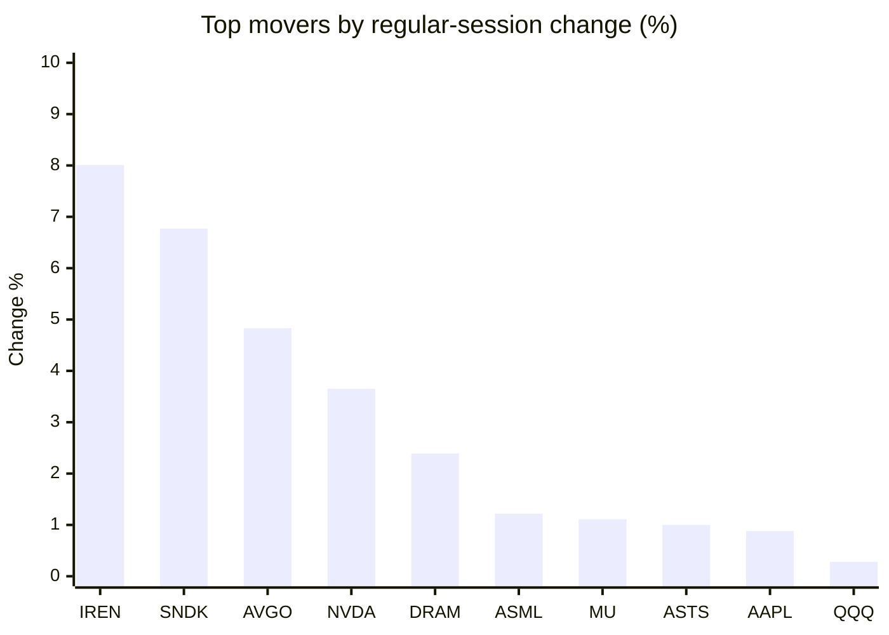
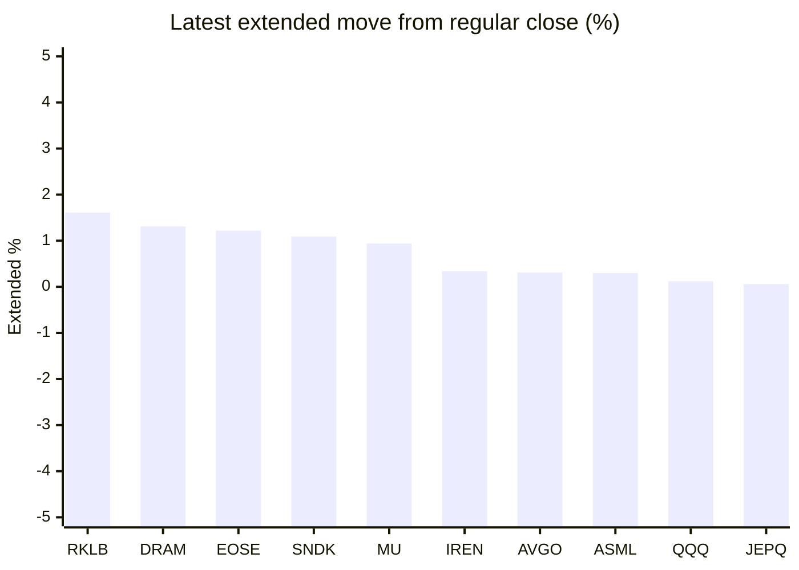

# Stock Brief - 2026-07-09

Generated at 2026-07-09 13:08 +07 from `watchlist.md`.
Prices are snapshots from Yahoo Finance public chart data. Extended/overnight is the latest available pre/post-market datapoint from the same feed.

## Market Snapshot

- SPY: close 745.40, latest extended 745.34, regular move -0.31%, extended move -0.01%
- QQQ: close 711.44, latest extended 712.32, regular move +0.28%, extended move +0.12%
- JEPQ: close 59.45, latest extended 59.48, regular move +0.22%, extended move +0.06%

## Watchlist Prices

| Ticker | Name | Regular close | Latest extended/overnight | Regular move | Extended move | Latest data time | Source |
|---|---|---:|---:|---:|---:|---|---|
| INTC | Intel Corporation | 110.24 USD | 110.29 USD | -0.14% | +0.05% | 2026-07-08 19:59 EDT | [Yahoo](https://finance.yahoo.com/quote/INTC/) |
| AVGO | Broadcom Inc. | 388.69 USD | 389.90 USD | +4.83% | +0.31% | 2026-07-08 19:59 EDT | [Yahoo](https://finance.yahoo.com/quote/AVGO/) |
| RKLB | Rocket Lab Corporation | 83.35 USD | 84.69 USD | -0.07% | +1.61% | 2026-07-08 19:59 EDT | [Yahoo](https://finance.yahoo.com/quote/RKLB/) |
| AAPL | Apple Inc. | 313.39 USD | 313.16 USD | +0.88% | -0.07% | 2026-07-08 19:59 EDT | [Yahoo](https://finance.yahoo.com/quote/AAPL/) |
| NVDA | NVIDIA Corporation | 204.12 USD | 203.62 USD | +3.65% | -0.24% | 2026-07-08 19:59 EDT | [Yahoo](https://finance.yahoo.com/quote/NVDA/) |
| TSLA | Tesla, Inc. | 394.06 USD | 394.00 USD | -2.19% | -0.02% | 2026-07-08 19:59 EDT | [Yahoo](https://finance.yahoo.com/quote/TSLA/) |
| SNDK | Sandisk Corporation | 1,727.18 USD | 1,746.00 USD | +6.77% | +1.09% | 2026-07-08 19:59 EDT | [Yahoo](https://finance.yahoo.com/quote/SNDK/) |
| QQQ | Invesco QQQ Trust, Series 1 | 711.44 USD | 712.32 USD | +0.28% | +0.12% | 2026-07-08 19:59 EDT | [Yahoo](https://finance.yahoo.com/quote/QQQ/) |
| SPY | State Street SPDR S&P 500 ETF T | 745.40 USD | 745.34 USD | -0.31% | -0.01% | 2026-07-08 19:59 EDT | [Yahoo](https://finance.yahoo.com/quote/SPY/) |
| JEPQ | JPMorgan Nasdaq Equity Premium  | 59.45 USD | 59.48 USD | +0.22% | +0.06% | 2026-07-08 19:59 EDT | [Yahoo](https://finance.yahoo.com/quote/JEPQ/) |
| ASTS | AST SpaceMobile, Inc. | 74.95 USD | 74.90 USD | +1.00% | -0.07% | 2026-07-08 19:59 EDT | [Yahoo](https://finance.yahoo.com/quote/ASTS/) |
| MU | Micron Technology, Inc. | 948.80 USD | 957.70 USD | +1.11% | +0.94% | 2026-07-08 19:59 EDT | [Yahoo](https://finance.yahoo.com/quote/MU/) |
| IREN | IREN LIMITED | 43.01 USD | 43.15 USD | +8.01% | +0.34% | 2026-07-08 19:59 EDT | [Yahoo](https://finance.yahoo.com/quote/IREN/) |
| EOSE | Eos Energy Enterprises, Inc. | 4.51 USD | 4.56 USD | -4.96% | +1.22% | 2026-07-08 19:59 EDT | [Yahoo](https://finance.yahoo.com/quote/EOSE/) |
| GOOG | Alphabet Inc. | 358.71 USD | 358.60 USD | -1.35% | -0.03% | 2026-07-08 19:59 EDT | [Yahoo](https://finance.yahoo.com/quote/GOOG/) |
| DRAM | Roundhill Memory ETF | 62.04 USD | 62.85 USD | +2.39% | +1.31% | 2026-07-08 19:59 EDT | [Yahoo](https://finance.yahoo.com/quote/DRAM/) |
| AMD | Advanced Micro Devices, Inc. | 517.41 USD | 516.79 USD | +0.25% | -0.12% | 2026-07-08 19:59 EDT | [Yahoo](https://finance.yahoo.com/quote/AMD/) |
| ASML | ASML Holding N.V. - New York Re | 1,768.65 USD | 1,774.01 USD | +1.22% | +0.30% | 2026-07-08 19:59 EDT | [Yahoo](https://finance.yahoo.com/quote/ASML/) |

## Charts

### Top Movers - Regular Session

### Extended / Overnight Move

### Quick Heatmap

| Group | Names in watchlist | Avg regular move | Avg extended move |
|---|---|---:|---:|
| Mega-cap tech | AVGO, AAPL, NVDA, TSLA, GOOG | +1.16% | -0.01% |
| Semis / memory | INTC, SNDK, MU, DRAM, AMD, ASML | +1.94% | +0.59% |
| Space / high beta | RKLB, ASTS, IREN, EOSE | +0.99% | +0.77% |
| ETFs | QQQ, SPY, JEPQ | +0.06% | +0.06% |

## News Headlines

- [Here's When Elon Musk Can Sell His Billions of SpaceX Shares](https://www.fool.com/investing/2026/07/09/heres-when--elon-musk-can-sell-his-billions-of/?.tsrc=rss) (2026-07-09 12:50 Bangkok)
- [Micron Raised Its Guidance on Surging Memory Prices. Here's What It Means for the Stock.](https://www.fool.com/investing/2026/07/09/micron-raised-its-guidance-on-surging-memory-price/?.tsrc=rss) (2026-07-09 12:35 Bangkok)
- [Dow Jones Futures, Oil Prices Rise Amid Iran News; Nvidia, Valero, Dell, SpaceX In Focus](https://finance.yahoo.com/m/460a0d08-18ee-3417-83ad-76a56f707497/dow-jones-futures%2C-oil-prices.html?.tsrc=rss) (2026-07-09 12:19 Bangkok)
- [Bitcoin's Most Prominent Holder Is Selling Some. Should You?](https://www.fool.com/investing/2026/07/09/bitcoins-most-prominent-holder-is-selling-some-sho/?.tsrc=rss) (2026-07-09 11:50 Bangkok)
- [RKLB Stock Rises Overnight: Rocket Lab Is Becoming More Like SpaceX, Morgan Stanley Says — Here’s Why](https://stocktwits.com/news-articles/markets/equity/rklb-becoming-spacex-morgan-stanley-heres-why/cZmoZbsR7Vm?.tsrc=rss) (2026-07-09 11:43 Bangkok)
- [VYMI vs. VIGI: Which International Dividend ETF Is Better?](https://www.fool.com/investing/2026/07/09/vymi-vs-vigi-which-international-dividend-etf-is-b/?.tsrc=rss) (2026-07-09 11:20 Bangkok)
- [NVDA Stock Ready For A Comeback? Why This Analyst Now Calls Nvidia An ‘Enhanced Buy’](https://stocktwits.com/news-articles/markets/equity/nvda-stock-ready-for-a-comeback-why-this-analyst-now-calls-nvidia-an-enhanced-buy/cZmokrUR7Vj?.tsrc=rss) (2026-07-09 10:56 Bangkok)
- [Elon Musk Says Optimus, AI Will Enable 'Excellent' Healthcare—Cathie Wood Sees $50 Billion AI Compute Need](https://finance.yahoo.com/technology/ai/articles/elon-musk-says-optimus-ai-033114121.html?.tsrc=rss) (2026-07-09 10:31 Bangkok)

## Caveats

- This is not investment advice. Extended-hours prices can be thin and volatile.
- Yahoo public endpoints may lag official exchange data.
