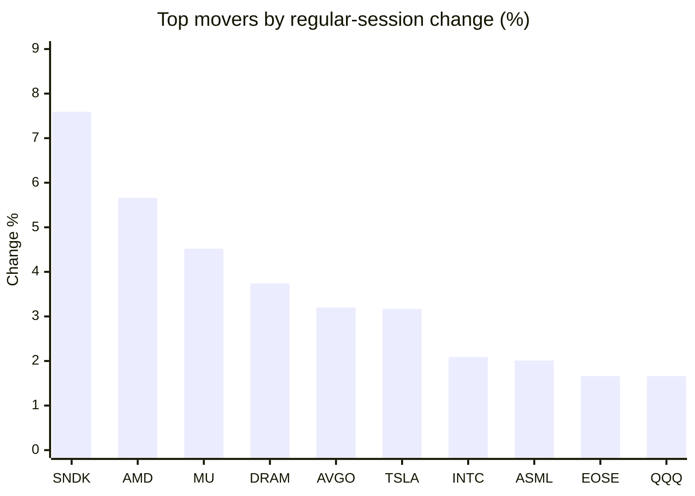
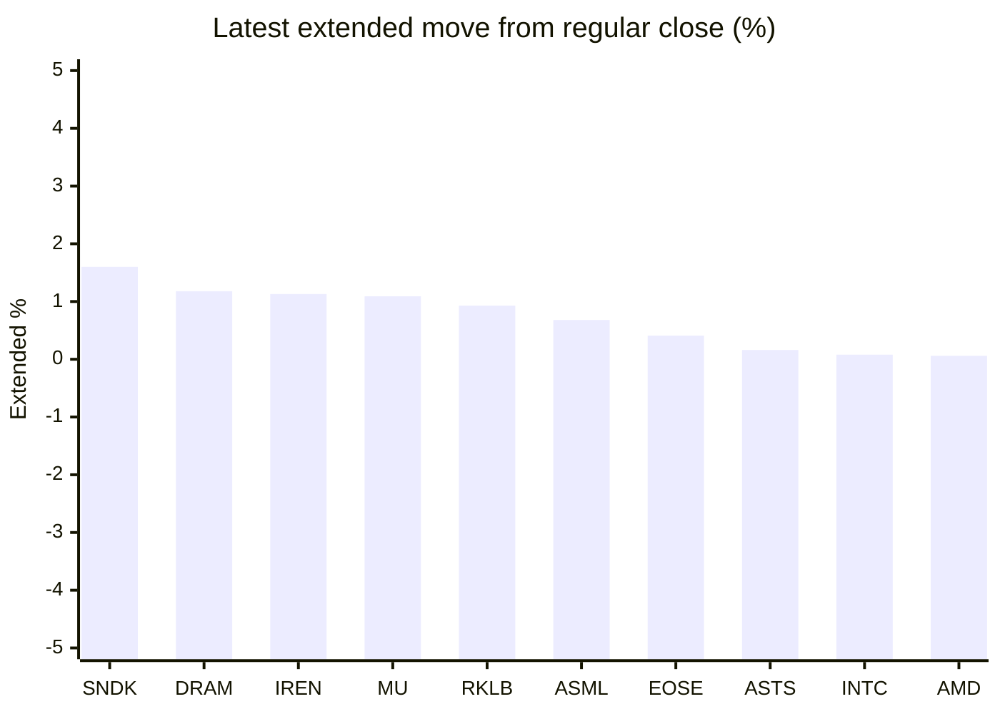

# Stock Brief - 2026-07-10

Generated at 2026-07-10 13:08 +07 from `watchlist.md`.
Prices are snapshots from Yahoo Finance public chart data. Extended/overnight is the latest available pre/post-market datapoint from the same feed.

## Market Snapshot

- SPY: close 751.71, latest extended 751.44, regular move +0.85%, extended move -0.04%
- QQQ: close 723.28, latest extended 722.92, regular move +1.66%, extended move -0.05%
- JEPQ: close 60.24, latest extended 60.22, regular move +1.33%, extended move -0.03%

## Watchlist Prices

| Ticker | Name | Regular close | Latest extended/overnight | Regular move | Extended move | Latest data time | Source |
|---|---|---:|---:|---:|---:|---|---|
| INTC | Intel Corporation | 112.54 USD | 112.63 USD | +2.09% | +0.08% | 2026-07-09 19:59 EDT | [Yahoo](https://finance.yahoo.com/quote/INTC/) |
| AVGO | Broadcom Inc. | 401.11 USD | 400.86 USD | +3.20% | -0.06% | 2026-07-09 19:59 EDT | [Yahoo](https://finance.yahoo.com/quote/AVGO/) |
| RKLB | Rocket Lab Corporation | 82.55 USD | 83.32 USD | -0.96% | +0.93% | 2026-07-09 19:59 EDT | [Yahoo](https://finance.yahoo.com/quote/RKLB/) |
| AAPL | Apple Inc. | 316.22 USD | 315.21 USD | +0.90% | -0.32% | 2026-07-09 19:59 EDT | [Yahoo](https://finance.yahoo.com/quote/AAPL/) |
| NVDA | NVIDIA Corporation | 202.78 USD | 202.31 USD | -0.66% | -0.23% | 2026-07-09 19:59 EDT | [Yahoo](https://finance.yahoo.com/quote/NVDA/) |
| TSLA | Tesla, Inc. | 406.55 USD | 405.10 USD | +3.17% | -0.36% | 2026-07-09 19:59 EDT | [Yahoo](https://finance.yahoo.com/quote/TSLA/) |
| SNDK | Sandisk Corporation | 1,858.27 USD | 1,887.99 USD | +7.59% | +1.60% | 2026-07-09 19:59 EDT | [Yahoo](https://finance.yahoo.com/quote/SNDK/) |
| QQQ | Invesco QQQ Trust, Series 1 | 723.28 USD | 722.92 USD | +1.66% | -0.05% | 2026-07-09 19:59 EDT | [Yahoo](https://finance.yahoo.com/quote/QQQ/) |
| SPY | State Street SPDR S&P 500 ETF T | 751.71 USD | 751.44 USD | +0.85% | -0.04% | 2026-07-09 19:59 EDT | [Yahoo](https://finance.yahoo.com/quote/SPY/) |
| JEPQ | JPMorgan Nasdaq Equity Premium  | 60.24 USD | 60.22 USD | +1.33% | -0.03% | 2026-07-09 19:59 EDT | [Yahoo](https://finance.yahoo.com/quote/JEPQ/) |
| ASTS | AST SpaceMobile, Inc. | 73.88 USD | 74.00 USD | -1.43% | +0.16% | 2026-07-09 19:59 EDT | [Yahoo](https://finance.yahoo.com/quote/ASTS/) |
| MU | Micron Technology, Inc. | 991.64 USD | 1,002.43 USD | +4.52% | +1.09% | 2026-07-09 19:59 EDT | [Yahoo](https://finance.yahoo.com/quote/MU/) |
| IREN | IREN LIMITED | 41.72 USD | 42.19 USD | -2.99% | +1.13% | 2026-07-09 19:59 EDT | [Yahoo](https://finance.yahoo.com/quote/IREN/) |
| EOSE | Eos Energy Enterprises, Inc. | 4.58 USD | 4.60 USD | +1.66% | +0.41% | 2026-07-09 19:59 EDT | [Yahoo](https://finance.yahoo.com/quote/EOSE/) |
| GOOG | Alphabet Inc. | 356.24 USD | 354.74 USD | -0.69% | -0.42% | 2026-07-09 19:59 EDT | [Yahoo](https://finance.yahoo.com/quote/GOOG/) |
| DRAM | Roundhill Memory ETF | 64.36 USD | 65.12 USD | +3.74% | +1.18% | 2026-07-09 19:59 EDT | [Yahoo](https://finance.yahoo.com/quote/DRAM/) |
| AMD | Advanced Micro Devices, Inc. | 546.72 USD | 547.06 USD | +5.66% | +0.06% | 2026-07-09 19:59 EDT | [Yahoo](https://finance.yahoo.com/quote/AMD/) |
| ASML | ASML Holding N.V. - New York Re | 1,804.25 USD | 1,816.49 USD | +2.01% | +0.68% | 2026-07-09 19:59 EDT | [Yahoo](https://finance.yahoo.com/quote/ASML/) |

## Charts

### Top Movers - Regular Session

### Extended / Overnight Move

### Quick Heatmap

| Group | Names in watchlist | Avg regular move | Avg extended move |
|---|---|---:|---:|
| Mega-cap tech | AVGO, AAPL, NVDA, TSLA, GOOG | +1.18% | -0.28% |
| Semis / memory | INTC, SNDK, MU, DRAM, AMD, ASML | +4.27% | +0.78% |
| Space / high beta | RKLB, ASTS, IREN, EOSE | -0.93% | +0.66% |
| ETFs | QQQ, SPY, JEPQ | +1.28% | -0.04% |

## News Headlines

- [These Precious Metals ETFs Beat The S&P 500 Over The Past Year — Can The Rally Survive The Iran Whiplash?](https://stocktwits.com/news-articles/markets/equity/these-precious-metals-etfs-beat-the-sp500-over-the-past-year/cZmAMRFR7FW?.tsrc=rss) (2026-07-10 12:15 Bangkok)
- [After Apple, India’s smartphone manufacturing boom enters new phase with Vivo JV](https://finance.yahoo.com/technology/articles/apple-india-smartphone-manufacturing-boom-043620231.html?.tsrc=rss) (2026-07-10 11:36 Bangkok)
- [RKLB Stock Rises Overnight: Analyst Calls Rocket Lab One Of SpaceX’s Most ‘Capable And Innovative’ Rivals In Space Race](https://stocktwits.com/news-articles/markets/equity/rklb-analyst-rocket-lab-spacex-capable-rival/cZmArE3R7Ff?.tsrc=rss) (2026-07-10 11:04 Bangkok)
- [Costco's June Sales Rose 10.6%, but the Stock Fell 4%. Here's What Spooked Investors.](https://www.fool.com/investing/2026/07/09/costcos-june-sales-rose-106-but-the-stock-fell-4-h/?.tsrc=rss) (2026-07-10 10:51 Bangkok)
- [Jim Cramer says one AI giant holds key to market’s next move](https://www.thestreet.com/investing/stocks/avgo-broadcom-stock-jim-cramer-market-bellwether-to-watch-bear-market?.tsrc=rss) (2026-07-10 10:33 Bangkok)
- [Why Mara Holdings Stock Spiked Today](https://www.fool.com/investing/2026/07/09/why-mara-holdings-stock-is-up-today/?.tsrc=rss) (2026-07-10 10:30 Bangkok)
- [Micron's Data Center Gross Margin Hit 87% Last Quarter. Here's What It Means for the Stock.](https://www.fool.com/investing/2026/07/09/microns-data-center-gross-margin-hit-87-last-quart/?.tsrc=rss) (2026-07-10 10:25 Bangkok)
- [Is Digital Turbine’s (APPS) AI Partnership Blitz Quietly Rewriting Its Mobile Advertising Thesis?](https://finance.yahoo.com/media-advertising/articles/digital-turbine-apps-ai-partnership-032236737.html?.tsrc=rss) (2026-07-10 10:22 Bangkok)

## Caveats

- This is not investment advice. Extended-hours prices can be thin and volatile.
- Yahoo public endpoints may lag official exchange data.
