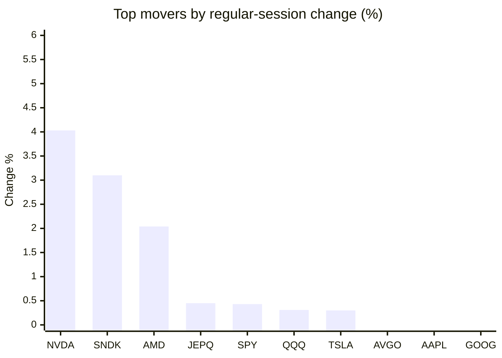
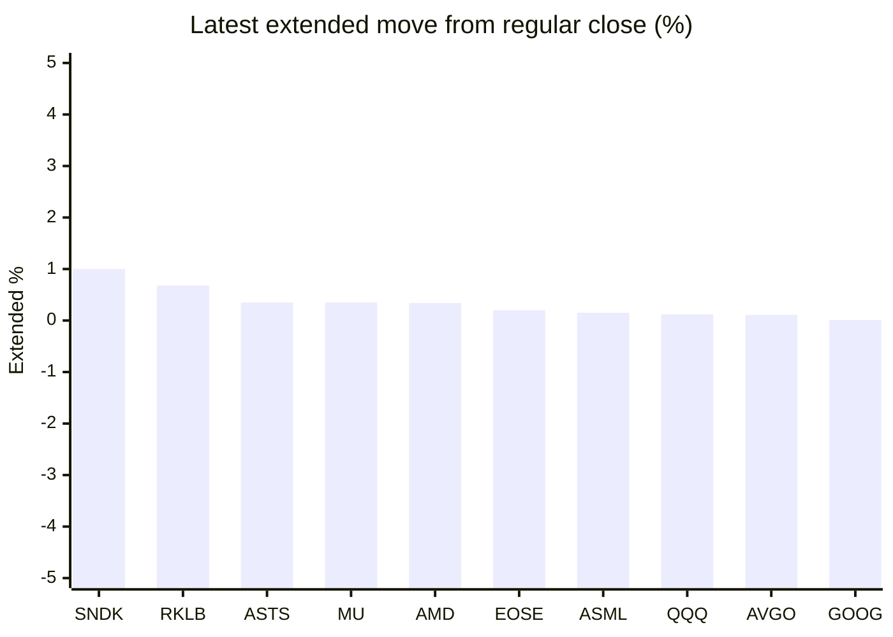

# Stock Brief - 2026-07-13

Generated at 2026-07-13 12:41 +07 from `watchlist.md`.
Prices are snapshots from Yahoo Finance public chart data. Extended/overnight is the latest available pre/post-market datapoint from the same feed.

## Market Snapshot

- SPY: close 754.95, latest extended 754.89, regular move +0.43%, extended move -0.01%
- QQQ: close 725.51, latest extended 726.41, regular move +0.31%, extended move +0.12%
- JEPQ: close 60.51, latest extended 60.45, regular move +0.45%, extended move -0.10%

## Watchlist Prices

| Ticker | Name | Regular close | Latest extended/overnight | Regular move | Extended move | Latest data time | Source |
|---|---|---:|---:|---:|---:|---|---|
| INTC | Intel Corporation | 109.84 USD | 109.60 USD | -2.40% | -0.22% | 2026-07-10 19:59 EDT | [Yahoo](https://finance.yahoo.com/quote/INTC/) |
| AVGO | Broadcom Inc. | 399.97 USD | 400.40 USD | -0.28% | +0.11% | 2026-07-10 19:59 EDT | [Yahoo](https://finance.yahoo.com/quote/AVGO/) |
| RKLB | Rocket Lab Corporation | 81.04 USD | 81.59 USD | -1.83% | +0.68% | 2026-07-10 19:59 EDT | [Yahoo](https://finance.yahoo.com/quote/RKLB/) |
| AAPL | Apple Inc. | 315.32 USD | 314.97 USD | -0.28% | -0.11% | 2026-07-10 19:59 EDT | [Yahoo](https://finance.yahoo.com/quote/AAPL/) |
| NVDA | NVIDIA Corporation | 210.96 USD | 210.57 USD | +4.03% | -0.18% | 2026-07-10 19:59 EDT | [Yahoo](https://finance.yahoo.com/quote/NVDA/) |
| TSLA | Tesla, Inc. | 407.76 USD | 407.59 USD | +0.30% | -0.04% | 2026-07-10 19:59 EDT | [Yahoo](https://finance.yahoo.com/quote/TSLA/) |
| SNDK | Sandisk Corporation | 1,915.92 USD | 1,935.00 USD | +3.10% | +1.00% | 2026-07-10 19:59 EDT | [Yahoo](https://finance.yahoo.com/quote/SNDK/) |
| QQQ | Invesco QQQ Trust, Series 1 | 725.51 USD | 726.41 USD | +0.31% | +0.12% | 2026-07-10 19:59 EDT | [Yahoo](https://finance.yahoo.com/quote/QQQ/) |
| SPY | State Street SPDR S&P 500 ETF T | 754.95 USD | 754.89 USD | +0.43% | -0.01% | 2026-07-10 19:59 EDT | [Yahoo](https://finance.yahoo.com/quote/SPY/) |
| JEPQ | JPMorgan Nasdaq Equity Premium  | 60.51 USD | 60.45 USD | +0.45% | -0.10% | 2026-07-10 19:59 EDT | [Yahoo](https://finance.yahoo.com/quote/JEPQ/) |
| ASTS | AST SpaceMobile, Inc. | 73.32 USD | 73.58 USD | -0.76% | +0.35% | 2026-07-10 19:59 EDT | [Yahoo](https://finance.yahoo.com/quote/ASTS/) |
| MU | Micron Technology, Inc. | 979.30 USD | 982.75 USD | -1.24% | +0.35% | 2026-07-10 19:59 EDT | [Yahoo](https://finance.yahoo.com/quote/MU/) |
| IREN | IREN LIMITED | 41.14 USD | 40.83 USD | -1.39% | -0.76% | 2026-07-10 19:59 EDT | [Yahoo](https://finance.yahoo.com/quote/IREN/) |
| EOSE | Eos Energy Enterprises, Inc. | 4.40 USD | 4.41 USD | -3.93% | +0.20% | 2026-07-10 19:59 EDT | [Yahoo](https://finance.yahoo.com/quote/EOSE/) |
| GOOG | Alphabet Inc. | 355.03 USD | 355.06 USD | -0.34% | +0.01% | 2026-07-10 19:59 EDT | [Yahoo](https://finance.yahoo.com/quote/GOOG/) |
| DRAM | Roundhill Memory ETF | 63.04 USD | 62.99 USD | -2.05% | -0.08% | 2026-07-10 19:59 EDT | [Yahoo](https://finance.yahoo.com/quote/DRAM/) |
| AMD | Advanced Micro Devices, Inc. | 557.89 USD | 559.77 USD | +2.04% | +0.34% | 2026-07-10 19:59 EDT | [Yahoo](https://finance.yahoo.com/quote/AMD/) |
| ASML | ASML Holding N.V. - New York Re | 1,797.32 USD | 1,800.00 USD | -0.38% | +0.15% | 2026-07-10 19:59 EDT | [Yahoo](https://finance.yahoo.com/quote/ASML/) |

## Charts

### Top Movers - Regular Session

### Extended / Overnight Move

### Quick Heatmap

| Group | Names in watchlist | Avg regular move | Avg extended move |
|---|---|---:|---:|
| Mega-cap tech | AVGO, AAPL, NVDA, TSLA, GOOG | +0.68% | -0.04% |
| Semis / memory | INTC, SNDK, MU, DRAM, AMD, ASML | -0.16% | +0.26% |
| Space / high beta | RKLB, ASTS, IREN, EOSE | -1.98% | +0.12% |
| ETFs | QQQ, SPY, JEPQ | +0.40% | +0.01% |

## News Headlines

- [Avoid This Hidden Risk of Index Funds](https://www.fool.com/investing/2026/07/13/avoid-this-hidden-risk-of-index-funds/?.tsrc=rss) (2026-07-13 12:20 Bangkok)
- [My Top 3 Software Stocks to Buy on the Dip](https://www.fool.com/investing/2026/07/13/my-top-3-software-stocks-to-buy-on-the-dip/?.tsrc=rss) (2026-07-13 12:05 Bangkok)
- [INTC, AMD, NVDA, AVGO: Chip Stocks Slide As Fresh US-Iran Strikes Test Peace Deal](https://stocktwits.com/news-articles/markets/equity/intc-amd-nvda-avgo-chip-stocks-slide-as-fresh-us-iran-strikes-test-peace-deal/cZmzgG5R7oh?.tsrc=rss) (2026-07-13 11:58 Bangkok)
- [Is The Oil Crisis Over? Or Is It Just Beginning?](https://www.fool.com/investing/2026/07/13/is-the-oil-crisis-over-or-is-it-just-beginning/?.tsrc=rss) (2026-07-13 11:26 Bangkok)
- [NASA ETF Tumbles Toward Launch Lows Amid SpaceX Selloff — But Tema Quietly Adds Over 5M ASTS, RKLB And LUNR Shares](https://stocktwits.com/news-articles/markets/equity/nasa-etf-spacex-selloff-asts-rklb-lunr-shares/cZmzQyfR7og?.tsrc=rss) (2026-07-13 11:17 Bangkok)
- [Jim Cramer Says Comparing the Mag 7 Is a Mistake: Here Are 5 Reasons Each Stock Is Different](https://247wallst.com/investing/2026/07/13/jim-cramer-says-comparing-the-mag-7-is-a-mistake-here-are-5-reasons-each-stock-is-different/?.tsrc=rss) (2026-07-13 11:05 Bangkok)
- [Zapata Quantum Bets Software, AI Partnerships Will Unlock Quantum Computing Value](https://www.marketbeat.com/instant-alerts/zapata-quantum-bets-software-ai-partnerships-will-unlock-quantum-computing-value-2026-07-12/?utm_source=yahoofinance&utm_medium=yahoofinance&.tsrc=rss) (2026-07-13 11:02 Bangkok)
- [Did Nvidia's 2028 Rack Delay Under Jensen Huang Open a Door for AMD and Google?](https://www.fool.com/investing/2026/07/12/did-nvidias-2028-rack-delay-under-jensen-huang-ope/?.tsrc=rss) (2026-07-13 10:35 Bangkok)

## Caveats

- This is not investment advice. Extended-hours prices can be thin and volatile.
- Yahoo public endpoints may lag official exchange data.
