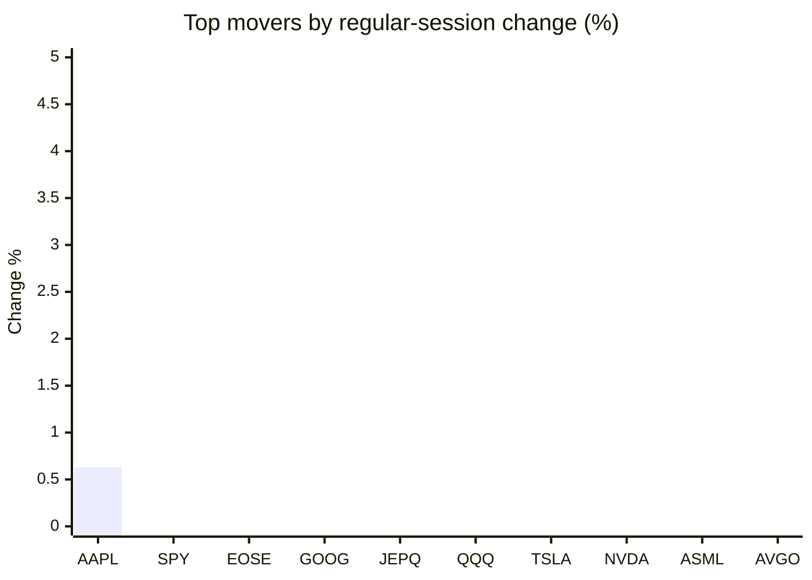
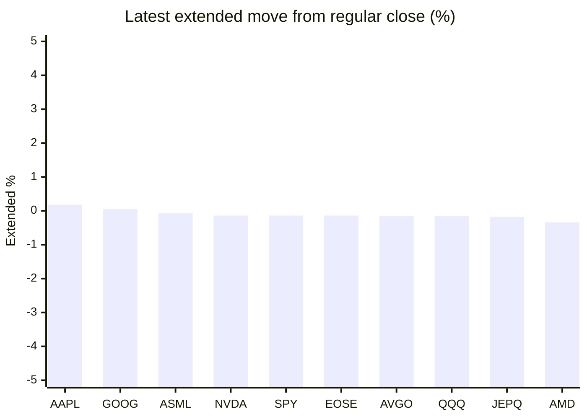

# Stock Brief - 2026-07-14

Generated at 2026-07-14 11:54 +07 from `watchlist.md`.
Prices are snapshots from Yahoo Finance public chart data. Extended/overnight is the latest available pre/post-market datapoint from the same feed.

## Market Snapshot

- SPY: close 749.17, latest extended 748.13, regular move -0.77%, extended move -0.14%
- QQQ: close 711.74, latest extended 710.58, regular move -1.90%, extended move -0.16%
- JEPQ: close 59.59, latest extended 59.48, regular move -1.52%, extended move -0.18%

## Watchlist Prices

| Ticker | Name | Regular close | Latest extended/overnight | Regular move | Extended move | Latest data time | Source |
|---|---|---:|---:|---:|---:|---|---|
| INTC | Intel Corporation | 103.12 USD | 102.42 USD | -6.12% | -0.68% | 2026-07-13 20:00 EDT | [Yahoo](https://finance.yahoo.com/quote/INTC/) |
| AVGO | Broadcom Inc. | 384.05 USD | 383.44 USD | -3.98% | -0.16% | 2026-07-13 19:59 EDT | [Yahoo](https://finance.yahoo.com/quote/AVGO/) |
| RKLB | Rocket Lab Corporation | 76.73 USD | 75.85 USD | -5.32% | -1.15% | 2026-07-13 19:59 EDT | [Yahoo](https://finance.yahoo.com/quote/RKLB/) |
| AAPL | Apple Inc. | 317.31 USD | 317.88 USD | +0.63% | +0.18% | 2026-07-13 19:59 EDT | [Yahoo](https://finance.yahoo.com/quote/AAPL/) |
| NVDA | NVIDIA Corporation | 203.53 USD | 203.25 USD | -3.52% | -0.14% | 2026-07-13 20:00 EDT | [Yahoo](https://finance.yahoo.com/quote/NVDA/) |
| TSLA | Tesla, Inc. | 394.76 USD | 393.02 USD | -3.19% | -0.44% | 2026-07-13 19:59 EDT | [Yahoo](https://finance.yahoo.com/quote/TSLA/) |
| SNDK | Sandisk Corporation | 1,673.97 USD | 1,633.17 USD | -12.63% | -2.44% | 2026-07-13 19:59 EDT | [Yahoo](https://finance.yahoo.com/quote/SNDK/) |
| QQQ | Invesco QQQ Trust, Series 1 | 711.74 USD | 710.58 USD | -1.90% | -0.16% | 2026-07-13 19:59 EDT | [Yahoo](https://finance.yahoo.com/quote/QQQ/) |
| SPY | State Street SPDR S&P 500 ETF T | 749.17 USD | 748.13 USD | -0.77% | -0.14% | 2026-07-13 19:59 EDT | [Yahoo](https://finance.yahoo.com/quote/SPY/) |
| JEPQ | JPMorgan Nasdaq Equity Premium  | 59.59 USD | 59.48 USD | -1.52% | -0.18% | 2026-07-13 19:59 EDT | [Yahoo](https://finance.yahoo.com/quote/JEPQ/) |
| ASTS | AST SpaceMobile, Inc. | 67.58 USD | 66.97 USD | -7.83% | -0.90% | 2026-07-13 19:59 EDT | [Yahoo](https://finance.yahoo.com/quote/ASTS/) |
| MU | Micron Technology, Inc. | 937.00 USD | 920.80 USD | -4.32% | -1.73% | 2026-07-13 19:59 EDT | [Yahoo](https://finance.yahoo.com/quote/MU/) |
| IREN | IREN LIMITED | 38.98 USD | 38.53 USD | -5.25% | -1.15% | 2026-07-13 19:59 EDT | [Yahoo](https://finance.yahoo.com/quote/IREN/) |
| EOSE | Eos Energy Enterprises, Inc. | 4.35 USD | 4.34 USD | -1.14% | -0.14% | 2026-07-13 19:58 EDT | [Yahoo](https://finance.yahoo.com/quote/EOSE/) |
| GOOG | Alphabet Inc. | 350.67 USD | 350.86 USD | -1.23% | +0.05% | 2026-07-13 19:59 EDT | [Yahoo](https://finance.yahoo.com/quote/GOOG/) |
| DRAM | Roundhill Memory ETF | 57.30 USD | 55.90 USD | -9.11% | -2.44% | 2026-07-13 19:59 EDT | [Yahoo](https://finance.yahoo.com/quote/DRAM/) |
| AMD | Advanced Micro Devices, Inc. | 534.39 USD | 532.56 USD | -4.21% | -0.34% | 2026-07-13 19:59 EDT | [Yahoo](https://finance.yahoo.com/quote/AMD/) |
| ASML | ASML Holding N.V. - New York Re | 1,726.04 USD | 1,725.00 USD | -3.97% | -0.06% | 2026-07-13 19:59 EDT | [Yahoo](https://finance.yahoo.com/quote/ASML/) |

## Charts

### Top Movers - Regular Session

### Extended / Overnight Move

### Quick Heatmap

| Group | Names in watchlist | Avg regular move | Avg extended move |
|---|---|---:|---:|
| Mega-cap tech | AVGO, AAPL, NVDA, TSLA, GOOG | -2.26% | -0.10% |
| Semis / memory | INTC, SNDK, MU, DRAM, AMD, ASML | -6.72% | -1.28% |
| Space / high beta | RKLB, ASTS, IREN, EOSE | -4.88% | -0.84% |
| ETFs | QQQ, SPY, JEPQ | -1.39% | -0.16% |

## News Headlines

- [Sandisk Stock Plunged Today. Analysts Say Buy the Dip.](https://www.fool.com/investing/2026/07/13/sandisk-stock-plunged-today-analysts-say-buy-dip/?.tsrc=rss) (2026-07-14 10:59 Bangkok)
- [Voyager Technologies Completes Astrobotic Acquisition And Was Just Awarded a $298 Million Contract From NASA](https://www.fool.com/investing/2026/07/13/voyager-technologies-completes-astrobotic-acquisition-and-was-just-awarded-a-298-million-contract-from-nasa/?.tsrc=rss) (2026-07-14 10:43 Bangkok)
- [RKLB Stock Rises Overnight: Rocket Lab Completes Major Engine Test Ahead of Neutron’s First Launch](https://stocktwits.com/news-articles/markets/equity/rklb-major-engine-test-neutron-first-launch/cZZbSD8R7Yz?.tsrc=rss) (2026-07-14 10:33 Bangkok)
- [SK Hynix set to benefit as South Korea's ruling party seeks to ease capital-raising rules](https://finance.yahoo.com/technology/articles/sk-hynix-set-benefit-south-033300276.html?.tsrc=rss) (2026-07-14 10:33 Bangkok)
- [Nvidia halves Asia AI chip customer list, FT reports](https://finance.yahoo.com/technology/ai/articles/nvidia-halves-asia-buyer-list-033140201.html?.tsrc=rss) (2026-07-14 10:31 Bangkok)
- [TSMC seen riding AI boom to fifth straight quarter of record profit](https://finance.yahoo.com/technology/ai/articles/tsmc-seen-riding-ai-boom-031106342.html?.tsrc=rss) (2026-07-14 10:11 Bangkok)
- [Already rich, already successful, why the last wave of tech winners is grinding again](https://finance.yahoo.com/technology/ai/articles/already-rich-already-successful-why-024642975.html?.tsrc=rss) (2026-07-14 09:46 Bangkok)
- [Apple stock move vindicates Palantir CEO warning for AI industry](https://www.thestreet.com/technology/apple-sues-openai-ai-ip-theft-concerns-supports-alex-karp-warnings?.tsrc=rss) (2026-07-14 09:33 Bangkok)

## Caveats

- This is not investment advice. Extended-hours prices can be thin and volatile.
- Yahoo public endpoints may lag official exchange data.
