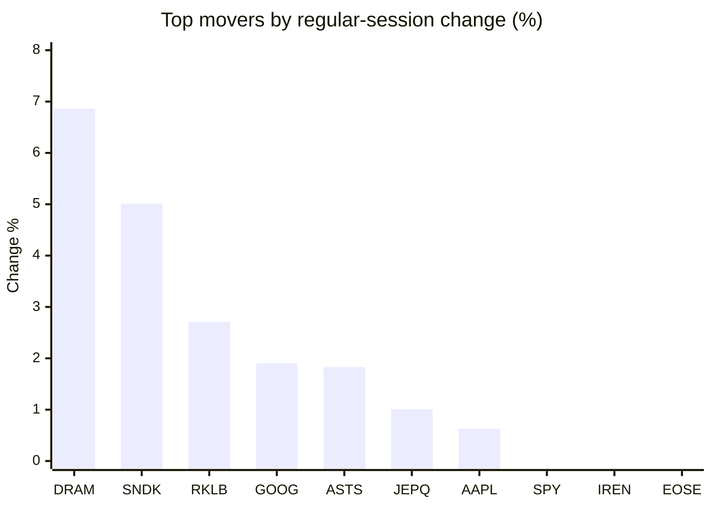
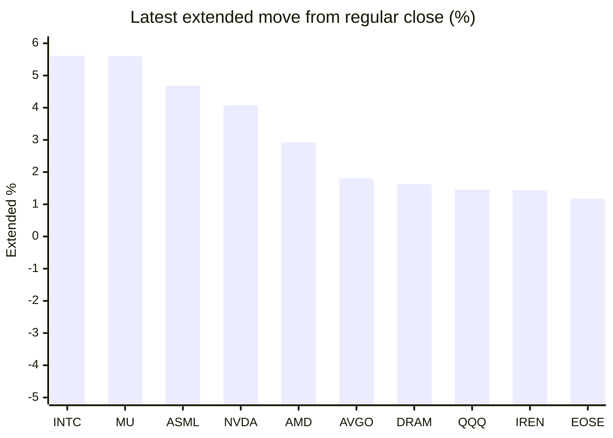

# Stock Brief - 2026-07-15

Generated at 2026-07-15 11:54 +07 from `watchlist.md`.
Prices are snapshots from Yahoo Finance public chart data. Extended/overnight is the latest available pre/post-market datapoint from the same feed.

## Market Snapshot

- SPY: close 749.17, latest extended 753.10, regular move -0.77%, extended move +0.52%
- QQQ: close 711.74, latest extended 722.06, regular move -1.90%, extended move +1.45%
- JEPQ: close 60.19, latest extended 60.33, regular move +1.01%, extended move +0.23%

## Watchlist Prices

| Ticker | Name | Regular close | Latest extended/overnight | Regular move | Extended move | Latest data time | Source |
|---|---|---:|---:|---:|---:|---|---|
| INTC | Intel Corporation | 103.12 USD | 108.91 USD | -6.12% | +5.61% | 2026-07-14 19:59 EDT | [Yahoo](https://finance.yahoo.com/quote/INTC/) |
| AVGO | Broadcom Inc. | 384.05 USD | 391.00 USD | -3.98% | +1.81% | 2026-07-14 19:59 EDT | [Yahoo](https://finance.yahoo.com/quote/AVGO/) |
| RKLB | Rocket Lab Corporation | 78.81 USD | 79.52 USD | +2.71% | +0.90% | 2026-07-14 19:59 EDT | [Yahoo](https://finance.yahoo.com/quote/RKLB/) |
| AAPL | Apple Inc. | 317.31 USD | 315.50 USD | +0.63% | -0.57% | 2026-07-14 19:59 EDT | [Yahoo](https://finance.yahoo.com/quote/AAPL/) |
| NVDA | NVIDIA Corporation | 203.53 USD | 211.82 USD | -3.52% | +4.07% | 2026-07-14 19:59 EDT | [Yahoo](https://finance.yahoo.com/quote/NVDA/) |
| TSLA | Tesla, Inc. | 394.76 USD | 395.80 USD | -3.19% | +0.26% | 2026-07-14 19:59 EDT | [Yahoo](https://finance.yahoo.com/quote/TSLA/) |
| SNDK | Sandisk Corporation | 1,757.82 USD | 1,767.00 USD | +5.01% | +0.52% | 2026-07-14 19:59 EDT | [Yahoo](https://finance.yahoo.com/quote/SNDK/) |
| QQQ | Invesco QQQ Trust, Series 1 | 711.74 USD | 722.06 USD | -1.90% | +1.45% | 2026-07-14 19:59 EDT | [Yahoo](https://finance.yahoo.com/quote/QQQ/) |
| SPY | State Street SPDR S&P 500 ETF T | 749.17 USD | 753.10 USD | -0.77% | +0.52% | 2026-07-14 19:59 EDT | [Yahoo](https://finance.yahoo.com/quote/SPY/) |
| JEPQ | JPMorgan Nasdaq Equity Premium  | 60.19 USD | 60.33 USD | +1.01% | +0.23% | 2026-07-14 19:59 EDT | [Yahoo](https://finance.yahoo.com/quote/JEPQ/) |
| ASTS | AST SpaceMobile, Inc. | 68.82 USD | 68.86 USD | +1.83% | +0.05% | 2026-07-14 19:59 EDT | [Yahoo](https://finance.yahoo.com/quote/ASTS/) |
| MU | Micron Technology, Inc. | 937.00 USD | 989.50 USD | -4.32% | +5.60% | 2026-07-14 19:59 EDT | [Yahoo](https://finance.yahoo.com/quote/MU/) |
| IREN | IREN LIMITED | 38.59 USD | 39.14 USD | -1.00% | +1.43% | 2026-07-14 19:59 EDT | [Yahoo](https://finance.yahoo.com/quote/IREN/) |
| EOSE | Eos Energy Enterprises, Inc. | 4.29 USD | 4.34 USD | -1.38% | +1.17% | 2026-07-14 19:59 EDT | [Yahoo](https://finance.yahoo.com/quote/EOSE/) |
| GOOG | Alphabet Inc. | 357.33 USD | 357.30 USD | +1.90% | -0.01% | 2026-07-14 19:59 EDT | [Yahoo](https://finance.yahoo.com/quote/GOOG/) |
| DRAM | Roundhill Memory ETF | 61.23 USD | 62.22 USD | +6.86% | +1.62% | 2026-07-14 19:59 EDT | [Yahoo](https://finance.yahoo.com/quote/DRAM/) |
| AMD | Advanced Micro Devices, Inc. | 534.39 USD | 549.97 USD | -4.21% | +2.92% | 2026-07-14 19:59 EDT | [Yahoo](https://finance.yahoo.com/quote/AMD/) |
| ASML | ASML Holding N.V. - New York Re | 1,726.04 USD | 1,806.80 USD | -3.97% | +4.68% | 2026-07-14 19:59 EDT | [Yahoo](https://finance.yahoo.com/quote/ASML/) |

## Charts

### Top Movers - Regular Session

### Extended / Overnight Move

### Quick Heatmap

| Group | Names in watchlist | Avg regular move | Avg extended move |
|---|---|---:|---:|
| Mega-cap tech | AVGO, AAPL, NVDA, TSLA, GOOG | -1.63% | +1.11% |
| Semis / memory | INTC, SNDK, MU, DRAM, AMD, ASML | -1.12% | +3.49% |
| Space / high beta | RKLB, ASTS, IREN, EOSE | +0.54% | +0.89% |
| ETFs | QQQ, SPY, JEPQ | -0.55% | +0.74% |

## News Headlines

- [Sandisk (SNDK) Stock Looks Below Fair Value Despite High Expectations](https://finance.yahoo.com/markets/stocks/articles/sandisk-sndk-stock-looks-below-043505956.html?.tsrc=rss) (2026-07-15 11:35 Bangkok)
- [Tesla (TSLA) Stock Looks Expensive Following Its 81% Five Year Gain](https://finance.yahoo.com/markets/stocks/articles/tesla-tsla-stock-looks-expensive-043501446.html?.tsrc=rss) (2026-07-15 11:35 Bangkok)
- [Goldman Sachs Says the Crowd Is Wrong on This Beaten-Down Medical Robotics Giant](https://www.fool.com/investing/2026/07/15/goldman-sachs-says-the-crowd-is-wrong-on-this-beat/?.tsrc=rss) (2026-07-15 11:35 Bangkok)
- [TSLA Stock Climbs Overnight: ‘SPAC King’ Chamath Palihapitiya Sees ‘Obvious’ Logic In Tesla-SpaceX Merger](https://stocktwits.com/news-articles/markets/equity/tsla-chamath-palihapitiya-tesla-spacex-merger/cZZ2A2xR7AG?.tsrc=rss) (2026-07-15 11:12 Bangkok)
- [OpenAI's First Hardware Product Is An AI Speaker? Report Reveals Details Amid Apple Lawsuit](https://stocktwits.com/news-articles/markets/equity/open-ai-s-first-hardware-product-is-an-ai-speaker-report-reveals-details-amid-apple-lawsuit/cZZ2YwyR7qy?.tsrc=rss) (2026-07-15 10:27 Bangkok)
- [Micron (MU) Stock May Look Reasonable Despite Fresh AI Expansion Plans](https://finance.yahoo.com/markets/stocks/articles/micron-mu-stock-may-look-032629369.html?.tsrc=rss) (2026-07-15 10:26 Bangkok)
- [Why Goldman Sachs Stock Jumped Today](https://www.fool.com/investing/2026/07/14/why-goldman-sachs-stock-is-up-today/?.tsrc=rss) (2026-07-15 10:20 Bangkok)
- [Dow Jones Futures: Goldman, CrowdStrike Jump, But AI Stocks Need To Do This](https://finance.yahoo.com/m/ff2fea6d-f6fc-389f-b0c6-62b745afe36d/dow-jones-futures%3A-goldman%2C.html?.tsrc=rss) (2026-07-15 09:55 Bangkok)

## Caveats

- This is not investment advice. Extended-hours prices can be thin and volatile.
- Yahoo public endpoints may lag official exchange data.
